# 23：从控制视角看强化学习 🧠

在本节课中，我们将从最优控制的视角出发，探讨强化学习（RL）的核心思想。我们将回顾最优控制问题，并分析当系统动力学模型未知时，如何通过强化学习的方法来求解。课程将重点介绍策略梯度方法，并通过简单的线性二次调节器（LQR）问题来直观展示其原理与实现。

---

## 概述

强化学习本质上是在解决与最优控制相同的问题，但核心假设是我们没有关于系统动力学的先验模型。其理想目标是仅通过系统上的试错实验来学习如何完成任务，尤其是在机器人等硬件平台上。

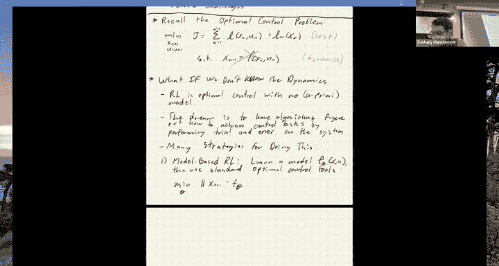

## 强化学习的主要方法

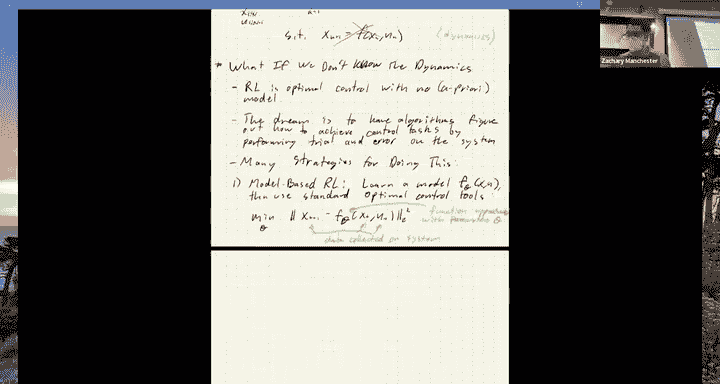

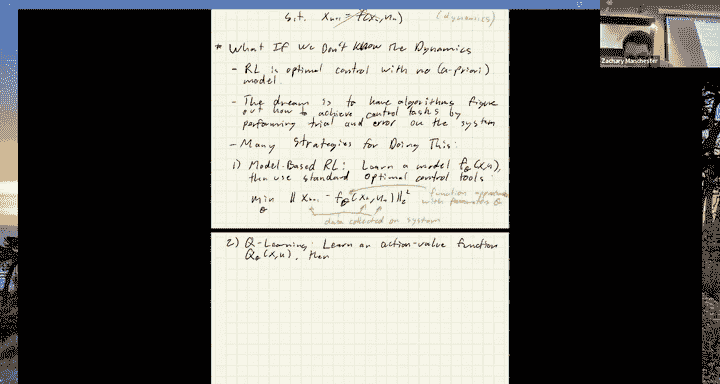

上一节我们回顾了最优控制问题，本节中我们来看看当模型未知时，主要的几种强化学习范式。

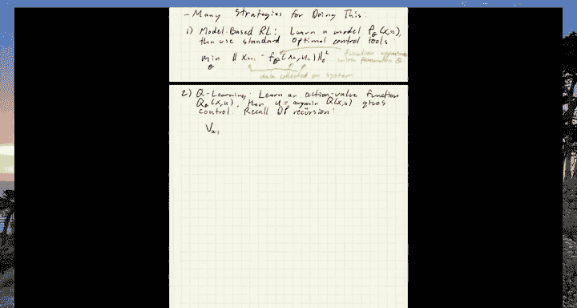

以下是几种主要的强化学习方法：

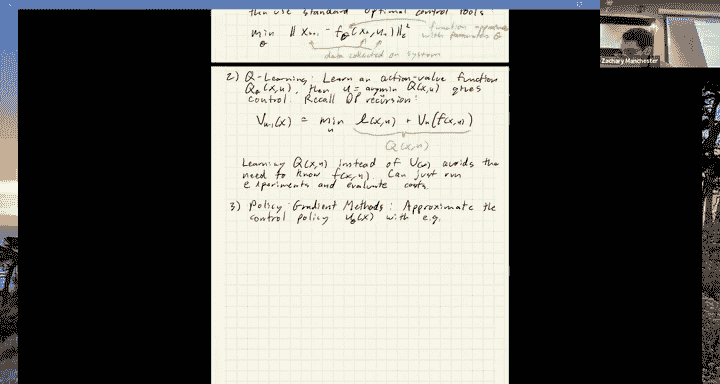

1.  **基于模型的强化学习**：首先从数据中学习一个动力学模型 `F_θ(x, u)`，然后使用标准的控制技术（如我们之前讨论过的）基于该模型进行控制。这本质上是一个回归问题，其历史可追溯到自适应控制等领域。
2.  **Q学习**：学习一个动作价值函数 `Q_θ(x, u)`。这个函数来自动态规划，代表了从状态 `x` 执行动作 `u` 开始，到任务结束的预期总成本。通过从大量实验数据中拟合 `Q` 函数，我们可以通过求解单步最小化问题 `u = argmin_u Q(x, u)` 来得到控制策略。学习 `Q` 而非价值函数 `V` 的好处在于，我们可以完全不需要动力学模型。
3.  **策略梯度方法**：直接参数化并优化控制策略 `u_θ(x)`（例如使用神经网络）。目标是最小化关于策略参数 `θ` 的期望总成本 `J(θ)`。通过在实际系统上采样轨迹并利用随机梯度估计来优化 `θ`。这是近年来非常热门的一类方法。
4.  **演员-评论家方法**：将上述第二和第三种方法结合，同时学习策略（演员）和价值函数（评论家）。这通常有助于改善随机梯度下降的收敛性。

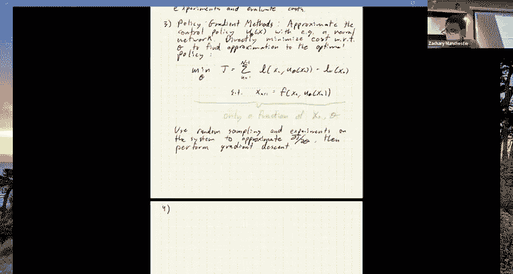

所有这些方法的哲学核心是，尽可能少地假设关于系统或环境的先验知识。然而，在工程实践中，我们通常知道很多，利用这些知识往往能得到更好的结果。

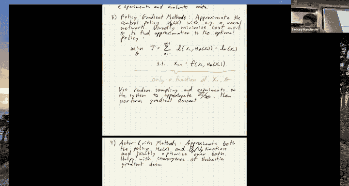

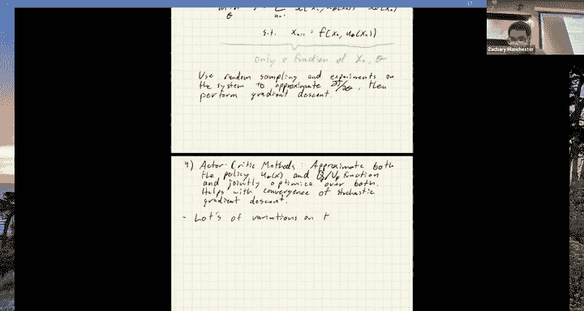

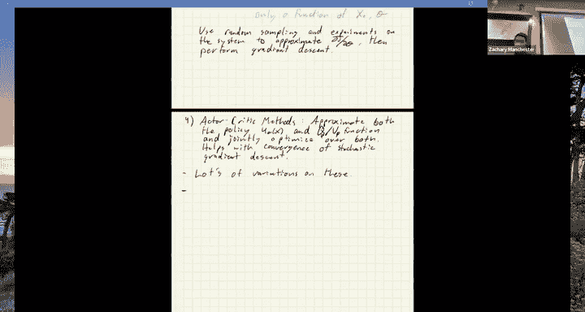

## 策略梯度方法详解

上一节我们概述了各类方法，本节我们将深入探讨策略梯度方法，这是当前机器人强化学习取得许多成功的关键。

为了使这些方法可行，我们需要做出一个关键假设：**控制策略是随机的**，即使真实系统是确定性的。我们将策略写为一个条件概率分布 `π_θ(u|x)`。这意味着，即使动力学是确定性的，由于我们在控制中注入了噪声，整个轨迹也会变得随机，从而诱导出一个轨迹分布 `p_θ(τ)`。

我们这样做的核心原因是为了通过采样来估计梯度。在策略中加入噪声（例如高斯噪声 `u = u_θ(x) + v, v ~ N(0, Σ)`）允许我们收集多样化的轨迹样本，从而近似计算成本函数关于策略参数的梯度。

### 策略梯度定理推导

我们的目标是最小化期望成本：
`J(θ) = E_{τ~p_θ(τ)} [J(τ)]`

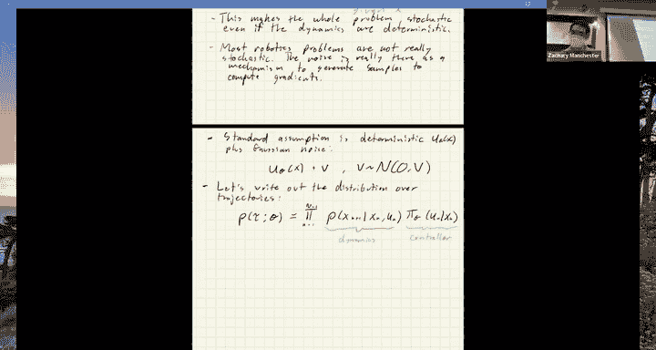

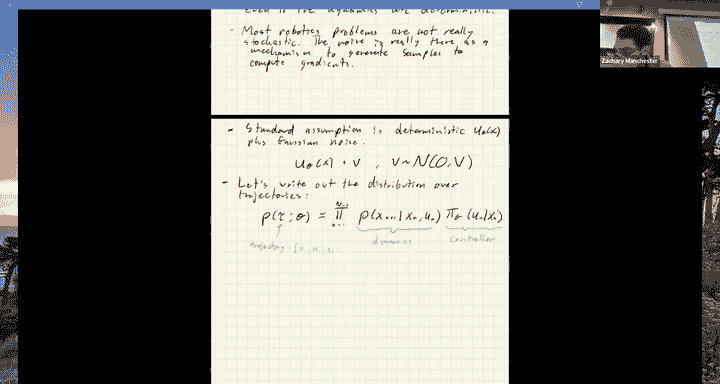

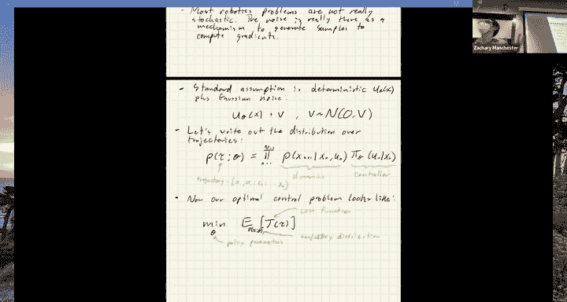

我们需要计算其梯度 `∇_θ J(θ)`。通过一系列数学变换（包括著名的对数似然技巧），我们可以得到策略梯度定理：

`∇_θ J(θ) = E_{τ~p_θ(τ)} [ J(τ) * ∇_θ log p_θ(τ) ]`

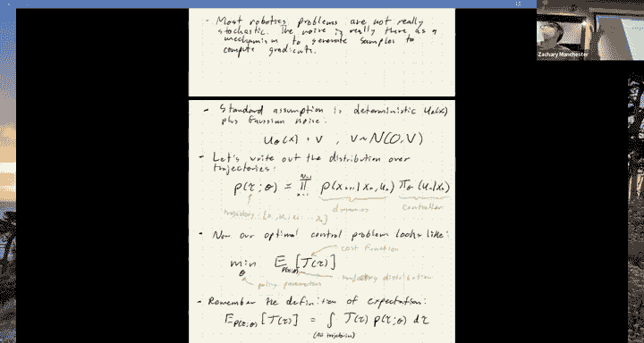

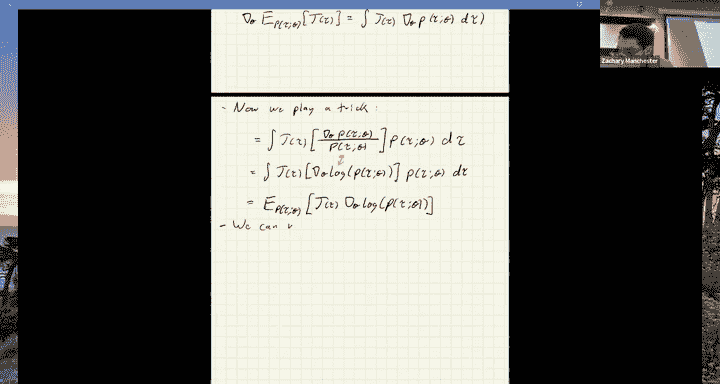

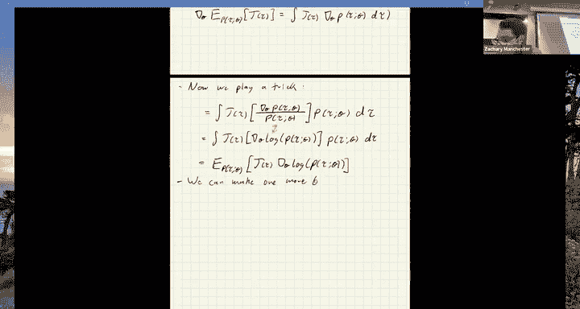

进一步，由于轨迹分布 `p_θ(τ)` 可分解为动力学转移概率和策略概率的乘积，而动力学部分不依赖于 `θ`，其梯度为零。因此，上式简化为：

`∇_θ J(θ) = E_{τ~p_θ(τ)} [ J(τ) * Σ_{k} ∇_θ log π_θ(u_k | x_k) ]`

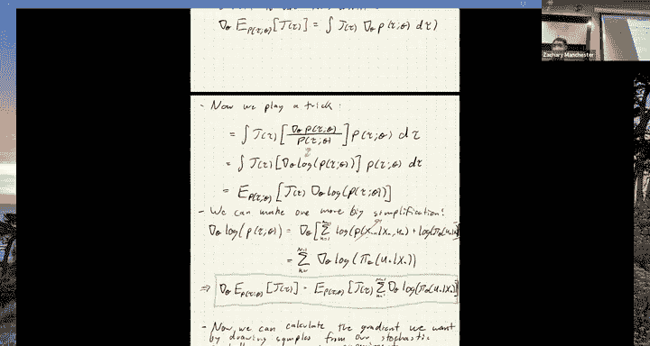

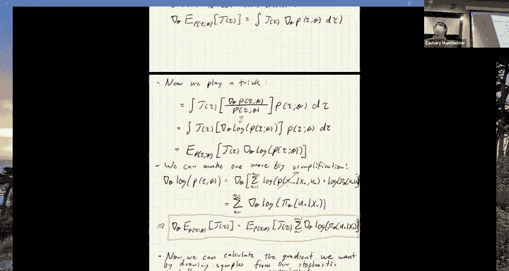

这个结果是策略梯度方法的核心。它表明，我们可以通过从随机策略中采样轨迹，并计算这些轨迹的总成本 `J(τ)` 与策略对数概率梯度 `∇_θ log π_θ(u_k | x_k)` 的乘积的期望，来估计真实梯度。**动力学模型从这个表达式中消失了**，这正是我们想要的。

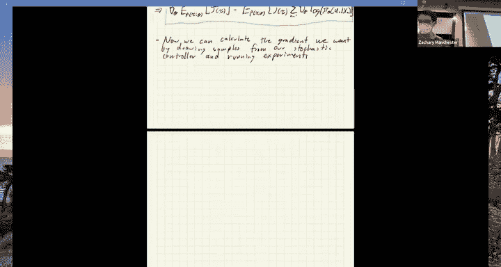

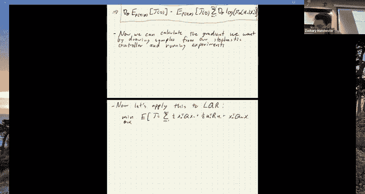

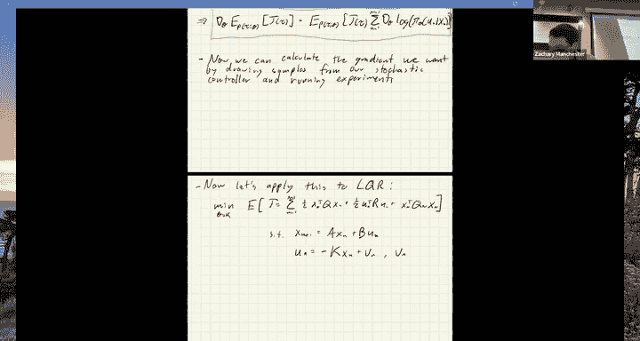

### 应用于LQR问题

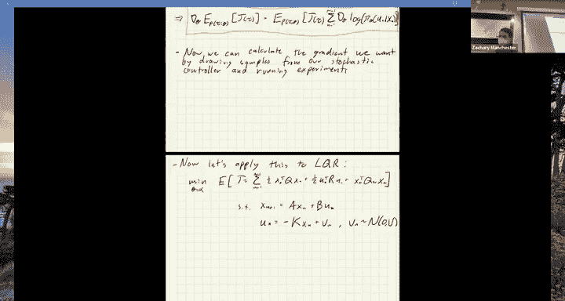

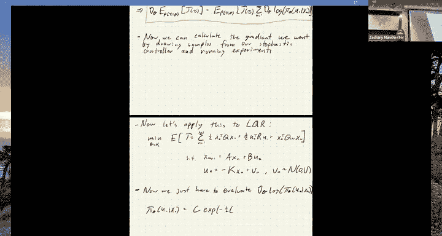

为了使概念更具体，我们将策略梯度应用于熟悉的LQR问题。假设一个线性策略 `u = -Kx + v`，其中 `v` 是高斯噪声。在这个设定下，策略分布 `π_θ(u|x)` 是一个高斯分布，其对数概率的梯度可以解析求出（或通过自动微分轻松获得）。

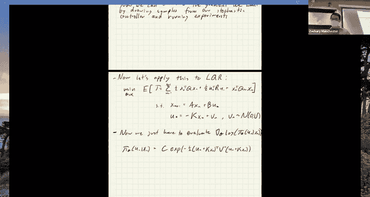

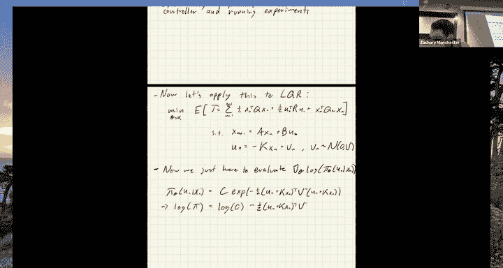

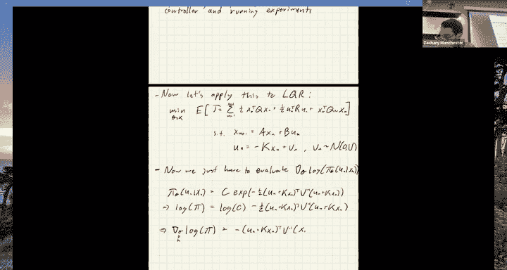

基本的策略梯度算法步骤如下：

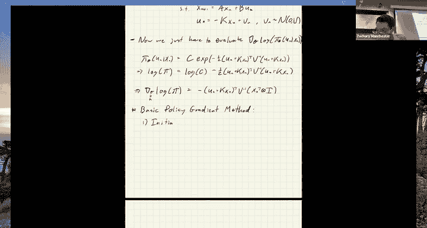

以下是基本的策略梯度算法伪代码：

1.  **初始化**：初始化策略参数 `θ`（例如，反馈矩阵 `K`）。
2.  **采样**：使用当前随机策略 `π_θ`，在系统上运行并收集一批（`S` 条）轨迹 `{τ_i}`。
3.  **梯度估计**：利用收集的轨迹样本，近似计算梯度：
    `g ≈ (1/S) Σ_{i=1}^S [ J(τ_i) * Σ_{k} ∇_θ log π_θ(u_{i,k} | x_{i,k}) ]`
    （实践中常会引入一个基线（如平均成本）来减少方差）。
4.  **策略更新**：沿梯度负方向更新参数：
    `θ ← θ - α * g`
    其中 `α` 是学习率。
5.  **重复**：返回步骤2，直到收敛。

## 实验演示与比较

上一节我们推导了算法，本节我们通过具体实验来看看它的表现，并与利用模型信息的方法进行对比。

我们在两个问题上进行了测试：
1.  **简单稳定系统**：一个一维双积分器LQR问题。使用基本的策略梯度（配合基线技巧）或更先进的优化器（如Adam），经过大量采样（数万次 rollout）后，可以得到接近最优解的策略，尽管参数 `K` 可能不完全相同。
2.  **不稳定系统**：一个线性化的二维四旋翼飞行器LQR问题。策略梯度方法很难收敛到一个稳定的控制器。因为初始随机策略会导致这个开环不稳定系统迅速失控，算法难以从这些“糟糕”的样本中学习到稳定策略。

作为对比，我们尝试了**利用模型梯度**的方法：即使我们仍然“不知道”精确模型，但如果我们能访问一个可微的模型（哪怕是近似的），并直接通过这个模型对成本函数 `J(θ)` 进行自动微分来获得精确梯度，然后使用梯度下降（甚至配合线搜索）。在这种方法下，仅需数百次迭代和少得多的数据，就能快速、精确地收敛到最优解，并且能轻松处理不稳定系统。

## 总结与思考

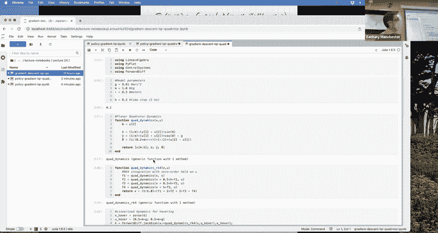

本节课中，我们一起学习了从控制视角理解强化学习，重点剖析了策略梯度方法。

*   **核心**：强化学习旨在解决无模型的最优控制问题。策略梯度方法通过向策略注入噪声、采样轨迹，并利用策略梯度定理来估计优化方向。
*   **实践观察**：在简单的稳定问题上，策略梯度可以工作，但需要大量样本，且对超参数（如基线、优化器）敏感。在不稳定或更复杂的问题上，其样本效率低和收敛困难的缺点更为明显。
*   **关键洞见**：在拥有模型信息（即使是近似模型）时，利用模型梯度的方法通常比完全无模型的策略梯度**样本效率高得多**，收敛更快、更稳定。
*   **观点**：许多在仿真中训练的“无模型”RL，其仿真器本身就是一个模型。忽略这个模型信息而进行黑盒采样，可能不是最有效的方式。将基于模型的控制思想与学习相结合，是未来提高机器人学习效率与可靠性的重要方向。

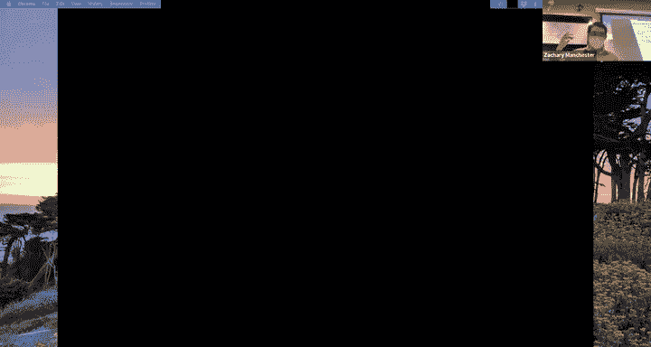

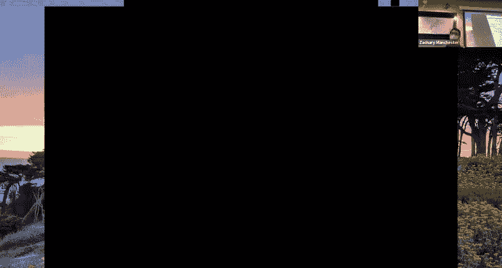

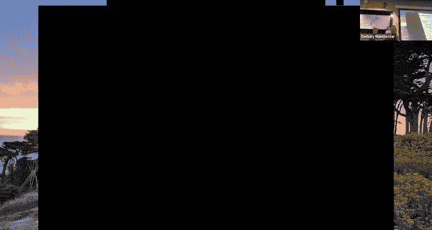

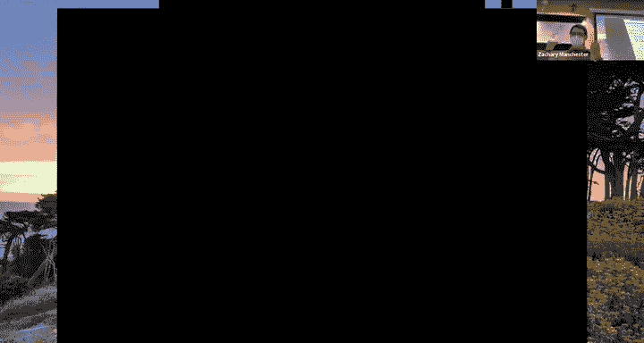

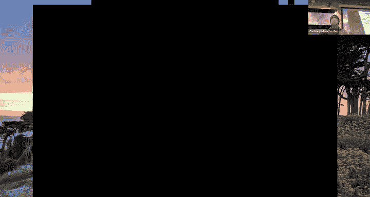

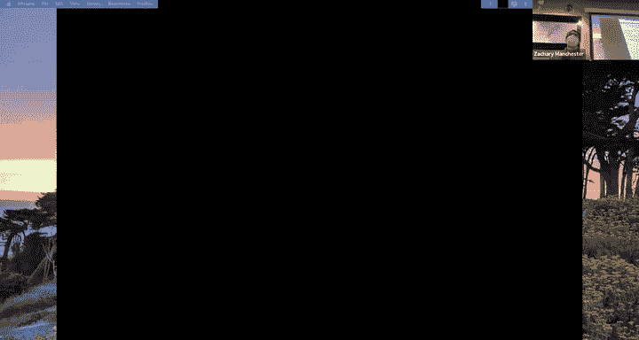

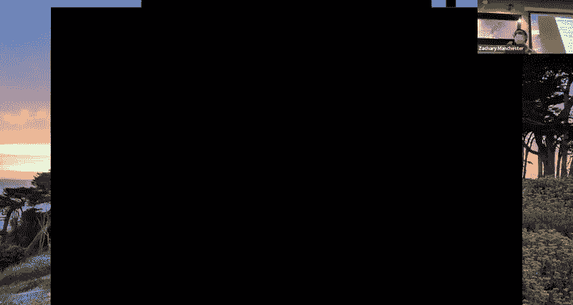

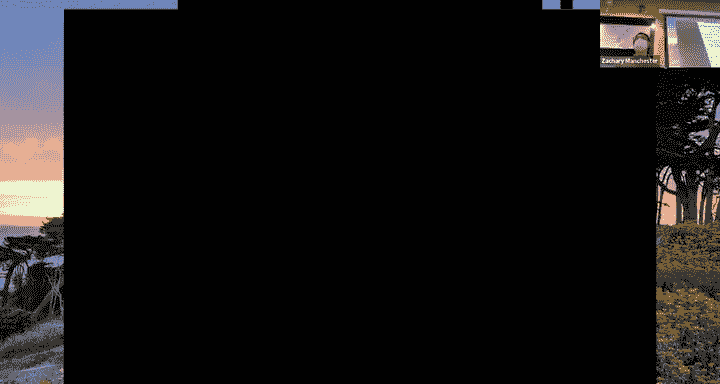

---
**总结**：强化学习，特别是策略梯度，为无模型控制提供了强大的框架。然而，在机器人等实际工程应用中，充分利用任何可获得的模型信息（包括可微仿真器），往往能带来显著的性能提升。理解这些方法的联系与权衡，对于设计和选择正确的控制与学习算法至关重要。