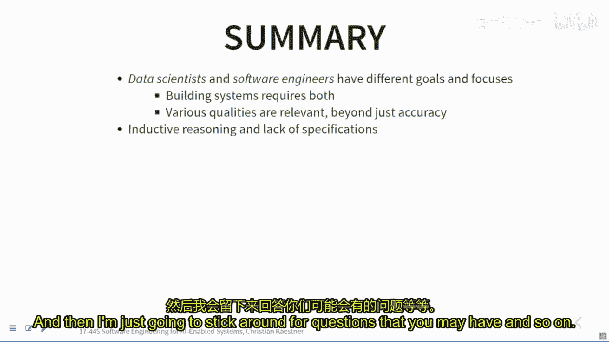

# 001：课程概述

在本节课中，我们将要学习AI驱动系统软件工程课程的整体介绍，包括课程目标、结构、预期挑战以及软件工程师与数据科学家在构建此类系统时的不同视角。

## 课程介绍与期望

欢迎来到本课程的第一讲。这门课程名为“AI驱动系统的软件工程”。在开始之前，我们先确认一下技术设置是否正常，确保大家都能听到声音，并能找到参与互动的界面。

我们希望在课堂上进行大量讨论。如果你之前上过卡内基梅隆大学的软件工程课程，就会知道理解权衡利弊、明白没有唯一正确答案是非常重要的。因此，互动讨论、提问和案例分析是本课程的核心。即使是在线授课，我们也希望尽可能模拟课堂体验。

我们将使用以下机制来促进互动：
*   你可以使用Zoom聊天功能提问或发表评论。
*   也可以直接语音提问。
*   可以举手示意。
*   助教会协助监控聊天内容。

为了获得更好的体验，建议大家在条件允许的情况下开启摄像头。这能让我们感觉更像在一起学习，减少隔离感。如果你因隐私或其他原因无法开启摄像头，请与我沟通，我们可以协商解决。

建议大家在听课期间保持参与者列表和聊天窗口打开。幻灯片会在课前发布在课程网页上。

## 课程背景与定位

这是一门相对较新且带有实验性质的课程，这是我第二次讲授，并做了大量修改。我第一次讲授是在去年秋季，当时是出于一种迫切感——我们需要教授如何设计包含越来越多机器学习组件的软件系统，以及如何确保这些系统的质量。

本学期，我将更侧重于软件工程的视角，假设大家有更多的软件工程背景。课程将教授一些数据科学基础知识，并更深入地探讨诸如鲁棒性、公平性以及对机器学习进行特定形式测试等细节。

因为是新课，过程中可能会遇到一些波折。欢迎大家随时反馈，课程的灵活性也允许我们根据大家的兴趣调整内容。

## 核心主题：两种视角的融合

贯穿整个学期的主题是：构建包含机器学习的系统存在不同的视角。我在此进行大量简化，以便说明：

*   **软件工程师**的视角：擅长构建产品。他们关注成本、性能、稳定性、交付时间、可扩展性、错误处理、系统维护与演进，并侧重于安全性、可靠性等问题。目标是构建一个在约束条件下“足够好”并能长期运行的产品。
*   **数据科学家**的视角：擅长机器学习、数学和统计。他们专注于在固定数据集上构建和评估模型，致力于将预测准确率提到最高。他们通常在Jupyter Notebook等环境中进行大量原型设计，是特征工程和建模技术的专家。

要构建一个包含机器学习组件的系统，我们通常需要这两类人才。市场曾期望找到同时精通两者的“独角兽”型人才，但这很罕见。本课程的目标，就是为大家提供重叠领域的知识，建立沟通的词汇和概念，让大家理解数据科学家的思维方式及其面临的约束，从而能够从软件工程的角度有效地支持他们，共同协作。

我本人来自软件工程背景，课程也会带有这个视角的偏向。但我们会从零开始讲解必要的数据科学知识，重点是学会如何将数据科学家开发的模型集成到系统中，并思考需要关注哪些问题。

## 案例研究：转录服务

我们通过一个案例研究来切入主题：一个自动转录服务。

**背景**：研究人员经常需要访谈，并将录音转为文字进行分析。人工转录耗时费力（1小时访谈需4-5小时转录），而外包给众包平台的价格约为每分钟1-2美元。

**机遇**：假设你完成了一项研究，开发了一个能出色识别特定领域（如医学、编程）专业术语的语音转文字模型，其性能优于通用模型。你看到了一个商机：建立一个类似众包平台的网站，用户上传音频文件并付费，你的AI模型在后台提供快速、低成本的转录服务。

**挑战**：如果作为一个初创公司来构建这项服务，你会预见哪些问题？

以下是可能遇到的挑战：
*   非功能性需求：快速响应时间、存储需求、可扩展性。
*   数据与模型：寻找合适的训练数据、识别实际发生的错误。
*   市场竞争：开发周期长，竞争对手可能更快进入市场。
*   技术复杂性：处理不同方言、口音、非英语语言。
*   协作问题：软件工程师与数据科学家在特性、沟通、目标（准确率 vs. 成本与部署时间）、工具链、开发环境、模块化结构、错误处理方式上可能存在分歧。

这个案例揭示了构建AI驱动产品时，我们关心的质量属性远不止模型的预测准确率。还包括：
*   模型更新速度
*   服务响应速度
*   系统可扩展性
*   错误检测与修复能力
*   模型大小与训练成本
*   系统可维护性与可调试性

这些质量属性往往是相互冲突的。核心问题在于：我们如何设计一个系统来权衡这些属性，并满足用户需求甚至实现盈利？

## 课程结构与安排

我将以软件工程的方式教授这门课，重点培养工程判断力，权衡利弊，理解“视情况而定”背后的决策依据。课程注重实践，包含一系列作业。

**先修要求**：
*   **软件工程**：具备基础理解，有构建超过100行代码系统的经验，了解版本控制、需求收集、软件设计、测试、持续集成等概念，最好有团队项目经验。
*   **机器学习**：无需背景。课程会涵盖必要的基础知识。

**课程活动**：
*   **课堂**：保持互动，有讨论和练习。
*   **阅读**：有一本指定教材及相关论文、文章。每次课前有阅读测验。
*   **作业**：前半部分有一些个人或小规模作业，后半部分是一个大型团队项目（关于质量保障的推荐系统）。
*   **实习课**：手把手实践，例如学习Apache Kafka流处理框架和机器学习框架。

**评分**：
*   包含作业、期中考试、团队项目展示和课堂参与。
*   课堂参与不仅指出席，更指积极参与讨论。

**学术诚信**：严禁作弊。如有压力或困难，请务必与我沟通，这远比作弊要好。

## 核心概念：从“规范”到“目标”

这是经典软件工程与机器学习的一个根本区别。

在经典软件工程中，我们习惯于通过**接口规范**来思考。规范（无论是API文档还是需求说明）明确描述了组件应有的行为。如果实现与规范不符，我们就称之为“缺陷”。

但在机器学习中，**规范的概念瓦解了**。我们无法精确写出“转录音频文件”或“推荐商品”的每一步规范。否则，我们直接写算法就行了。我们正是在**无法写出规范**（因为问题太复杂或我们知识不足）时，才使用机器学习。

因此，机器学习系统只有**模糊的目标**，例如“在此数据上尽可能准确地预测”。这使得测试变得异常困难。如果一个机器学习组件转录错了单词，这算是一个“缺陷”吗？这改变了我们设计系统的方式：我们不再有清晰的规范，而是在做“尽力而为”的努力，必须学会处理错误，这影响了我们关于系统设计的诸多思考。

## 总结与预告

本节课我们一起学习了课程的基本框架。我们认识到，要构建实际的AI驱动系统，需要融合数据科学家和软件工程师两种不同的视角与专长。我们关心的质量属性多种多样且常相互冲突。此外，机器学习组件的引入使得传统的基于“规范”的开发与测试范式发生了根本变化。

下节课我们将结束关于“规范”的讨论，并在接下来的两周内，学习机器学习的基础知识，以便为后续课程建立共同的理解基础。