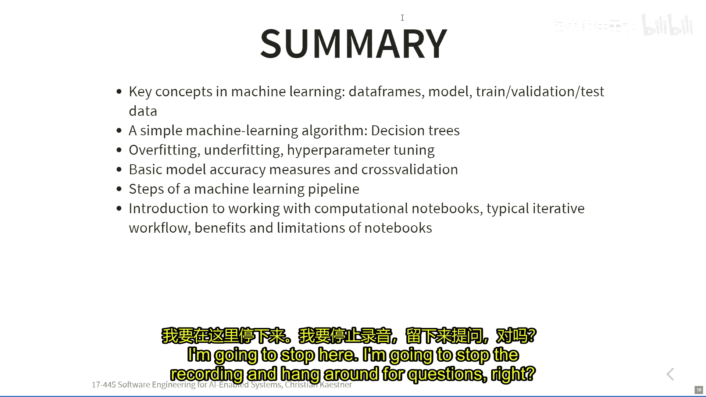

# 002：机器学习基础与决策树


在本节课中，我们将要学习机器学习的基础概念，特别是监督学习。我们将通过一个简单的决策树例子，来理解机器学习模型是如何从数据中学习的，以及如何评估和避免过拟合与欠拟合问题。

上一节我们介绍了在包含AI组件的软件系统中，数据科学家和软件工程师的不同视角，以及由于缺乏明确规范而带来的挑战。本节中我们来看看机器学习的基础知识，理解其核心工作原理。

## 机器学习的基本概念

机器学习，在最基本的意义上，是学习一个从输入到输出的函数。

例如，在图像中检测癌症，输入可能是图像的所有像素，输出是“是”或“否”，判断是否存在癌症。转录音频文件时，输入是一段音频，输出是预测的下一个单词。检测垃圾邮件时，输入是经过预处理的电子邮件文本，输出是“垃圾邮件”或“非垃圾邮件”。

我们总是试图学习某种函数。理想情况下，我们会有这个函数的规范说明，但我们没有。我们希望函数的行为能大致符合数据。

在监督学习中，我们通过从带标签的数据中进行归纳来做到这一点。

我们有一堆带标签的数据点。例如，对于房价预测，每一行数据代表一所房子及其属性（如房间数、面积），以及我们知道的结果（房价）。我们想学习一个函数，它既能很好地拟合这些训练数据，又能推广到未见过的数据上。

以下是机器学习中常见的数据结构表示：

```python
# 数据通常以数据框（DataFrame）的形式组织
# 每一行是一个样本（如一所房子），每一列是一个特征（如房间数、面积）
# 最后一列通常是标签（如房价）
data = [
    [1, 750, 300000],
    [5, 2000, 750000],
    # ... 更多数据行
]
```

## 决策树学习算法

决策树是理解机器学习工作原理的最简单形式之一。它最终会构建一棵树。例如，对于房价数据集，树可能先判断面积，如果小于某个值，再判断房龄，最后给出该类房子的平均价格。

这种树很容易理解，人类也可能使用类似的规则。它可以写成一系列的 `if` 语句。

关键问题是：如果我们有一些带标签的数据，如何生成这样一棵树？

我们将使用一个经典的“是否去打高尔夫”的简单数据集来演示。数据包括天气、温度、湿度和是否有风等特征，以及是否去打高尔夫的结果。

学习算法需要做两件事：
1.  找出所有可能的决策（谓词）。
2.  从所有可能的决策中，找出最好的一个。

在ID3算法中，使用**信息增益**来决定哪个是最好的分割属性。信息增益基于**熵**的概念。熵衡量序列的混乱程度。如果序列全是“是”或全是“否”，则熵很低（信息很纯）。如果“是”和“否”混合，则熵很高。

算法计算每个可能谓词的信息增益，并选择增益最高的那个。然后，它根据这个最佳谓词分割数据集，并对分割后的每个子集递归地重复这个过程。

以下是递归构建决策树的核心步骤：

```python
def build_tree(data, predicates):
    if 所有数据结果相同 或 没有更多谓词:
        return OutcomeNode(最常见的结果, 置信度)
    best_pred = 找到信息增益最高的谓词
    left_data, right_data = 根据 best_pred 分割数据
    left_tree = build_tree(left_data, 剩余谓词)
    right_tree = build_tree(right_data, 剩余谓词)
    return DecisionNode(best_pred, left_tree, right_tree)
```

递归过程会在以下情况停止：所有数据的结果相同（全是“是”或全是“否”），或者没有更多谓词可以用来改善分割。

## 过拟合、欠拟合与超参数

如果只允许树做一次分割（深度很浅），模型可能无法学习到足够的信息，预测能力较弱，这称为**欠拟合**。

如果让树一直生长，直到无法再分，它会尽可能完美地拟合训练数据，但这可能无法很好地推广到新数据，这称为**过拟合**。

控制树生长深度的参数（如最大深度）被称为**超参数**。超参数是控制学习过程的参数，而模型内部学习到的具体判断条件（如“湿度>高”）被称为**模型参数**。

通过调整超参数（如树的最大深度），我们可以控制模型的复杂度（**自由度**），从而在欠拟合和过拟合之间找到平衡。

## 模型评估

评估模型常用的指标是**准确率**，即正确预测的数量除以总预测数量。

准确率只在有标签的数据上定义。我们需要比较模型的预测结果与已知的正确结果。

但只在训练数据上评估准确率是不够的，那只能说明模型“记住”训练数据的能力。我们真正关心的是模型在**未见过的数据**上的表现，即**泛化**能力。

标准的做法是将数据集分割为**训练集**和**验证集**（或测试集），例如80%的数据用于训练，20%用于验证。我们在训练集上学习模型，然后在验证集上评估其准确率。

以下是数据集分割的示例：

```python
from sklearn.model_selection import train_test_split
X_train, X_val, y_train, y_val = train_test_split(features, labels, test_size=0.2, random_state=42)
```

通过观察训练集和验证集上的准确率随模型复杂度（如树深度）的变化，可以检测过拟合：训练准确率会持续上升，而验证准确率在达到某一点后会开始下降，下降点就是过拟合的开始。

由于单次数据分割可能具有随机性，更稳健的方法是使用**交叉验证**。例如，k折交叉验证将数据分成k份，每次用k-1份训练，用剩下的1份验证，重复k次后取平均准确率。

需要警惕的是，如果使用验证集来反复选择和调整超参数，那么验证集实际上也参与了“训练”，可能导致对验证集的过拟合。因此，严谨的做法是将数据分为三部分：**训练集**（用于训练模型）、**验证集**（用于调整超参数）、**测试集**（仅用于最终评估，且只使用一次）。

## 总结




本节课中我们一起学习了机器学习的基础知识。我们了解到机器学习的核心是学习一个从数据中归纳的函数，而决策树是一个直观的入门示例。我们探讨了模型如何通过递归分割数据来学习，并引入了**过拟合**与**欠拟合**的关键概念，它们通过**超参数**（如树深度）来控制。最后，我们学习了评估模型泛化能力的重要性，以及通过**训练集/验证集分割**和**交叉验证**来可靠评估模型性能的方法。理解这些基础概念对于软件工程师构建和集成可靠的AI组件至关重要。