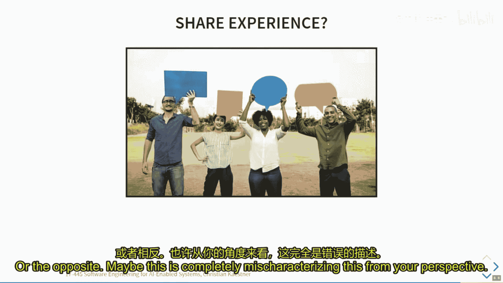
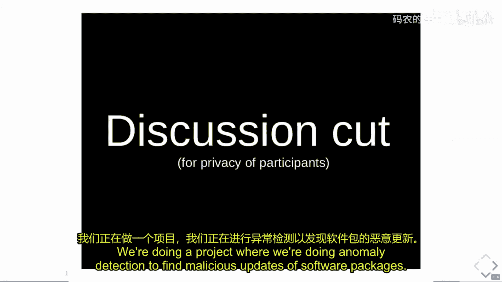
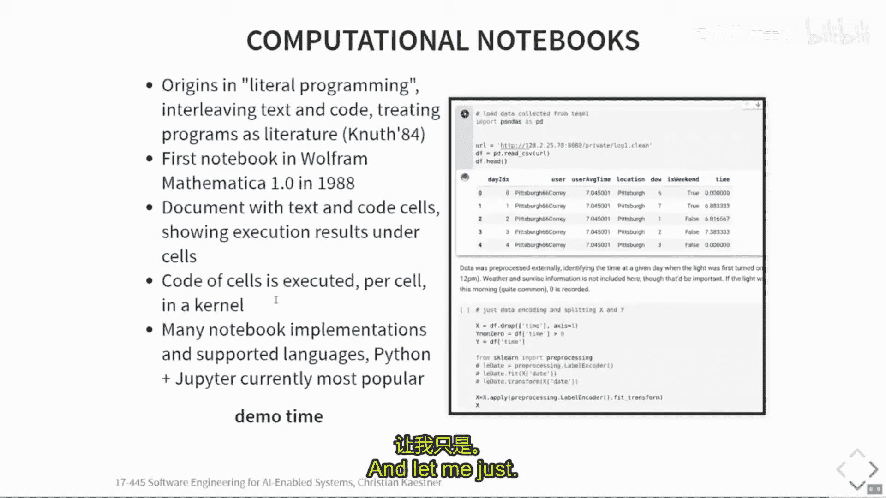
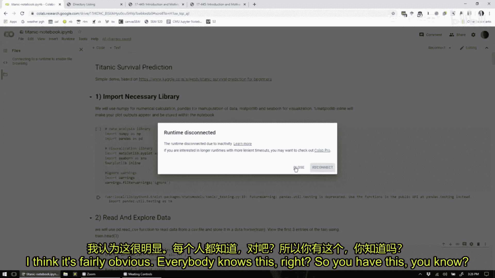
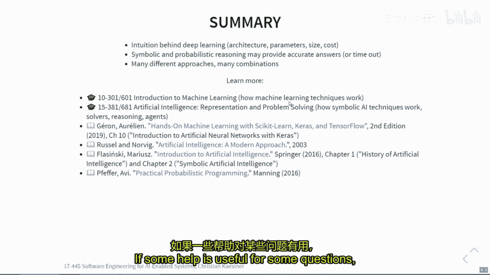

# 003：面向软件工程师的人工智能（第二部分）

## 概述
在本节课中，我们将继续探讨面向软件工程师的人工智能基础。我们将回顾上一讲的内容，深入讨论机器学习项目的完整流程，分析数据科学家的工作方式与软件工程师的差异，并重点介绍深度学习的基本原理，特别是深度神经网络的工作机制。

## 回顾与衔接
上一节我们介绍了机器学习的基本概念，如决策树、过拟合与欠拟合，以及训练集、验证集和测试集的划分。本节中，我们将首先回顾这些内容，然后探讨构建机器学习模型的完整流程。

## 机器学习项目流程
机器学习不仅仅是构建一个模型，它涉及一个完整的、可重复的流程。人们通常将机器学习视为一个包含多个阶段的管道。

以下是构建机器学习模型的典型阶段：
1.  **目标与需求定义**：明确项目目标，例如预测房屋售价。
2.  **数据收集**：从各种来源（如房地产交易网站、公共税务记录）获取相关数据。
3.  **数据清洗**：处理缺失值、移除异常值、统一数据格式。
4.  **数据标注**：为监督学习任务获取标签，例如从销售记录中获取房价。
5.  **特征工程**：从原始数据中提取和构造用于模型训练的特征，如房屋面积、房间数、社区犯罪率。
6.  **模型训练**：使用框架和算法（如几行代码调用学习函数）来训练模型。
7.  **模型评估**：在测试集或验证集上计算模型的准确率等指标。
8.  **部署与监控**：将模型投入生产环境，并持续监控其性能。

在实践中，数据科学家将大量时间花在数据收集、清洗和标注阶段。而需求定义、部署和监控则更多属于软件工程的范畴。

## 数据科学的工作方式
数据科学家开发模型的方式与软件工程师开发传统应用程序有显著不同。这个过程更具探索性和迭代性。

数据科学工作流程通常如下：
1.  获取数据。
2.  准备数据。
3.  编写分析脚本。
4.  分析结果。
5.  调试并重复上述步骤，改进脚本和模型。
6.  记录结果并进行讨论。
7.  可能返回收集更多数据或探索其他方案。
8.  最终发布或产出可用的模型。

研究表明，数据科学家通常从一个准确率较低的初始模型开始，通过不断尝试和改进，在数小时内逐步提升其性能。这个过程是开放式的，类似于研究过程，开始时并不确定最终方案是否可行。

这与软件工程中的螺旋模型或敏捷开发有相似之处，但也存在关键区别：
*   **敏捷开发**强调频繁向客户交付可工作的软件，并有明确的迭代周期。
*   **数据科学探索**则更侧重于内部实验和验证，直到获得满意的结果后才可能交付。整个过程更具直觉驱动性，难以精确分解为可计划的小任务或预估时间。

## 开发工具：Jupyter Notebook
为了支持这种探索性工作流程，数据科学家广泛使用Jupyter Notebook等工具。

以下是Notebook流行的原因：
*   **快速反馈**：可以分段执行代码并立即看到输出。
*   **增量计算**：加载一次数据后，可以只修改和重新运行部分代码单元，无需从头执行。
*   **便于可视化**：图表和结果可以直接嵌入在代码旁边。
*   **易于分享**：可以将整个分析过程（代码、结果、文本说明）作为一个文档分享。

然而，Notebook也存在一些缺点，尤其是在软件工程最佳实践方面：
*   **版本控制困难**：Notebook文件格式（JSON）使得代码差异对比不便。
*   **模块化差**：代码通常组织在一个很长的“方法”中，缺乏函数抽象和模块化。
*   **全局状态**：变量作用域通常是全局的。
*   **不利于测试**：为Notebook代码编写测试用例并不常见。
*   **协作挑战**：多人协作修改单个文件不如传统的模块化导入方式方便。

需要理解的是，Notebook的设计初衷是支持快速探索和实验。当项目需要长期维护和投入生产时，通常需要将代码从Notebook迁移到更结构化的环境中。

## 人工智能与机器学习问题分类
在深入具体技术前，我们先对人工智能领域的术语和问题进行分类。

**术语关系**：
*   **人工智能**：最广泛的领域，旨在让计算机表现出智能行为。
*   **机器学习**：人工智能的一个子领域，通过数据学习模式。
*   **深度学习**：机器学习的一种特定技术，使用深度神经网络。

**常见的机器学习问题类型**：
*   **分类**：预测离散的类别标签。例如，识别图片中的鞋子品牌（Nike或Adidas）。
*   **回归**：预测连续的数值。例如，预测网约车的到达时间。
*   **概率估计**：预测某个事件发生的概率。例如，估计泰坦尼克号乘客的生存概率。
*   **排序**：将项目按特定顺序排列。例如，YouTube视频推荐列表。

**学习范式**：
*   **监督学习**：使用带有标签的数据进行训练。例如，用已标注的房屋价格数据训练房价预测模型。
*   **无监督学习**：使用无标签的数据发现内在结构。例如，对书籍进行聚类分组。
*   **强化学习**：智能体通过与环境交互获得的奖励来学习。例如，计算机学习下围棋。

## 深度学习与神经网络
现在，我们来看一种当前非常流行的机器学习技术：深度学习，特别是深度神经网络。

### 基本思想
神经网络受到生物大脑神经元网络的启发。基本单元是**神经元**（节点），它们通过**连接**（边）传递信号。每个连接有一个**权重**，每个神经元对输入进行加权求和，并通过一个**激活函数**（如阶跃函数、ReLU、Sigmoid）决定是否“激活”（输出信号）。

一个简单的神经元计算可以表示为：
`输出 = 激活函数(权重1 * 输入1 + 权重2 * 输入2 + 偏置)`

### 从单层到深度网络
将多个神经元组织成层，就形成了神经网络。**深度神经网络**意味着网络包含多个**隐藏层**。

前向传播过程可以用矩阵运算描述：
`第1层输出 = 激活函数(权重矩阵1 * 输入向量 + 偏置向量1)`
`第2层输出 = 激活函数(权重矩阵2 * 第1层输出 + 偏置向量2)`
`最终输出 = 激活函数(权重矩阵N * 第N-1层输出 + 偏置向量N)`

### 模型训练：学习权重
模型的**参数**就是所有这些连接上的**权重**和**偏置**。**超参数**则是网络**架构**（如层数、每层神经元数量、激活函数类型），这些是在训练前设定的。

训练过程（反向传播算法）概述：
1.  随机初始化所有权重和偏置。
2.  输入一个训练样本，进行前向传播，得到预测输出。
3.  计算预测输出与真实标签之间的误差。
4.  从输出层开始，反向逐层计算误差对每个权重的梯度。
5.  根据梯度方向，微调所有权重和偏置，使误差减小。
6.  对大量训练样本重复步骤2-5，直到模型性能稳定。

### 实例与规模
以一个识别10类时尚物品的神经网络为例：
*   **输入**：28x28灰度图像（784个像素值）。
*   **架构**：784 -> 300 (ReLU) -> 100 (ReLU) -> 10 (Softmax)。
*   **参数量计算**：
    *   第一层权重：784 * 300 = 235,200
    *   第一层偏置：300
    *   第二层权重：300 * 100 = 30,000
    *   第二层偏置：100
    *   输出层权重：100 * 10 = 1,000
    *   输出层偏置：10
    *   **总计约26.6万个参数**。

现代大型网络规模惊人：
*   图像分类网络（如ResNet）：可能拥有数千万参数，占用数百MB存储空间。
*   文本生成网络（如GPT系列）：可能拥有数十亿参数，占用数十GB存储空间，需要海量数据和数周GPU训练时间。

### 特点与挑战
**深度学习的优势**：
*   **自动特征提取**：能从原始数据（如图像像素、音频波形）中自动学习高层次特征，减少人工特征工程。
*   **处理高维数据**：擅长处理输入维度极高的任务。
*   **强大的表达能力**：理论上可以近似任意复杂函数。

**深度学习的挑战**：
*   **计算成本高**：训练需要大量数据和强大的计算资源（GPU）。
*   **模型复杂度高**：参数量巨大，导致模型文件大，预测（推理）时计算量也大。
*   **可解释性差**：模型内部如同“黑箱”，难以理解其决策依据。
*   **需要大量数据**：通常需要大规模标注数据集才能达到良好性能。

## 总结
本节课我们一起学习了机器学习项目的完整流程，理解了数据科学家探索式、迭代式的工作方式及其常用工具（如Jupyter Notebook）的利弊。我们深入探讨了深度学习的基本原理，了解到深度神经网络通过多层神经元和权重连接来模拟复杂函数，其训练过程本质上是利用梯度下降法在海量参数中寻找最优解。我们认识到深度学习虽然功能强大，尤其在感知类任务上表现出色，但也伴随着计算成本高、可解释性差和对数据量需求大等挑战。这些知识为我们后续将AI组件集成到软件系统中并考量其工程影响奠定了基础。