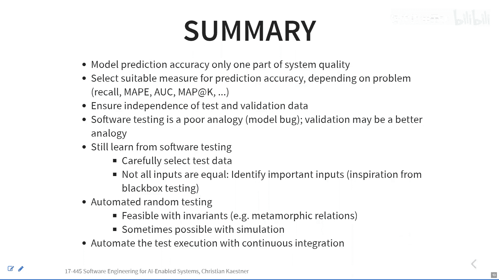

# 004：模型质量 📊

在本节课中，我们将要学习如何评估机器学习模型的质量。我们将从数据科学家的视角出发，了解经典的准确率衡量指标及其适用场景。接着，我们会从软件工程的视角重新审视模型质量，探讨如何借鉴软件测试的思想来评估模型。

## 概述

上一节我们介绍了机器学习流水线、不同类型的任务以及神经网络的基本工作原理。本节中，我们将聚焦于一个核心问题：如何判断一个模型的好坏？我们将首先学习数据科学家常用的评估指标，然后探讨这些评估方法与软件工程中的测试理念有何异同。

## 第一部分：预测准确率——数据科学视角

模型评估的基本思想是，将模型在测试数据或验证数据上的预测结果，与已知的正确标签进行比较。

### 混淆矩阵与基础准确率

对于分类任务，一种常见的评估工具是**混淆矩阵**（也称为误差矩阵）。它通过对比模型的预测类别和真实类别来展示模型的性能。

以下是混淆矩阵的一个示例，其中包含三个类别（A, B, C）：

| 预测 \ 实际 | 实际为 A | 实际为 B | 实际为 C |
| :--- | :--- | :--- | :--- |
| **预测为 A** | 10 | 8 | 2 |
| **预测为 B** | 5 | 24 | 3 |
| **预测为 C** | 1 | 4 | 82 |

*   对角线上的数值（10, 24, 82）代表预测正确的样本数量。
*   其他位置的数值则代表预测错误的样本数量。

最基础的准确率计算公式为：**准确率 = 对角线数值之和 / 所有预测样本总数**。在上例中，准确率约为 71%。

然而，单一的准确率数字往往难以解读。它就像被告知“Web服务器响应时间为0.5秒”一样，好坏完全取决于具体场景。

### 如何解读准确率？

为了更有效地解读准确率，我们可以采用以下两种方法：

1.  **与基线模型比较**：将你的模型与一个简单的、无需复杂机器学习即可实现的启发式方法进行比较。例如：
    *   对于癌症预测，基线可以是“永远预测无癌症”（假设癌症罕见）。
    *   对于房价预测，基线可以是“预测该区域的平均房价”。
    *   了解基线模型的性能后，你就能更好地理解“99%准确率”的真正含义。

2.  **关注错误类型**：在二分类问题中，区分不同类型的错误至关重要。我们定义：
    *   **真正例**：实际为真，预测也为真。（例如：有癌症，且预测有癌症）
    *   **真反例**：实际为假，预测也为假。（例如：无癌症，且预测无癌症）
    *   **假正例**：实际为假，但预测为真。（例如：无癌症，但预测有癌症）
    *   **假反例**：实际为真，但预测为假。（例如：有癌症，但预测无癌症）

假正例和假反例的严重性通常不同。在医疗诊断中，漏诊（假反例）可能比误诊（假正例）后果更严重；而在垃圾邮件过滤中，误判正常邮件为垃圾邮件（假正例）可能比漏掉垃圾邮件（假反例）更令人烦恼。

### 精确率与召回率

为了量化这两种错误，我们引入两个指标：

*   **召回率**：在所有实际为正例的样本中，模型正确预测出的比例。**公式：召回率 = 真正例 / (真正例 + 假反例)**。它衡量了模型的“查全”能力。
*   **精确率**：在所有模型预测为正例的样本中，实际为正例的比例。**公式：精确率 = 真正例 / (真正例 + 假正例)**。它衡量了模型的“查准”能力。

精确率和召回率通常存在此消彼长的关系，这引出了下一个概念：阈值。

### 阈值与曲线下面积

许多分类器（如逻辑回归、神经网络）输出的不是直接的类别，而是一个介于0和1之间的**置信度分数**。我们需要设定一个**阈值**（例如0.5）来决定将哪些预测视为正例。

*   提高阈值（例如设为0.8）意味着只对高置信度的预测才判定为正例。这通常会**提高精确率**（因为判定的正例更可能是对的），但会**降低召回率**（因为一些真正的正例可能因为置信度不够高而被漏掉）。
*   降低阈值则相反，会提高召回率但降低精确率。

通过在不同阈值下计算精确率和召回率，我们可以绘制**精确率-召回率曲线**。一个在所有阈值上都表现更好的模型，其曲线会更靠近右上角。为了用一个数字概括模型的整体性能，我们常计算**曲线下面积**，面积越大，模型性能通常越好。

另一种常见的曲线是**受试者工作特征曲线**，它绘制的是**真正例率**（即召回率）与**假正例率**的关系，其解读方式与精确率-召回率曲线类似。

### 回归与排序任务的评估

对于回归任务（如预测房价），我们关心的是预测值与真实值的接近程度，而非分类是否正确。常用的指标包括：

*   **平均绝对百分比误差**：计算每个预测值的误差百分比，然后取平均。**公式：MAPE = (1/n) * Σ |(预测值 - 真实值) / 真实值|**
*   **均方误差**：计算预测值与真实值之差的平方的平均值。**公式：MSE = (1/n) * Σ (预测值 - 真实值)²**

对于排序任务（如搜索引擎结果），我们更关心靠前的结果是否准确。常用指标如**平均精度**，它考察在前K个推荐结果中，相关结果所占的比例。

## 第二部分：模型质量——软件工程视角

了解了数据科学家的评估方法后，本节中我们来看看软件工程中的测试思想能否应用于模型评估。

### 软件测试的类比

传统软件测试包含三个部分：测试输入、预期输出和受控的执行环境。其核心挑战之一是“预言问题”：我们如何知道特定输入下的正确输出是什么？

对于机器学习模型，我们似乎拥有完美的“预言”——带标签的验证集。但直接将其转化为测试用例会遇到问题：我们并不期望模型在每一个测试样本上都做出完全正确的预测。一个错误的预测本身并不等同于程序中的“Bug”。

或许，**性能测试**是一个更好的类比。在性能测试中，我们并不要求每次响应都恰好是0.5秒，而是期望在多次执行和多种输入下，平均响应时间低于某个阈值。类似地，对于模型，我们关心的是在整体验证集上，其准确率、精确率等指标是否满足我们的期望。

### 一个不同的视角：验证 vs. 确认

我们可以从另一个角度思考模型质量问题：**验证**与**确认**的区别。
*   **验证**：我们是否正确地构建了系统？（“是否正确地实现了规格说明？”）
*   **确认**：我们构建的是否是正确的系统？（“规格说明本身是否正确？”）

传统软件测试主要关注**验证**。而机器学习模型本身，可以看作是从数据中学习到的“规格说明”。将模型转化为代码（如一个决策树规则集）通常是直接的。因此，真正的挑战不在于“实现这个模型时是否有Bug”，而在于“我们学习到的这个模型本身是否合适、是否公平、是否满足业务目标”。这更像是一个**确认**问题，类似于需求工程。

因此，谈论“模型Bug”可能并不恰当。我们更应关注模型的**准确率**或**性能**是否达标，以及它是否与一些额外的约束（如公平性要求）相一致。

### 模型比较与统计显著性

在实践中，我们经常需要比较不同模型或同一模型不同参数下的性能。由于机器学习训练过程中可能存在随机性（如神经网络权重初始化、随机森林的样本采样），仅凭一次训练得到的准确率差异可能源于偶然。

为了更严谨地比较，可以进行多次训练（或使用K折交叉验证），并运用统计检验（如t检验）来判断一个模型是否显著优于另一个。不过，在工业界实践中，如果性能提升幅度很大（例如从80%到90%），人们通常不会进行复杂的统计检验；而在学术研究中，或当提升非常微小时，统计显著性分析则更为重要。

## 总结

本节课中我们一起学习了评估机器学习模型质量的核心方法。我们从数据科学的基础指标出发，了解了准确率、精确率、召回率以及曲线下面积等概念及其应用场景。随后，我们从软件工程的视角进行探讨，分析了将模型评估类比于传统测试或性能测试的可行性，并引入了“验证 vs. 确认”的框架来更深入地理解模型质量的本质。最后，我们简要讨论了在比较模型时考虑统计显著性的重要性。下一节，我们将继续探讨更多从软件工程中汲取灵感的模型质量保障技术。