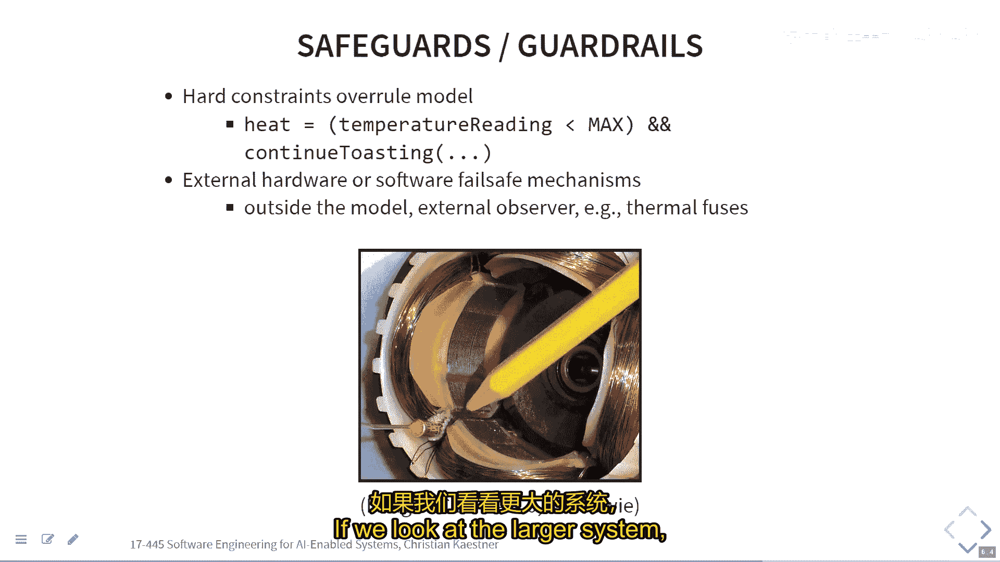
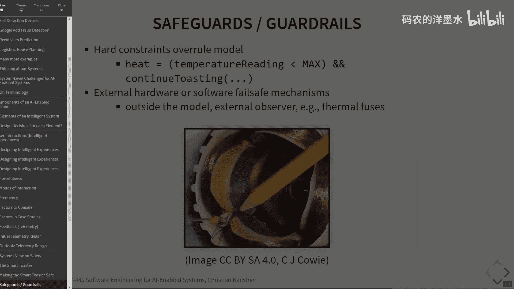
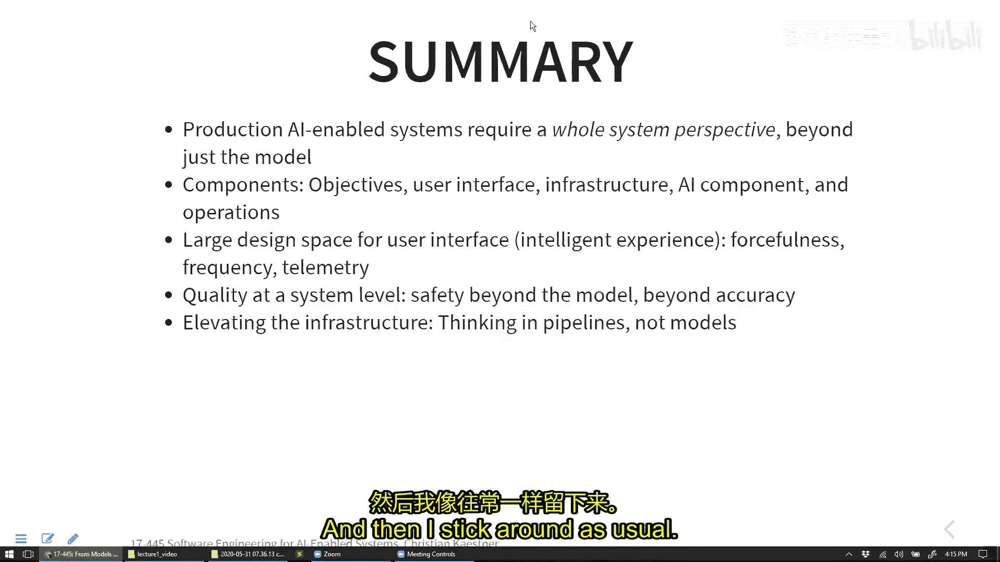

# 005：从模型到人工智能驱动系统 🚀

在本节课中，我们将学习如何将单一的机器学习模型整合到更广泛的软件系统中。我们将探讨评估模型质量之外的挑战，并理解构建一个完整、可靠且可维护的AI驱动系统所需考虑的系统级因素。

## 回顾：模型质量评估

上一节我们介绍了如何评估机器学习模型的质量，例如使用准确率、精确率等指标。本节中，我们将视角从模型本身扩展到包含模型的整个系统。

在传统软件测试中，我们讨论覆盖率、变异测试等技术。然而，将这些概念直接应用于机器学习模型测试存在挑战：
*   **规格说明覆盖**：机器学习模型通常没有明确的规格说明，难以进行传统的边界值分析。
*   **分支覆盖**：例如在决策树中，确保测试数据覆盖所有分支，但这通常依赖于训练数据的代表性。
*   **神经元覆盖**：在深度神经网络中研究神经元激活情况，但其实际效用尚不明确。
*   **变异测试**：不清楚应对模型的哪些部分（如阈值、参数）进行“变异”以注入故障。

目前，比追求某种“覆盖率”更实用的方法是**确保验证数据的代表性**，并监控**数据漂移**。

## 超越单一验证集：重要性与公平性

将所有输入数据视为同等重要可能掩盖关键问题。平均准确率无法反映某些输入子集（可能不常见但至关重要）的性能差异。

以下是创建更细致评估集的策略：

*   **关键用例验证集**：针对高频或关键功能创建专门的测试集。例如，语音助手中的“打电话给妈妈”指令。
*   **子群体验证集**：为特定用户群体（如特定口音、方言）创建验证集，以评估和保障公平性。
*   **延伸目标验证集**：针对当前模型表现不佳但希望未来改进的困难案例（如嘈杂环境下的语音）建立基准。

这些子集类似于传统软件测试中的**测试用例**，每个用例包含多个数据点，并可以设定不同的准确率期望。

如何识别这些重要的子集？可以借鉴黑盒测试思想：
*   分析问题领域和用户。
*   咨询领域专家或公平性专家。
*   分析用户反馈或生产环境中的性能数据。
*   在现有验证集中寻找模型表现显著较差的模式。

## 自动化测试与不变性关系

在传统软件测试中，模糊测试通过生成大量随机输入来发现崩溃等错误。对于机器学习模型，生成输入数据很容易，但**预言问题**（如何判断输出是否正确）依然存在。

解决预言问题的一种思路是检查模型的**不变性关系**，即某些输入变换不应影响（或应以特定方式影响）输出。这被称为**蜕变测试**。

以下是一些机器学习模型可能具有的不变性关系示例：

*   **公平性不变性**：对于贷款预测模型，仅改变申请人的性别属性，预测结果应保持不变。公式表示为：`predict(data) == predict(swap_gender(data))`
*   **语义不变性**：对于情感分析模型，将句子中的“is not”替换为同义的“isn’t”，情感判断应保持不变。
*   **鲁棒性不变性**：对于图像分类器，对输入图像进行微小扰动（如旋转、添加噪声），分类结果应保持不变。公式表示为：`predict(image) == predict(perturb(image))`
*   **规则不变性**：模型应遵守某些硬编码规则，例如“如果信用分数低于X，则贷款申请总是被拒绝”。

一旦定义了这些不变性关系，就可以自动生成大量测试输入，并验证模型是否遵守这些关系。这需要领域知识来定义恰当的不变性。

## 持续集成与基础设施

与传统软件开发一样，机器学习项目也能从持续集成实践中受益：
*   自动化训练和评估流程。
*   使用仪表板（如TensorBoard、MLflow）跟踪模型版本、超参数、指标和训练时间。
*   设定质量阈值，在模型性能下降时触发警报。

关键在于将模型视为通过**流水线**产生的制品，而不仅仅是静态代码。一个完整的ML系统流水线包括数据收集、特征工程、模型训练、服务部署、监控和反馈收集等众多环节。构建和维护这个可重复、可调试、可更新的自动化流水线，是工程化的核心，其代码量远超过模型训练本身的几行代码。

## 系统思维：AI驱动系统的设计

机器学习模型通常是更大系统的一个组件。以Microsoft PowerPoint的“设计灵感”功能为例：
*   **目标**：不是追求最高的布局预测准确率，而是帮助用户更轻松地创建美观的幻灯片，最终提升产品竞争力。
*   **用户体验设计**：功能是可选而非强制的，用户需主动点击按钮查看建议，并可轻松撤销。这降低了错误预测的风险。
*   **基础设施与遥测**：需要设计架构来处理预测请求（本地或云端），并收集使用数据（如功能使用频率、建议采纳率、撤销率）以改进系统。
*   **运营**：基于遥测数据持续更新和优化模型。

另一个例子是跌倒检测智能设备：
*   **目标**：在老人跌倒时及时获得救助。
*   **交互设计决策**：需要在自动呼叫救护车（及时但可能误报）、询问用户（可能无法回应）等选项间权衡。设计需平衡救助价值、误报成本以及模型置信度。
*   **反馈收集**：如何获取“漏报”（实际跌倒但未检测到）的数据极具挑战性。

设计交互时需考虑**主动性**（从被动显示到强制行动）、**频率**以及如何通过交互设计**获取改进模型所需的反馈**。

## 系统级安全与质量

即使模型本身不可靠，也可以通过系统设计来保障安全。例如智能烤面包机：
*   **不可靠组件**：基于摄像头图像预测烘烤时长的模型可能出错。
*   **系统级保障**：通过设置最大烘烤时间硬限制、温度传感器和保险丝等**冗余安全机制**，可以防止模型错误导致火灾，而无需追求模型的绝对完美。

最终，系统的成功取决于多种质量属性的平衡（如效用、成本、安全性、用户体验），而不仅仅是模型的准确率。有时，通过改进用户界面或系统流程，比单纯优化模型更能有效地提升整体质量。

## 总结

本节课中我们一起学习了如何超越对单一机器学习模型的评估，转而以系统工程的视角构建AI驱动系统。我们探讨了创建针对性验证集以评估重要子群体性能和公平性的方法，介绍了利用蜕变测试验证模型不变性的自动化测试思路，并强调了构建自动化ML流水线的重要性。最后，我们通过实例分析了在系统层面进行目标定义、交互设计、安全保障和质量权衡的关键考量。记住，优秀的AI驱动系统是精心设计的软件工程产物，而不仅仅是机器学习模型的简单封装。