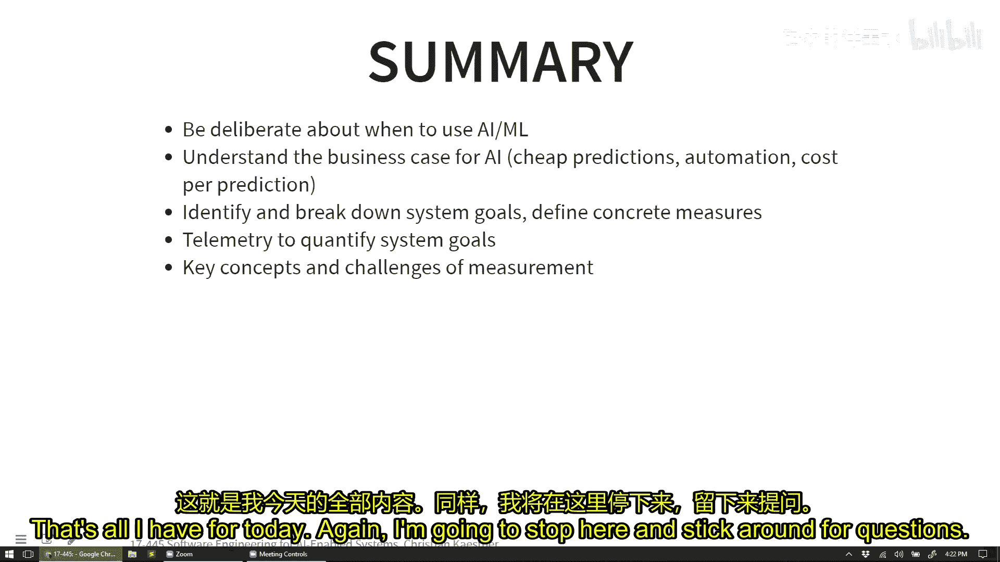

# 006：为人工智能系统设定目标 🎯

在本节课中，我们将学习如何为人工智能系统设定目标。我们将探讨何时适合使用机器学习，如何从业务角度理解其价值，以及如何将模型性能与更广泛的系统及组织目标联系起来。

## 何时使用机器学习 🤔

上一节我们讨论了如何向用户呈现预测结果，本节我们来看看一个更根本的问题：何时应该使用机器学习。

在决定是否采用机器学习时，需要考虑多种因素。以下是几种**不应使用机器学习**的情况：

*   **有明确规范时**：如果问题有清晰、明确的解决方案，直接实现规范即可。例如，批改只有选择题的试卷或执行数学运算。
*   **简单启发式方法足够好时**：如果简单的规则就能提供足够好的结果，则无需引入复杂的机器学习模型。例如，根据总分和分数线判断学生是否及格。
*   **成本效益不划算时**：如果构建和维护机器学习系统的成本远超其带来的收益，则应放弃。例如，为个人网站开发复杂的语音搜索功能。
*   **正确性至关重要时**：在需要绝对可靠性的领域，如武器系统、飞机自动驾驶或某些医疗诊断，应谨慎使用机器学习。
*   **仅为追逐热点时**：如果使用机器学习仅仅是为了吸引投资或制造噱头，而非解决实际问题，这并非明智的技术决策。

那么，哪些问题**适合使用机器学习**呢？以下是机器学习表现出色的场景：

*   **大规模问题**：处理海量输入数据，人类难以手动处理。例如，基因组分析、文本情感分析。
*   **开放性问题**：没有单一最优解，追求渐进式改进。例如，游戏AI、语言翻译。
*   **随时间变化的问题**：环境或数据分布不断变化，需要模型持续适应。例如，电影推荐、库存预测、交易自动化。
*   **本质上困难的问题**：没有现成的有效启发式规则。例如，图像识别（识别猫）、语音处理。

此外，成功的机器学习应用通常还需要满足一些前提条件：允许部分系统可行（即可以容忍一定错误）、能够收集反馈数据用于改进、预测结果能对系统目标产生积极影响，并且比替代方案更具成本效益。

## 案例分析：Spotify个性化播放列表 🎧

让我们以Spotify的个性化播放列表功能为例，分析其为何适合使用机器学习。

*   **大规模问题**：拥有数百万用户和海量音乐库。
*   **开放且随时间变化**：用户品味和音乐库不断变化，需要动态调整。
*   **无明确规则**：很难用硬编码规则定义“相似音乐”或“用户喜好”。
*   **部分系统可行**：偶尔推荐不喜欢的歌曲是可以接受的。
*   **有数据和反馈**：可以收集用户收听历史作为训练数据，并通过播放行为获得反馈。
*   **影响业务目标**：该功能通过提升用户参与度和满意度，间接支持Spotify的核心目标（如增加订阅、提高广告收入）。
*   **成本效益高**：比人工为每个用户定制播放列表成本低得多。

## 商业视角：作为预测机器的AI 💡

从经济学和商业战略角度看，机器学习（或广义的AI）的核心价值在于**降低预测成本**。

*   **预测与决策**：商业决策依赖于预测（例如，预测合并是否有利、预测客户需求）。机器学习使高质量预测变得廉价且可大规模自动化。
*   **历史类比**：如同电力降低照明成本、互联网降低搜索成本一样，AI降低了预测成本，从而催生了新的商业模式和产品（如实时导航、机器翻译）。
*   **预测与判断**：需要区分“预测”（估计未来状态或概率）和“判断”（基于预测结果和价值函数做出决策）。机器学习擅长自动化预测，而判断（涉及价值权衡和风险评估）通常仍由人类完成，或通过数据学习人类的判断模式。
*   **商业影响**：预测成本下降提升了数据和数据科学专家的价值，改变了竞争格局（例如，拥有导航App的网约车司机削弱了传统伦敦出租车司机的路线知识优势），并可能催生颠覆性商业模式（例如，基于精准预测的“先发货后购买”模式）。

## 设定与分解系统目标 🎯

我们讨论了模型评估，但模型服务于更大的系统目标。因此，我们需要将模型性能与业务目标联系起来。

目标可以分解为多个层次：

1.  **组织目标**：最高层的目标，通常与商业成功或社会使命相关。例如，公司利润最大化、拯救生命、促进社会公平。
2.  **先导指标**：能够快速衡量、并与组织目标强相关的代理指标。例如，用户参与度、订阅用户数、广告点击率。
3.  **用户成果**：从用户角度衡量的结果。例如，用户满意度、任务完成效率、发现新内容的愉悦感。
4.  **模型属性**：传统的机器学习性能指标。例如，准确率、精确率、召回率、F1分数。

**关键点**：机器学习组件通常不直接实现组织目标，而是通过影响用户成果和先导指标来间接贡献。例如，Spotify的推荐算法（模型属性）旨在提升用户发现音乐的满意度（用户成果），从而提高用户留存和收听时长（先导指标），最终增加收入和利润（组织目标）。

## 小组讨论：研究生申请审核自动化 🎓

假设我们开发一个机器学习模型来自动化审核研究生申请（如软件工程硕士项目）。请思考以下四个层次的目标：

*   **组织目标**：大学或该硕士项目的根本目标是什么？（例如，提升学术声誉、培养杰出人才、维持财务可持续性。）
*   **先导指标**：哪些指标能快速反映项目在招生方面的成功？（例如，录取学生的毕业后起薪、论文发表数量、项目申请人数、校友捐赠率。）
*   **用户成果**：
    *   对**申请学生**而言：成功匹配到适合的项目、获得公平的评估。
    *   对**招生官员**而言：减轻审核负担、聚焦于边缘案例、更快做出决策。
*   **模型属性**：如何评估这个预测模型的质量？（例如，预测学生“是否接受录取”（ yield ）的准确率、预测学生“入学后成绩”的准确率、在已录取学生中识别出优秀候选人的精确率。）

通过这样的分解，我们可以清晰地看到，优化模型准确率（模型属性）是为了帮助招生官更高效地选拔出最有可能成功且接受录取的学生（用户成果），从而提升生源质量（先导指标），最终服务于大学提升声誉和培养人才的目标（组织目标）。

## 总结 📝

本节课我们一起学习了如何为人工智能系统设定目标。我们首先探讨了何时使用（或不使用）机器学习的决策框架。接着，我们从商业视角将AI视为“预测机器”，理解了其降低预测成本、重塑商业模式的核心价值。最后，我们学习了如何将机器学习模型的具体性能指标，与更高层次的用户成果、先导指标乃至组织战略目标系统地联系起来。这种目标分解与对齐的思维，对于设计、评估和迭代一个成功的AI驱动系统至关重要。