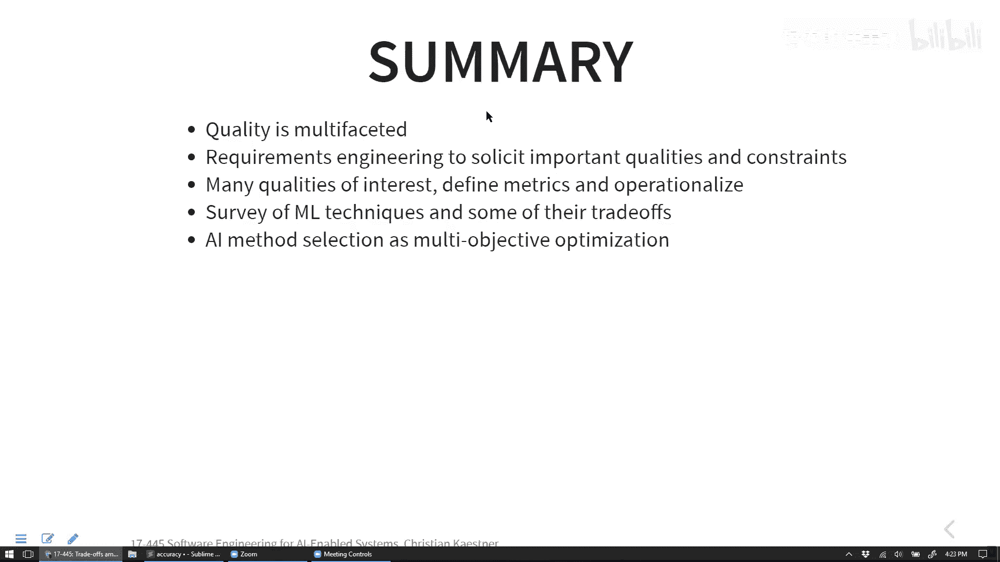

# 007：AI技术之间的权衡

在本节课中，我们将要学习如何为AI系统选择合适的建模技术。我们将探讨除了准确率之外，系统可能关心的其他多种质量属性，并了解不同AI技术在这些属性上的权衡。我们将以车道辅助系统为例，分析其约束条件，并对比决策树、线性回归、神经网络和K近邻等技术的优缺点。最后，我们将简要介绍符号AI和概率编程，以拓宽对AI技术的理解。

## 质量属性的多样性

上一节我们讨论了如何将高层目标分解为可测量的模型属性。本节中，我们来看看在具体选择建模技术时，我们需要考虑哪些质量属性。

质量是一个多维度的概念，可以从不同角度理解。例如，一幅画的质量可能源于其艺术价值（超越性观点），也可能源于其使用了更多颜料（产品观点）。对于AI模型，我们同样需要从多个维度评估其“质量”。

以下是AI模型或组件可能涉及的一些关键质量属性：
*   **准确率**：模型预测的正确程度。
*   **推理时间/延迟**：模型对单个输入做出预测所需的时间。
*   **模型大小**：训练后模型所占用的存储空间。
*   **可解释性**：理解模型为何做出特定预测的能力。
*   **鲁棒性**：模型在面对输入微小扰动时，预测结果的稳定程度。
*   **公平性**：模型对不同人群（如不同性别、种族）的表现是否一致，避免歧视。
*   **训练时间**：从数据中学习模型所需的时间。
*   **可扩展性**：模型处理大量特征或数据的能力。
*   **能耗**：模型进行推理时消耗的计算资源。
*   **可靠性**：在系统层面，组件故障时整个系统能否继续运行。

## 案例研究：车道辅助系统的约束

让我们以车道辅助系统为例，分析在选择具体技术方案时必须满足的硬性约束。

以下是构建车道辅助系统时的一些关键约束：
*   **实时性**：系统必须在极短时间内（例如1/50秒）处理完一帧图像并给出预测，以控制车辆。
*   **硬件限制**：模型必须在车载计算机有限的算力和内存资源内运行。
*   **最低准确率**：预测必须达到一个最低的准确率阈值，否则系统无效甚至危险。
*   **安全性**：模型的错误不应导致碰撞等安全事故（通常通过系统设计实现）。

## 不同建模技术的权衡

了解了我们关心的属性和面临的约束后，本节我们来看看几种常见机器学习技术各自的优缺点。

### 决策树
决策树通过一系列“如果-那么”规则进行预测。
*   **优点**：小型决策树**易于理解和解释**；推理速度快（只需几次判断）；模型通常较小。
*   **缺点**：处理**大量特征或连续数据**时效果不佳；树太深时难以解释；容易过拟合；通常不支持**增量学习**。

### 线性回归
线性回归试图学习一个线性函数 `y = w1*x1 + w2*x2 + ... + b` 来拟合数据。
*   **优点**：模型**简单，参数少时易于解释**；训练和推理速度通常较快。
*   **缺点**：只能学习**线性关系**，无法捕捉复杂模式；处理**类别型数据**需要特殊编码；通常不支持增量学习。

### 神经网络（深度学习）
神经网络通过多层非线性变换来学习复杂函数。
*   **优点**：能处理**海量特征和复杂非线性关系**；在许多任务上能达到很高的准确率；无需大量特征工程。
*   **缺点**：**训练耗时且需要大量数据**；模型庞大，**几乎无法解释**（“黑盒”）；推理可能计算量大。

### K近邻
K近邻不构建显式模型，预测时在训练数据中寻找最相似的K个样本，以其标签进行投票。
*   **优点**：**无需训练阶段**；模型大小即为数据集大小；**支持自然增量学习**（增加数据即可）；预测结果可通过相似样本解释。
*   **缺点**：**推理速度慢**（需搜索整个数据集）；不擅长处理**高维特征**；需要定义合适的距离度量。

## 超越机器学习：符号AI与概率推理

之前我们主要关注基于数据的归纳学习（机器学习）。本节中，我们来看看另一类AI技术——基于规则和逻辑的符号推理。

符号AI（如布尔可满足性问题求解器、约束满足问题求解器）通过编码领域知识和规则进行**演绎推理**。
*   **核心**：将问题（如配置验证、任务调度）编码为一组逻辑约束，然后使用求解器寻找满足所有约束的解。
*   **优点**：如果求解器找到解，该解**保证是正确的或最优的**（在给定约束下）。
*   **缺点**：许多问题是NP难的，**求解时间可能很长或不可预测**；需要人工精确编码领域知识。

概率编程是符号推理与概率论的结合，用于在不确定性下进行推理。
*   **核心**：编写程序来描述事件之间的概率关系网络，然后进行概率推断。
*   **优点**：可以**精确地推理不确定性**，给出概率意义上的最优答案或置信度。
*   **缺点**：概率推断计算复杂；需要事先知道或估计概率分布。

这些技术表明，AI不仅仅是机器学习。对于需要**严格保证**或能进行**形式化编码**的问题，符号方法可能是更合适的选择。

## 总结

本节课中我们一起学习了为AI系统选择技术时需要考虑的复杂权衡。
*   我们首先认识到**准确率只是众多质量属性之一**，其他如延迟、可解释性、公平性、鲁棒性等同样至关重要。
*   我们通过车道辅助系统的例子，学习了如何识别项目的**硬性约束**（如实时性、硬件限制），这些约束直接限定了技术选型的范围。
*   我们对比了决策树、线性模型、神经网络和K近邻等常见机器学习技术，了解了它们各自擅长的领域和固有的短板。
*   最后，我们简要介绍了**符号AI和概率编程**，认识到AI领域存在能提供确定性保证或处理不确定性的其他范式。

最终的技术选择取决于对具体问题**优先级和约束的深入分析**。通常需要在不同质量属性之间做出权衡，选择在帕累托前沿上最符合项目目标的解决方案。