# 008：风险与应对错误

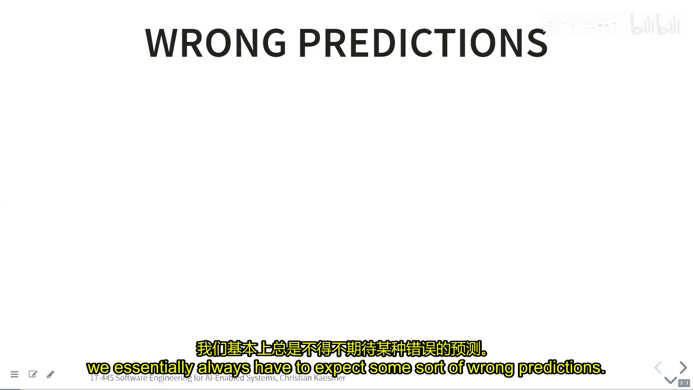

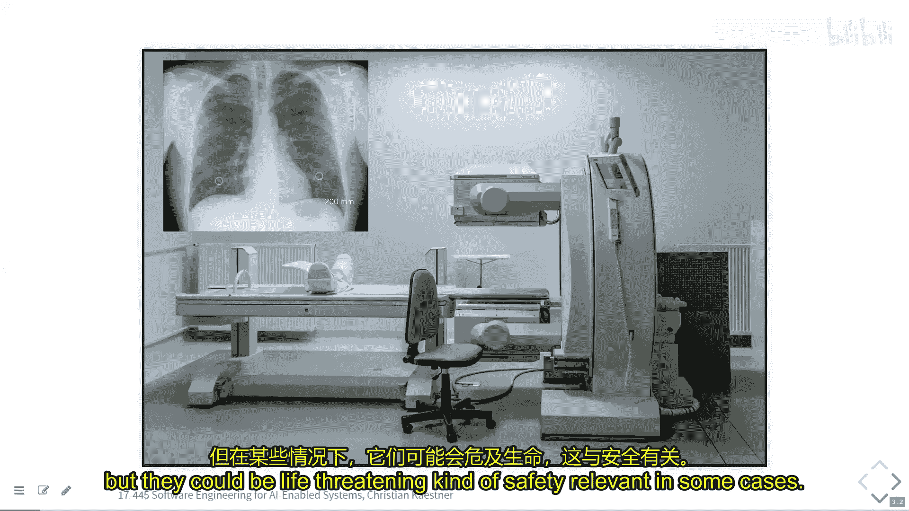

在本节课中，我们将从组件视角回归到系统整体视角，探讨AI组件可能犯的错误、这些错误对系统的影响，以及我们应如何思考风险、规划应对措施和制定系统级需求。

## 系统错误的后果

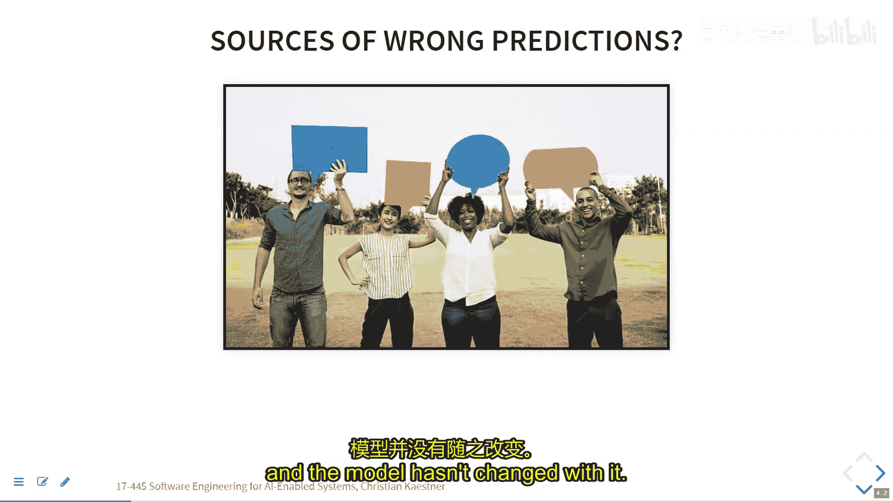

上一节我们讨论了AI组件的内部工作原理，本节中我们来看看当这些组件出错时，会带来哪些后果。

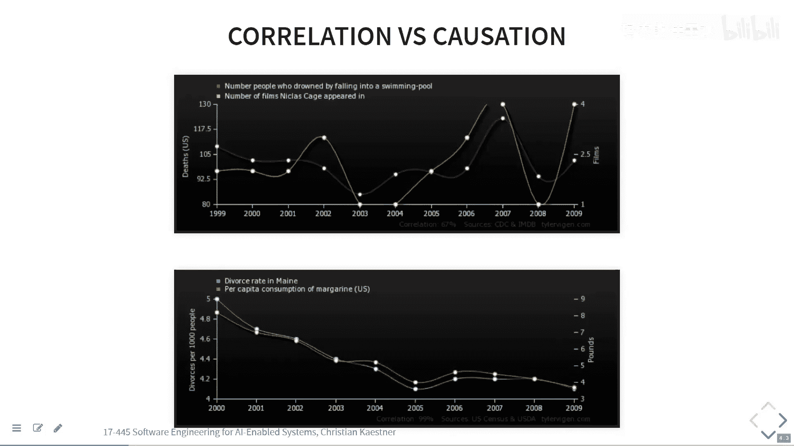

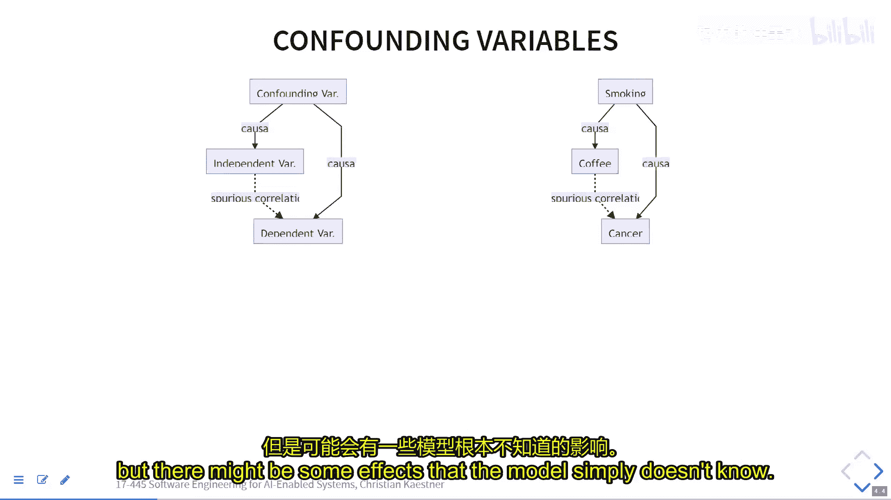

AI组件几乎总是会做出错误的预测。例如，我们之前讨论过的癌症检测系统可能会出错：它可能未能检测出癌症，也可能错误地检测出癌症，导致不必要的侵入性手术。这些错误的后果各不相同，有些可能只是带来不便，有些则可能危及生命。

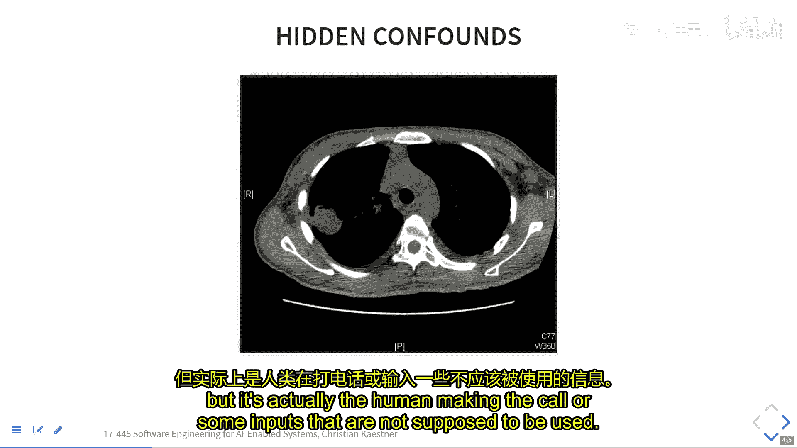

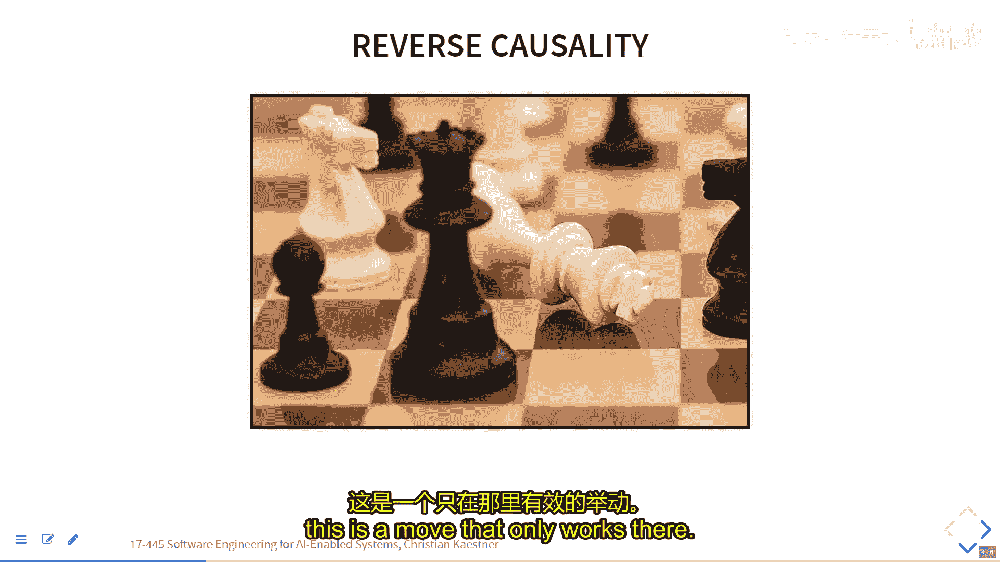

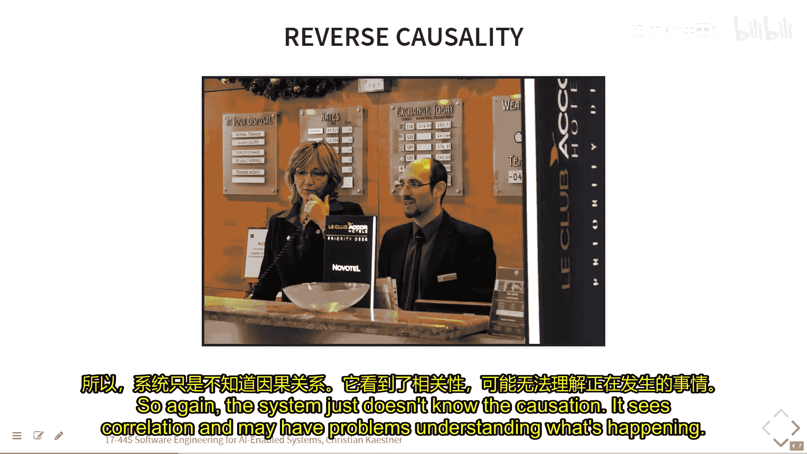

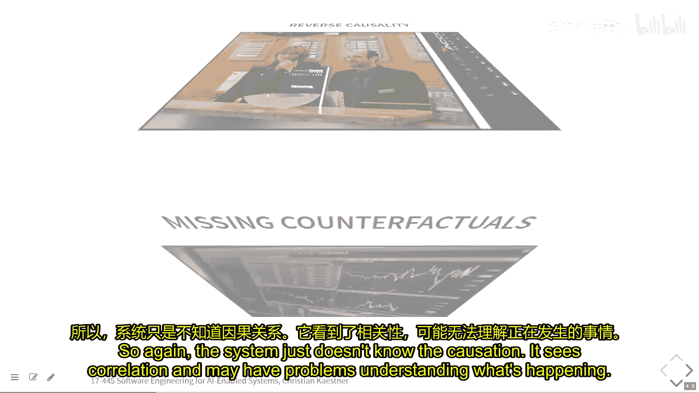

以下是几个具体案例：
*   **Uber自动驾驶汽车事故**：这起事故具有明确的安全影响，也对Uber的声誉造成了严重打击，并可能限制了其运营和开发。
*   **亚马逊Alexa的意外行为**：例如，因误识别指令而在无人在家时大声播放音乐，或从电视节目中误听指令而订购商品。这些行为可能导致财产损失、财务影响或声誉受损。
*   **微软聊天机器人Tay**：该机器人在与Twitter用户互动学习后迅速变得具有种族歧视倾向，最终被下线。这主要造成了声誉损害和研究项目的失败。
*   **亚马逊招聘工具**：该工具被发现存在严重偏见，例如倾向于选择特定性别或毕业院校的候选人。

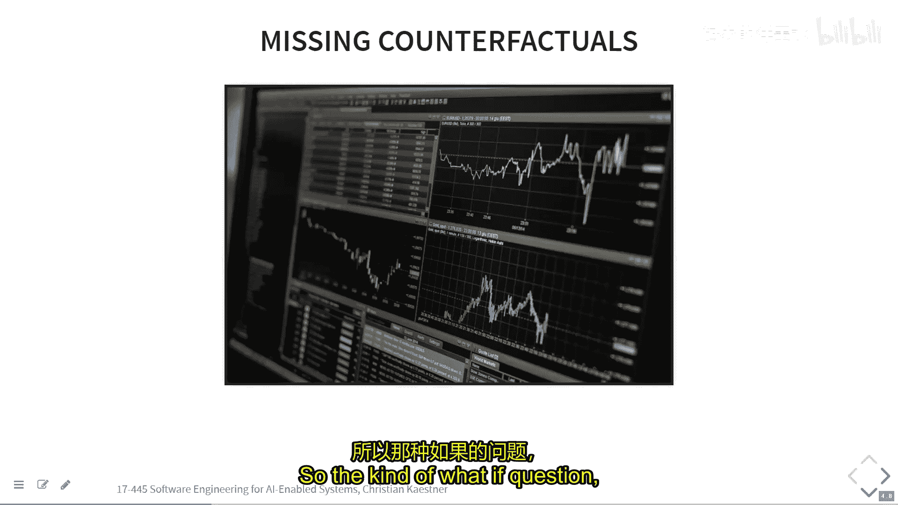

## 错误来源分析

认识到错误不可避免后，我们需要深入理解这些错误从何而来。以下是导致错误预测的一些常见原因：

*   **训练数据偏差**：训练数据不能代表真实世界，或者存在系统性偏见。
*   **输入错误**：传感器测量误差导致输入数据不可靠。
*   **反馈循环与数据漂移**：模型基于过去的数据训练，但世界已经发生变化，模型未能随之更新。
*   **虚假相关性**：机器学习寻找的是相关性而非因果性。模型可能学到一些同时发生但并无因果联系的特征。例如，尼古拉斯·凯奇一年内出演的电影数量与游泳池溺水人数在统计上相关，但这显然没有因果关系。
*   **混淆变量**：模型可能学到一些不应使用的“捷径”特征。例如，一个癌症预测模型可能不是通过扫描图像中的病变，而是通过识别使用的是移动式还是固定式扫描设备来做出判断，因为病情更重的病人更常使用移动设备，其生存率本身就更低。
*   **反向因果关系**：模型可能混淆了因果方向。例如，早期国际象棋程序从大师棋谱中学到“弃后”通常与胜利相关，但它没有理解“弃后”是“即将获胜”的结果，而非原因，从而错误地建议在任何情况下弃后。
*   **仅观测到已发生事件**：模型通常只学习历史数据中“发生了什么”，而不知道“如果采取不同行动会发生什么”。这被称为“反事实”问题。

此外，还有模型选择不当（过拟合或欠拟合）、输入数据噪声、以及预测超出训练数据分布范围（分布外输入）等问题。

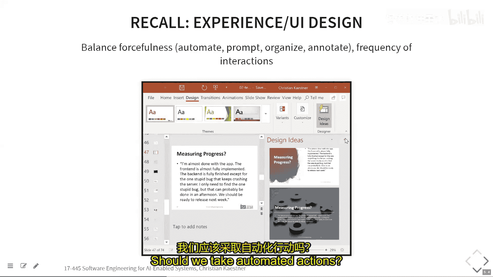

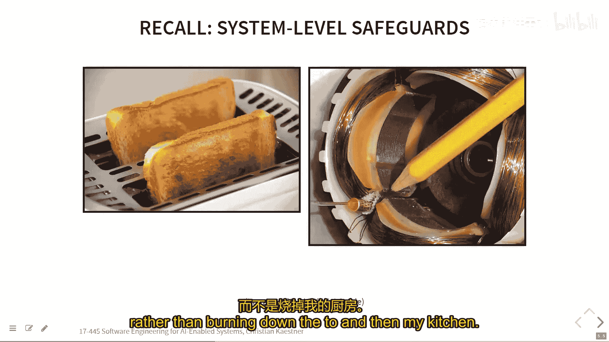

## 预测问题的分类

为了更好地理解机器学习的能力边界，我们可以将预测问题进行分类。一种有用的分类方式基于“我们已知什么”和“我们预测的置信度”：

*   **已知的已知**：我们有丰富的训练数据，模型能在训练数据附近做出高置信度的良好预测。例如：垃圾邮件检测、情感分析、翻译、语音识别、导航、推荐系统、人脸检测。
*   **已知的未知**：我们知道自己在某些方面预测能力很差，通常是因为数据稀疏或事件罕见。模型对此类预测的置信度较低。例如：预测选举结果、评估公司合并的成败。
*   **未知的未知（黑天鹅事件）**：这些事件极难预见，无论是人类还是机器都无法预测。例如：9/11袭击、全球性疫情及其连锁反应（如囤积卫生纸导致库存预测失效）。
*   **未知的已知**：模型对其预测结果非常自信，但却是完全错误的。这是机器学习特有的问题。例如：之前提到的国际象棋程序自信地建议弃后，但实际是步坏棋；或者图像分类器将熊猫图片高置信度地识别为长臂猿。

这个分类的核心启示是：**必须接受机器会犯错的事实**。机器学习组件应被视为**不可靠的组件**。它们可能在90%或99%的情况下表现良好，但也可能做出随机、不可预测且自信的错误预测。因此，系统设计必须考虑到组件可能出错，并确保即使在这种情况下系统仍然是安全或可靠的。

## 系统级错误缓解策略

既然组件本身可能不可靠，我们就需要在系统层面设计策略来应对错误。以下是一些常见的缓解策略：

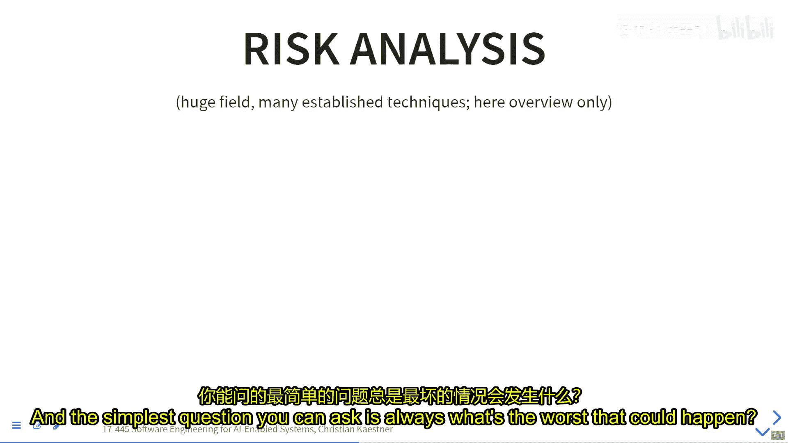

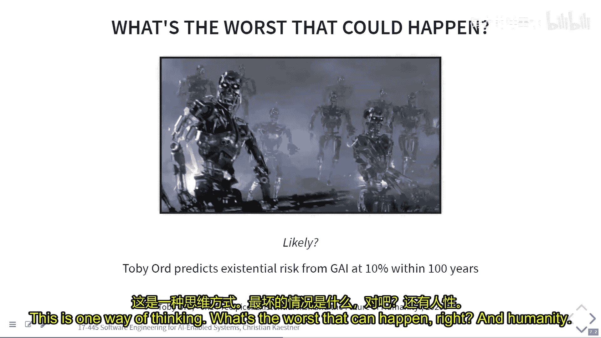

*   **防护措施**：设计一种机制，在最坏情况发生时能够阻止损害。例如，智能烤面包机中的**热熔断器**，即使控制算法出错导致过热，熔断器也会熔断以切断电源，防止火灾。
*   **冗余与投票**：使用多个模型（集成学习）并对它们的输出进行平均或投票，以减少过拟合和随机错误。例如，**随机森林**就是通过构建多个决策树并汇总其结果来工作的。但这种方法无法解决数据偏差等系统性问题。
*   **硬编码规则或启发式方法**：用确定性的规则覆盖或限制机器学习模型的决策。例如，规定烤面包机**连续加热时间不得超过10分钟**；YouTube手动编码规则来打破推荐系统可能导致用户陷入“阴谋论视频”循环的反馈回路。
*   **人机协同**：将人类纳入决策循环。这可以通过多种方式实现：
    *   **建议而非自动执行**：系统提供建议，由人类做最终决定（如PPT设计建议）。
    *   **要求确认**：在执行自动操作前请求用户确认。
    *   **允许撤销**：提供简单的方法来撤销系统执行的操作（如撤销邮件分类、删除自动补全的文本）。
    *   **人类监督**：由人类专家监督关键决策（如法官参考再犯风险评分做出保释决定，军事行动中要求人类授权攻击指令）。
    *   **需要注意的问题**：设计不当的人机协同可能导致“警报疲劳”、人类过度依赖或盲目信任模型（“自动化偏见”），或者人类成为推卸责任的“橡皮图章”。特斯拉自动驾驶系统要求驾驶员随时准备接管，但广告宣传与责任声明的矛盾就是一个典型案例。
*   **可解释模型**：如果模型是可解释的（例如简单的决策树或线性模型），我们能理解其推理过程，就能更有效地信任它、调试它或发现其潜在偏见。然而，对于复杂的深度学习模型，这通常很难实现。

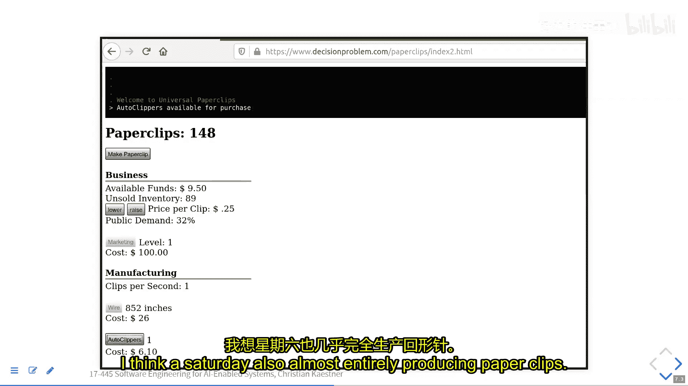

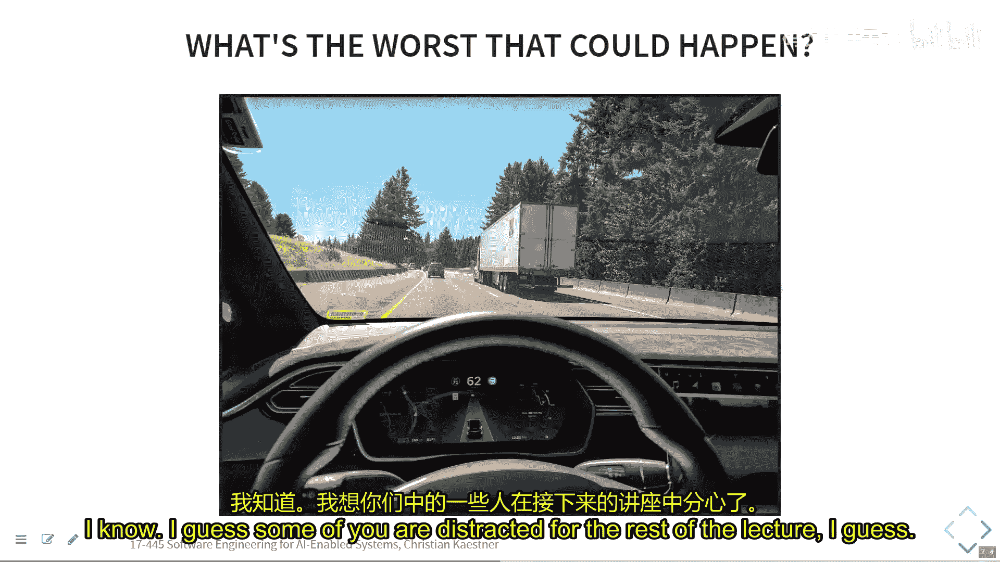

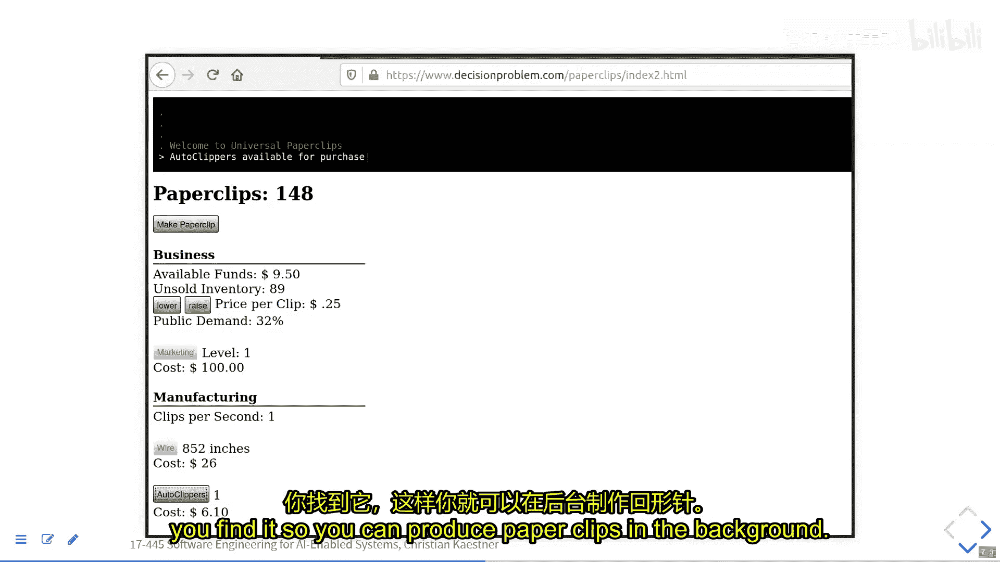

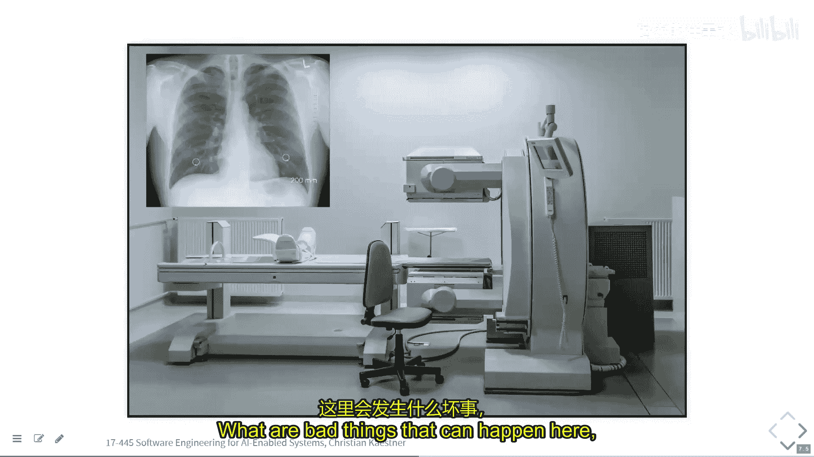

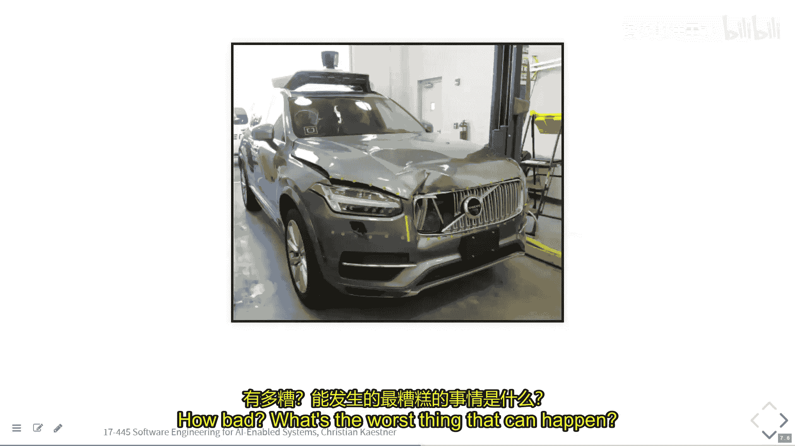

## 风险分析：识别与评估危害

为了系统地规划如何应对错误，我们需要进行风险分析，即思考“可能出什么问题”以及“后果有多严重”。风险通常由**事件发生的可能性**和**事件发生后的影响**两个因素构成。

以下是一些用于风险分析的结构化方法：

*   **故障树分析**：这是一种**自上而下（逆向）** 的分析方法。从一个不希望发生的**项事件**（如“汽车撞车”）开始，逆向推导导致该事件发生的所有可能原因组合（如“车道识别错误”且“安全系统失效”）。它使用逻辑门（与门、或门）来组合基本事件。通过**最小割集分析**，可以找出导致项事件发生的最小事件组合。还可以为基本事件分配概率，进行定量分析，计算项事件发生的总体概率。
    *   **示例：智能烤面包机起火**
        *   **项事件**：烤面包机起火。
        *   **可能路径**：`AI模型预测错误` **且** `热熔断器失效` **且** `软件过热保护失效`。
        *   **进一步分解**：`软件过热保护失效` 可能是因为 `温度传感器故障` **或** `保护程序存在bug`。
*   **失效模式与影响分析**：这是一种**自下而上（正向）** 的分析方法。系统地检查系统中的每个组件，思考它可能以何种方式失效（失效模式），每种失效会对系统产生什么影响（影响），以及如何缓解（缓解措施）。这有助于发现那些未直接导致最坏结果但仍属危害的问题。
    *   **示例：车道保持系统**
        *   **组件**：摄像头。
        *   **失效模式1**：完全无图像输出。
        *   **影响**：车道检测模型无输入，系统应报警并退出，要求人类接管。
        *   **失效模式2**：输出图像质量差（如雨天、污垢）。
        *   **影响**：车道检测可能出错，导致车辆偏离车道。系统可能需要额外的图像质量检测逻辑。
*   **危险与可操作性研究**：使用一套引导词（如“无”、“多”、“少”、“早”、“晚”等）与流程或组件结合，进行结构化的头脑风暴，以识别潜在的偏差和危险。

## 世界、机器与需求

在需求工程中，一个关键概念是区分**世界**、**机器**以及它们之间的接口。

*   **世界**：系统运行的真实环境及其状态（如汽车的实际位置、烤面包机的真实温度）。
*   **机器**：软件系统及其内部状态、表示和逻辑。
*   **共享现象**：世界与机器交互的接口，主要是**传感器**（机器感知世界）和**执行器**（机器影响世界）。

基于此，我们可以区分三种表述：
*   **需求**：描述我们希望在世界中实现什么（例如，“汽车应保持在车道内”）。这是关于世界的陈述。
*   **环境假设**：关于世界如何通过共享现象展现给机器的假设（例如，“摄像头拍摄的图像能真实反映前方的车道标线”）。
*   **规格说明**：描述机器在给定共享现象输入时应如何表现（例如，“给定一张前方道路图像，软件应识别出车道标线”）。这是关于机器的陈述。

这个视角非常重要，因为它明确了：
1.  软件（包括AI）并不直接“知道”世界，它只知道通过传感器获得的、对世界的**抽象表示**。
2.  如果环境假设被打破（例如，摄像头被 adversarial attack 欺骗，或用户行为因推荐系统而改变），即使机器软件本身“正确”地执行了规格说明，系统需求也可能无法满足。这就是**对抗性攻击**和**反馈循环**问题的根源。
3.  数据漂移也可以从这个角度理解：世界发生了变化，但我们基于旧世界数据训练模型所做的环境假设已经过时。

## 总结

本节课中，我们一起学习了如何应对AI驱动系统中的错误与风险。核心要点如下：

1.  **接受错误**：机器学习组件本质上是不可靠的，会做出错误且有时非常自信的预测。系统设计必须以此为前提。
2.  **理解错误来源**：错误可能源于有偏数据、虚假相关性、混淆变量、反向因果等多种原因。
3.  **在系统层面设计缓解策略**：不能只依赖改进模型本身。应综合运用**防护措施**、**冗余**、**硬编码规则**和**精心设计的人机协同**等策略来构建鲁棒的系统。
4.  **进行结构化风险分析**：使用如**故障树分析**、**失效模式与影响分析**等工具，系统地识别潜在危害、分析其成因并评估风险。
5.  **明确区分世界与机器**：在需求工程中清晰界定**需求**（关于世界）、**环境假设**（关于世界如何被感知）和**规格说明**（关于机器行为），这有助于理解系统失效的根本原因，特别是应对对抗性攻击和反馈循环等问题。

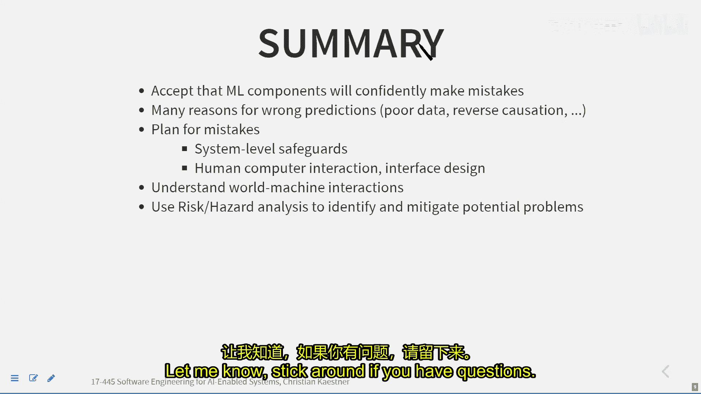

通过将这些理念和实践融入系统设计与开发过程，我们能够更好地构建出即使在其核心AI组件不完美时仍能安全、可靠运行的智能系统。