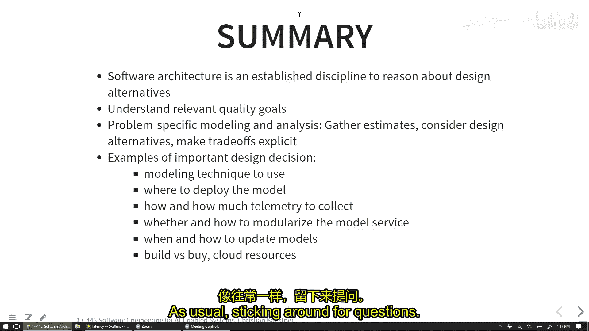

# 009：人工智能驱动系统的软件架构 🏗️

在本节课中，我们将探讨人工智能驱动系统的软件架构。我们将了解软件架构的基本概念，并通过一个增强现实翻译的案例研究，深入讨论在AI系统中如何做出关键的架构决策，例如模型部署位置和遥测设计。

## 概述

软件架构关注系统的高层设计，它涉及定义系统的结构、组件间的交互方式以及这些决策如何影响系统的质量属性，如性能、可维护性和可靠性。对于AI系统，架构决策尤为重要，因为它决定了模型如何集成、更新和监控。

上一节我们讨论了风险分析和故障树分析，本节中我们来看看如何为包含AI组件的系统设计稳健的架构。

## 什么是软件架构？

软件架构是系统的高层设计，它定义了组件、它们之间的连接以及相关的属性。架构决策通常由我们关心的质量属性驱动，例如性能、可修改性或可靠性。这些决策会影响整个系统，而不仅仅是单个模块。

架构图就像城市地图，不同的地图服务于不同的目的。例如，一张交通地图用于导航，而一张消防区域地图则用于应急规划。同样，在软件中，我们使用不同的架构图来推理不同的系统属性，如性能瓶颈或安全边界。

## 案例研究：Twitter的架构演进

Twitter早期是一个用Ruby on Rails编写的单体应用。随着用户增长，他们遇到了严重的性能和可扩展性问题。例如，在大型体育赛事期间，平台经常因过载而崩溃。

他们的初始解决方案是到处添加缓存，但这无法从根本上解决问题。因此，他们决定进行彻底的架构重设计，目标包括：
*   将性能提升至少10倍。
*   降低延迟。
*   提高可靠性和可维护性。
*   实现故障隔离。

为了实现这些目标，Twitter做出了以下关键架构变更：
*   **技术栈迁移**：从Ruby on Rails迁移到基于JVM的Scala。
*   **架构风格转变**：从单体应用转向微服务架构。
*   **通信框架**：投资构建了自己的远程过程调用（RPC）框架，内置监控、故障转移和负载均衡。
*   **数据存储革新**：设计了新的存储解决方案，使用大致可排序的ID，避免了写入时的单点瓶颈，实现了并行写入。

这个案例表明，架构决策是根本性的，需要根据系统目标（质量属性）进行自上而下的设计，而不是在问题出现后才进行修补。

## AI系统架构：增强现实翻译案例

让我们考虑一个增强现实（AR）翻译系统的案例。想象你戴着一副智能眼镜走在国外街头，眼镜能实时将看到的文字翻译并叠加显示在你的视野中。

该系统至少需要两个AI组件：
1.  **光学字符识别（OCR）模型**：检测图像或视频流中的文字及其位置。
2.  **翻译模型**：将识别出的文字翻译成目标语言。

一个核心的架构决策是：**这些模型应该部署在哪里？**

以下是三个主要的候选方案：
*   **在眼镜上**：设备端处理。
*   **在手机上**：通过蓝牙与眼镜连接。
*   **在云端**：通过蜂窝网络连接。

为了做出决策，我们需要考虑系统关心的质量属性。

以下是需要考虑的关键质量属性：
*   **延迟**：对于AR体验，延迟需要极低（研究显示在5-20毫秒以内），否则会导致眩晕感。
*   **准确性**：OCR和翻译的准确性至关重要。
*   **能耗**：在眼镜上持续处理会快速耗尽电池。
*   **带宽**：蓝牙（如5.0版本）带宽约2 Mbps，可能难以持续传输高清视频流。
*   **模型大小与更新频率**：翻译模型可能约50MB，更新频率不高，易于管理。
*   **可用性/离线工作**：系统是否需要在没有网络连接时工作？
*   **隐私**：处理用户实时视频流涉及重大隐私问题。
*   **运营成本**：向云端传输数据（如图片）会产生流量成本。

基于这些考虑，纯粹的云端方案（持续传输视频）可能因带宽、延迟、隐私和离线需求而不切实际。纯粹的眼镜端方案可能受限于计算能力和能耗。因此，一个**混合架构**可能更优：例如，在眼镜上进行轻量级的文字区域检测或初步OCR，只将必要的文本信息发送到手机或云端进行精确识别和翻译，再将结果返回显示。

## 遥测（Telemetry）设计

遥测用于监控系统运行状况和收集改进模型所需的新数据。在设计AR翻译系统的遥测时，我们面临挑战：如何检测翻译错误？如何收集有用的数据而不侵犯隐私或产生过高成本？

直接持续上传所有视频流是不可行的，因为会产生巨大的数据量、高昂的成本和严重的隐私问题。

以下是一些可能的遥测设计策略：
*   **基于置信度采样**：当模型对其预测（如OCR或翻译）置信度较低时，记录并上传相关数据。
*   **隐式用户反馈**：监测用户行为，例如用户长时间注视某处或反复移动眼镜试图获取更好翻译，这可能表明当前结果不佳。
*   **显式用户反馈**：设计用户界面，允许用户主动报告错误的翻译。
*   **数据匿名化与过滤**：在上传前，尝试在设备端过滤或模糊化图像中的隐私信息（如人脸），只保留文本区域。
*   **缓存与延迟上传**：将遥测数据缓存在设备上，等待连接到Wi-Fi时再批量上传，以节省蜂窝数据。

遥测设计需要在数据价值、用户隐私、系统成本和法规遵从之间找到平衡。

## 模型即服务与更新策略

将AI模型部署为独立的微服务是一种常见且良好的架构模式。这遵循了“为变更而设计”的原则，使得模型可以独立于应用程序的其他部分进行更新、扩展和替换。

例如，可以为OCR模型提供一个简单的API：
*   **输入**：图像或图像区域。
*   **输出**：识别出的文本及其在图像中的坐标。

采用这种服务化架构的好处包括：
*   **解耦**：模型更新无需重新部署整个应用。
*   **可扩展性**：可以通过负载均衡器轻松扩展服务实例以处理高负载。
*   **容错性**：模型服务的故障不会导致整个系统崩溃。
*   **可观测性**：可以集中监控服务的延迟、调用次数和错误率。
*   **版本控制**：对模型进行版本管理，便于调试和回滚。在返回结果时包含模型版本号，有助于追踪问题来源。

关于模型更新，需要考虑更新频率和成本。对于语言翻译，模型可能不需要非常频繁地更新。更新策略可以是定期发布新版本，也可以探索更复杂的持续学习/在线学习架构。

## 架构风格与模式

在AI系统领域，成熟的、标准化的架构设计模式仍在发展中。目前常见的实践多源于通用的软件架构原则：

*   **微服务架构**：将模型推理等功能封装为独立的服务。
*   **网关/路由模式**：使用一个网关服务来管理对多个模型服务的请求，实现负载均衡、路由和API聚合。
*   **流水线架构**：将数据预处理、模型推理、后处理等步骤组织成可管理的流水线。

此外，业界也出现了一些专注于ML工作流最佳实践的工具和平台（如TensorFlow Extended， MLflow），它们帮助组织代码、数据和实验，但更多是工程实践而非高层架构模式。云服务提供商（如AWS SageMaker， Google AI Platform）也提供了托管式的模型训练和部署基础设施，抽象了许多架构复杂性。

## 总结

本节课中我们一起学习了人工智能驱动系统的软件架构。我们回顾了软件架构的核心概念，即通过高层设计决策来满足特定的质量属性。通过Twitter的案例，我们看到了架构重设计如何解决可扩展性和性能问题。重点我们以AR翻译系统为例，探讨了AI系统中关键的架构决策：
1.  **模型部署**：需要在设备端、边缘端和云端之间权衡延迟、带宽、能耗和隐私。
2.  **遥测设计**：需要在收集有效数据、保护用户隐私和控制成本之间取得平衡。
3.  **服务化与API设计**：将模型封装为独立服务，以提高可维护性和可扩展性。
4.  **模型更新策略**：根据模型变化频率和数据漂移情况制定更新计划。

为AI系统设计架构要求我们具备系统思维，综合考虑软件工程原则和AI模型的独特需求。虽然一些成熟的模式正在形成，但这仍然是一个不断发展和充满机遇的领域。