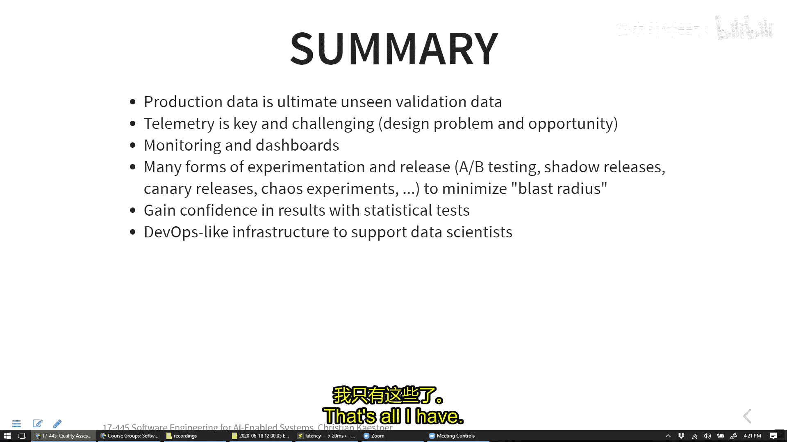

# 010：生产中的质量评估


在本节课中，我们将学习如何在生产环境中评估AI系统的质量。我们将探讨如何收集反馈、监控系统、设计实验，以及如何将数据科学家的工作流程与生产环境中的质量评估相结合。

## 概述

上一节我们讨论了系统架构及其对质量属性的影响。本节中，我们将重点关注生产环境下的质量评估。我们将看到，生产数据是评估模型性能的终极“未见”数据集，但如何安全、有效地进行测试和监控，需要一套系统的方法。

## 从离线评估到生产监控

在传统的机器学习工作流中，我们通常在固定的数据集上进行模型训练和评估，例如将数据分为训练集、验证集和测试集。我们使用准确率、AUC等指标来衡量模型质量，并警惕过拟合等问题。

然而，静态数据集评估存在局限性：
*   **数据代表性**：静态数据集可能无法代表生产环境中不断变化的数据分布。
*   **时间依赖性问题**：对于时间序列数据，随机分割可能导致模型“看到未来”，从而得到过于乐观的评估结果。
*   **过拟合测试集**：反复在同一个测试集上调整模型，可能导致模型过拟合于该测试集。

**核心观点**：生产环境中的数据是模型从未见过的，因此是评估模型泛化能力的终极标准。但这并不意味着我们应该盲目地将模型部署到生产环境。

## 设计生产环境中的反馈机制（遥测）

为了在生产中测试，我们需要收集反馈，这依赖于**遥测**技术。我们需要观察系统或特定AI组件在生产环境中的表现。

设计遥测系统需要考虑：
*   **收集什么信息**：是系统级的指标（如响应时间、错误率），还是AI组件特定的指标（如预测准确性）？
*   **如何收集**：如何在不干扰用户体验、保护隐私的前提下，管理海量数据？

**以下是几个案例中收集生产反馈的策略：**

*   **房价预测**：模型对当前挂牌房屋做出预测。当房屋实际售出后，将预测价格与成交价进行比较，即可获得准确的反馈标签。
*   **评论脏话过滤器**：
    *   用户可以“举报”未被过滤的违规内容（衡量漏报/召回率）。
    *   用户可以申诉被误判的内容（衡量误报/精度）。手动审核这些申诉可以提供反馈。
*   **癌症图像检测**：
    *   **假阳性**：当模型预测为癌症时，患者会接受进一步诊断（如活检），诊断结果可提供明确的反馈。
    *   **假阴性**：更具挑战性。可通过长期追踪患者病历，观察其后续是否被确诊为癌症，但这涉及隐私且反馈延迟长。

设计遥测时，我们得到的指标可能与离线评估的指标不同：
*   **直接准确标签**：如房价案例，反馈准确但可能有延迟。
*   **仅知错误**：如脏话过滤器举报，用户满意时我们无感知。
*   **弱相关性代理指标**：如音乐推荐系统，我们可能无法直接测量“推荐准确性”，但可以测量“用户在推荐歌单上的停留时间”，该指标与模型质量弱相关，但可用于比较相对变化。

**关键点**：生产监控更关注**趋势和相对变化**，而非绝对数值。例如，关注指标在新版本发布后是否发生跳跃式变化，或是否随时间缓慢下降。

## 生产环境中的实验

除了被动监控，我们还可以主动在生产环境中进行实验。

### A/B 测试

A/B测试的核心是**随机对照实验**。将用户随机分为两组：
*   **对照组（A组）**：使用当前版本（如旧推荐算法）。
*   **实验组（B组）**：使用新版本（如新推荐算法）。

通过比较两组在目标指标（如购买转化率、用户停留时间）上的差异，可以因果性地推断新版本的效果。

**实施A/B测试的关键要素：**
1.  **分流逻辑**：根据用户ID等标识，将请求定向到不同版本的服务。代码层面通常体现为功能开关（Feature Flag）。
    ```python
    if feature_flag.is_enabled(“new_recommendation_model”, user_id):
        use_new_model()
    else:
        use_old_model()
    ```
2.  **指标收集与关联**：收集遥测数据时，需标记数据属于A组还是B组。
3.  **统计显著性**：使用统计检验（如T检验）来判断观察到的差异是否由随机波动引起。通常，p值小于0.05被认为具有统计显著性。实验所需样本量取决于预期效应大小和数据噪声。

### 其他实验策略

*   **影子发布/流量复制**：将生产流量复制一份发送给新模型，但不将新模型的预测结果返回给用户。用于在不影响用户的情况下，比较新模型与当前模型的预测差异，尤其适用于有后续真实标签的场景（如房价预测）。
*   **金丝雀发布**：逐步向小部分用户（如1%）发布新版本，密切监控指标。若出现问题，可快速回滚，将影响范围降到最低。
*   **混沌实验**：在生产环境中故意引入故障（如随机使服务实例崩溃、延迟响应），以测试系统的鲁棒性和容错能力。这可以培养开发人员对故障处理和回退机制的重视。

## 为数据科学家赋能

软件工程师已拥有成熟的DevOps和A/B测试基础设施。我们需要让数据科学家也能利用这些能力。

**目标**：使数据科学家能够轻松地在生产环境中进行实验。
*   **简化部署**：建立从笔记本到生产模型的自动化流水线。
*   **提供数据访问**：让数据科学家能够方便地获取生产环境收集的遥测数据，用于分析和构建新的测试集。
*   **模型版本管理与溯源**：维护清晰的模型版本记录，以便在出现问题时能够快速定位是哪个模型、基于什么数据做出的决策。

## 总结

本节课中，我们一起学习了在生产环境中评估AI系统质量的方法。
1.  我们认识到生产数据是评估模型泛化能力的最终标准。
2.  我们探讨了如何设计遥测系统来收集反馈，并理解到生产监控更注重指标的趋势变化。
3.  我们介绍了多种生产环境实验方法，包括A/B测试、影子发布、金丝雀发布和混沌实验，这些方法有助于我们安全、科学地评估变更效果。
4.  最后，我们强调了构建基础设施和流程，以支持数据科学家和软件工程师协作，共同在生产环境中进行有效的质量评估和迭代。



通过结合离线评估和生产监控，我们可以更全面、更可靠地确保AI驱动系统的质量。