# 011：数据质量 📊

在本节课中，我们将要学习数据质量与数据工程的核心概念。数据质量是数据科学家面临的主要挑战之一，研究表明，数据获取、整理和清洗工作占据了他们60%到90%的时间。我们将探讨数据质量的多个维度，包括准确性、完整性、一致性、唯一性和及时性，并学习如何检测和处理数据漂移问题。

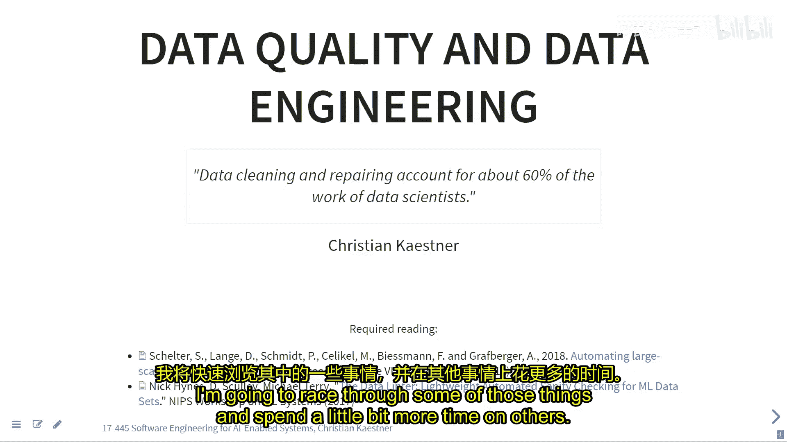


上一节我们讨论了测试与生产环境中的挑战，本节中我们来看看数据质量如何影响机器学习系统的构建与维护。

## 数据质量场景：超市库存预测 🛒

让我们从一个经典的机器学习用例开始：预测超市的商品需求以优化库存。系统需要决定何时订购、订购多少，以避免缺货或浪费。

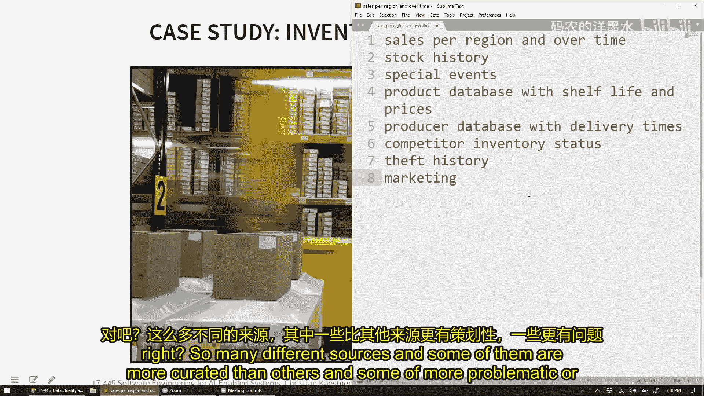

以下是构建此类预测模型可能使用的数据源：
*   **销售历史**：商品随时间变化的销售记录。
*   **库存历史**：货架上商品数量的实时记录。
*   **特殊事件**：节假日、促销活动等。
*   **产品信息**：商品保质期、价格、供应商等。
*   **外部数据**：天气预报、社交媒体趋势、竞争对手信息等。

这些数据可能来自多个不同的源头，格式和质量各异，因此确保数据质量至关重要。

## 数据质量的多个维度 🔍

数据质量可以从多个方面进行评估。以下是主要维度及其可能存在的问题：

*   **准确性**：数据记录是否正确。例如，收银系统漏扫了商品，导致销售数据不准确。
*   **完整性**：所有相关数据是否都被记录。例如，纸质收货单未及时录入系统，导致库存数据不完整。
*   **唯一性**：数据是否存在不必要的重复。例如，同一张收货单被错误地录入了两次。
*   **一致性**：不同数据源间的信息是否匹配。例如，销售数据库显示售出20个桃子，但库存记录显示只进货了10个。
*   **及时性**：数据是否最新。例如，系统故障或人工延迟导致数据更新滞后。

此外，数据还可能存在格式错误、计算错误、顺序错乱等问题。环境也在不断变化，例如：
*   **系统目标变化**：优化目标从“永不缺货”变为“减少浪费”。
*   **数据源质量变化**：更换了新扫描仪，数据准确性提高。
*   **用户行为变化**：突发公共卫生事件导致某些商品需求骤变。
*   **反馈循环**：用户或供应商可能试图“欺骗”模型，制造虚假需求峰值。

## 数据质量对机器学习的影响 🤖

数据质量和数量深刻影响机器学习模型。
*   **数据量**：通常，数据越多，模型效果越好，但存在收益递减点。
*   **数据噪声**：噪声数据需要更多数据来抵消其影响，否则模型可能学习到错误模式或过拟合。
*   **数据准确性**：不准确的数据（存在系统性偏差）是更严重的问题，模型无法通过统计方法纠正，会基于错误数据学习。

这里需要区分**准确度**与**精确度**：
*   **准确度**：测量值与真实值之间的接近程度。
*   **精确度**：重复测量时结果的一致性。

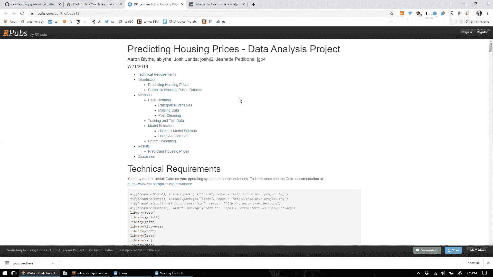

**公式**：假设真实值为 `T`，测量值为 `M`。
*   高准确度：`M ≈ T`
*   高精确度：多次测量的 `M` 值彼此接近。

机器学习通常能通过平均化处理不精确（有噪声）的数据，但难以纠正不准确（有偏差）的数据。

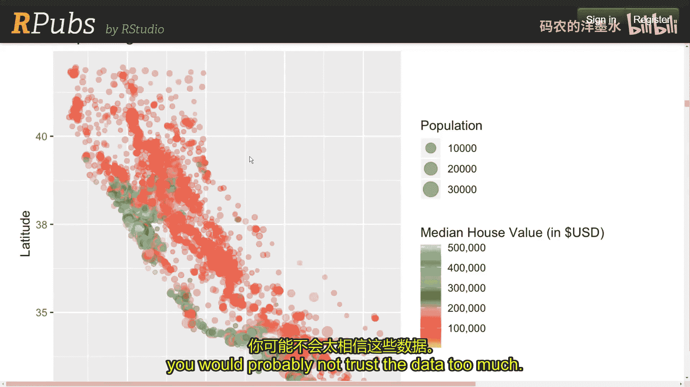

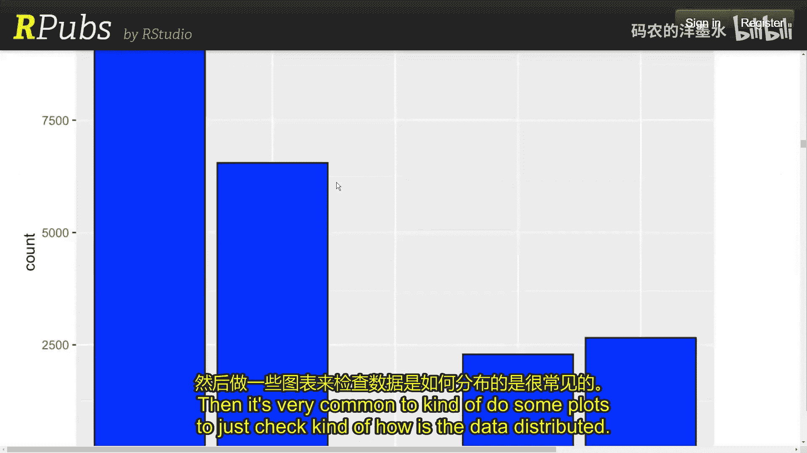

## 探索性数据分析 📈

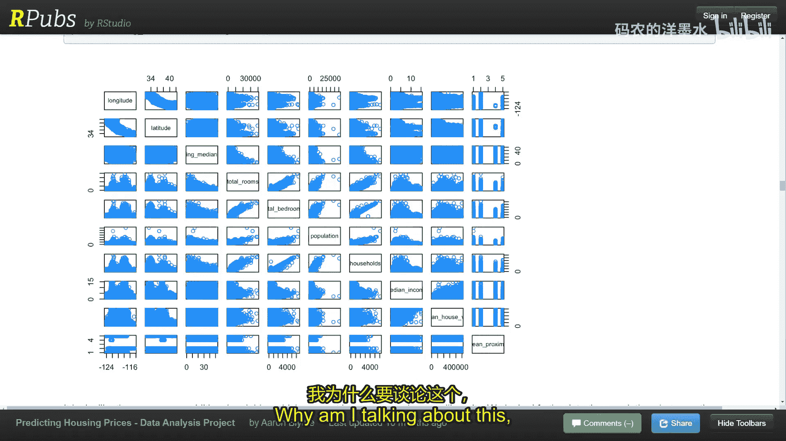

在开始建模前，进行探索性数据分析至关重要。这有助于理解数据分布、发现异常并验证假设。

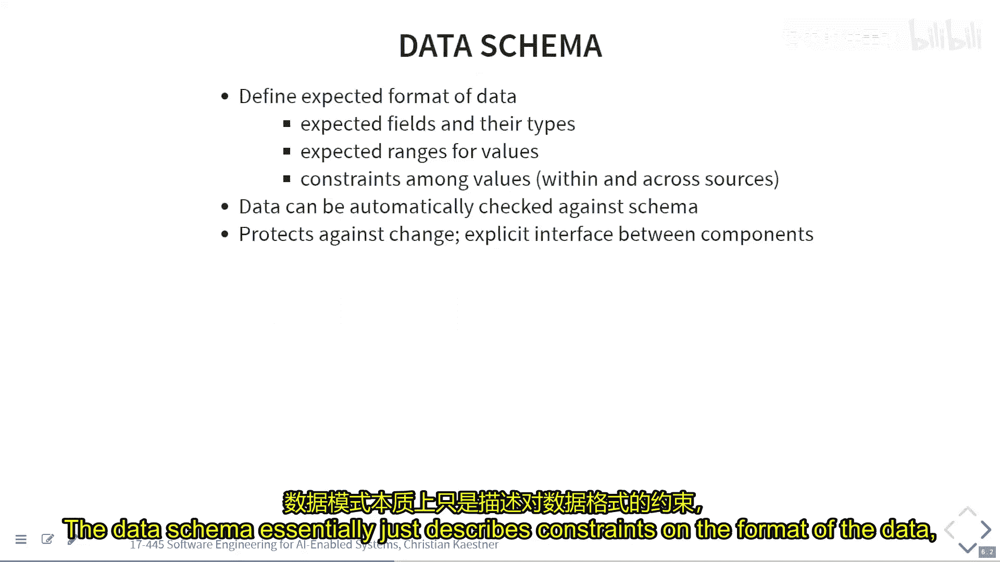

例如，在一个房价预测数据集中，我们不应直接使用所有特征建模，而应先：
1.  查看各特征的统计摘要（如最小值、最大值、均值）。
2.  可视化数据分布（如直方图、散点图）。
3.  检查特征间的相关性。

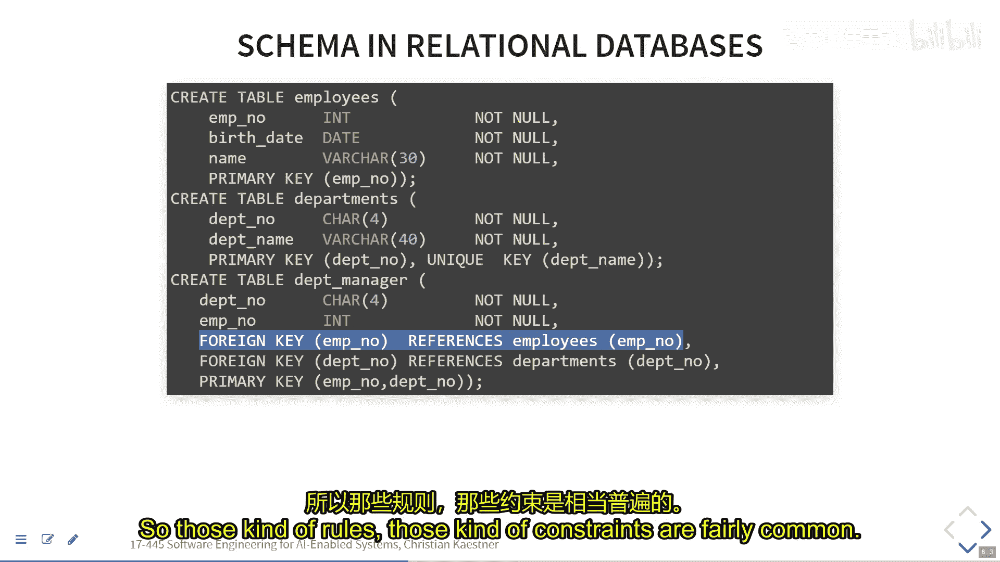

**代码**：使用Pandas进行初步探索。
```python
import pandas as pd
import matplotlib.pyplot as plt

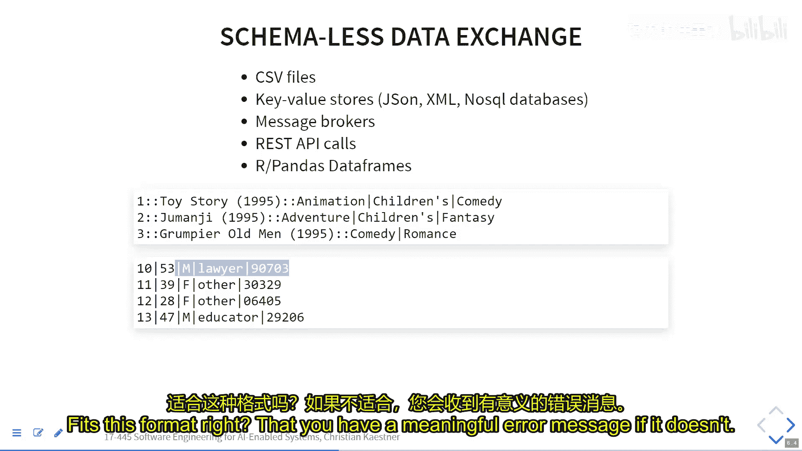

# 加载数据
data = pd.read_csv('housing.csv')
# 查看前几行和基本信息
print(data.head())
print(data.describe())
# 绘制某个特征的分布
data['median_house_value'].hist()
plt.show()
```
理解数据的预期分布和形状，有助于在系统运行时设置断言，监控数据是否偏离预期。

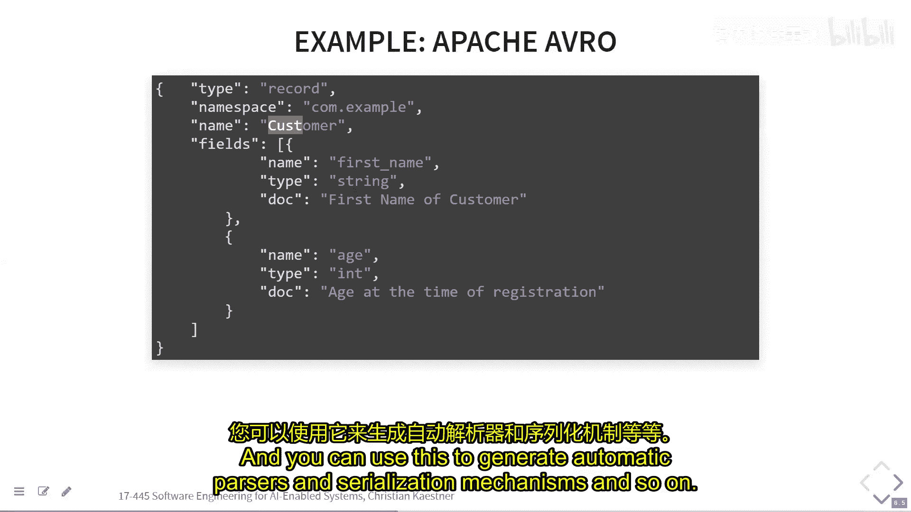


## 数据清洗技术 🧹

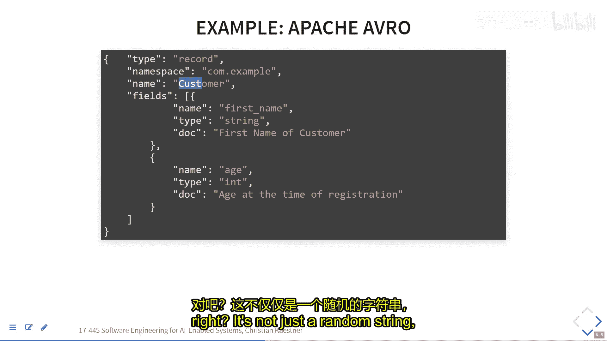

数据清洗涉及多种活动和技术。以下是一些基础且实用的方法：

### 使用数据模式（Schema）

数据模式定义了数据的预期结构和约束，是保证数据一致性的第一道防线。

在传统关系型数据库中，模式通过表结构、数据类型、主键、外键等来定义。
**代码**：简化的SQL模式定义示例。
```sql
CREATE TABLE Employees (
    employee_id INT PRIMARY KEY NOT NULL,
    birth_date DATE NOT NULL,
    department VARCHAR(100)
);
```
现代数据科学中常使用CSV或JSON文件，它们通常没有显式模式。这可能导致问题，例如代码对文件格式做出隐式假设，一旦格式变化就会出错。为数据流定义模式（如使用Apache Avro、Protobuf）能有效解决此问题。
**代码**：Avro模式示例（JSON格式）。
```json
{
  "type": "record",
  "name": "Movie",
  "fields": [
    {"name": "id", "type": "int"},
    {"name": "title", "type": "string"},
    {"name": "genre", "type": "string"}
  ]
}
```
模式能验证数据格式，但无法保证数据值的正确性。

### 检测不一致性与规则挖掘

数据中常存在冗余信息，可以利用这些冗余来发现不一致性。例如，邮政编码应与城市/州匹配。

我们可以挖掘数据中的关联规则或函数依赖关系。关联规则挖掘（如Apriori算法）可以发现数据项之间的有趣联系。
**公式**：关联规则 `X -> Y` 有两个重要度量：
*   **支持度**：规则在数据集中出现的频率。`Support(X->Y) = P(X∪Y)`
*   **置信度**：当X出现时，Y也出现的条件概率。`Confidence(X->Y) = P(Y|X)`

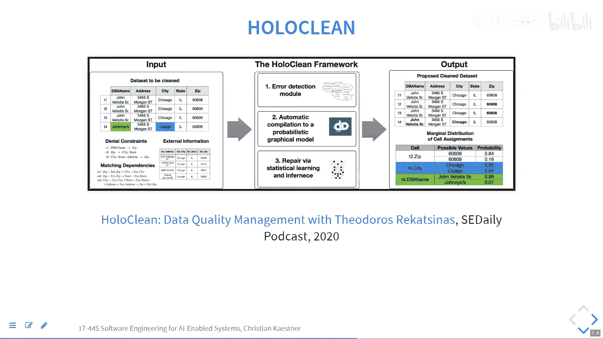

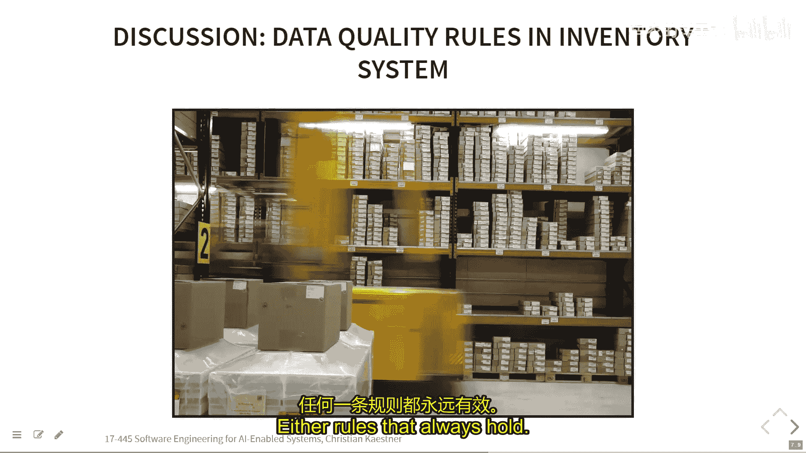

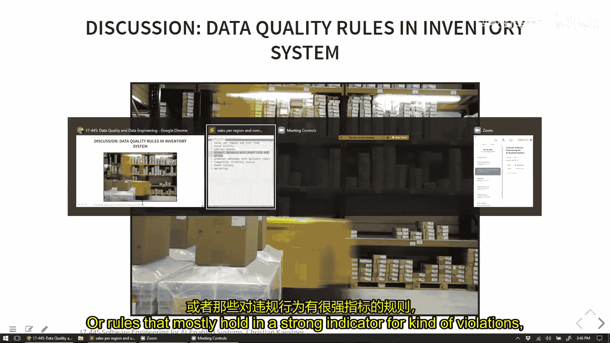

高置信度的规则可用于检测异常（违反规则的数据点）甚至自动修复数据。在软件工程中，类似技术（如Daikon）可用于推断程序中的不变量。

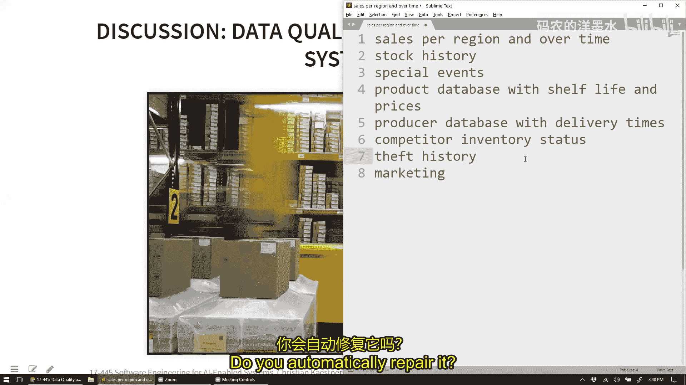

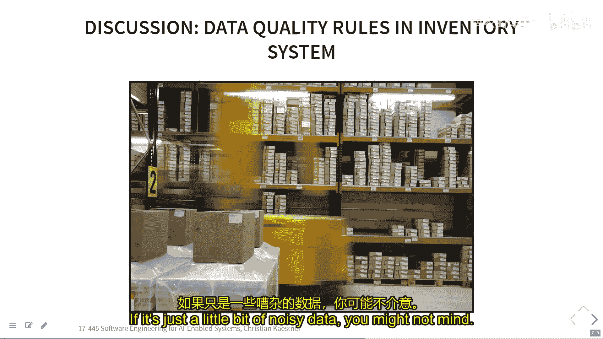

对于库存系统，可能存在的规则包括：
*   库存数量不应为负数。
*   同一产品的不同供应商报价应在合理范围内。
*   订货日期与预计送达日期之间存在依赖关系。

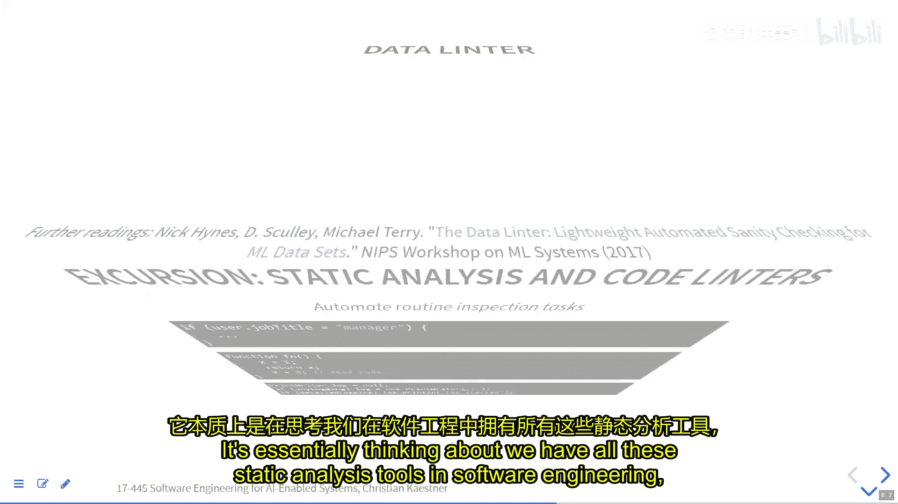

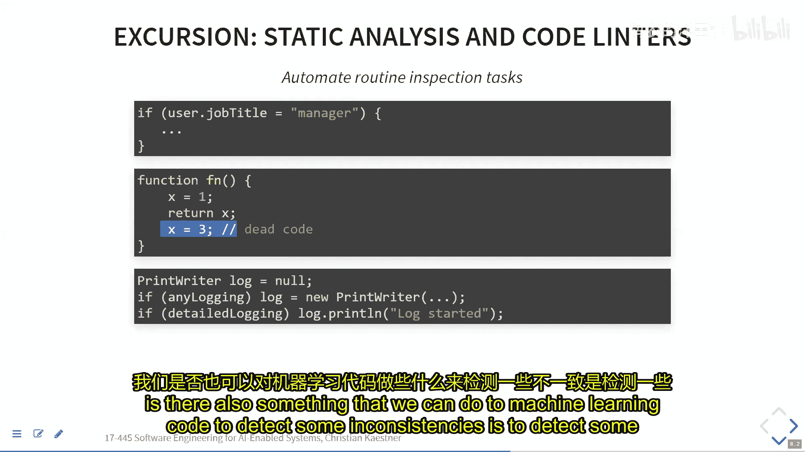

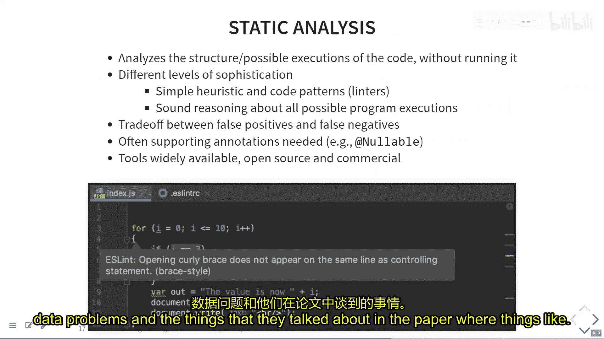

违反这些规则可能预示着数据质量问题。

## 数据漂移与概念漂移 🎯

数据随时间变化是一个重大挑战，主要分为两类：

1.  **概念漂移**：对于相同的输入，预期的输出随时间发生了变化。
    *   **例子**：信用卡交易欺诈检测。昨天正常的交易模式，今天可能因为出现新型攻击而被视为可疑。
    *   **应对**：需要重新标注数据并重新训练模型。

2.  **数据漂移**：模型接收的输入数据的分布发生了变化，与训练数据分布不同。
    *   **例子**：人脸识别系统在疫情期间需要识别戴口罩的人脸。
    *   **应对**：收集新环境下的数据并重新训练模型。

此外，还有**上游数据变更**，如数据格式或单位突然改变（例如温度从华氏度改为摄氏度），这通常需要转换数据输入。

在实践中，这两种漂移常被统称为“漂移”。检测漂移对于维持模型性能至关重要。

### 如何检测漂移？

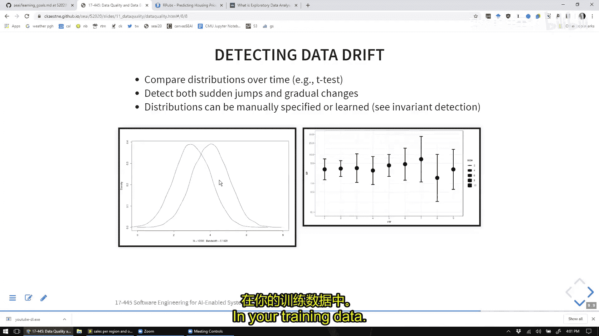

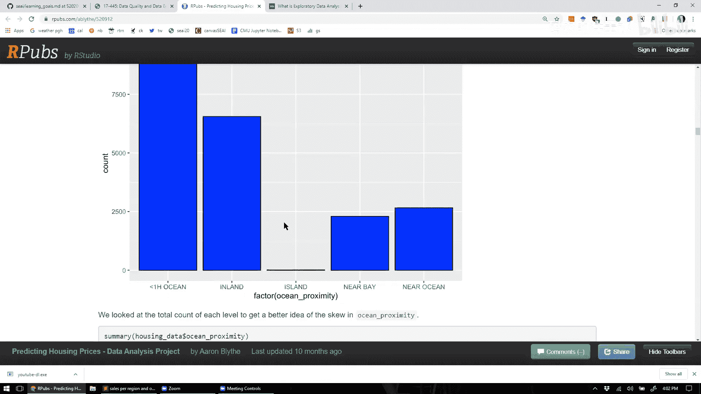

*   **监控模型质量指标**：在生产环境中持续监控准确率、F1分数等指标，发现其下降是漂移的明显信号。
*   **比较数据分布**：将生产输入数据的分布与训练数据分布进行比较。可绘制特征分布图（如直方图、箱线图）或使用统计检验（如KL散度、群体稳定性指数PSI）。
*   **分析预测结果分布**：观察模型预测结果的分布是否发生显著变化。
*   **人工审核**：定期对部分预测结果进行人工审核，判断标签是否发生变化。

许多机器学习平台（如Azure ML）提供了数据漂移检测仪表板，可以自动化监控特征分布的变化。

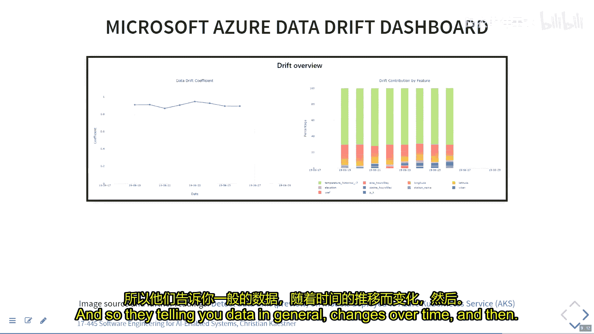

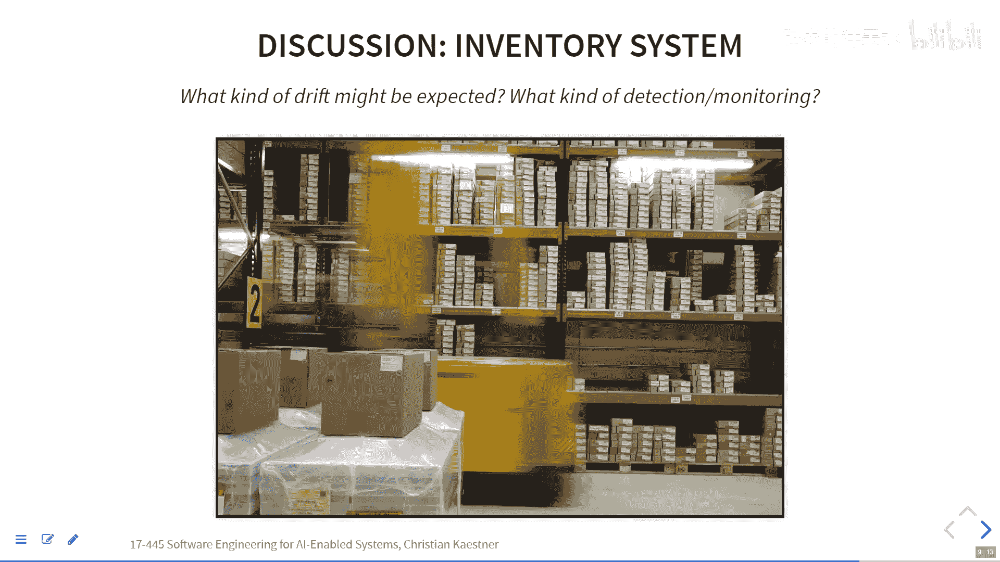

在库存预测系统中，漂移可能由季节变化、节假日、突发事件（如疫情）或供应链中断引起。持续监控销售预测与实际销售之间的差异，是发现漂移的关键。

---


本节课中我们一起学习了数据质量的核心概念及其对机器学习系统的重要性。我们探讨了数据质量的多个维度、进行探索性数据分析的必要性、基础的数据清洗技术（如模式约束和规则挖掘），以及数据漂移和概念漂移的识别与应对策略。高质量的数据是构建可靠AI系统的基石，而持续监控与适应变化是维持系统长期性能的关键。下一节，我们将深入探讨如何从多种异构数据源中集成数据。