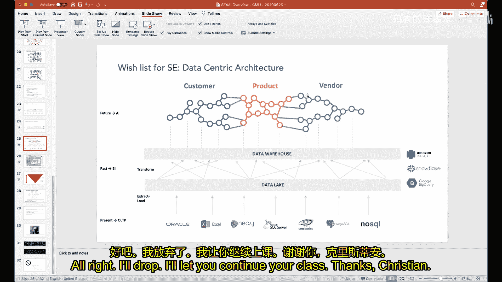

# 012：机器学习驱动的业务系统

在本节课中，我们将探讨如何为传统企业构建和部署机器学习与人工智能系统。我们将了解企业级AI系统面临的独特挑战，以及如何通过改进软件工程实践、数据架构和工具来应对这些挑战。

## 概述

企业级AI系统与消费级AI系统（如手机上的面部识别）存在显著差异。它们通常需要处理大量异构数据，服务于复杂的业务流程，并在资源（如人才和计算能力）相对有限的环境中运行。本讲座将基于演讲者Moham在多个行业（如金融、零售、电信）超过30年的实践经验，剖析当前企业AI系统构建中的核心痛点，并展望未来的改进方向。

## 演讲者背景与案例

上一节我们介绍了本讲座的背景，本节中我们来看看演讲者Moham丰富的行业经验，这些经验构成了本次分享的实践基础。

Moham的职业生涯始于20世纪90年代初的HNC软件公司，该公司专注于使用神经网络等技术为银行构建信用卡欺诈检测系统。到1995年，该公司已服务于全球绝大多数顶级发卡行。当时的技术栈包括单隐藏层神经网络、基于规则的系统和线性/整数规划。

随后，HNC收购了零售业ERP解决方案提供商Retek。Retek利用预测分析和机器学习技术，在需求预测、供应链优化和定价等领域为零售商（如沃尔玛、克罗格）开发了主导市场的解决方案。所使用的技术包括时间序列分析、传统回归和启发式优化。Retek在1999年独立上市，并于2005年被甲骨文以约6.5亿美元收购。

Moham还参与或创立了其他几家公司：
*   **Brickstream**：使用传统计算机视觉技术进行店内视频分析，通过立体摄像头生成客流热力图，用于分析产品摆放位置与销量的关系。
*   一家无线网络优化公司：使用蒙特卡洛模拟和启发式搜索（如模拟退火）来优化蜂窝网络中的频率分配，后被爱立信收购。
*   **Opsmart**：重返零售领域，在云端使用更现代的机器学习技术（如因子分解机）进行需求预测和供应链优化。

这些经历表明，将机器学习应用于企业决策系统（如欺诈检测、需求预测、网络优化）具有巨大的商业价值，但同时也伴随着复杂的工程挑战。

## 企业作为复杂系统及其建模挑战

从上述案例中我们可以看到一个共同点：企业本身是复杂的系统。为了管理这种复杂性，我们需要为其构建简化的模型。

企业中使用多种类型的模型来辅助决策：
*   **财务模型**：通常在电子表格中构建，用于预测决策对盈利能力的影响。
*   **数据模型**：存储在数据库中，用于捕获业务实体（如客户、产品）及其关系。
*   **供应链网络模型**：可映射为线性/整数规划系统。
*   **统计模型**：如消费者需求模型、价格弹性模型。
*   **流程模型**：用于执行业务操作。

然而，这些模型通常彼此不一致。它们要么存在于成千上万个分散、易出错的电子表格中（细节丰富但缺乏整体视图），要么存在于像SAP或Oracle这样庞大、僵化、难以驾驭的企业系统中（细节淹没在整体中）。理想的情况是，能够拥有电子表格般的敏捷性和灵活性，同时具备企业级系统的健壮性。这种组合目前尚不存在。

例如，一个简单的杜邦投资回报率模型，其基本公式为：
`投资回报率 = 周转率 × 销售利润率`
而销售利润率又由 `销售额 - 销售成本` 计算得出。不同行业（如软件业与零售业）的成本构成细节差异巨大，但核心的盈利模型（`利润 = 销售额 - 成本`）是相通的。此外，模型还必须考虑物理约束（如运输时间）和法规约束（如员工加班规定）。理想情况下，业务应被建模为一组方程，其中可以包含用于预测的统计或机器学习模型，而无需处理底层实现技术的复杂性。

## 当前企业技术栈的混乱现状

上一节我们讨论了企业建模的理想，本节中我们来看看现实中的技术实现是多么复杂和 fragmented。

下图展示了某前客户约2%的IT系统架构，它代表了实现上述模型的典型技术栈。每个方框都包含一套复杂的技术组合：
*   **OLTP层（在线事务处理）**：通常包含用SQL/PLSQL编程的事务数据库、用Java/C#编写业务逻辑的应用服务器，以及用HTML/JavaScript实现的前端界面。
*   **BI层（商业智能）**：包含用于数据仓库的数据库（如Teradata）、BI应用服务器（如MicroStrategy）及其前端。
*   **规划层**：包含规划服务器（如Anaplan）和前端（如Excel）。
*   **数据移动层**：使用ETL（提取、转换、加载）工具连接各层。
*   **预测/优化层**：可能使用MATLAB、R、TensorFlow、PyTorch构建模型，或使用OPL、AMPL等语言和CPLEX、Gurobi等求解器构建优化模型。

这导致了**数十种不同的编程语言、三四种数据管理系统、以及相互竞争的编程范式（声明式 vs. 命令式）** 混杂在一起的局面。在此架构上进行任何更改（例如在界面上添加一个“年龄”字段）的成本都极高，需要跨多个层次和语言进行同步修改。

即使到了今天，技术栈演变为云原生系统（如Redshift、Snowflake、BigQuery、Spark），并使用更现代的机器学习工具（TensorFlow、PyTorch），**其核心的“混乱”本质并未改变**。这种复杂性催生了更高的云计算成本和人力成本，因为AI系统需要大量手动特征工程和维护工作。

## 高复杂度的商业影响

这种技术上的混乱直接影响了企业的经济效益：
*   **利润降低**：更多的钱花在了云基础设施和人力上。
*   **增长放缓**：增加新功能需要大量人力，速度慢。
*   **防御壁垒薄弱**：难以构建足够多的自动化模型来形成竞争优势。

这与AI本应带来的经济优势背道而驰。AI的经济学基础在于**大幅降低每次预测或决策的成本，并显著提高其质量**。然而，当前系统的复杂性使得许多本可廉价进行的预测变得昂贵。

## 对未来技术发展的愿景与建议

面对当前的困境，我们需要从多个层面进行革新。以下是演讲者对不同技术社区提出的愿景：

**对软件工程社区的愿景**：从**以应用为中心**的架构转向**以数据为中心**的架构。我们需要创建一个能够跨越多样化数据源和技术栈、对核心业务概念（如产品、客户、门店）进行统一建模和协调的中间层。例如，摩根大通拥有约1.7万个SQL数据库和数亿列数据，但其核心业务概念可能只有约400个。通过构建知识图谱来抽象和统一这些概念，可以逐步重构底层的应用。

**对数据库社区的愿景**：摆脱为每种用例创建一种专用数据库的“疯狂”现状（如事务处理数据库、图数据库、文档数据库、键值数据库）。目前存在数百种数据库技术。我们需要开发能够“同时走路和嚼口香糖”的数据库技术，以更通用的方式支持不同的数据负载。

**对编程语言社区的愿景**：认识到存在大量“公民开发者”（如业务分析师、数据科学家、量化分析师），他们远多于传统的应用开发者。需要为他们创建真正可扩展的、超越电子表格的终端用户工具。这些工具应该是声明式的、反应式的，允许用户以交互方式构建和调整模型，而无需经历漫长的编译、链接和执行周期。

**对机器学习社区的愿景**：开发能够直接理解**关系型结构化数据**的机器学习技术。目前，企业数据中蕴含的领域知识（如实体关系）在输入到TensorFlow等工具前，为了生成扁平的特征矩阵（DataFrame）而被丢弃了。我们需要像深度学习在图像、文本领域实现自动特征学习一样，为企业关系型数据自动化特征工程和表示学习的过程。这将极大减少数据科学家手工设计特征的工作量。

## 总结与展望

本节课中我们一起学习了构建企业级机器学习系统所面临的深刻挑战。我们回顾了演讲者从信用卡反欺诈到零售预测的丰富案例，剖析了当前企业技术栈复杂、低效的现状及其商业影响。最后，我们探讨了未来的改进方向：通过采用以数据为中心、基于知识图谱的架构，发展更通用的数据库和声明式编程工具，以及实现针对关系数据的自动化机器学习，来构建**反应式、以数据为中心的企业系统**。

在这样的未来，系统的更多组件将通过机器学习自动生成（如同Google Translate从数百万行C++代码演变为几百行Python脚本），或通过更强大的声明式语言进行描述，并由复杂的推理机执行。逐步告别需要一步步指令计算机如何工作的时代。虽然这并非一朝一夕可实现，但软件工程、编程语言、数据库和机器学习社区已呈现出向此方向发展的趋势。对于即将进入工业界的同学们而言，理解这些挑战和方向将大有裨益。