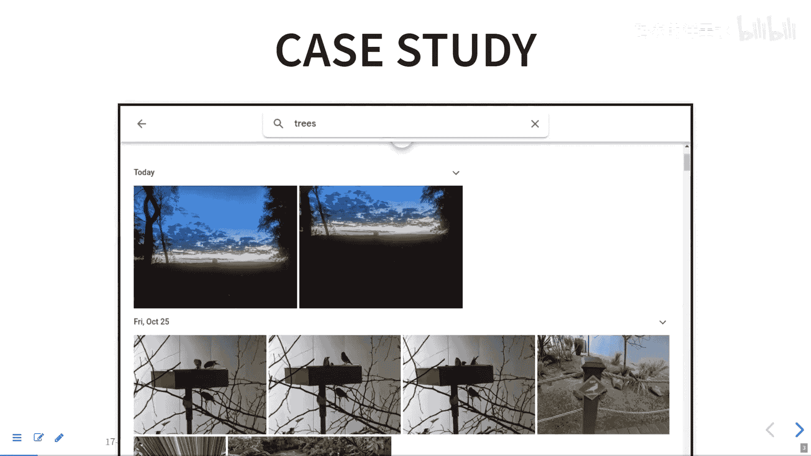

# 013：数据编程与大数据处理入门 🚀

在本节课中，我们将要学习数据编程（也称为弱监督学习）的基本概念，并探讨如何设计能够处理海量数据（如Google Photos）的系统架构。我们将从数据标注的挑战开始，逐步深入到大规模数据处理的策略。

## 数据编程（弱监督学习）💡

上一节我们讨论了数据质量问题。本节中，我们来看看一种应对高质量标注数据稀缺的流行技术：数据编程或弱监督学习。

标注数据成本高昂。对于机器学习，通常需要已标注的数据。在许多情况下，获取未标注数据很容易（例如从互联网获取大量图片），但为它们添加标签则需要人工参与，这既昂贵又可能引入质量不一的问题。例如，标注医学影像中的癌症，专家标注准确但昂贵，而众包标注则便宜但可能不可靠。

弱监督学习的核心思想是：**质量较弱的标签可能比完全没有标签要好**。这项技术旨在将不同质量的专家知识整合到标注流程中。

### 标注函数与生成模型

其基本方法是：让领域专家编写一系列**标注函数**。这些函数是用于为数据打标签的机制，它们**不需要完全可靠**，可以是部分的或启发式的。

以下是用于检测垃圾邮件的标注函数示例：

*   **函数1：** 如果文本中包含“Maa”（可能是一个拼写错误），则标记为垃圾邮件；否则，弃权。
    *   `if "Maa" in text: label = SPAM else: label = ABSTAIN`
*   **函数2：** 调用一个外部情感分析工具，如果文本被判定为高度两极分化，则标记为垃圾邮件。
*   **函数3：** 如果文本中包含“Viagra”或某些常见拼写变体，则标记为垃圾邮件。
    *   `if any(word in text for word in ["viagra", "v1agra", "viaqra"]): label = SPAM`

以下是标注函数的常见来源：
*   **硬编码启发式规则：** 基于特定短语或模式（如上述示例）。
*   **外部模型/远程监督：** 委托给另一个可能较弱的模型（如情感分析工具）。
*   **众包结果：** 整合来自众包平台的不完美标签。
*   **外部知识库：** 利用已知的关系数据库（如通过邮政编码推断城市）。

系统会构建一个**生成模型**（在Snorkel框架中），该模型分析这些标注函数之间的相关性。经常达成一致的函数被认为更可靠，会被赋予更高的权重；经常相互矛盾的函数则被认为可靠性较低。通过这种加权投票机制，系统可以自动为海量未标注数据生成（带有噪声的）标签。

随后，这些生成的、带有噪声标签的数据被用来训练一个**判别式机器学习模型**。这个最终模型通常能学习到比原始标注函数组合更通用的模式。

### 应用场景

这种思路不仅可用于标注训练数据，还可用于：
*   **数据增强：** 根据规则创建人工数据以扩充训练集。
*   **识别重要数据：** 根据规则筛选出关键样本（如可能包含癌症的影像）。
*   **数据清洗：** 基于多源弱信号识别并修正数据中的问题。

### 实例：检测YouTube有毒评论

假设我们要检测YouTube上的有毒评论（可能只占1%）。我们可以设计以下**弱信号**标注函数：
*   **硬编码关键词列表：** 匹配已知的侮辱性词汇、脏话。
*   **外部情感/毒性分类器：** 调用现有API获取初步毒性评分。
*   **用户举报历史：** 将用户举报过的评论作者的新评论视为弱信号。
*   **用户名检查：** 用户名中包含冒犯性词汇的用户的评论。

通过组合这些不完美的信号，我们可以快速为数百万条评论生成初始标签，用于训练一个更强大的分类器。

## 大规模数据处理架构设计 🏗️

现在，让我们将视角转向如何处理像Google Photos这样拥有极大规模数据的系统。该服务每天处理约1.2亿张图片上传（约6PB数据）。我们需要设计一个能够为图片自动添加标签（如“树”、“生日”、“匹兹堡”）并支持快速搜索的系统。

核心挑战在于：**何时以及如何为海量图片计算这些标签？** 以下是三种主要的处理范式：

### 1. 流处理
当用户上传一张图片后，系统并不立即进行复杂的分析。而是将图片放入一个**队列**中。后台有多个工作进程从队列中取出图片，并行地进行标签预测（物体识别、地理位置解析等）。这种模式**接近实时**，延迟通常在几秒到几小时之间，适用于需要较快响应的场景。
*   **优点：** 延迟较低，资源分配灵活（可根据队列长度扩展计算资源）。
*   **缺点：** 无法为了使用新改进的模型而重新处理所有历史数据。

### 2. 批处理
系统定期（例如每天夜间或每周）启动一个任务，对数据库中的所有或部分图片（例如过去一年内的图片）重新运行最新的分析模型。这种模式用于**更新整个数据集**，例如当图像识别模型得到重大改进后。
*   **优点：** 可以高效地全局更新数据，利用计算资源空闲时段。
*   **缺点：** 延迟很高（天或周级别），结果不是实时的。

### 3. 按需处理（搜索时处理）
当用户执行搜索时（例如搜索“树”），系统实时地对用户个人图库中的图片运行相关的分类模型。为了加速，通常会对常用标签建立**索引**。
*   **优点：** 节省计算资源（只为被搜索的内容进行计算），总是使用最新的模型。
*   **缺点：** 对单个搜索请求的响应时间可能较长，尤其是当需要处理大量图片或运行复杂模型时。

在一个像Google Photos这样的实际系统中，很可能是**混合架构**：
*   **上传时：** 使用**流处理**快速添加简单、高置信度的标签（如GPS地理位置、通过轻量模型识别的明显物体）。
*   **定期：** 使用**批处理**运行更复杂、更新的模型，刷新整个库的标签，或计算不常用的标签。
*   **搜索时：** 结合使用预构建的**索引**和可能的**按需计算**来平衡响应速度与结果准确性。

## 总结 📚

本节课中我们一起学习了：
1.  **数据编程（弱监督学习）：** 通过组合多个不完美的**标注函数**，利用生成模型估算其可靠性，从而为海量数据自动生成训练标签。这是一种在标注成本高昂或数据质量不一的情况下，有效扩大训练数据集规模的强大技术。
2.  **大规模数据处理架构：** 面对海量数据，我们需要在**流处理**（近实时）、**批处理**（周期性全局更新）和**按需处理**（请求时计算）之间做出设计和权衡。一个健壮的系统通常会根据数据特性、业务需求和对延迟的容忍度，灵活结合这些模式。

理解这些概念有助于我们设计出既能处理大规模数据流，又能智能地利用资源并管理数据质量的AI驱动系统。