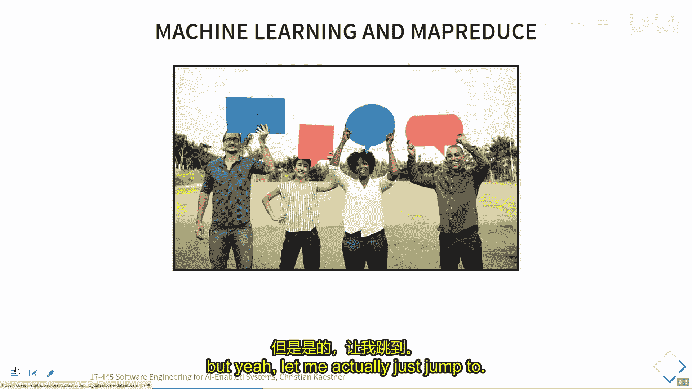
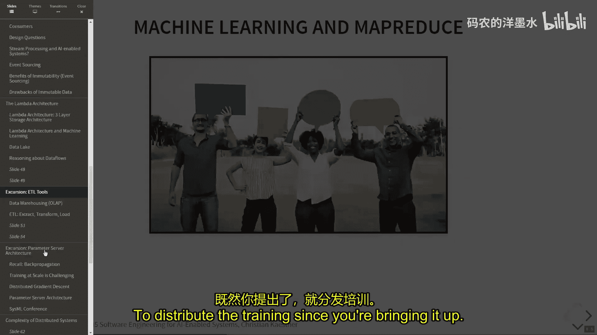
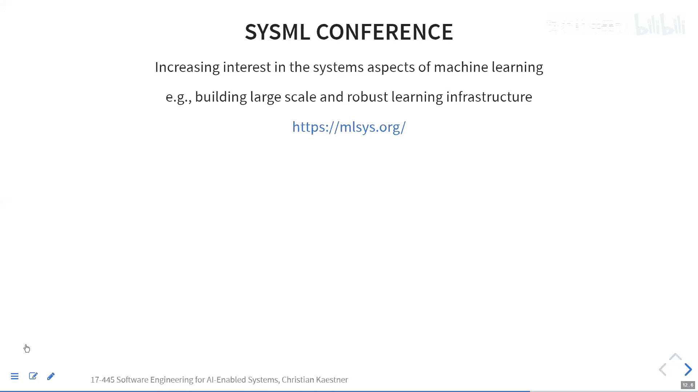
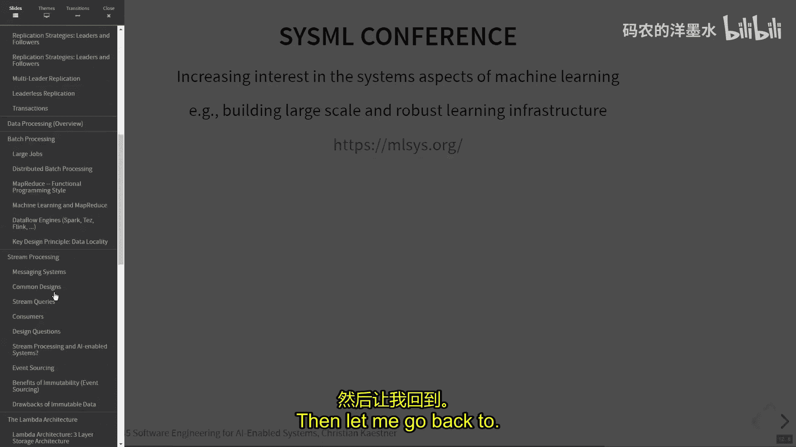
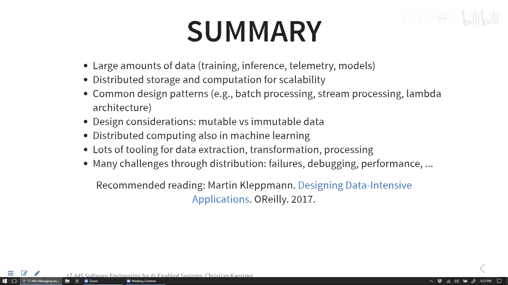

# 014：大型数据集的管理与处理 📊


在本节课中，我们将要学习如何处理和管理大规模数据集。这是构建AI驱动系统时的一个核心挑战，因为机器学习通常涉及海量的训练数据、推理输入和遥测数据。我们将探讨不同的数据存储、处理模式以及相关的系统设计考量。

上一节我们介绍了业务模型与数据质量的重要性，本节中我们来看看当数据量变得非常庞大时，我们该如何应对。

## 数据存储基础 🗄️

处理大数据的第一步是决定如何存储它。数据存储方式决定了你如何访问和查询数据。

*   **关系型数据库**：数据以表格形式存储，使用SQL查询。它们能高效处理索引查询并强制保证数据模式的一致性。
*   **文档数据库 (NoSQL)**：存储结构化文档（如JSON）。其优势在于模式灵活，易于存储嵌套结构，但通常不擅长处理连接等复杂操作。
*   **日志文件**：常见的非结构化数据存储形式，如CSV文件。它们易于转储，但通常不支持索引，查询效率低。

数据还可以用不同格式编码，从纯文本到高效的二进制编码（如Protocol Buffers），后者在网络传输中尤其有用。

## 数据分布策略 🔀

当单台机器无法容纳所有数据时，我们需要将数据分布到多台机器上。以下是两种核心策略：

*   **分区**：将数据库分割成多个部分。
    *   **水平分区**：将不同的数据行分布到不同机器上（例如，按用户ID哈希）。
    *   **垂直分区**：将不同的数据列分布到不同机器上（例如，将用户基本信息与历史记录分开存储）。
*   **复制**：将相同的数据副本存储在多台机器上，以提高读取可用性和可靠性。

在实际系统中，分区和复制常结合使用。一个常见的设计是**主从复制**：一个主数据库处理所有写入操作，然后数据被复制到多个从数据库以供读取。这带来了数据一致性的挑战，例如如何处理多个客户端的并发写入。著名的CAP定理指出，在分布式系统中，一致性、可用性和分区容错性无法同时完全满足，设计时需要做出权衡。

## 数据处理模式 ⚙️

根据对延迟和数据处理量的要求，主要有三种数据处理模式。

### 服务（按需处理）🌐

这是最直接的模式，例如Web服务器。用户发出请求（如电影推荐），系统立即计算并返回结果。这适用于需要实时响应的场景。

### 批处理 🔄

批处理用于运行大型计算任务，通常按固定间隔（如每天）离线执行。它适合处理海量数据，计算可能持续数小时甚至数天。

一个经典的例子是使用Unix命令行工具分析网络服务器日志，找出访问最频繁的URL：





```bash
cat access.log | awk '{print $7}' | sort | uniq -c | sort -nr | head -5
```

这个流水线依次执行：读取日志、提取URL、排序、计数、按计数排序、输出前五名。当数据量极大时，这种单机顺序处理会变得非常缓慢。

**MapReduce** 框架（如Hadoop）就是为了分布式批处理而设计的。其核心思想是 **将计算移动到数据所在之处**，而非移动数据。它通过两个主要阶段工作：
1.  **Map（映射）**：在各个数据分片上本地执行过滤、转换等操作。
2.  **Reduce（归约）**：将Map阶段产生的中间结果进行汇总、聚合。

框架本身会处理任务调度、故障恢复等复杂问题。在机器学习中，批处理常被用于对历史数据应用新的预测模型（如为所有旧图片重新生成标签）或计算聚合统计报告。





### 流处理 🌊

流处理介于服务和批处理之间，用于近实时处理连续的数据流。数据被发送到消息队列（如Kafka）中，消费者从队列中读取并处理消息。

其优势在于**解耦**：生产者和消费者可以独立扩展，以不同的速度运行。例如，在图片服务中，上传的图片可以流入一个队列，然后由多个并行的消费者处理（一个识别物体，一个添加地理位置，另一个检测人脸）。

设计流处理系统时需要仔细考虑消息传递的可靠性保证：
*   **至多一次**：消息可能丢失，但绝不会被重复处理。
*   **至少一次**：消息绝不会丢失，但可能被重复处理。
*   **恰好一次**：这是理想情况，但在分布式系统中最难实现，通常需要业务逻辑的配合。

## 高级概念与架构 🏗️

以下是构建大规模数据处理系统时常见的几个高级概念。

### 事件溯源 📜

与传统数据库直接修改当前状态不同，事件溯源只**追加**记录状态变化的事件（如“用户部门更新为A”）。要获取当前状态，需要从头回放所有相关事件。

**优点**：
*   完整的历史记录，易于调试和审计。
*   能轻松重现过去任意时间点的数据状态，对于追踪模型训练所用的数据版本特别有用。

**挑战**：
*   查询当前状态需要计算，成本高。通常需要构建并维护一个针对查询优化的“物化视图”。

### Lambda 架构 λ

Lambda架构结合了批处理和流处理的优点，以平衡延迟和准确性。它包含三层：
1.  **批处理层**：处理所有历史数据，生成准确但延迟高的“基准”结果或模型。
2.  **速度层（流处理层）**：处理实时数据，对结果进行快速增量更新，提供低延迟但可能近似的结果。
3.  **服务层**：合并批处理层和速度层的结果，响应用户查询。

例如，可以每晚用全部数据训练一个准确的模型（批处理层），同时用流处理实时微调模型以适应新趋势（速度层）。服务层则提供融合了最新微调结果的预测。即使流处理偶尔出错，次日批处理任务也会将其纠正。

### 数据湖 vs. 数据仓库 🏞️ vs. 🏢

*   **数据湖**：存储大量原始、非结构化的数据（如日志文件）。理念是“先存储，后分析”，保留所有数据以备未来潜在之用。
*   **数据仓库**：存储从各业务系统提取、转换并结构化的数据，针对复杂的分析查询进行了优化。

随着数据流经不同系统（数据库、流平台、处理任务），维护一份**数据血缘图**来记录数据的来源、变换和去向，对于系统理解和治理至关重要。

## 分布式机器学习训练 🤖

训练大型机器学习模型本身也需要分布式计算。以分布式梯度下降为例：
*   **数据并行**：多个工作节点各自持有部分训练数据，计算梯度，并将梯度更新发送到一个中心化的**参数服务器**进行聚合和模型参数更新。
*   **挑战**：参数和梯度通信量巨大。研究集中在通过稀疏更新、梯度压缩等技术来优化网络通信。

像参数服务器这样的专用框架，为分布式训练处理了复杂的协调、容错和通信优化问题。

## 总结 📝



本节课中我们一起学习了管理大规模数据集的核心知识。我们了解到，处理机器学习中的海量数据需要借助分布式系统。关键要点包括：根据需求选择数据存储（关系型、文档型）和分布策略（分区、复制）；根据延迟要求选用合适的数据处理模式（服务、批处理、流处理）；并可以借鉴事件溯源、Lambda架构等设计模式来构建健壮的系统。此外，分布式训练框架使得在大数据上训练大模型成为可能。最重要的是，利用现有的成熟工具和框架（如Hadoop、Spark、Kafka）来处理底层的复杂性，通常比从头自建更为明智。