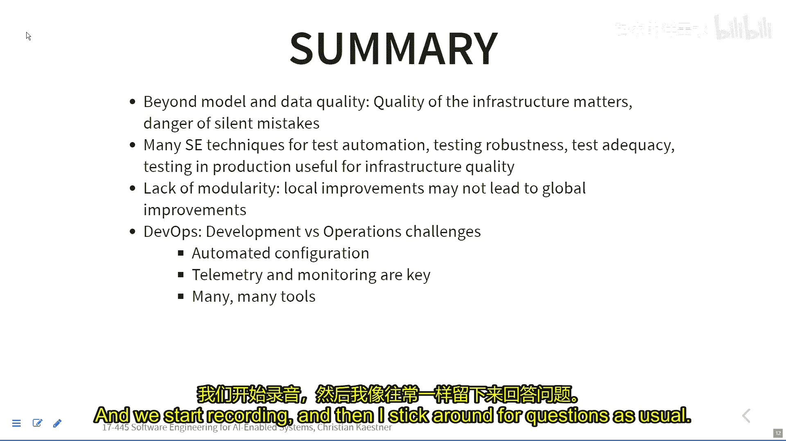

# 015：基础设施质量、部署与运维 🛠️

在本节课中，我们将学习如何确保AI系统基础设施的质量，并了解现代部署与运维（DevOps）以及机器学习运维（MLOps）的核心概念与实践。我们将探讨从代码测试到自动化部署的整个流程，确保系统在生产环境中可靠运行。

---

## 课程概述

首先，我们回顾了上节课关于分布式操作、机器学习数据处理以及批处理与流处理的内容。本节课，我们将重点转向支撑AI系统的“管道”基础设施。与关注模型预测准确性不同，我们将关注整个数据收集、清洗、训练、部署和监控流程的代码质量与可靠性。这些环节中的任何错误都可能导致“静默故障”，即系统看似运行，实则产出错误结果。

---

## 基础设施测试的重要性

上一节我们讨论了大规模数据处理，本节中我们来看看如何确保处理这些数据的代码本身是可靠的。机器学习管道中的许多步骤（如数据提取、特征工程）都是传统的软件代码，因此可以且应该进行测试。

以下是测试时需要考虑的核心方面：

*   **测试层级**：包括单元测试（测试单个函数）、集成测试（测试多个组件的交互）和系统测试（测试整个端到端流程）。
*   **测试环境控制**：通过使用**模拟对象（Mock）** 来替代真实的依赖（如数据库、数据流），可以隔离测试目标代码，并注入特定错误以测试系统的健壮性。例如，可以模拟一个在第三次请求时抛出IO异常的数据流，以测试程序的错误处理机制。
*   **测试自动化与持续集成**：利用如Jenkins、Travis CI等工具，在每次代码提交时自动运行测试套件，确保问题被及早发现。

---

## 针对机器学习管道的专项测试

除了通用软件测试，机器学习系统还有其独特的测试需求。以下是一些关键测试类别：

*   **数据测试**：确保输入数据的模式（Schema）正确、特征有益、隐私控制得当，并且能够快速集成新的数据源或特征。
*   **模型开发测试**：验证模型参数和超参数被正确记录和版本化；通过A/B测试评估模型更新对用户参与度的影响；确保模型在不同数据切片（如不同地区、设备）上的质量公平性。
*   **基础设施测试**：保证训练和服务环境的一致性；监控模型性能随时间是否衰减；实施**混沌工程**，在生产环境中安全地注入故障（如关闭一个服务实例），以测试监控和恢复系统的有效性。
*   **监控测试**：定期进行“消防演习”，手动或自动触发警报条件，确保监控系统能正确通知团队。

---

## 系统集成与模型交互的挑战

当多个模型以管道或复杂方式协同工作时，会引入新的挑战。例如，一个自动驾驶系统可能包含物体检测、轨迹预测、车道识别等多个模型。改进其中一个子模型，可能会因为意想不到的交互而导致整个系统性能下降。这类似于传统软件工程中的“特性交互”问题。

> 解决方案是必须进行充分的**系统级测试**和**端到端评估**，而不能仅仅依赖单个组件的单元测试结果。

---

## DevOps与MLOps：自动化部署与运维

为了高效、可靠地将软件（包括ML模型）交付到生产环境，DevOps文化强调开发与运维团队的协作与自动化。其核心实践包括：

*   **基础设施即代码**：将所有配置、依赖和环境定义通过代码（如Dockerfile、Ansible脚本）管理，并纳入版本控制。
*   **持续集成/持续部署**：自动化构建、测试和部署流程，实现快速、频繁的发布。
*   **容器化与编排**：使用**Docker**等容器技术封装应用及其环境，并通过**Kubernetes**等工具进行容器编排，实现自动化部署、扩展和管理。
*   **全面监控**：对应用性能、基础设施状态进行实时监控和日志记录。

MLOps是DevOps理念在机器学习领域的具体应用，它额外关注：

*   **数据和模型的版本管理**
*   **自动化机器学习管道**
*   **模型性能的持续监控与触发重训练**

目前存在大量支持MLOps的工具生态，涵盖从特征存储、实验跟踪到模型部署和监控的各个环节。

---

## 总结

本节课中我们一起学习了确保AI驱动系统基础设施质量的关键方法。我们认识到，构建可靠的系统不仅需要优秀的模型，更需要坚实的、经过充分测试的代码管道。通过采用单元测试、集成测试、混沌工程等策略，我们可以捕捉并预防许多潜在故障。此外，拥抱DevOps和MLOps的自动化实践，如持续集成、容器化和基础设施即代码，能够显著提升部署效率、系统可靠性和团队协作能力。最终，这些实践共同构成了将机器学习项目从研究原型顺利转化为稳定生产服务的基石。