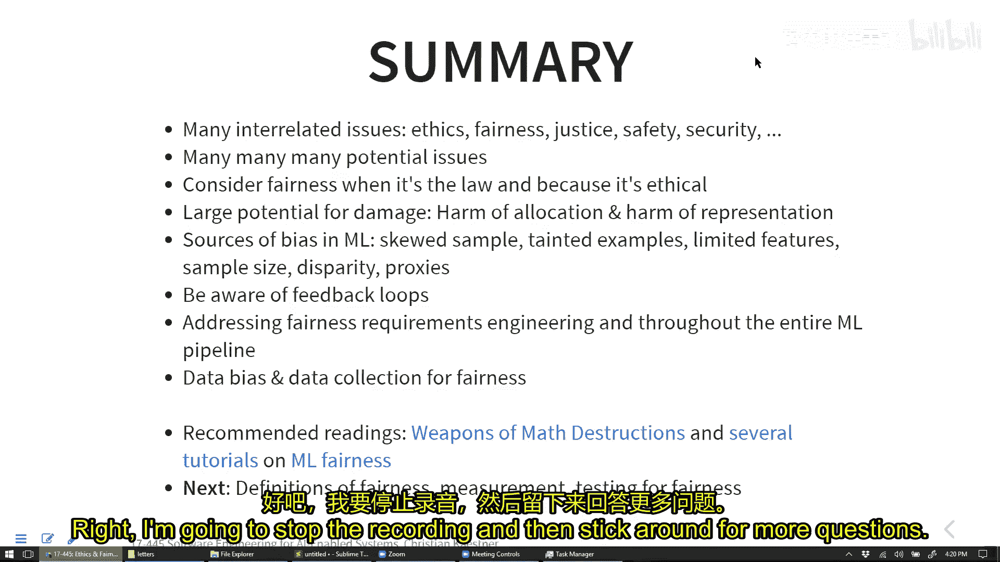

# 016：伦理与公平性 🧭

在本节课中，我们将要学习人工智能系统中的伦理与公平性问题。我们将探讨这些问题为何重要，它们如何产生，以及作为软件工程师，我们应如何思考并应对这些挑战。

## 课程概述

上一节我们介绍了软件测试、监控和DevOps等确保系统质量的技术。本节中，我们将转向一个同样重要但性质不同的主题：构建AI系统时需要考虑的伦理与公平性。这是一个涉及广泛、有时令人沮丧的话题，因为它揭示了技术可能带来的诸多问题。今天我们将重点讨论这些问题本身，了解其来源，为后续探讨缓解策略打下基础。

## 伦理与法律的区别

首先，我们需要区分“伦理”与“法律”。法律是明文规定、具有强制力的规则。而伦理则关乎哲学标准、社会共识和个人道德，它通常没有法律约束力，更多依赖于社会认同和职业操守。

一个经典案例是某制药公司CEO将一种药的价格从13美元提高到750美元。此举在当时是完全合法的，但引发了巨大的道德谴责。这说明了合法行为未必符合伦理。作为软件工程师，我们手握巨大力量，几行代码就可能造成重大影响，因此思考行为的伦理后果至关重要。

## 机器学习带来的伦理关切

机器学习技术放大了许多已有的关切，并引入了新的问题。以下是一些关键领域：

*   **偏见与歧视**：机器学习模型可能编码并放大训练数据中存在的历史偏见。例如，在招聘、大学录取、信用评分等领域，算法可能基于种族、性别等受保护属性进行歧视，且由于其不透明性（“黑箱”），问题更难被发现和纠正。
*   **安全问题**：AI系统可能带来直接的人身安全风险。例如，家庭自动化系统故障可能导致用户受冻；城市中的送货机器人可能意外阻挡残障人士通行。
*   **成瘾与心理健康**：推荐系统和用户界面设计（如“无限滚动”）经常被优化以最大化用户参与度，这可能导致成瘾行为，并与青少年抑郁等心理健康问题相关。A/B测试和机器学习可以用来“破解”人脑，诱导特定行为。
*   **社会影响**：自动化可能导致失业、加剧社会不平等。算法可能制造“信息茧房”，加剧社会极化。此外，AI在监控、自动化武器等领域的应用也引发深刻的社会伦理担忧。

## 聚焦公平性与歧视

在众多伦理问题中，公平性是一个核心且被广泛研究的议题。它通常与歧视问题紧密相连。

**公平性**关注的是避免不公正的区别对待。在法律层面，许多司法管辖区定义了“受保护类别”（如种族、性别、宗教），禁止基于这些属性的歧视。在伦理层面，我们追求的标准往往高于法律要求。

一个重要的概念区分是**平等**与**公平**：
*   **平等**意味着给予每个人相同的资源或机会。
*   **公平**意味着认识到不同个体可能需要不同的支持才能达到相同的结果，旨在消除系统性障碍。

在讨论歧视带来的危害时，我们通常区分两类：
1.  **分配性危害**：不同群体获得不同的结果、机会或资源，或遭受更差的服务质量。例如，人脸识别算法在女性和深色皮肤人群上的表现通常更差。
2.  **代表性危害**：强化有害的刻板印象或贬低某些群体。例如，搜索引擎可能因为一个名字“听起来像”某个族裔，就更倾向于展示与该族裔负面刻板印象相关的广告。

## 为何要关注公平性？

关注公平性不仅是遵守法律的最低要求，更是出于多重考虑：
1.  **遵守法律**：避免法律诉讼和罚款。
2.  **履行责任**：作为工程师和公司，负有道德和社会责任。
3.  **打造更好的产品**：更公平的系统通常能服务更广泛的用户群体。
4.  **维护声誉**：符合伦理的行为可以成为积极的公关策略。

## 偏见从何而来？

机器学习模型中的偏见并非凭空产生，它们通常源于数据或建模过程。以下是几种常见的偏见来源：

*   **历史偏见**：训练数据反映了过去存在的社会偏见。例如，将“护士”自动翻译为“她”，将“医生”自动翻译为“他”，因为历史文本中存在这种关联。
*   **带有偏见的人工标注**：如果训练数据的标签由人类标注，而标注者自身存在偏见，那么这些偏见就会被编码进数据。例如，亚马逊曾尝试的简历筛选系统，因为历史招聘数据偏向男性，导致系统学会了歧视女性求职者。
*   **样本偏差**：数据收集过程不均衡，导致某些群体被过度代表或代表不足。例如，预测性警务系统如果在某些社区部署更多警力，就会记录下更多该社区的犯罪数据，从而形成“犯罪高发区”的偏见反馈循环。
*   **特征偏差**：所使用的特征对不同群体的预测效力不同。例如，将“请假天数”作为员工绩效评估特征，可能对需要休产假或病假的员工不公平。
*   **聚合偏差**：在模型开发或测试中，过度依赖或代表了某些群体。例如，相机公司长期使用白人女性照片（“雪莉卡”）校准色彩，导致相机对其他肤色拍照效果不佳。
*   **代理变量**：即使移除了受保护属性（如种族），其他特征（如邮政编码、就读学校）也可能与这些属性高度相关，成为“代理变量”，导致间接歧视。

## 案例：大学录取自动化

让我们以“自动化研究生项目申请审核”为例，应用上述概念。可能的偏见风险包括：

*   **历史偏见**：如果过去项目中某些群体（如女性）因环境不友好而成功率较低，模型会学会不录取这些群体。
*   **带有偏见的人工标注**：对“成功”的定义可能狭隘（如只认可进入顶级科技公司），忽略了其他有价值的职业路径。
*   **样本偏差**：训练数据可能主要来自少数知名本科院校，缺乏对其他背景申请者的了解。
*   **特征偏差**：标准化考试（如GRE）成绩可能更反映备考资源而非实际潜力，对经济条件差的学生不利。
*   **聚合偏差**：申请者中来自某些国家或地区的人数远多于其他地区。
*   **代理变量**：即使不考虑性别、种族，本科学校、家庭收入、居住城市等都可能成为受保护属性的代理。

## 算法信任的陷阱与自我实现的预言

凯西·奥尼尔的《数学杀伤性武器》一书深刻揭示了算法在高风险决策中的危险。我们常常错误地认为算法是“客观中立”的，从而不加质疑地信任其输出。然而，这些算法通常是黑箱、基于相关而非因果、并且可能由特权群体设计。

最危险的模式之一是**自我实现的预言**或**偏见反馈循环**。以预测性警务为例：
1.  历史数据存在偏见（某些社区巡逻更多，记录犯罪更多）。
2.  算法基于这些数据训练，预测这些社区犯罪风险高。
3.  警方根据预测向这些社区增派警力。
4.  更多的警力导致该社区记录到更多的犯罪（即使实际犯罪率未变）。
5.  新增的犯罪数据反过来“证实”了算法的预测，强化了偏见。

类似的循环也出现在信贷、住房等领域，最终固化并加剧了社会不平等。

## 总结与展望

本节课中，我们一起探讨了AI驱动系统中伦理与公平性的重要性、各类问题及其根源。我们了解到，偏见可能以多种方式潜入系统，而盲目信任算法可能导致严重的分配性和代表性危害，甚至形成自我强化的恶性循环。

关键在于，**大数据编码的是过去，它不会发明未来**。要创造更公平的未来，我们需要有意识地进行设计。这始于需求工程阶段——与多元化的利益相关者沟通，明确系统的公平性约束和目标。

下一节课，我们将把重点从“问题是什么”转向“我们能做什么”。我们将探讨在机器学习模型内部定义和测量公平性的方法，以及作为软件工程师，我们如何在系统层面（如数据收集、界面设计、部署监控）实施缓解策略，共同构建更负责任、更公平的AI系统。