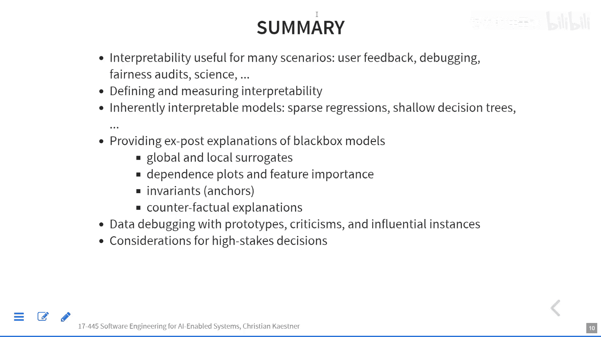

# 017：可解释性与可解读性-part1


在本节课中，我们将要学习机器学习模型的可解释性与可解读性。我们将探讨为什么理解模型决策至关重要，并介绍一系列用于解释模型行为的技术，从本质上可解释的模型到用于解释复杂“黑盒”模型的事后分析方法。

## 概述

上一节我们讨论了AI公平性。本节中，我们将转向另一个关键主题：可解释性与可解读性。理解模型为何做出特定决策，对于调试、合规、科学发现以及建立用户信任都至关重要。我们将首先通过几个实例来了解其重要性，然后探讨不同类型的可解释性方法。

## 动机与实例

理解模型决策的需求在许多实际场景中都非常明显。

### 实例一：GitHub提交异常检测

在一个旨在帮助开发者关注重要GitHub提交的项目中，仅仅标记一个提交为“异常”并提供0到1的评分是不够的。为了提供更有用的信息，项目为每个异常预测提供了**解释**。模型基于多个特征（如提交时间、文件类型）的概率分布工作，可以指出具体是哪些特征（例如“用户通常在夜间不提交，但此次在夜间提交”）使得该提交显得异常。这种解释为用户提供了理解模型判断的具体上下文。

### 实例二：累犯预测模型

考虑两个用于预测累犯风险的模型。第一个模型是一系列简单的**if-then规则**，例如：
```
IF 性别 = 男性 AND 年龄 > 18 AND 有前科 = 是
THEN 预测 = 再次被捕
```
这种模型是**本质上可解释的**，我们可以直接阅读规则并讨论其公平性（例如，使用性别作为特征是否合适）。

相比之下，广泛使用的COMPAS工具是一个**黑盒模型**。它输入多达140个特征，输出一个0到10的风险分数，但不解释其推理过程。研究人员只能通过输入大量数据并观察输出来推断其可能存在的偏见，这个过程既困难又充满争议。可解释的模型使这类审计和讨论变得容易得多。

### 实例三：信用评分与模型调试

当用户抱怨信用评分模型可能存在偏见时（例如，一对财务状况相似的夫妇得到了不同的评分），如果模型是黑盒，调试将非常困难。我们无法轻易判断这是个例错误还是系统性偏差。**可解释性工具**在这里成为了关键的调试手段，帮助我们理解模型在特定案例或某一类案例上的决策依据。

## 为何需要可解释性？

可解释性有多种重要用途，远不止于调试。

以下是其主要价值：
*   **法律与合规要求**：例如，欧盟《通用数据保护条例》规定，用户有权获得自动化决策的解释。在美国，信用评分被拒时必须提供理由。
*   **帮助用户改进**：解释可以指导用户如何改变行为以获得更理想的结果（例如，如何改善信用状况以获得贷款）。
*   **模型调试与理解**：这是软件工程师视角下的核心用途。用于理解错误预测、识别模型学到了什么、评估模型稳健性以及发现边缘情况。
*   **审计与公平性分析**：理解模型决策边界是评估其是否存在偏见或不安全因素的基础。
*   **科学发现**：在许多科研领域，目标不仅是预测，更是理解现象背后的驱动因素（例如，哪些因素影响自行车租赁需求）。线性模型等可解释模型在此类场景中更受青睐。

当然，并非所有场景都需要可解释性。对于低风险决策（如电影推荐）、为防止系统被恶意“博弈”而保护模型细节、或仅在可行性研究阶段，使用黑盒模型可能是可以接受的。

## 定义与评估可解释性

可解释性没有一个统一的数学定义。通常，它指**人类能够理解决策原因的程度**，或**人类能够持续预测模型结果的程度**。

如何比较两个模型的可解释性？这通常需要人工实验。例如，可以给参与者一些输入案例，让他们根据对模型的理解来预测输出，看其预测与模型实际输出的一致性有多高。也可以询问参与者，对于某个特定决策，他们认为原因是什么。此外，一些简单的代理指标也被使用，例如**决策树的大小**（节点越少，通常越易理解）或**线性模型中特征的数量**。

需要区分两个概念：
*   **模型可解释性**：指模型本身的结构就易于理解（如小型决策树、线性模型）。这称为**本质可解释性**。
*   **解释**：指针对**单个预测**提供的、易于理解的理由（例如，“您的贷款被拒是因为储蓄不足。如果储蓄超过100美元，贷款就会被批准”）。这种**事后解释**可以应用于任何模型，尤其是黑盒模型。

一个好的解释通常具备以下特点：**正确**（或至少是合理的近似）、**简洁**、**对比性**（说明什么改变会导致不同结果）、**符合受众的先前信念**，并且是**社会性的**（针对受众的知识水平进行表述）。值得注意的是，对于同一个结果，可能存在多个看似合理的解释（“罗生门效应”），因此选择提供哪个解释需要仔细考量。

## 本质可解释的模型

有些模型本身设计得就易于人类理解。

以下是几种常见的本质可解释模型：
*   **线性回归/逻辑回归**：当特征数量较少且系数易于理解时。公式 `y = β₀ + β₁x₁ + β₂x₂ + ...` 直接显示了每个特征的影响方向和强度。通过**特征选择**（如Lasso正则化）可以控制模型稀疏性，使其更易解释。
*   **决策树与决策规则**：树形结构或“如果...那么...”规则集直观显示了决策路径。例如，累犯预测的决策树。但树或规则集过大时，可解释性会下降。
*   **记分卡模型**：这是线性模型的一种可视化呈现，为每个特征值分配分数，总分用于决策。这种形式在实践中（如信用评分）被广泛使用，因为它极其直观。
*   **K-最近邻**：虽然它没有全局模型，但可以为单个预测提供解释，即展示与当前案例最相似的**K个历史案例**及其结果。

这些模型的可解释性优势在于，我们可以直接从中推导出**反事实解释**（例如，“如果年龄小于18岁，预测结果就会不同”）。

## 解释黑盒模型的技术

对于深度学习等复杂黑盒模型，我们需要专门的技术来生成事后解释。大多数技术将模型视为一个仅能查询输入-输出关系的“黑箱”。

### 全局代理模型

一种直观的思路是：用一个简单的、可解释的模型（如决策树）去近似模拟复杂黑盒模型的行为。

具体步骤是：
1.  使用原始数据或生成新数据，获取黑盒模型 `F` 的预测。
2.  基于这些（输入，`F`的预测）数据对，训练一个新的可解释模型 `G`（代理模型）。
3.  通过解释 `G` 来近似理解 `F`。

**局限性**：代理模型 `G` 可能无法完全捕捉 `F` 的复杂性，其解释可能不忠实于原模型。如果 `G` 效果很好，那或许一开始就应该使用 `G`。此外，`G` 可能学到的是与 `F` 不同的特征关联（例如，学到代理特征而非真实因果）。

### 局部代理模型 (LIME)

LIME的核心思想是：**不为整个复杂模型寻找一个全局解释，而是专注于解释模型在单个预测点附近的行为**。

工作流程如下：
1.  在感兴趣的预测点附近随机生成大量数据样本。
2.  查询黑盒模型得到这些样本的预测标签。
3.  根据样本与原始点的距离赋予权重（越近权重越高）。
4.  用一个简单的可解释模型（如线性模型）去拟合这些加权样本的预测结果。
5.  这个局部线性模型就提供了对该点预测的解释，显示了哪些特征在局部范围内最重要。

例如，在一个文本分类任务中，LIME可以高亮出对“将某帖子分类为无神论”贡献最大的关键词。在图像分类中，它可以生成**显著图**，显示哪些像素区域对“识别为狼”的决策影响最大。

**优点与局限**：LIME易于使用，能提供简洁、对比性的解释，适用于多种数据类型。但其解释可能**不稳定**（对输入微小变化敏感），且是**局部近似**，不一定反映模型的全局逻辑，因此在需要严格合规的场景中可能不被接受。

### 特征重要性分析

这类方法旨在评估每个特征对模型整体性能的贡献。

一种常用方法是**排列特征重要性**：
1.  在验证集上计算模型的基准准确率。
2.  对于某个特征（如“温度”），随机打乱（排列）该特征在验证集中的所有值。这破坏了该特征与真实标签之间的关系，但保持了特征值的分布。
3.  用打乱后的数据再次评估模型准确率。
4.  准确率下降的幅度即为该特征的“重要性”度量。下降越多，说明该特征越重要。

结果通常以条形图展示，直观显示了各个特征的重要性排序。这种方法无需重新训练模型，计算相对高效。

**注意**：打乱特征可能创建不现实的数据组合（例如，高温与高湿度本应相关，但打乱后可能无关），但通常仍能提供有用的参考。

### 部分依赖图

PDP用于可视化**单个特征**与模型**预测结果**之间的平均关系。

具体步骤是：
1.  对于某个特征（如“温度”），在其取值范围内选择一系列值。
2.  对于数据集中每一个样本，将该特征的值依次替换为选定的值，其他特征保持不变，然后获取模型的预测。
3.  对所有样本在每个替换值上的预测结果取平均。
4.  绘制该特征值与平均预测值的关系图。

例如，在自行车租赁预测中，PDP可能显示租赁量随温度升高而增加，但在极高温时略有下降。PDP还能展示数据分布，帮助识别预测不可靠的区域（如数据稀少的极端值区间）。

**个体条件期望图**是PDP的变体，它不绘制平均线，而是绘制每个样本单独的条件期望曲线。如果所有曲线形状相似，说明该特征的影响是独立的；如果曲线差异很大，则暗示该特征与其他特征存在交互作用。

## 总结



本节课我们一起学习了机器学习模型可解释性与可解读性的重要性及基本方法。我们了解到，可解释性对于调试、合规、审计和科学发现都至关重要。我们区分了**本质可解释的模型**（如线性模型、决策树）和用于解释**黑盒模型**的**事后技术**。介绍的后者包括**全局代理模型**、**局部代理模型**、**特征重要性分析**和**部分依赖图**。这些工具能帮助我们理解模型行为、诊断问题并建立对AI系统的信任。在下一节中，我们将继续探讨更多解释技术，并讨论与可解释性相关的策略与政策问题。