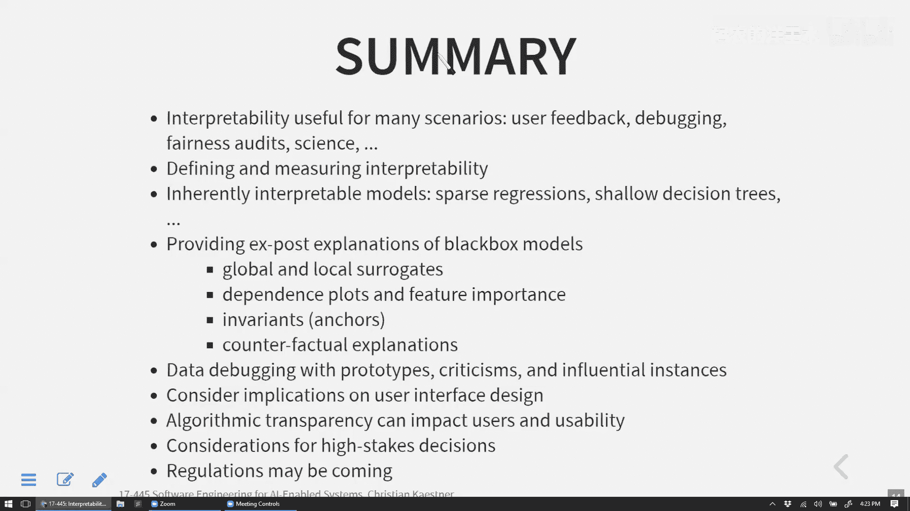

# 018：可解释性与可解读性（第二部分）


在本节课中，我们将继续探讨机器学习模型的可解释性。我们将学习几种新的解释技术，讨论如何将解释融入用户界面设计，并思考在高风险决策中，解释性模型与黑盒模型之间的权衡。

上一节我们介绍了几种解释黑盒模型的技术，如LIME和SHAP。本节中，我们将看看更多方法，并探讨解释性在实际应用中的意义。

## 不变性与锚点

不变性（在软件工程中常用）或锚点（在机器学习中的称呼）是一种寻找能描述模型部分行为的规则或充分条件的技术。其核心思想是找到一些能解释某些预测结果的规则。

例如，一条规则可能是：“如果收入低于某个阈值，贷款总是被拒绝。”这条规则并不解释所有情况，但它是一个充分条件：只要前提成立，我们就能解释这部分模型的输出。这类似于关联规则挖掘或规约挖掘。

**概念示例**：假设我们有一个栈的实现，我们通过测试用例观察其行为。像Daikon这样的工具会尝试寻找方法执行之间始终成立的不变性。例如，它可能发现栈内部的数组对象在执行任何方法前后都永远不会是`null`。

**代码示例**：
```java
// 一个栈类的不变性示例
public class Stack {
    private Object[] array; // 不变性：array != null
    private int top;        // 不变性：top >= -1 && top < array.length
    // ... 方法实现
}
```

在机器学习中，锚点的概念类似。我们尝试找到一些规则，这些规则能保证（或以高概率）产生特定结果。例如，在贷款模型中，我们可能发现规则：“如果FICO信用分低于X，则模型总是拒绝贷款。”这是一个部分解释，易于人类理解。

## 反事实解释

反事实解释通过描述“如果情况不同，结果会如何改变”来提供解释。这是一种非常自然的解释方式。

**核心形式**：如果X没有发生，Y就不会发生（或就会发生）。例如，对贷款申请者可以说：“如果你的储蓄账户再多5000美元，你的贷款就会被批准。”这种解释具有可操作性，为用户提供了改进的方向。

**挑战**：对于一个给定的预测，通常存在许多可能的反事实解释。关键在于找到**最佳**解释，通常是最简短或最可操作的。

**如何寻找反事实**？我们可以使用多种搜索策略：
*   **简单采样**：在输入特征附近随机采样，观察哪些改变会翻转预测结果。
*   **基于梯度的搜索**：如果模型提供连续输出（如概率分数），可以利用梯度信息进行“爬山”搜索，朝着改变预测结果的方向移动。
*   **更复杂的优化算法**：如Nelder-Mead算法，它通过采样多个点来估计改进方向。

**公式示意（梯度搜索）**：对于一个输入点 `x` 和模型输出 `f(x)`，我们寻找一个接近 `x` 的点 `x'`，使得 `f(x')` 达到期望的结果（如从“拒绝”变为“批准”）。这可以形式化为一个优化问题：`min distance(x, x')`，约束条件为 `f(x') = 期望结果`。

## 原型与批评实例

这种技术不是解释模型，而是通过分析训练数据本身来进行调试。它寻找能代表某一类别的典型数据点（原型）以及该类别的异常数据点（批评实例）。

**概念**：
*   **原型**：最能代表某个类别或概念的典型数据点。
*   **批评实例**：属于某个类别，但与该类别的典型特征相距甚远的数据点。

**用途**：这有助于调试训练数据。例如，批评实例可能标识出错误标注的数据，或者表明我们需要更多某种类型的数据来提高模型鲁棒性。对于图像分类，原型可能是某类狗的典型图片，而批评实例可能是姿势、背景或品种特征不典型的图片。

## 影响实例

影响实例分析旨在找出训练数据中哪些数据点对模型训练的影响最大。其核心思想是：如果移除某个训练数据点，模型参数或预测性能会发生显著变化，那么这个点就是有影响力的。

**工作原理**：一种直接的方法是“留一法”重训练。即，对于每个训练数据点，重新训练模型（排除该点），并观察模型性能（如准确率）或参数的变化程度。变化大的点即为影响实例。

**用途**：
1.  **数据清洗**：影响大的点可能是异常值或错误标注的数据，需要仔细检查。
2.  **理解泛化问题**：分析哪些数据点导致模型在特定新数据（如来自不同医院的患者数据）上表现不佳，有助于发现数据偏差。

**主要限制**：需要多次重新训练模型，计算成本非常高。不过，对于某些模型（如线性回归），存在近似计算方法可以避免完全重训练。

---

## 解释与用户界面设计

将解释融入系统设计可以增加用户信任。关键在于根据**决策信心**和**对用户的影响**来设计不同的解释策略。

以下是几种典型场景：

*   **高信心，低影响**：例如，导航应用的预计到达时间。可能不需要详细解释，简单的显示即可。
*   **低信心，低影响**：例如，新用户的电影推荐。可以解释：“因为我们还不了解你的喜好，这是目前流行的电影。”并可能引导用户提供更多反馈。
*   **高信心，高影响**：例如，医疗诊断或贷款审批。需要清晰、可信的解释来说明决策依据。
*   **低信心，高影响**：例如，社交媒体上的虚假信息检测。需要解释不确定性（“这条内容可能具有误导性，因为…”），并可能将最终决定权交给人类审核。

**透明度的重要性**：研究表明，即使只是告知用户有算法在背后进行内容筛选（如社交媒体信息流），也能增加用户的控制感和满意度，即使他们不改变对算法本身的看法。隐藏算法的存在可能导致误解和不满。

---

## 可解释模型 vs. 黑盒模型：一个关键争论

一个重要的观点认为，我们应停止为高风险决策中的黑盒模型寻找事后解释，而应直接使用可解释模型。

**核心论点**：
1.  **准确性-可解释性权衡是个误区**：在许多情况下，通过精心设计特征，可以构建出性能与复杂黑盒模型相当的可解释模型（如稀疏线性模型、浅层决策树）。
2.  **事后解释可能不忠实**：像LIME这样的局部替代模型只是近似，其解释可能无法真实反映原黑盒模型的决策逻辑，导致误导。
3.  **可解释模型便于审计和结合上下文**：当决策者（如法官）能看到完整的模型时，他们能更好地理解其局限性（例如，模型未考虑犯罪严重性），从而更有效地结合其他信息做出最终判断。

**挑战**：构建可解释模型通常需要更多的特征工程努力和领域知识。对于像图像识别这样特征极其复杂的任务，可解释模型可能目前还难以达到深度神经网络的性能。

**政策启示**：有学者主张，在任何存在性能相当的可解释模型的高风险决策领域（如刑事司法、贷款、雇佣），都应禁止部署黑盒模型。这引发了关于知识产权、创新激励与监管必要性的广泛讨论。目前，全球各司法管辖区正在探索相关的AI治理和监管框架。

---



本节课中我们一起学习了多种机器学习模型的可解释性技术，包括锚点规则、反事实解释、原型与批评实例以及影响实例分析。我们还探讨了如何将解释策略融入用户体验设计，并深入思考了在高风险场景下，追求模型本身的可解释性而非事后解释的重要性和争议。理解这些工具和概念，对于构建负责任、可信赖的AI驱动系统至关重要。