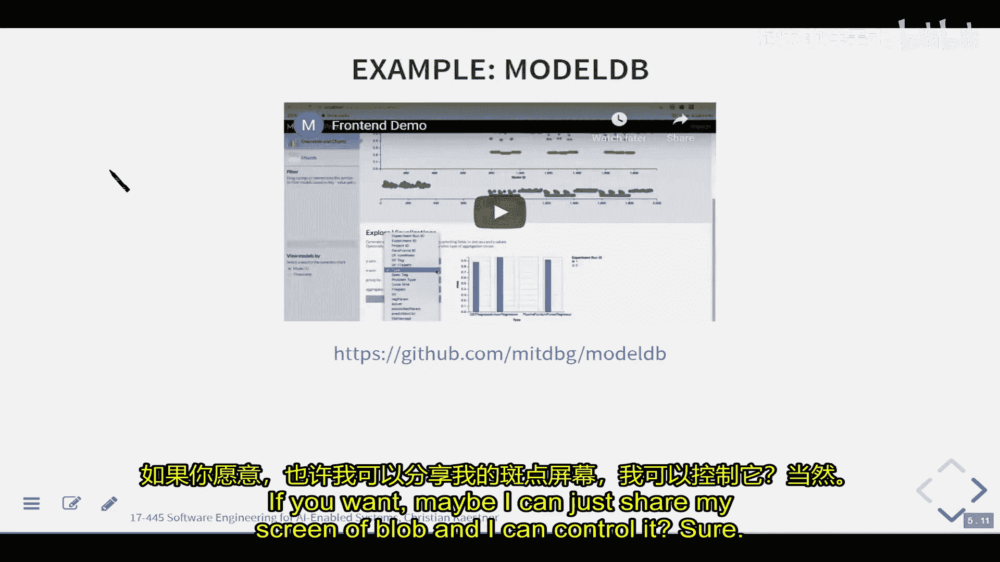
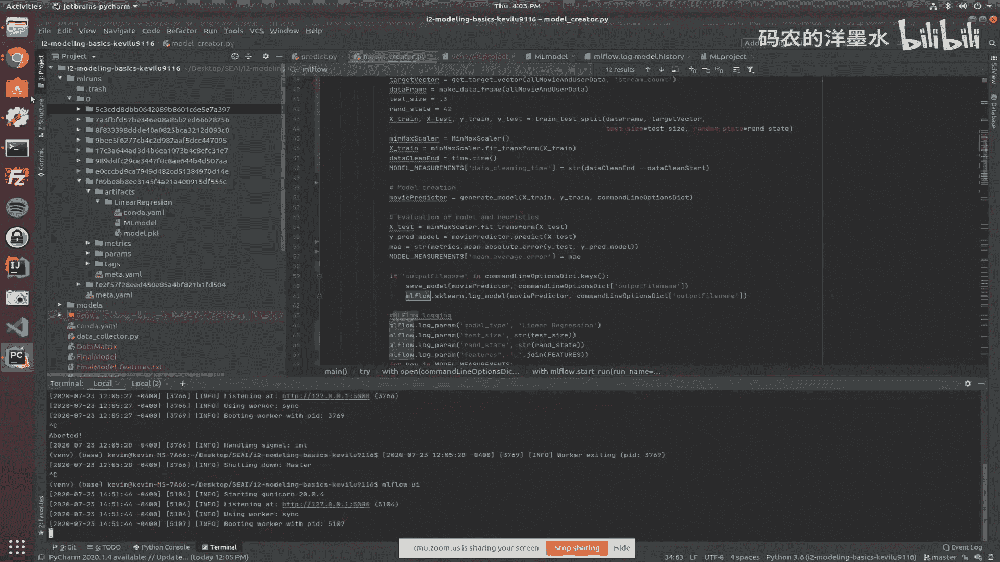
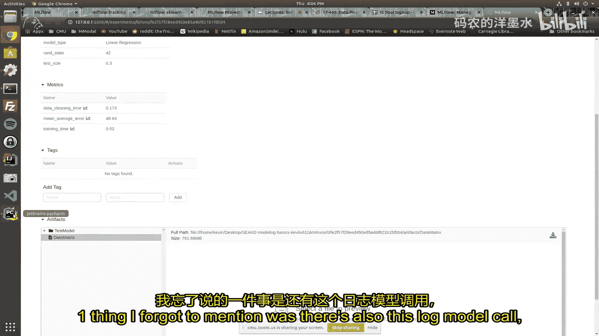
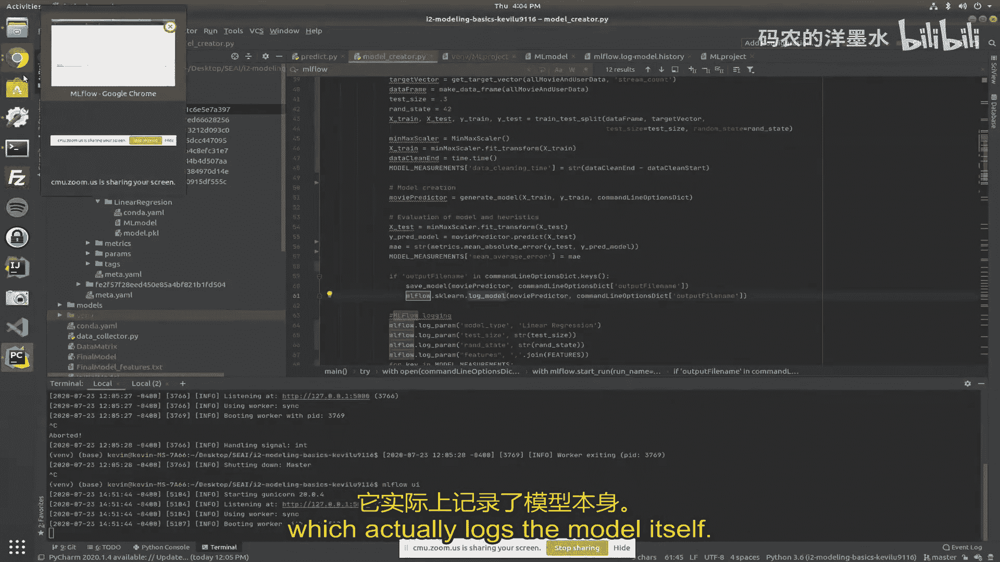
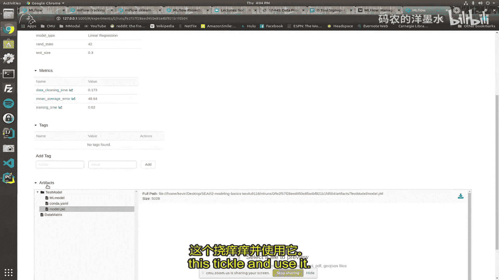
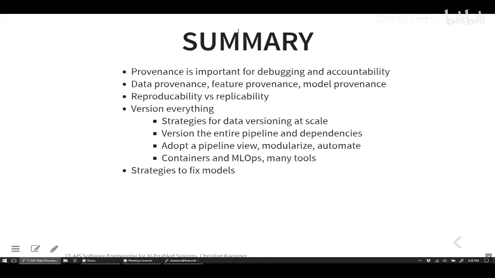

# 019：版本控制、溯源与可复现性

在本节课中，我们将要学习如何追踪AI系统中数据的来源、模型的版本以及整个处理流程，这对于调试、理解和复现系统行为至关重要。我们将探讨数据溯源、模型版本控制以及确保结果可复现性的最佳实践。

上一讲我们讨论了如何解释单个模型的预测。然而，在复杂的现实系统中，一个决策往往由多个模型和数据处理步骤共同决定。本节中，我们将看看如何追踪整个决策链条的起源。

## 溯源的必要性

考虑一个信贷审批系统的例子。用户对系统给出的信用评分或信贷额度感到不满，并质疑其公平性。要调试和理解这个问题，我们需要知道：
*   使用了哪个版本的信用评分模型？
*   该模型使用了哪些输入数据？这些数据可能来自其他模型。
*   训练该模型使用了哪些历史数据？
*   特征提取和数据处理代码是哪个版本？

所有这些信息共同构成了系统的“溯源”信息。它帮助我们追踪一个特定预测或决策是如何产生的，以及系统中的每个组件（数据、特征、模型）来自何处。

## 溯源的类型

以下是三种主要的溯源类型：

**数据溯源**
追踪数据的原始来源和变更历史。例如，数据由谁收集、何时被修改、修改原因，以及是否由其他算法（如另一个模型）生成。

**特征溯源**
追踪用于模型训练和推理的特征是如何从原始数据中提取的。这包括特征提取代码的版本、数据清洗和标准化方法。

**模型溯源**
追踪模型本身的来源。包括：训练数据版本、使用的算法库及其版本、超参数设置、训练代码版本，以及可能提供输入的其他模型。

## 版本控制策略

为了有效追踪溯源信息，我们需要对系统中的关键组件进行版本控制。

**版本化训练数据**
对于大型且不断增长的数据集（如每日新增的用户评分），直接存储完整副本可能效率低下。以下是几种策略：
*   **存储差异**：仅存储数据集的增量变化。
*   **仅追加数据**：对于时间序列或日志类数据，可以记录偏移量或时间范围来标识版本。
*   **事件溯源**：将数据变更记录为一系列事件，通过重放事件可以重建任何时间点的数据状态。
*   **存储哈希值**：存储数据文件的哈希值（如SHA256）来唯一标识其内容。
*   **可重现的查询**：存储生成数据集的查询语句或处理步骤，以便重新计算。

**版本化模型**
模型文件通常是二进制文件，即使输入有微小变化，输出模型也可能完全不同，因此存储差异的收益不大。常见的做法是：
*   存储模型的完整副本。
*   使用唯一的标识符（如哈希值或带时间戳的版本号）来命名模型文件。
*   将模型与生成它的**数据版本**和**代码版本**的元数据关联存储。

**版本化流水线**
连接数据和模型的代码流水线通常规模较小，可以使用传统的版本控制系统（如Git）进行管理。关键是要记录：
*   流水线代码版本。
*   使用的库及其精确版本（例如，通过`requirements.txt`文件锁定）。
*   超参数配置。
*   通过元数据将流水线版本与它产生的数据版本和模型版本明确关联。

## 工具与实践

有一些工具可以帮助自动化版本控制和溯源追踪。

以下是DVC工具的核心概念：
*   DVC在Git之上工作，专门用于版本化大文件和目录（如数据和模型）。
*   它使用远程存储（如S3、Google云存储）来存放实际文件，而在Git仓库中只存储元数据和文件哈希。
*   用户可以定义数据处理流水线的各个阶段（stage），DVC会自动跟踪每个阶段的输入和输出依赖。当输入改变时，可以高效地重新运行受影响的阶段。

以下是MLflow Tracking组件的核心功能：
*   它是一个用于记录机器学习实验的API和用户界面。
*   开发者可以手动记录实验参数（`log_param`）、评估指标（`log_metric`）、 artifacts（如数据文件、模型文件，使用`log_artifact`）和代码版本。
*   它提供了一个Web UI来比较不同实验的运行结果，帮助管理模型的生命周期。

以下是ModelDB工具的特点：
*   它是一个用于机器学习模型版本控制和实验跟踪的开源系统。
*   它包含一个中央服务器（可通过Docker部署）和一个客户端库（Verta）。
*   用户通过API调用记录实验的详细信息，并在Web界面上进行可视化和比较。

这些工具在理念上有所不同：DVC更侧重于基于依赖关系的自动化流水线和数据版本控制；而MLflow和ModelDB更像一个集中的实验日志记录与比较平台，需要更多的手动记录操作。

## 从溯源到可复现性

当我们能够完整追踪一个预测所用模型、代码和数据的版本时，我们就为“可复现性”奠定了基础。可复现性意味着我们能够重新运行流水线，得到相同或非常相似的模型和结果。

然而，实现完全确定性的复现存在挑战，主要源于**随机性**：
*   模型随机初始化（如神经网络权重）。
*   随机划分训练集/验证集。
*   算法内部的随机性（如随机森林、随机梯度下降）。
*   分布式计算中的不确定性。

为了提高可复现性，可以采取以下措施：
*   **固定随机种子**：在代码开始时设置随机数生成器的种子。
*   **版本化所有依赖**：包括操作系统、编程语言、库的精确版本。容器化技术（如Docker）是解决此问题的有效方法。
*   **测试可复现性**：多次运行同一流水线，检查结果的稳定性。

## 生产环境中的日志记录

为了将溯源信息用于生产环境的调试，必须在服务日志中记录关键信息：
*   每个用户请求的唯一标识。
*   处理该请求所使用的**模型版本**。
*   对于多阶段系统，记录每个阶段使用的模型版本和中间结果。
*   将日志本身视为仅追加数据流进行管理和备份。

这样，当收到用户投诉时，我们可以根据请求ID找到对应的日志，追溯到具体的模型版本，进而根据模型版本找到其对应的训练数据版本和代码版本，从而完整地复现和调查问题。

## 总结

本节课中我们一起学习了在AI驱动系统中实现溯源和可复现性的核心方法。关键在于**对一切进行版本控制**：代码、数据、模型、配置和环境。我们探讨了针对不同组件（大数据集、大模型）的版本控制策略，介绍了几种辅助工具（如DVC、MLflow），并讨论了如何通过管理随机性和完善生产日志来确保结果的可复现性。建立这些实践虽然需要前期投入，但对于构建可靠、可调试、可信赖的AI系统至关重要。