# 020：攻防与风险防护

在本节课中，我们将探讨AI驱动系统中的安全问题。我们将了解安全的基本概念，分析针对机器学习模型的特定攻击，并讨论如何在系统层面进行防御设计。

## 概述

安全是构建可靠AI系统的关键。我们将从三个核心安全目标——机密性、完整性和可用性——开始讨论。接着，我们会深入探讨针对机器学习模型的两种主要攻击：投毒攻击和规避攻击。最后，我们将学习如何通过系统设计（如威胁建模）来构建更安全的整体解决方案。

## 安全基础概念

在讨论具体攻击之前，我们需要理解安全的基本要素。安全通常围绕三个核心属性展开：

*   **机密性**：确保敏感数据不被未授权方访问或泄露。
*   **完整性**：确保数据和系统功能不被未授权方篡改。
*   **可用性**：确保授权用户能够按需访问系统和服务。

以一次针对智能手表服务商的勒索软件攻击为例。攻击导致服务中断数日，这直接破坏了**可用性**。同时，攻击者可能窃取了用户的心率、体重等健康数据，这破坏了**机密性**。他们也可能篡改了用户数据，例如修改跑步里程或年龄，这破坏了**完整性**。

理解攻击者的动机和能力对于设计防御措施至关重要。攻击者的目标可能是经济利益（如勒索）、制造负面舆论、窃取数据用于其他目的，或仅仅是破坏服务。

## 针对机器学习模型的攻击

上一节我们介绍了安全的基本概念，本节中我们来看看针对机器学习模型的具体攻击方式。攻击者主要通过影响模型的训练数据或推理输入来达成目的。

### 投毒攻击

投毒攻击是指攻击者通过向模型的训练数据中注入恶意数据，来破坏模型的行为。这可以分为两类：旨在降低模型整体性能的**可用性攻击**，和旨在导致模型对特定输入做出错误预测的**完整性攻击**。

一个经典例子是杀毒软件公司之间的竞争。一家公司可能将正常的Windows系统文件作为病毒样本提交给竞争对手的病毒收集系统。如果系统未能正确识别，其后续训练的模型就可能将这个正常文件误判为病毒，从而使该杀毒软件变得不可用。

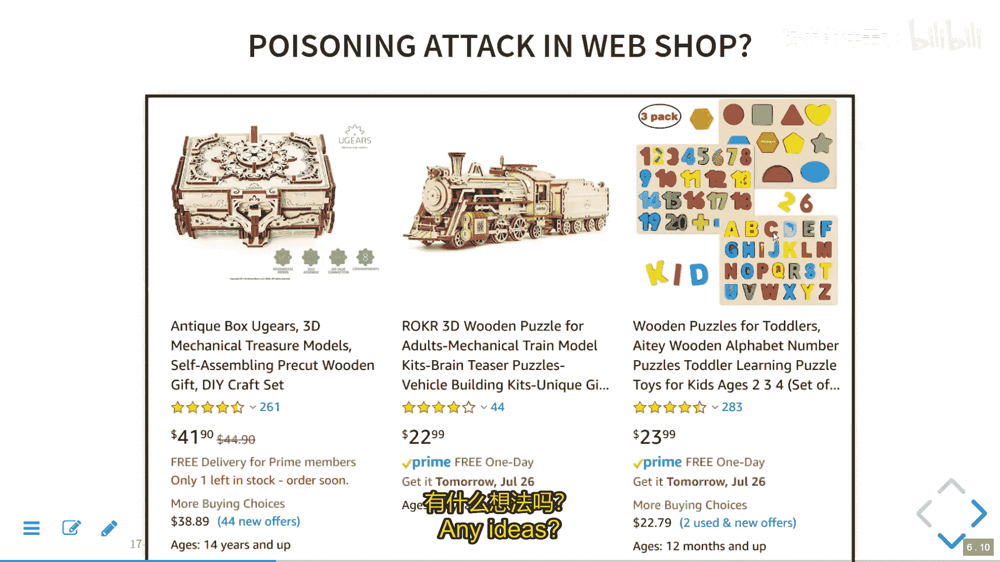

在电商产品推荐的场景中，撰写虚假好评或差评来人为提升或降低某个商品的排名，就是一种针对训练数据的投毒攻击。

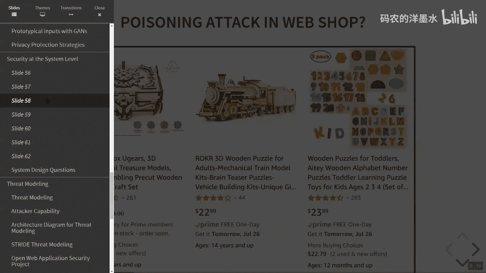

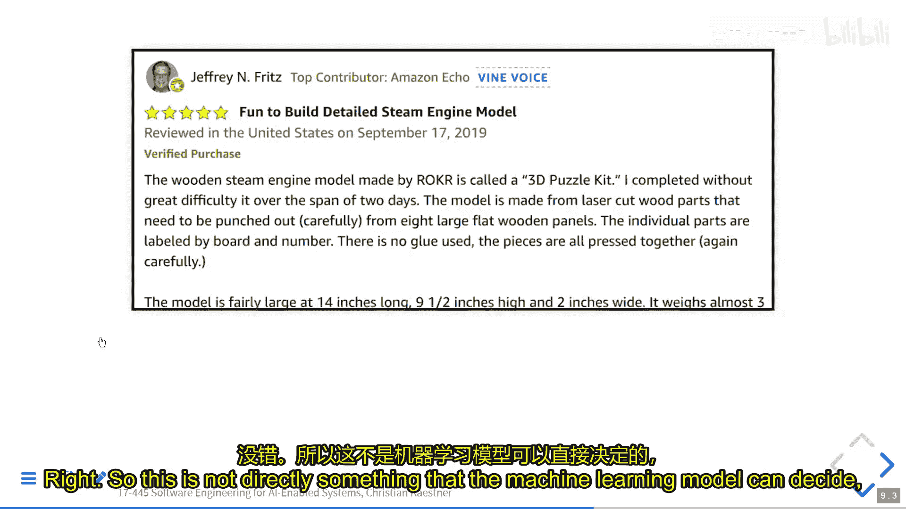

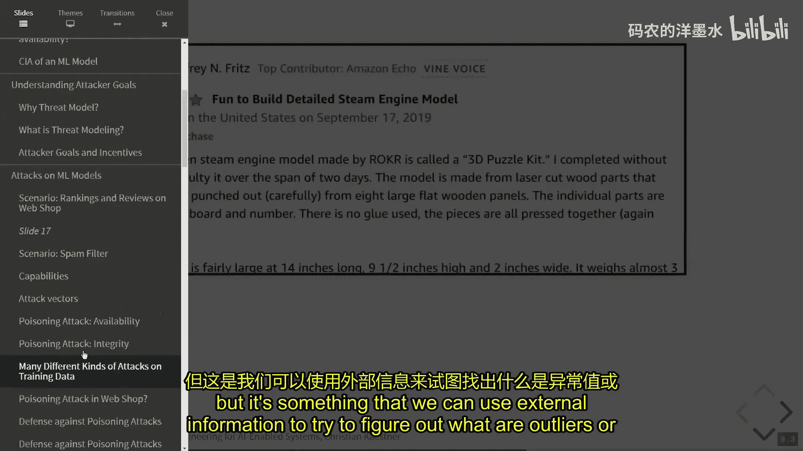

以下是防御投毒攻击的一些常见策略：

*   **异常检测与数据清洗**：识别并移除训练数据中的异常值或可疑样本。
*   **数据源可信度评估**：例如，电商网站更信任“已验证购买”用户的评论，或根据用户历史行为评估其信誉。
*   **监控模型质量**：持续监控模型上线后的性能指标，异常下降可能预示着攻击。
*   **使用对噪声鲁棒的模型**：某些机器学习算法对训练数据中的噪声不那么敏感。

### 规避攻击

与投毒攻击不同，规避攻击发生在模型部署后的推理阶段。攻击者精心构造输入样本，使训练好的模型对其做出错误分类，而模型本身和训练数据并未被修改。

一个著名的例子是对图像分类器的攻击。通过对一张“熊猫”图片添加人眼难以察觉的微小扰动，可以使模型将其高置信度地识别为“鸵鸟”。在垃圾邮件过滤场景中，攻击者会修改邮件内容，例如使用同义词替换敏感词、添加无关的正常文本，以使垃圾邮件绕过过滤器。

从形式上看，规避攻击是寻找一个最小的扰动 `z`，使得模型 `F` 对原始输入 `x` 和扰动后输入 `x+z` 的预测结果不同：
`F(x) ≠ F(x+z)`

攻击者如果了解模型内部参数，可以利用梯度信息高效地找到这种扰动。即使模型是黑盒，攻击者也可以通过大量查询来训练一个替代模型，或利用模型输出的置信度分数进行搜索。

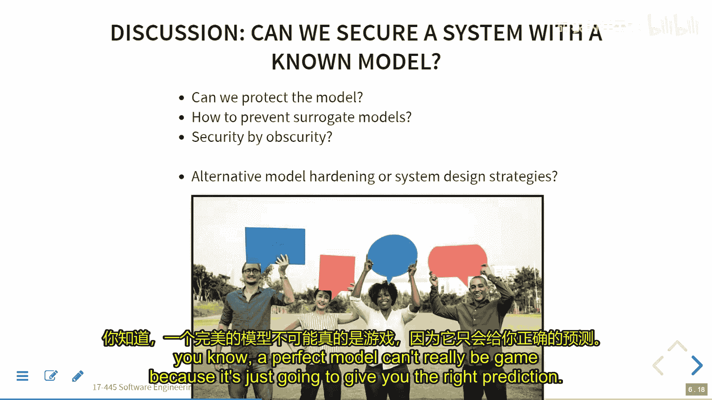

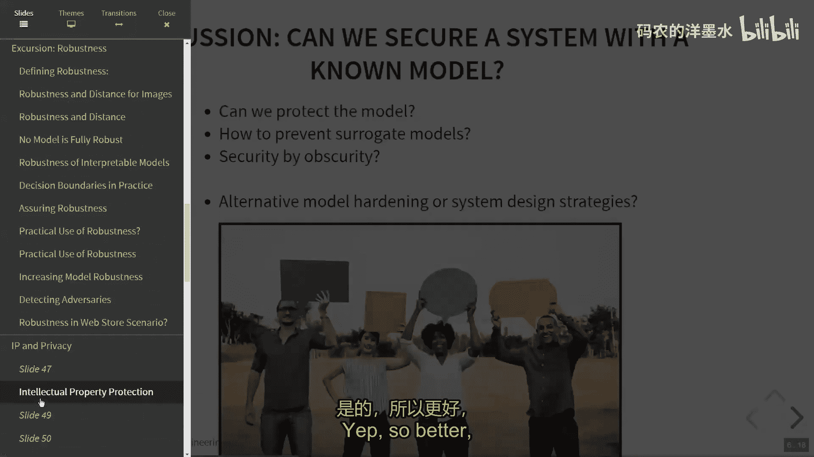

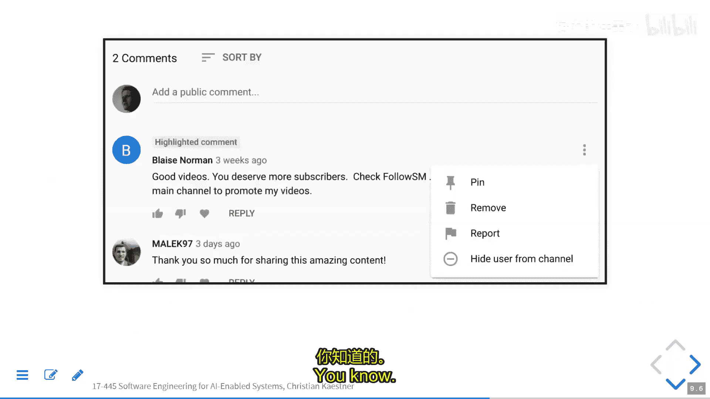

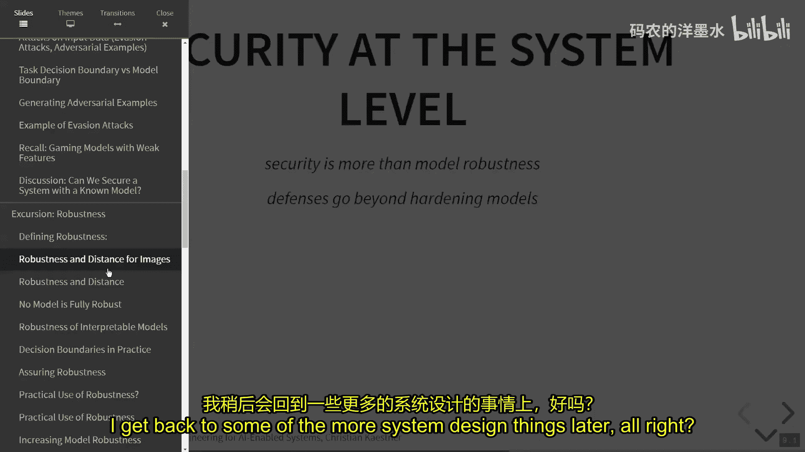

以下是防御规避攻击的一些思路：

*   **减少信息暴露**：不提供置信度分数，增加攻击者分析模型的难度。
*   **提高模型质量**：更好的模型其决策边界更接近真实的分类边界，被攻击的空间可能更小。
*   **增加攻击成本**：对API进行速率限制或收费，增加攻击者进行大量查询的成本。
*   **输入预处理**：对输入进行规整化或变换，消除可能的扰动。

## 模型的鲁棒性验证

上一节我们讨论了具体的攻击与防御，本节中我们来看看一个重要的研究领域：模型的鲁棒性验证。鲁棒性指的是模型对于输入的小范围扰动能够保持预测结果稳定的能力。

我们希望证明，对于某个输入 `x`，在其邻域 `N(x)` 内的所有点，模型的预测都与 `F(x)` 一致。这可以形式化地表示为对扰动的稳定性。

然而，除非模型对所有输入都给出相同预测（这是无用的），否则任何非平凡的模型都存在一些靠近决策边界的点，这些点不可能是完全鲁棒的。因此，鲁棒性通常是针对特定输入和特定扰动范围来讨论的。

目前主要有两种验证鲁棒性的方法：

1.  **形式化验证**：使用符号执行、抽象解释或约束求解等技术，数学上证明在定义的扰动范围内不存在对抗样本。这种方法能提供严格保证，但目前难以扩展到大型复杂模型，且计算开销大。
2.  **基于抽样的概率验证**：在输入邻域内进行大量随机采样，如果所有采样点的预测结果都与原始点一致，则可以以很高的置信度认为该点是鲁棒的。这种方法更易于实施，但提供的是概率性保证而非绝对证明。

在实践中，鲁棒性验证可以用于：
*   **高风险决策的实时防御**：例如，在自动驾驶中识别交通标志时，额外验证该识别的鲁棒性。
*   **模型测试与调试**：检查测试集或训练集中的样本是否鲁棒，并将找到的非鲁棒样本（对抗样本）加入训练集，以增强模型。

## 系统级安全设计

仅仅关注模型层面的鲁棒性是远远不够的。安全是一个系统级属性，需要从整体架构进行设计。威胁建模是一种由微软推广的流行方法，用于系统化地识别和缓解安全威胁。

威胁建模的步骤通常包括：
1.  **绘制系统架构图**：包括所有组件、数据流和外部交互方。
2.  **识别信任边界**：明确系统内不同部分之间的信任关系。
3.  **系统化分析威胁**：沿着每个数据流和交互点，使用结构化清单（如STRIDE模型）寻找潜在威胁。

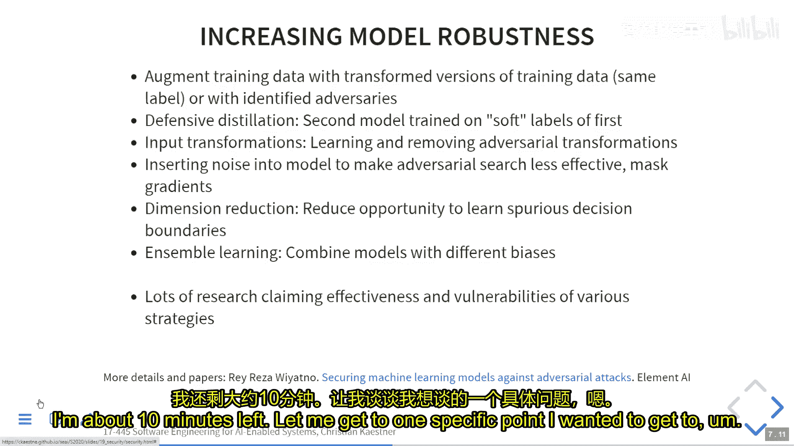

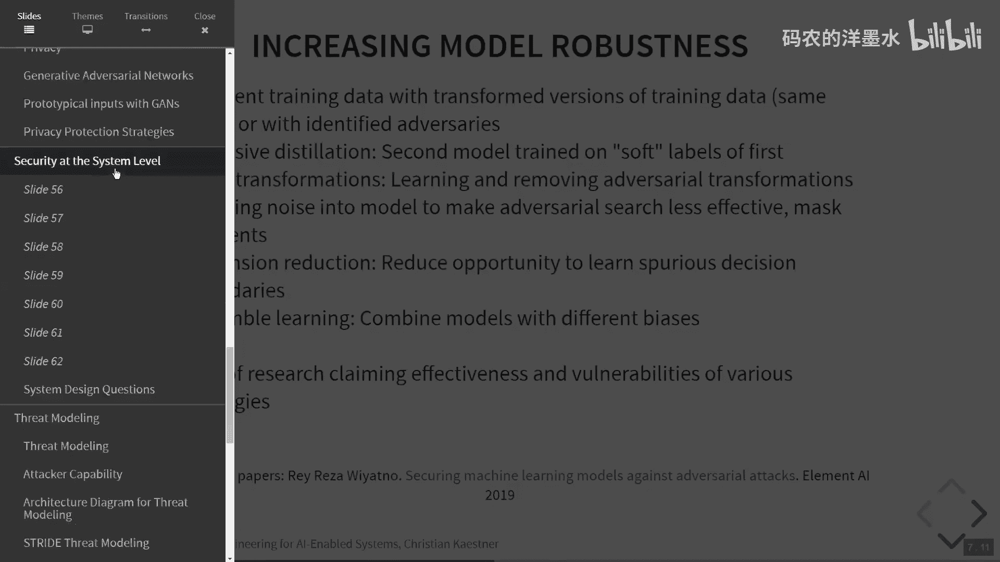

STRIDE模型从六个方面考虑威胁：
*   **假冒**：冒充他人身份。
*   **篡改**：恶意修改数据或代码。
*   **抵赖**：否认执行过的操作。
*   **信息泄露**：机密信息被未授权访问。
*   **拒绝服务**：使系统无法提供正常服务。
*   **权限提升**：获取未授权的访问权限。

对于包含机器学习组件的系统，需要在威胁建模中额外考虑：
*   谁可以影响训练数据（投毒攻击）？
*   谁可以访问或操纵模型的预测输入（规避攻击）？
*   模型的预测结果如何被反馈并影响后续训练（数据闭环中的攻击）？

除了威胁建模，还可以通过系统设计来提升安全性：
*   **增加攻击成本**：例如，实施“已验证购买”机制，提高刷评成本；对API进行速率限制和收费。
*   **降低攻击收益**：例如，对可疑内容进行标记或限流，而非直接删除，减少攻击的可见影响。
*   **建立信任体系**：例如，像Stack Overflow那样，通过社区投票和声望系统来识别可信用户和内容。
*   **实施最小权限原则**：每个组件只拥有其完成功能所必需的最小权限。

## 总结

本节课中我们一起学习了AI驱动系统中的安全与防护。我们首先回顾了机密性、完整性和可用性这三个核心安全目标。然后，我们深入探讨了针对机器学习模型的两种主要攻击：通过污染训练数据发起的**投毒攻击**，以及在推理阶段精心构造输入以欺骗模型的**规避攻击**。

我们了解到，仅靠模型层面的防御（如追求鲁棒性验证）往往不足，安全必须是一个系统级的考量。**威胁建模**是一种有效的结构化方法，能帮助我们在系统设计阶段就识别潜在风险。最后，我们认识到，通过聪明的系统设计（如增加攻击成本、建立信任体系）可以构建起更加强大的整体防御。

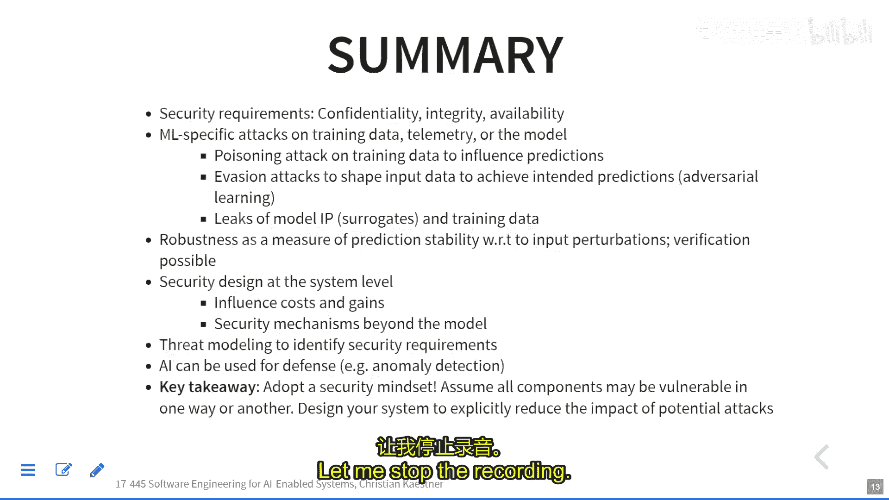

记住，安全是一个持续的过程，而非一劳永逸的状态。在设计、开发和运维AI系统时，必须始终将安全思维贯穿其中。