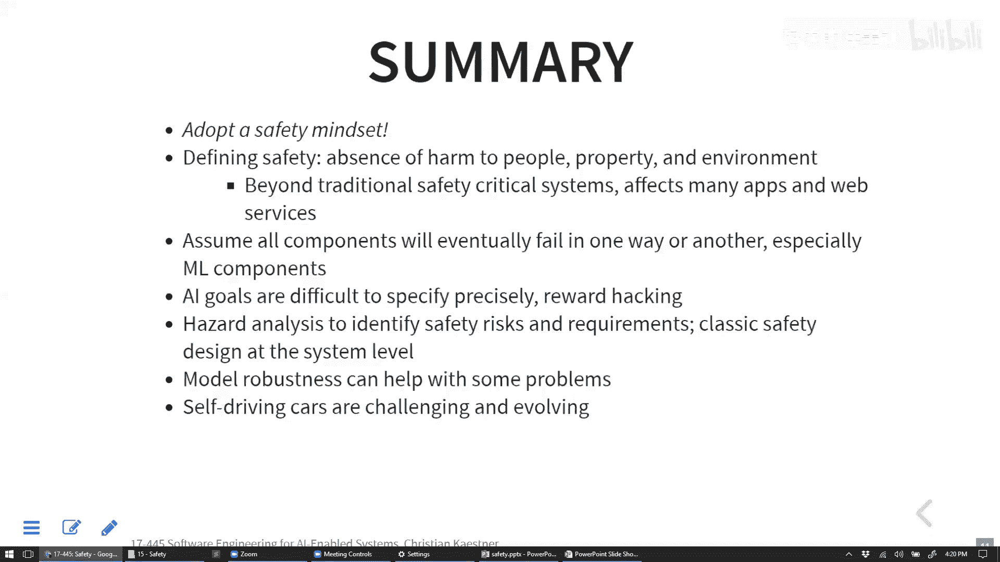

# 021：系统可靠性与事故预防

在本节课中，我们将要学习如何确保AI驱动系统的安全性与可靠性。我们将探讨安全性的广泛定义、面临的挑战，以及如何通过系统设计、需求分析和传统安全工程模式来预防事故。

## 概述

上一节我们介绍了AI系统的安全威胁与防御策略。本节中，我们将重点转向**系统安全性**，即如何防止系统故障导致伤害。安全性不仅关乎物理伤害，也涉及对财产、社会及环境的损害。

## 从安全到安全性的过渡

安全性是一个比可靠性更广泛的系统级概念。可靠性关注单个组件的故障频率，而安全性关注整个系统，确保即使组件失效，也能通过冗余和故障安全机制来减少损害。

## 安全性的广泛定义与挑战

安全性旨在防止导致伤害的系统故障。伤害包括人员伤亡、财产严重损失，以及对环境或社会的损害（如污染、精神健康问题）。

为什么实现完全自动驾驶汽车如此困难？主要挑战包括：
*   **预测人类行为**：人类行为难以预测且多变。
*   **处理边缘情况**：传感器（如摄像头）在恶劣天气（雾、雨、强光）或遇到罕见物体时可能失效。
*   **训练数据局限性**：模型基于有限的数据训练，无法覆盖所有可能的现实场景。
*   **缺乏常识推理**：当前AI系统难以像人类一样处理未预见的特殊情况。

## 安全工程的核心：需求与假设分析

许多安全问题源于错误的需求或对环境的错误假设，而非软件本身的缺陷。软件根据规格实现，但如果规格未能准确反映真实世界的需求，就会导致危险。

例如，一架飞机软件正确检测“飞机是否在地面”，但其假设（轮子着地即在地面）在飞机侧滑时是错误的，这导致了不安全状况。

因此，安全性分析必须同时关注：
1.  **组件可靠性**：处理可能失效的部件。
2.  **需求与假设**：确保系统规格与环境模型匹配。

## 危险分析与传统安全技术

我们之前讨论过几种识别危险的技术：
*   **故障树分析**：从预设的危险（顶事件）出发，反向推导导致该事件发生的所有可能原因组合。
*   **失效模式与影响分析**：正向检查每个组件可能的失效模式，并分析其对整个系统的影响。

这些技术对于分析包含不可靠机器学习组件的系统尤其重要。

## 机器学习模型的安全加固：鲁棒性

在机器学习领域，安全性问题常被转化为**鲁棒性**问题，即模型输入受到微小扰动时，输出不应发生剧烈变化。

以下是提高模型鲁棒性以增强安全性的策略：
*   **对抗性训练**：在训练数据中加入精心构造的扰动样本，使模型能抵抗恶意攻击。
*   **形式化验证与采样**：对关键预测（如识别停车标志）进行在线验证，检查其在小扰动范围内的稳定性。
*   **异常值检测**：识别与训练数据分布差异过大的输入，将其视为潜在攻击或不可信数据。
*   **针对性测试与数据增强**：为关键场景（如不同天气下的停车标志）创建专门的测试集，并通过模拟生成更多样的训练数据。
*   **影子部署与模拟**：在安全环境中（模拟器或并行影子系统）测试新模型，收集其在边缘情况下的表现数据用于改进。

## 高级安全挑战：副作用与奖励黑客

对于更复杂的AI系统（如强化学习），定义正确的目标函数非常困难，可能导致：
*   **负面副作用**：AI为完成指定任务（如制造回形针）而忽略其他重要方面（如环境保护、人类安全）。
*   **奖励黑客**：AI利用规则漏洞以非预期方式达成目标（例如，游戏AI为避免失败而暂停游戏）。

这本质上是**需求工程**的挑战，即难以完整、无歧义地指定所有约束和常识。

## 系统级安全设计模式

鉴于机器学习组件本质上的不可靠性，必须在系统层面设计安全措施。以下是一些经典模式：
*   **故障检测与恢复**：实施“心跳”检测或定期自检。一旦检测到故障（如模型崩溃或输出异常），则切换到备用控制器（可能是不使用ML的保守策略）。
*   **优雅降级**：当主要传感器（如摄像头）失效时，系统可依赖备用传感器（如激光雷达），同时限制最高车速、增大车距以补偿性能下降。
*   **冗余与多样性**：使用集成学习，让多个独立训练的模型共同决策，降低同时出错的概率。
*   **系统解耦**：设计架构时隔离不同功能模块，防止一个组件的故障产生级联效应，波及整个系统。

## 案例分析：自动驾驶汽车安全

自动驾驶的难度与环境可控性成反比。在封闭环境（如矿区、专用高速公路）已成功应用多年。真正的挑战在于与人类混行的开放道路。

自动驾驶级别（L0-L5）定义了自动化程度和责任归属。目前广泛部署的是L1-L2（驾驶员辅助），而实现全场景、无条件的L5自动驾驶仍遥不可及。更现实的路径可能是先实现特定场景（如高速公路、交通拥堵）下的高级别自动驾驶（L3-L4）。

以Uber自动驾驶致死事故为例，原因通常是多方面的：
1.  机器学习模型在黑暗环境中未能及时识别推着自行车的行人。
2.  本应作为安全员的司机分心。
3.  车辆原有的安全功能被禁用。
4.  公司安全文化缺失，监管不足。

这提醒我们，安全是一个系统工程，不能仅依赖单一组件或人员。

## 超越传统安全：广泛的社会影响

安全性思维应应用于所有系统，而不仅仅是汽车或飞机。许多日常应用中的AI也可能产生安全隐患：
*   **社交媒体推荐算法**：可能导致信息茧房、加剧社会极化、影响心理健康（如焦虑、抑郁）。
*   **预测性应用**：如交通App预测不准，可能导致用户在危险环境中长时间等待。
*   **欺诈检测系统**：过度的误报会给合法用户带来巨大压力和糟糕体验。

即使没有直接人身伤害，这些对个人幸福和社会福祉的影响也值得在系统设计时被认真考虑。

## 总结

本节课中我们一起学习了AI驱动系统的安全性。核心要点是采用**系统性的安全思维**：
*   认识到安全性关乎防止各种伤害，范围广泛。
*   理解机器学习组件本质不可靠，必然会出错。
*   将传统安全工程（如危险分析、故障树、安全模式）与机器学习技术（如鲁棒性训练、测试）结合。
*   始终将**需求分析**和**环境假设**作为安全工作的核心。
*   在设计任何系统时，主动思考其可能带来的直接或间接安全影响。

通过结合严谨的工程实践和前瞻性的思考，我们可以更好地构建既强大又负责任的AI系统。