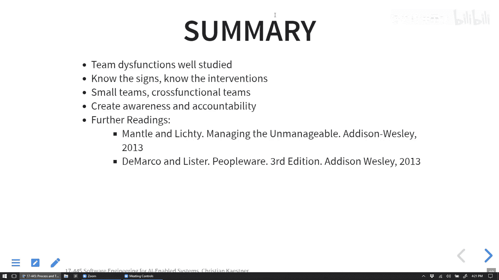

# 022：跨学科团队的培养与协作

在本节课中，我们将探讨在构建AI驱动系统时，如何组建和协调跨学科团队。我们将分析团队中不同角色（如数据科学家、软件工程师、领域专家等）的特点、潜在冲突，并讨论有效的团队结构和协作策略。

## 概述：为何需要跨学科团队

上一节我们讨论了系统安全，本节我们来看看构建复杂AI系统时的人员组织问题。以设想中的TikTok“抑郁检测”功能为例，该项目需要自然语言处理、软件工程、心理健康、法律合规等多方面的专业知识。这清楚地表明，单一领域的专家无法独立完成此类项目，我们必须组建跨学科团队。

然而，组建团队并非简单地将人聚集在一起。团队规模、结构、目标冲突和群体思维等问题都可能影响项目成败。接下来，我们将逐一分析这些挑战及其应对策略。

## 团队角色与专业分工

首先，我们需要理解团队中可能存在的各种角色。传统的“数据科学家”与“软件工程师”的二分法过于简化，实际分工要细致得多。

以下是数据科学领域内的一些常见角色分工：
*   **研究科学家**：专注于从数据中发现关联和洞察，可能使用基础的线性回归等方法。
*   **应用科学家**：不仅对数据感兴趣，更致力于将发现应用于解决具体问题。
*   **数据科学家**：更深入地参与建模和数据分析工作。
*   **数据工程师**：更接近软件工程侧，专注于数据的获取、处理和管道构建。

同样，软件工程师内部也有前端、后端、基础设施、测试、DevOps、架构师等不同专长。

此外，一个完整的产品团队还需要其他角色，例如：
*   产品经理与业务分析师
*   用户体验（UX/UI）设计师
*   法务与合规专员
*   领域专家（如本案例中的心理健康专业人士）
*   伦理顾问

期望找到同时精通所有领域的“独角兽”人才是不现实的。因此，更可行的策略是组建一个由“T型人才”构成的团队，即每个成员在某一领域有深度专长，同时对其他相关领域有足够的了解以便沟通协作。

## 团队规模与结构挑战

当团队规模增长时，沟通和协调成本会急剧上升。布鲁克斯法则指出：向进度落后的项目中增加人手，只会使项目更加落后。

这主要是因为：
1.  **沟通链路呈二次方增长**：n个人的团队，潜在的沟通链路数量是 n*(n-1)/2。
2.  **新人培训与融入成本**：在项目后期加入，需要大量时间了解项目上下文。
3.  **工作难以完全并行**：某些核心模块的修改可能无法由多人同时进行。

因此，常见的做法是将大团队拆分为多个小团队（通常5-10人），并设立协调角色或架构来管理团队间的接口。这引出了康威定律：**系统的设计架构会反映组织的沟通结构**。

一个糟糕的结构是让两个团队负责同一个模块，这会导致高昂的协调成本。理想的结构是让一个团队独立负责一个或多个具有清晰接口的模块（或微服务），从而实现团队结构与软件架构的匹配。

以TikTok抑郁检测项目为例，一个可能的团队结构划分是：
*   **数据获取与标注团队**：负责收集、清洗和标注历史数据。
*   **模型研发团队**：负责构建和训练抑郁检测模型。
*   **基础设施与平台团队**：提供计算资源、MLOps工具支持。
*   **产品集成与前端团队**：将检测功能集成到TikTok主产品中，设计用户界面和干预措施。

## 目标冲突与协调机制

不同角色的团队成员可能拥有相互冲突的目标。例如：
*   **数据科学家 vs. 软件工程师**：前者可能追求极致的模型准确率，而后者更关注系统运行效率、可维护性和部署成本。
*   **数据科学家 vs. 法务专员**：前者希望获取更多数据以提升模型，后者则关注用户隐私和数据合规风险。
*   **业务团队 vs. 技术团队**：业务方可能追求快速上线和营销亮点，而技术方更注重方案的稳健性和科学性。

如果这些角色被分隔在不同的团队或部门，协调冲突将更加困难。

如何缓解目标冲突？我们可以从DevOps实践中汲取经验。以下是几种策略：
*   **建立共同的组织目标与愿景**：让所有成员为同一个高层次目标努力。
*   **培养“T型人才”**：鼓励成员理解彼此领域的关切和词汇。
*   **调整团队组织结构**：
    *   **矩阵型组织**：员工属于专业部门（如机器学习部、软件开发部），同时被分配到项目组。优点是专业交流深入，缺点是有“两个老板”，优先级可能冲突。
    *   **项目型组织**：员工完全归属于项目组。优点是目标一致，专注度高；缺点是项目结束后需要重新分配，且难以共享稀缺的专业资源。
    *   **混合型组织**：在团队中配备主要专家，同时设立中心化的专家小组提供咨询和支持。这是目前许多公司在安全、ML等领域倾向采用的模式。
*   **采用敏捷实践**：站会、迭代计划会、产品负责人（Product Owner）决策等机制，有助于同步信息、明确优先级和调解冲突。

## 群体思维及其应对

群体思维是指团队成员为追求和谐一致，而不愿提出异议或探索替代方案，从而导致决策失误的现象。

在软件项目中，群体思维可能表现为：
*   盲目跟随技术潮流（如“我们必须用深度学习”），而不评估是否适合。
*   在估算会议中，第一个人给出的数字影响了后续所有人的判断。
*   在代码审查中，因为作者是资深员工而不敢提出质疑。
*   在TikTok案例中，可能表现为：对“抑郁”的定义过于狭隘、仅采用团队熟悉的情绪分析技术、或全盘接受管理层提出的干预方案而不加论证。

如何避免群体思维？以下是一些方法：
*   **提升团队多样性**：包括背景、性别、文化、专业领域的多样性。
*   **营造开放冲突的文化**：鼓励建设性的辩论，将提出反对意见视为对团队的贡献。
*   **使用特定技巧**：例如，在会议中让领导者最后发言；指定“魔鬼代言人”角色；要求至少提出两种备选方案。
*   **借助敏捷实践**：例如“计划扑克”，让成员独立给出估算后再同时亮出，避免相互影响。

## 社会惰化与激励

社会惰化是指个体在团队中付出比单独工作时更少努力的倾向。原因包括责任分散、个人贡献难以被识别等。

应对社会惰化的措施包括：
*   **保持小团队规模**。
*   **将工作分解为小而明确的任务**，并在看板或迭代任务板上可视化。
*   **通过站会等方式让个人贡献可见**。
*   **提供有效的激励**：对于知识型工作者，金钱奖励（如奖金）在基本需求满足后效用递减，甚至可能损害内在动机。更有效的驱动因素是**自主性**（给予选择权）、**专精**（追求 mastery）和**使命感**（工作的意义）。

## 总结

本节课中，我们一起学习了构建AI驱动系统时跨学科团队面临的挑战与协作策略。我们认识到，成功不仅依赖于技术，更依赖于人的有效组织。我们需要理解不同角色的专长与目标，设计合理的团队规模与结构（遵循康威定律），并积极管理目标冲突、避免群体思维和社会惰化。通过培养T型人才、采用敏捷实践、营造开放协作的文化，我们可以将多元化的专业知识凝聚起来，共同构建负责任且强大的AI系统。