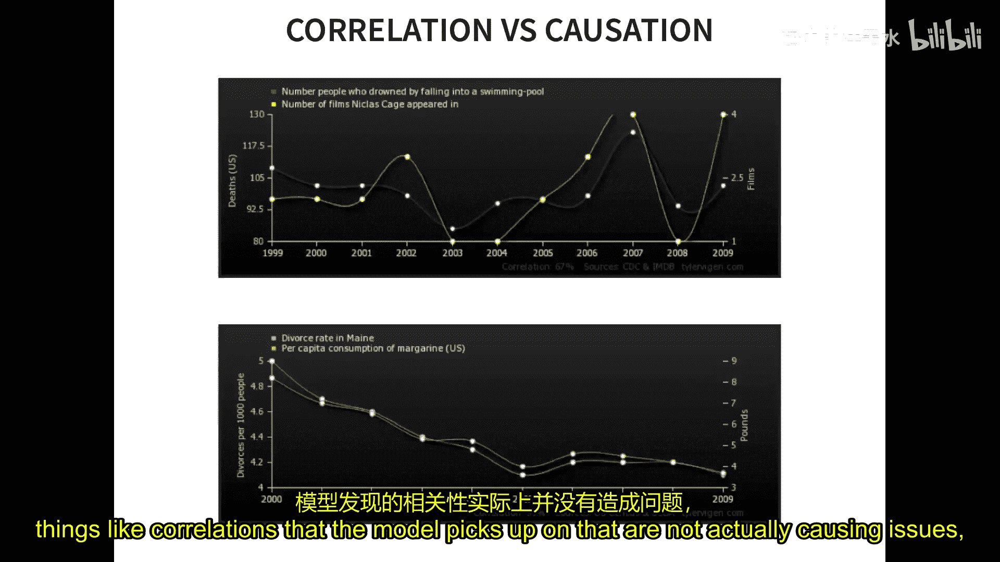
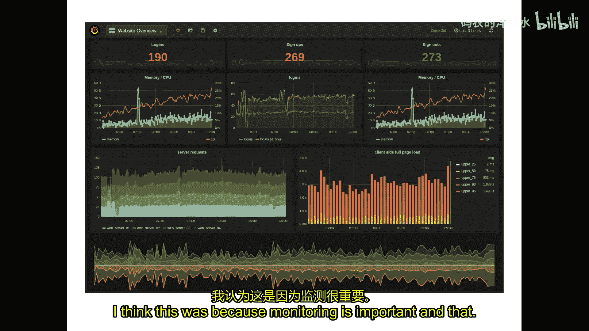
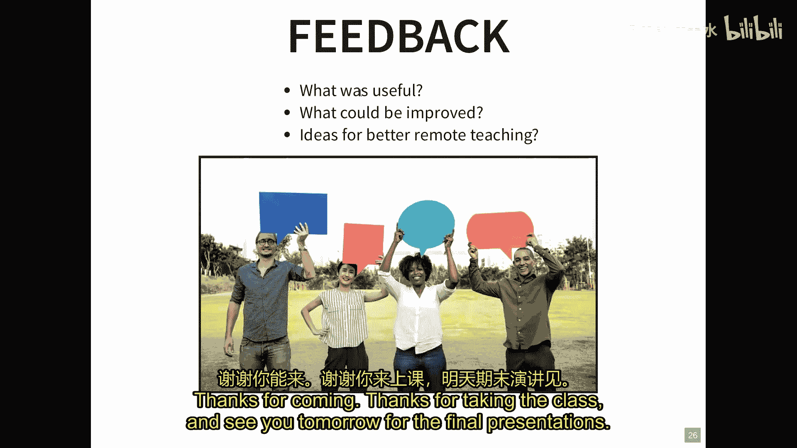

# 023：总结与反思 🎓

在本节课中，我们将回顾整个学期所学的核心内容，并共同探讨AI驱动系统软件工程领域的未来挑战与发展方向。

## 课程回顾 📚

上一节我们讨论了跨学科团队的结构与管理。本节中，我们将快速浏览整个学期的知识框架，将各个部分串联起来，看看我们共同学习了哪些内容。

### 学期内容概览

我们以介绍课程和对比数据科学家与软件工程师的角色开始。我们讨论了构建一个AI驱动系统远不止是训练一个机器学习模型，还需要考虑整个产品、各种质量属性和系统层面的问题。

以下是本学期涵盖的主要模块：

*   **机器学习与人工智能基础**：我们定义了机器学习，探讨了线性回归、决策树、神经网络等模型，以及过拟合、欠拟合、训练/验证集划分等核心概念。
*   **模型质量与评估**：我们区分了机器学习视角（如准确率、召回率、精确度）和软件工程视角（如测试预言问题、验证数据管理）。核心观点是：**机器学习更类似于传统软件工程中的需求分析**，即 `学习正确模型` 而非 `验证实现是否符合规格说明`。
*   **系统思维与目标设定**：我们探讨了如何将模型集成到更大的系统中，思考用户界面设计、业务流程和风险。我们引入了**AI画布**框架来思考业务用例、数据、预测成本与价值。
*   **模型选择与质量权衡**：我们强调**准确率并非唯一标准**。模型的可解释性、鲁棒性、公平性、大小等属性同样重要，需要在具体场景中进行权衡分析。
*   **风险与安全设计**：我们将机器学习模型视为**不可靠的组件**，会随机犯错。因此，系统设计必须考虑容错，采用防护栏、冗余、人在回路等策略。我们介绍了如FMEA等风险分析技术。
*   **软件架构**：我们以增强现实翻译等案例，探讨了模型部署位置（边缘 vs. 云端）的架构决策及其在延迟、更新、数据隐私等方面的权衡。
*   **生产环境的质量保障**：我们深入讨论了监控、遥测数据收集、A/B测试、影子发布和金丝雀发布等技术，以在真实环境中评估和改进模型。
*   **数据质量与数据编程**：我们讨论了数据质量的多个维度（如准确性、一致性），以及如何应对数据漂移和模型衰减。工具如Snorkel可用于通过弱监督生成标签函数。
*   **大规模数据处理基础设施**：我们对比了批处理与流处理模式，探讨了事件溯源、Lambda架构和数据湖等概念，以管理海量数据。
*   **基础设施质量与自动化**：我们讨论了测试AI系统基础设施（如数据管道）的传统软件工程方法，以及DevOps和MLOps如何实现高度自动化。
*   **公平性与伦理**：我们区分了伦理与法律，讨论了分配性伤害和代表性伤害，并探讨了多种公平性定义（如反分类、分类均等），强调这是一个**需求工程挑战**。
*   **可解释性与可说明性**：我们探讨了为何需要解释模型决策（如调试、建立信任、满足法规），并介绍了一系列技术（如LIME、反事实解释）。
*   **版本控制与可复现性**：我们讨论了模型、数据和流水线的版本管理重要性，以及确保实验可复现所面临的挑战（如非确定性）。
*   **安全、隐私与对抗性机器学习**：我们研究了投毒攻击和逃避攻击，讨论了鲁棒性验证、隐私保护技术（如差分隐私），并强调需要在**系统层面**（如威胁建模）而不仅仅是模型层面考虑安全。
*   **团队协作**：最后，我们探讨了在跨学科团队（数据科学家、软件工程师等）中有效协作的模式、组织结构和挑战。

## 未来挑战与讨论 💭

回顾了整个课程的知识体系后，我们现在来看看这个领域可能的发展方向以及面临的开放挑战。

### 主要挑战在哪里？

从软件工程的角度看，构建实际AI系统的主要挑战、工具缺口和研究缺口有哪些？

以下是课堂讨论中提出的一些观点：

*   **质量评估的领域特异性与通用化**：衡量质量非常困难且高度依赖领域。未来可能需要开发能适应不同常见领域（如推荐系统）的通用化工具和方法。
*   **需求工程的重要性**：在项目初期，像公平性、鲁棒性这样的非功能性需求常常被忽视。机器学习项目的需求工程和管理实践需要显著演进和更多研究关注。
*   **可解释性的核心作用**：可解释性似乎是一个枢纽，它能促进公平性审查、安全性评估，并帮助确保需求得到满足，其重要性将日益凸显。
*   **架构模式的缺失**：针对机器学习系统的、经过验证的架构模式仍然较少。例如，在边缘计算与云计算的权衡中，缺乏成熟的设计模式。
*   **跨学科沟通的鸿沟**：数据科学家和软件工程师（尤其是架构师）之间常常存在沟通障碍，缺乏共同语言来理解彼此的工件（如模型、组件）和关切。

### 软件2.0与自动化的未来

业界有“软件2.0”的讨论，即用数据和少量代码（如TensorFlow模型）替代大量传统逻辑代码。这是否意味着软件工程师会被取代？

讨论认为，**软件工程远不止是编写代码**，它包含了系统思考、权衡分析、架构设计、集成、确保非功能性需求等复杂活动。目前AI在这些方面尚未达到替代人类专家的水平。自动化（如AutoML）更可能的方向是**消除繁琐任务**，让数据科学家和软件工程师都能更专注于高价值的创造性工作。

### 赋能与专业化

工具（如MLOps框架）正在赋能数据科学家更独立地部署模型，同时也在让软件工程师更容易接触机器学习任务。未来的方向可能是：

*   **降低门槛**：让更多人能够构建AI应用，因为数据驱动决策已成为普遍需求。
*   **深化协作**：并非追求“全能型独角兽”，而是培养**T型人才**，并建立高效的跨学科团队。软件工程师和领域专家（如结构工程师在建筑中一样）的专业知识仍然至关重要。
*   **催生新角色**：如同过去系统工程师演化出应用工程师，AI与软件工程的融合也可能催生全新的工程角色。

## 总结 🏁

本节课中，我们一起回顾了“AI驱动系统的软件工程”这门课程的全部核心内容，从机器学习基础到系统集成，从质量保障到伦理安全。我们认识到，构建成功的AI系统需要**数据科学和软件工程的深度融合**。虽然自动化工具在不断进步，但人类在定义目标、理解上下文、进行复杂权衡和跨领域沟通方面的作用无可替代。未来的挑战在于改进工具、完善方法、加强教育，并最终培养出能够有效协作、负责任地构建AI系统的团队。