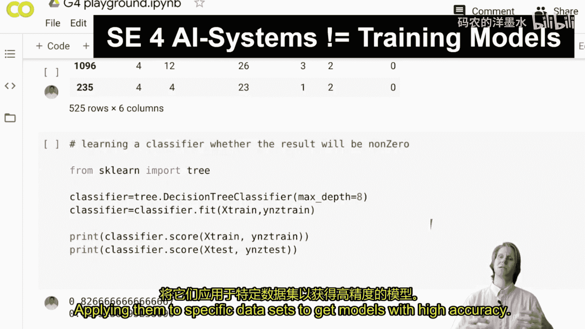
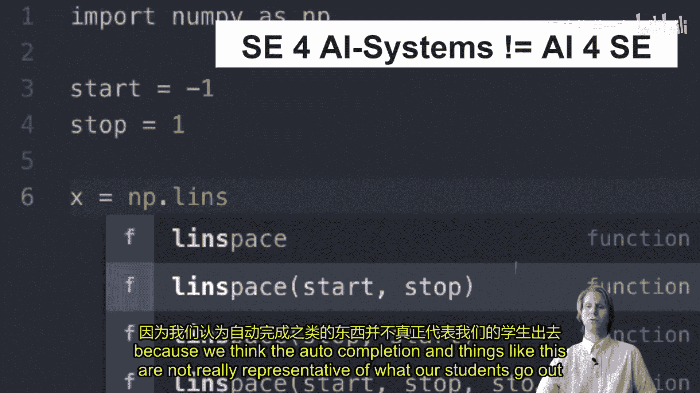
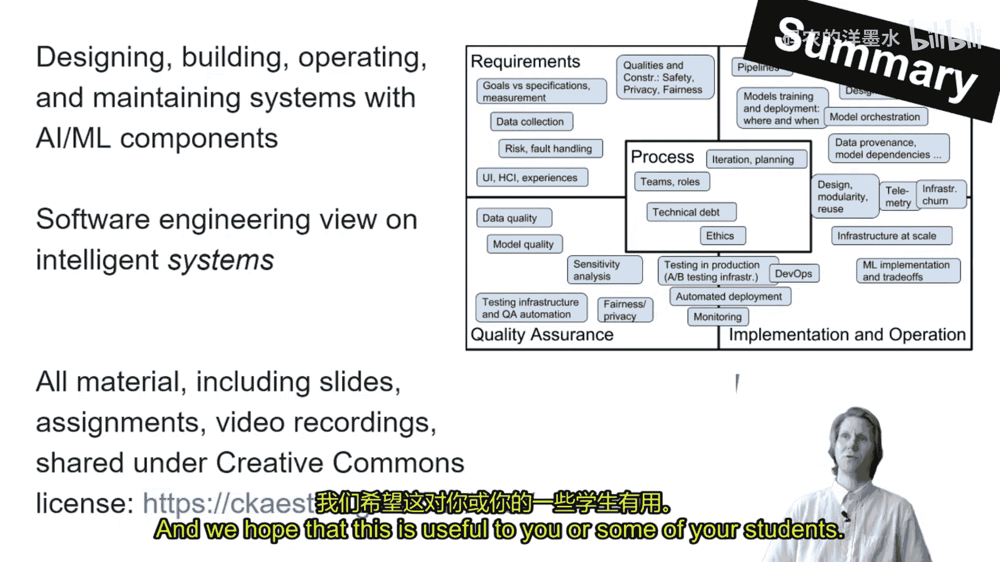

# 024：课程介绍与理念

在本节课中，我们将介绍一门由卡内基梅隆大学开设的课程——“面向AI驱动系统的软件工程”。我们将探讨这门课程的设计理念、目标以及它如何帮助学生构建包含机器学习组件的真实系统。

## 课程定位与目标 🎯

上一节我们介绍了课程背景，本节中我们来看看这门课程的具体定位。这门课程并非传统的机器学习课程。传统课程主要关注理解机器学习技术原理，或将其应用于特定数据集以获得高精度模型。我们的目标是**构建真实的系统**。

我们也不专注于软件工程在AI中的应用研究，例如本届会议上讨论的自动补全等技术。我们认为这些应用并不能完全代表学生未来将从事的工作。

## 核心应用场景 📱

以下是本课程关注的核心应用场景，它们都涉及将AI组件集成到更大的系统中：

*   **智能演示文稿工具**：例如PowerPoint中的“设计灵感”功能，它能自动布局幻灯片。PowerPoint本身远不止AI组件，AI只是其庞大系统中的一个部分。
*   **音频转录服务**：用户上传音频文件以获取文字转录。同样，机器学习是其中的核心组件，但仅构建这个组件无法成就一项业务。

为了构建此类业务，开发者必须考虑用户界面、系统扩展性（处理大量音频文件）、数据存储、错误处理以及支付系统等。所有这些都对应着**围绕AI组件构建的额外系统**。

## 所需技能与挑战 ⚙️

构建这类系统需要数据科学家和软件工程师的协作。数据科学家负责模型，软件工程师负责构建健壮的系统。

引入AI组件会带来许多独特挑战，例如需求规格不明确、反馈循环等。然而，软件工程师在构建此类系统时也能贡献巨大价值。例如，我们在构建基于不可靠组件的安全系统、进行风险分析、处理现实世界与机器接口之间的需求等方面拥有丰富经验。这些正是我们可以传授给学生，帮助他们在现实世界中构建此类系统的知识。

## 课程结构与教学理念 📚

本课程围绕传统的软件生命周期构建，重点探讨当引入机器学习组件后，需求分析、测试和架构设计将如何变化。

我们认为，这更多是一个**教育问题**，即深入思考并应用我们已有的技术，而非一个需要完全发明新技术的纯粹研究问题（尽管也存在部分研究内容）。教育是目前的主导部分。

## 实践环节：模拟真实世界 🎬

最后，我们简要介绍课程的实践环节。我们希望让学生摆脱仅使用Jupyter笔记本和静态数据集、只评估模型准确率的传统模式。

这体现在我们的作业设计中。我们构建了一个基础设施来模拟真实世界：一百万个模拟用户观看电影，学生需要提供一个推荐服务。通过这种方式，学生提供的推荐会实际影响模拟环境，从而让我们能够检测到反馈循环。学生还需要在“生产环境”中运行和维护系统，关注可用性，并以最短的停机时间更新系统等。我们通过这种方式，在构建真实系统方面创造了**现实感**。

## 总结与资源分享 🌐

本节课中我们一起学习了“面向AI驱动系统的软件工程”这门课程的核心理念。它专注于教授如何将机器学习组件集成到完整的、可用的软件系统中，强调软件工程原则在AI时代的重要性与实践。

如果你对此感兴趣，我们欢迎你查看我们的课程材料。我们在知识共享许可协议下分享了幻灯片、作业、基础设施代码和视频录像等资源，希望这些对你或你的学生有所帮助。