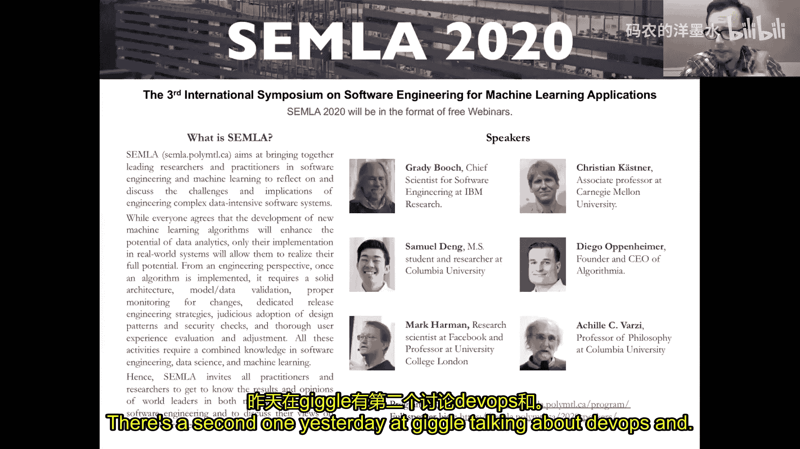
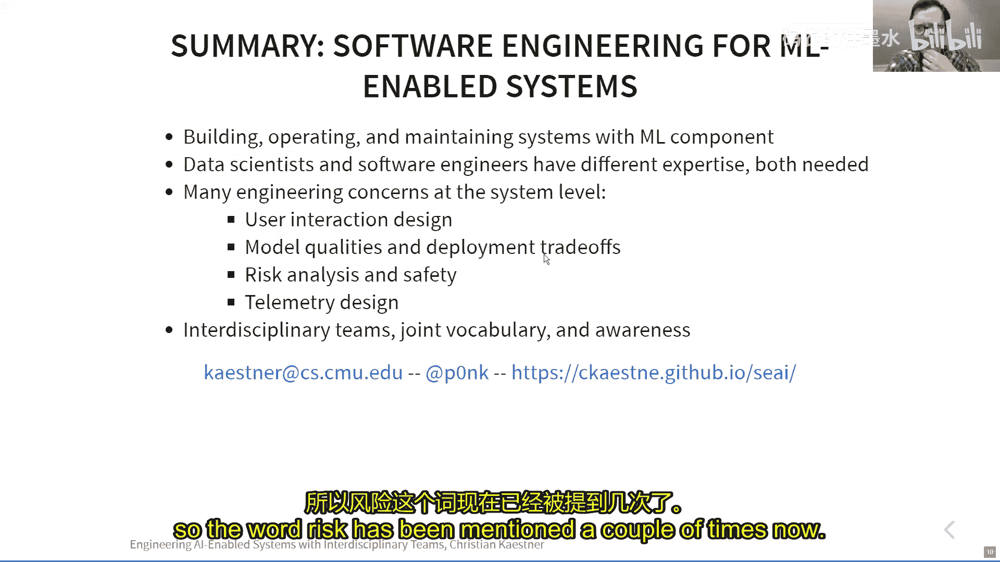

# 025：软件工程与机器学习的融合

在本节课中，我们将探讨如何将传统的软件工程实践与机器学习应用相结合，以构建可靠、可维护且安全的AI驱动系统。我们将分析软件工程师与数据科学家在团队中的不同角色与协作方式，并讨论在系统层面需要考虑的关键工程挑战。

---

## 概述：为何需要融合软件工程与机器学习？

在构建现代软件应用时，我们越来越多地引入机器学习（ML）或人工智能（AI）组件。一方面，软件工程领域拥有悠久的传统、成熟的流程和最佳实践，涵盖从需求开发到部署运维的完整生命周期。另一方面，机器学习领域不断取得突破性创新，这些技术有潜力深刻改变人们的生活。然而，当这些技术被集成到甚至安全关键系统中时，我们迫切需要将软件工程的最佳实践与机器学习开发结合起来。核心问题在于：如何实现这种结合？如何让来自不同背景的角色有效协作？本节课将深入探讨这一交叉领域。

## 软件工程师与数据科学家：不同的专长与思维模式

要成功构建包含AI组件的系统，我们需要理解团队中不同角色的背景和专长。本节中，我们将主要关注软件工程师和数据科学家这两种核心角色。

软件工程师所做的远不止编程。他们接受训练，在资源有限和信息不完整的情况下做出重要的工程决策和判断。他们需要权衡系统的多种质量属性（如性能、安全性、成本），并根据具体场景做出“视情况而定”的工程判断。这通常涉及处理现实世界的复杂性，并在预算内构建系统。

相比之下，多数的机器学习课程、讲座和博客文章往往更狭隘地专注于建模技术本身。数据科学家通常关注如何在给定数据集上构建具有最高准确率的模型，例如在Kaggle竞赛中常见的模式。他们的工作流程更具探索性和科学性，从一个模糊的目标开始，尝试解决一个甚至在一开始都不确定是否可行的问题。这是一个非常增量、迭代的过程。

**核心协作公式**：
`成功系统 = 软件工程师的系统思维与工程实践 + 数据科学家的建模专长与探索能力`

这两种专长都是必需的，并且通常是互补的。在实践中，寻找同时精通两者的“全能型人才”（或称“独角兽”）非常困难。因此，更可行的方式是组建拥有不同专长的团队，并让他们协同工作。

## AI驱动系统带来的新挑战

引入AI组件后，构建系统的方式发生了一些根本性变化。上一节我们介绍了不同角色的专长，本节我们来看看这些变化具体体现在哪些方面。

1.  **规格说明的缺失**：在传统软件中，我们根据规格说明来定义“正确性”和“缺陷”。但对于从数据中学习的机器学习组件（如转录服务、累犯预测），我们并没有明确的规格说明。我们能够接受模型在90%的情况下正确，而在10%的情况下出错，并以不同的准确率水平来衡量性能。
2.  **对环境与反馈循环的重视**：我们需要更多地考虑系统运行的环境以及可能产生的反馈循环。例如，YouTube的推荐算法曾过度推荐阴谋论视频，因为这能提高用户参与度，但却形成了一个使用户越陷越深的负面反馈循环。
3.  **组件的非单调效应与交互**：机器学习组件很难被当作独立的模块进行推理。在一个由多个ML组件组成的复杂系统（如车道辅助系统）中，改进一个组件可能会降低整个系统的性能，这使得系统级推理变得非常困难。
4.  **生产环境测试的必要性**：仅凭测试数据进行测试是远远不够的，某些风险必须在生产环境中才能暴露。例如，微软的Tay聊天机器人在与用户互动仅一天后就变得充满种族歧视言论。
5.  **数据管理的复杂性**：我们需要在更大规模上处理数据版本控制、数据溯源等问题，带来了新的挑战。

## 软件工程传统方法依然适用

尽管面临新挑战，但许多问题并非完全陌生。本节我们将探讨，现有的软件工程工具和方法经过调整后，如何能有效应对这些挑战。

*   **应对模糊需求**：即使没有ML，传统软件系统也常常面临模糊或不完整的规格说明。敏捷方法之所以流行，正是因为我们经常无法预先获得完整的需求，需要客户在看到产品后才知道他们真正想要什么。
*   **从不可靠组件构建安全系统**：我们早已掌握从不可靠的硬件或软件组件构建整体安全系统的技术（例如冗余设计、故障安全机制），这些经验可以直接借鉴。
*   **以“世界与机器”的视角看待环境**：需求工程中的经典观点（如Michael Jackson的“世界与机器”理论）强调软件与真实世界接口的重要性，这同样是思考机器学习系统环境的正确框架。
*   **处理特征交互**：在软件产品线或信息物理系统中，我们长期研究功能交互和组件间的影响，这超出了单元测试的范畴，强调系统测试的重要性。
*   **生产环境测试与实践**：混沌工程、A/B测试、持续部署、功能开关等技术，都是软件工程中用于在生产环境中测试和验证系统的成熟实践。

因此，虽然存在新的关注点，但很多挑战并非根本性的新问题。在笔者看来，这更多是一个**教育问题**而非纯粹的研究问题。我们需要更审慎地思考如何应用软件工程技术来构建机器学习应用，并根据新语境进行调整。

## 理解数据科学家的工作：以Notebook为例

为了有效协作，软件工程师需要理解数据科学家的工作方式和工具。一个典型的例子就是Jupyter Notebooks。从软件工程的视角看，Notebooks可能显得“糟糕”：全局状态、缺乏函数和抽象、没有测试、大量复制粘贴、文档匮乏、版本控制困难以及可能出现的乱序执行。

然而，如果理解数据科学的工作性质，这些设计选择就有其合理性。数据科学工作具有极强的探索性，Notebooks提供了快速反馈（类似REPL）、可视化支持以及增量计算的能力（无需重新运行整个管道，只需重新执行个别单元格），并且便于编辑和分享最终成果。

**核心观点**：在探索阶段，严格的文档和测试并非优先事项；Notebooks作为“文学编程”工具，在记录最终成果时更有意义。真正的痛点和研究机会在于如何**从Notebooks平滑过渡到生产系统**。目前的支持非常有限，代码离开Notebook后，数据科学家很难继续基于生产代码进行实验，导致两者脱节。

## 软件工程师的贡献：系统级思维与设计

软件工程师可以为AI驱动系统的构建带来至关重要的系统级思维。本节我们来看看几个关键的设计挑战。

**1. 用户体验与界面设计**
预测结果如何呈现给用户，存在多种不同的设计，适用于不同的场景。例如：
*   **Microsoft PowerPoint的设计灵感功能**：用户需要主动点击按钮，系统会展示几种设计预览供用户选择，用户可以采纳或撤销。这种设计是非侵入式的，允许用户控制。
*   **智能手表跌倒检测功能**：检测到跌倒后，系统可能会在自动呼叫救护车前提供30秒的取消窗口，并给出视听反馈。这种设计更具主动性，旨在采取自动化行动。
设计时需要权衡：功能的侵入性有多强？交互有多强制？处理错误是否容易？是否会导致通知疲劳？

**2. 超越准确率的系统质量权衡**
在生产系统中，除了模型准确率，许多其他质量属性同样重要：
*   训练和运行系统的成本
*   推理时间与延迟
*   能耗（对于边缘设备尤为重要）
*   训练所需的数据量和数据质量
*   可解释性、鲁棒性、安全性、隐私性、公平性
一个著名的例子是Netflix Prize竞赛：许多参赛方案的预测准确率远超Netflix原有算法，但Netflix最终没有采用任何一个，因为额外的工程复杂度和运行时成本无法证明其微小的准确率提升是合理的。

**3. 架构决策：模型部署于何处？**
以实时翻译应用为例，我们需要决定OCR和翻译模型是部署在本地手机、云端，还是混合架构中。这个决策直接影响对模型质量的要求：模型大小、能耗、更新频率、运行成本、延迟等。不同的模型可能支持构建截然不同的系统。

**4. 风险分析与安全保障**
软件工程中的需求工程专业知识，特别是风险分析技术（如危险分析、故障树分析、失效模式与影响分析），可以系统性地识别系统中可能出错的地方。对于机器学习组件，我们承认它们会犯错，关键是在系统层面设计保障措施。
*   **示例：智能烤面包机**：一个学习何时停止烘烤的模型可能偶尔烤焦面包（可接受），但绝不能引发火灾（不可接受）。解决方案不是在模型内追求完美，而是在系统层面添加**硬性约束**（如温度传感器阈值）或**独立的安全机制**（如图中的热熔断器），在过热时直接切断电源。

**5. 遥测设计**
这是AI驱动系统相较于传统软件的一大变化。我们需要设计从生产环境收集反馈的机制，以评估模型表现并获取改进数据。
*   **直接询问**：如Skype在部分通话后请求评分。
*   **“报告问题”按钮**：收集负面反馈。
*   **收集生产数据人工评估**：成本较高，可借助众包。
*   **延迟获取真实标签**：例如预测航班价格，几天后即可验证。
*   **巧妙的设计引导**：以转录服务**Otter.ai**为例。它提供了一个集成的编辑器，用户可以在其中修正转录文本。当用户进行修改时，系统就获得了精确的错误位置信息，可用于模型训练。为了鼓励用户使用这个编辑器（而非导出到Word），Otter.ai设计了音频与文本同步播放、点击文本跳转音频、高亮低置信度词汇等功能，提升了修正体验，从而自然地收集了高质量的遥测数据。

## 前进之路：借鉴DevOps模式的跨学科团队协作

如何让软件工程师和数据科学家有效协作？我们可以从DevOps运动中汲取灵感。DevOps解决了开发人员（Dev）和运维人员（Ops）之间因背景、目标和激励不同而产生的冲突。

**DevOps的成功要素**：
*   **共同责任**：对应用从构建到运行的全生命周期负责。
*   **共享词汇表**：增进相互理解。
*   **共享工具链**：开发者通过容器化等技术让部署更简单，同时也获得了更快的发布速度和反馈；运维人员则能提供更利于开发者的基础设施。

**构建AI驱动系统的类比**：
我们需要类似的跨学科团队，成员拥有不同专长但承担共同责任。我们不应抛弃Notebooks，但需要搭建桥梁和基础设施，帮助数据科学家：
*   思考生产环境中除准确率外的重要质量属性。
*   将Notebook中的探索平滑地过渡到生产部署。
*   利用生产数据和遥测反馈来持续改进模型。
同样，软件工程师需要增进对机器学习技术及其权衡的理解。

**核心协作模式**：
`跨学科团队 = 分离的专长 + 共同的责任 + 共享的词汇与工具 + 系统级思维意识`

## 总结

在本节课中，我们一起学习了构建AI驱动系统的核心思想。我们首先强调了焦点不应仅限于构建模型，而应扩展到构建、运营和维护包含机器学习组件的完整系统。我们分析了软件工程师与数据科学家各自不同的专业知识和思维模式，指出两者都是成功所必需的。

我们探讨了AI组件引入的新挑战，如规格缺失、反馈循环和系统级交互，但也指出许多传统软件工程方法经过调整后依然适用。通过理解数据科学家的工作流程（如Notebook的使用）和软件工程师带来的系统级设计思维（如用户体验权衡、多质量属性决策、风险分析、遥测设计），我们看到了两者协作的价值。

最后，我们借鉴DevOps的成功经验，提出了通过组建跨学科团队、建立共同责任、共享词汇和工具来融合两种专长的前进路径。未来的方向在于加强相关教育，并开发支持这种协作的流程与基础设施。