# 026：构建与维护机器学习系统

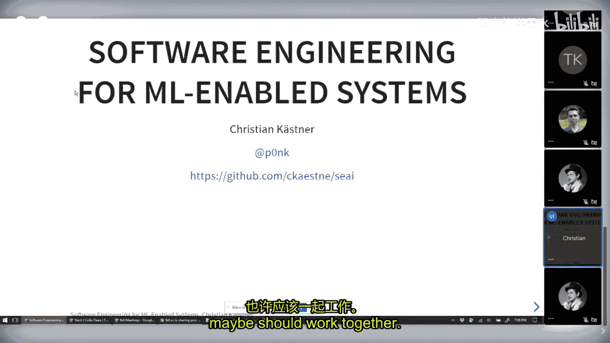

在本节课中，我们将学习如何构建、运营和维护包含机器学习组件的软件系统。我们将探讨数据科学家和软件工程师如何协作，并了解如何将传统的软件工程方法应用于机器学习驱动的系统。

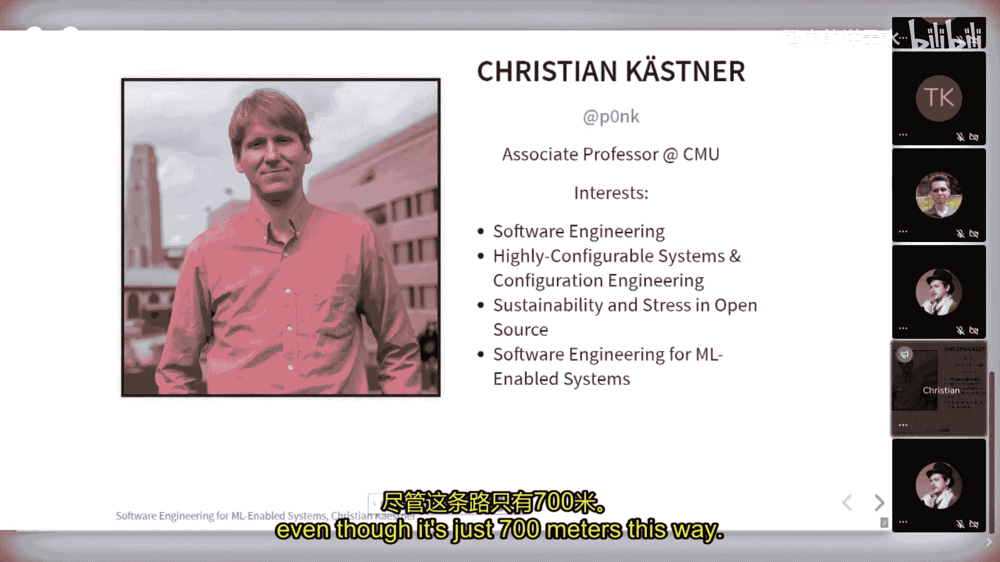

---

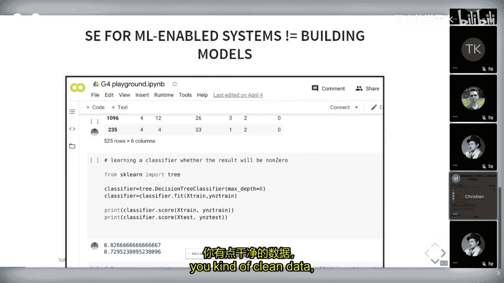

## 概述

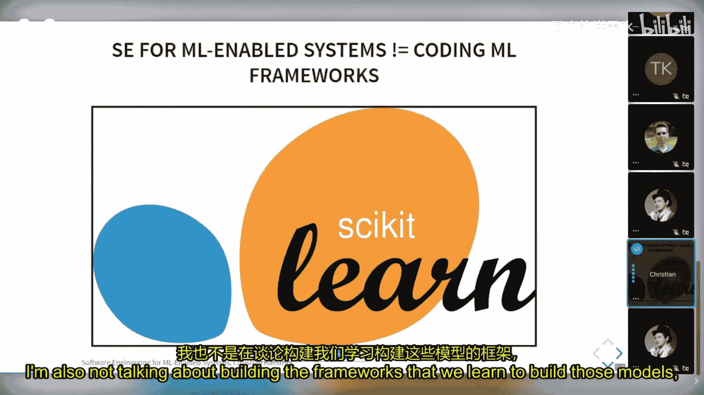

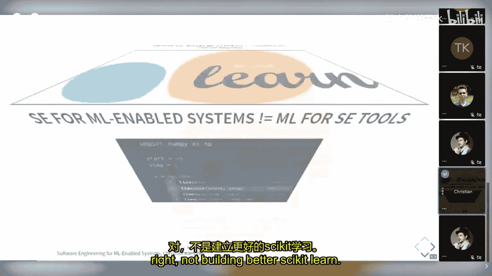

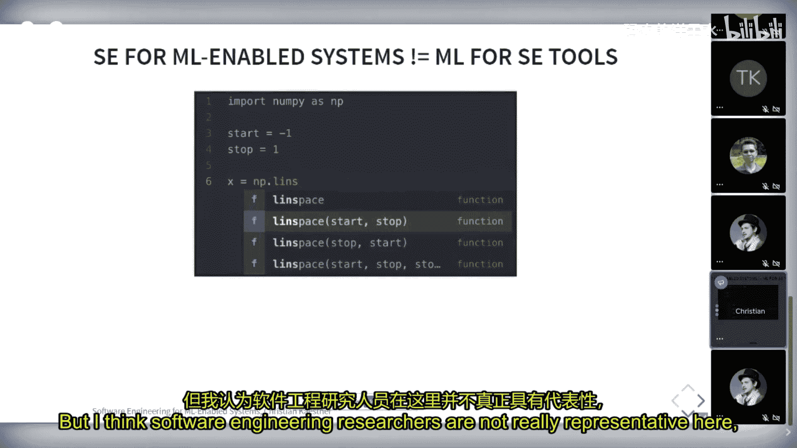

本次讲座由卡内基梅隆大学的副教授Christian Kästner主讲。他将讨论在构建包含机器学习组件的生产系统时，数据科学家和软件工程师如何协作以及应该怎样协作。

## 引言

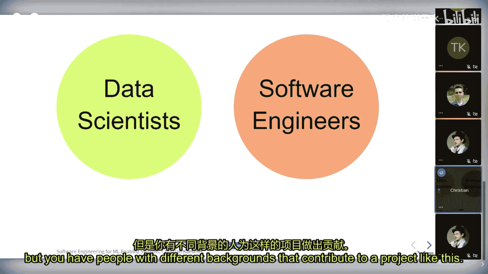

机器学习不仅仅是构建一个模型，更是构建一个完整的软件产品。以转录服务为例，它不仅仅是一个深度学习模型，还包括用户界面、支付系统、音频文件上传和编辑功能等。构建这样的系统需要跨学科的协作团队。

## 数据科学家与软件工程师的角色

在构建机器学习系统时，我们需要理解数据科学家和软件工程师的不同角色和专长。

### 软件工程师的角色

软件工程师不仅仅是程序员，他们需要在有限的资源和信息下做出工程判断。他们关注设计权衡，处理现实世界的复杂性，并在成本、交付时间、正确性、性能和可扩展性等多种质量属性之间进行权衡。一个优秀的软件工程师能够解释决策所依赖的因素，并在具体场景中做出合理的判断。

### 数据科学家的角色

传统的数据科学家通常具有统计学背景，专注于在给定数据集上构建和评估模型。他们通常在笔记本环境中工作，清理数据、提取特征、构建模型并评估准确率。然而，许多机器学习课程或讨论往往止步于此，很少涉及如何将模型部署到生产环境中。

## 机器学习系统的独特挑战

将机器学习引入系统会带来一些独特的挑战，但其中许多挑战并非全新。

### 不可靠的组件

机器学习模型是一个不可靠的组件。我们通常没有明确的规格说明，并且很难定义什么是“错误”。这与传统软件中拥有清晰需求和规格的情况不同。

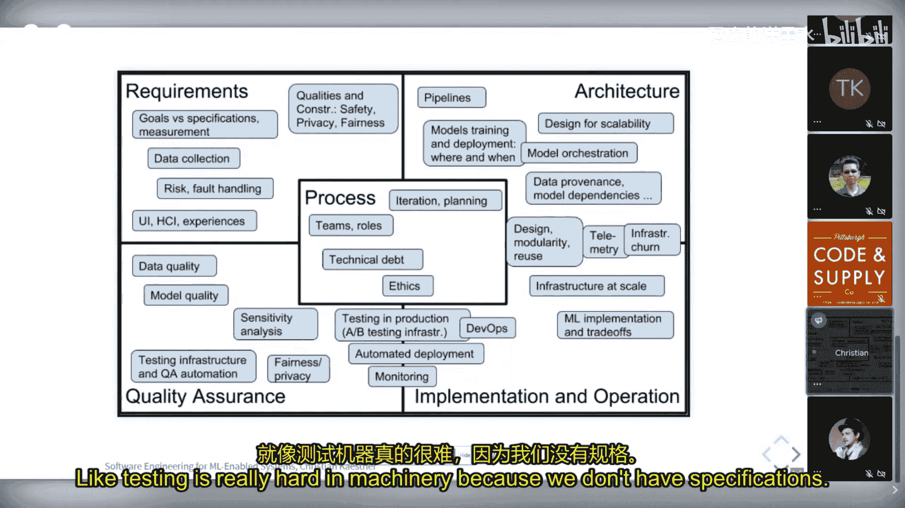

### 环境的重要性

机器学习组件的预测会影响现实世界，进而可能影响未来的训练数据，引入偏见和反馈循环。例如，YouTube推荐算法可能因为用户观看行为而过度推荐阴谋论视频。

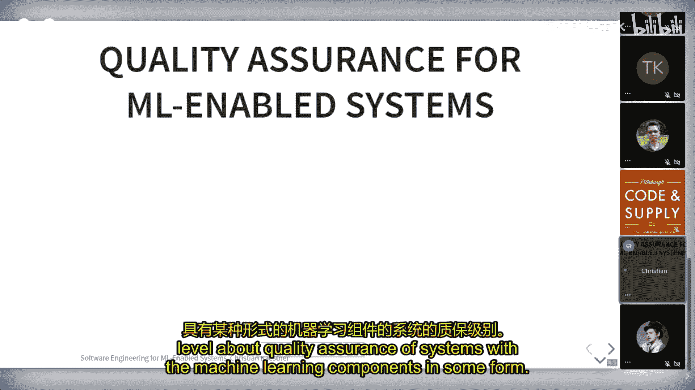

### 非局部和非单调效应

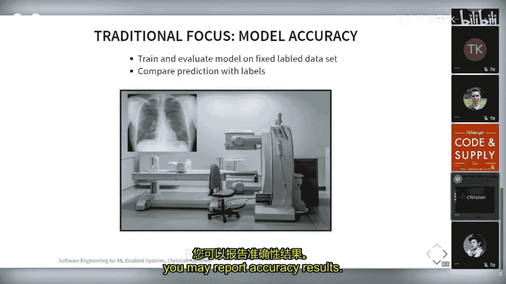

系统可能包含多个相互关联的机器学习组件。改进一个组件（如行人检测）可能不会改善整体系统性能，这使得调试和测试变得困难。

### 大规模数据处理

处理海量数据是机器学习系统的常态，这需要专门的数据处理基础设施和知识。

## 借鉴传统软件工程

尽管存在挑战，但许多问题并非机器学习独有。软件工程领域已有方法处理不可靠组件、模糊需求、系统测试和生产环境监控。

*   **处理不可靠组件**：我们可以通过设计冗余、回退策略和监控来构建高可用系统，就像使用廉价硬件构建可靠的云服务一样。
*   **环境交互**：需求工程领域早已研究软件如何感知和影响现实世界，涉及传感器、执行器等方面的考量。
*   **系统测试与交互**：我们不仅进行单元测试，还进行系统测试以处理功能交互问题。
*   **生产环境测试**：持续部署和A/B测试等方法在机器学习之前就已存在。
*   **大数据处理**：数据库社区在流处理和事件溯源等方面拥有丰富经验。

关键在于，当系统变得复杂且具有安全含义时，我们需要更加认真地应用这些经典的软件工程方法。

## 质量保证的层次

质量保证不应只关注模型准确率，而应扩展到整个系统和开发流程。

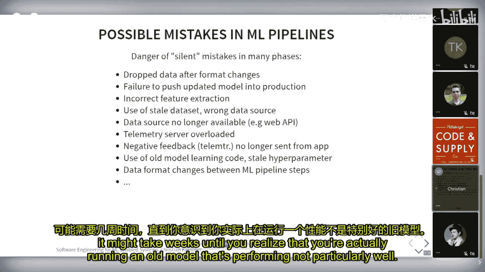

### 模型质量

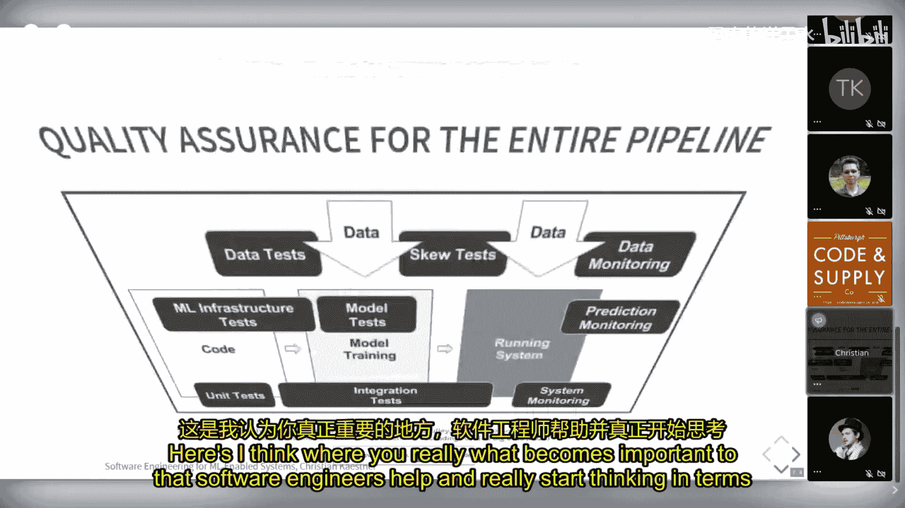

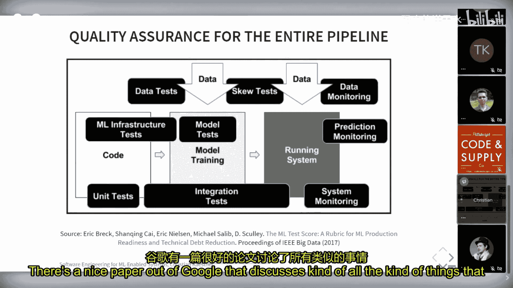

传统上，数据科学家关注模型的准确率、精确率、召回率等指标。但我们需要进一步思考：

*   **错误并非等价**：在癌症检测中，假阴性（漏诊）的代价远高于假阳性（误诊）。我们需要根据错误成本来评估模型。
*   **公平性**：确保模型在不同群体（如不同性别、种族）中表现一致。
*   **超越准确率**：在生产中，模型的训练时间、更新能力、推理成本（`cost_per_prediction`）等都至关重要。`cost_per_prediction` 综合了训练、设计和维护成本，是运营机器学习系统的终极指标之一。

### 管道（Pipeline）质量

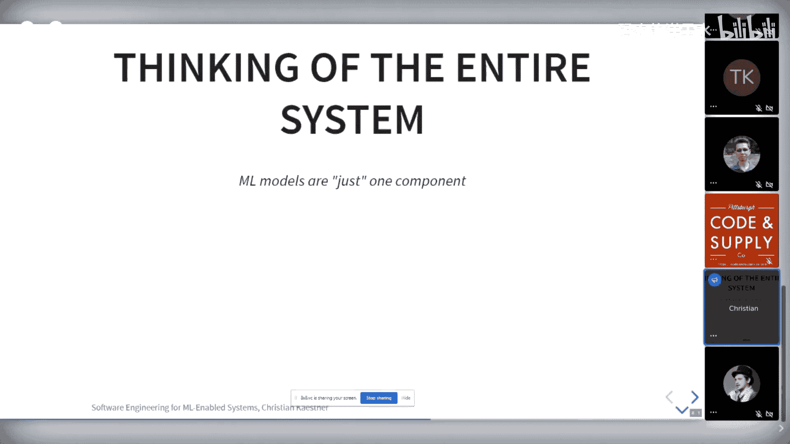

我们应该将模型视为一个自动化管道（Pipeline）的输出。这个管道包括数据收集、清洗、标注、特征工程、训练、评估和部署等步骤。

管道中的任何错误（如数据清洗代码的静默故障）都可能导致模型性能灾难性下降。因此，我们需要像对待软件一样对待这个管道：

*   为数据清洗代码编写单元测试。
*   对管道进行端到端测试。
*   测试错误处理例程（如处理上传失败）。
*   测试监控基础设施本身是否正常工作。

### 系统质量

最终，我们关心的是整个系统的质量，而不仅仅是其中机器学习组件的质量。

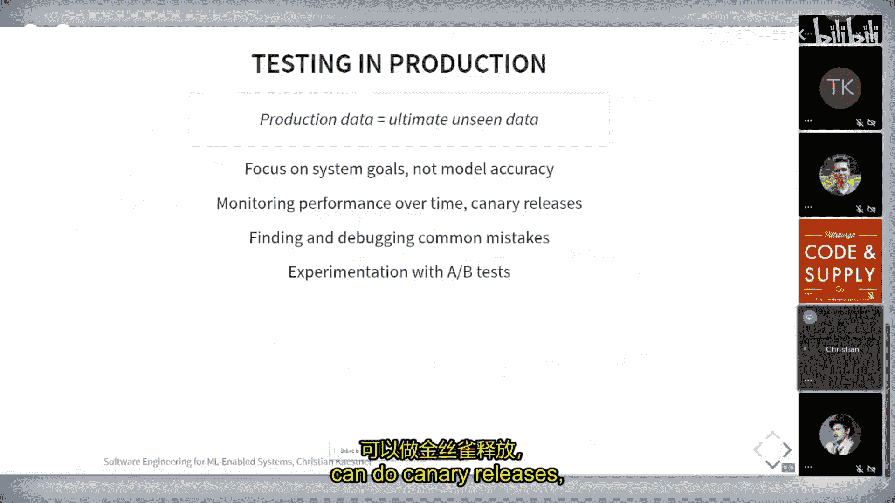

*   **设计容错**：系统可以设计得能够容忍机器学习组件的错误。例如，一个智能烤面包机在预测失败时可能会烤焦面包，但必须通过硬件保险丝等机制防止引发火灾。
*   **用户体验集成**：如何将预测结果集成到用户界面中至关重要。例如，智能家居系统是应该自动执行操作，还是每次都需要确认？是否提供了撤销操作的途径？
*   **系统目标对齐**：系统的总体目标（如最大化利润、用户留存、社会效益）可能与单一模型的优化目标（如准确率）不完全一致。更快的推理速度、更少的严重错误或更好的可解释性有时比单纯的准确率提升对系统目标贡献更大。

## 生产环境测试与遥测设计

由于系统目标复杂且真实数据难以模拟，在生产环境中进行测试（A/B测试、金丝雀发布等）变得非常重要。这要求我们精心设计系统的**遥测**（Telemetry）能力。

以下是一个设计遥测系统的思考示例：

假设有一个“识鞋购物”App，用户拍照识别鞋子并购买。如何评估生产环境中模型的表现和整体产品效果？

*   **直接询问用户**：每次识别后都询问是否正确，但这会打扰用户。
*   **追踪购买行为**：用户最终是否购买？这更接近商业目标，但不能直接反映识别准确性。
*   **创造性间接指标**：如果用户快速对同一只鞋连续拍照，可能意味着首次识别结果不佳。这是一种无侵入式的反馈信号。
*   **人工标注抽样**：付费请人对一部分识别结果进行标注验证。
*   **利用后续事实**：对于预测任务（如机票价格涨跌），只需等待一段时间即可验证预测准确性。

设计良好的遥测系统需要创造性思维，并考虑隐私、数据量、采样策略和版本隔离等工程挑战。

以转录服务为例，其编辑器通过同步音频文本、高亮不确定词汇，巧妙地鼓励用户在界面内修正转录错误。这无形中收集了高质量的纠错数据（即标注数据），用于后续模型改进，是一个优秀的系统级遥测设计。

## 构建跨学科团队

要成功构建机器学习驱动系统，我们需要数据科学家和软件工程师紧密协作的跨学科团队。这类似于DevOps的理念：

*   **不是寻找“独角兽”**：即不苛求个人同时精通数据科学和软件工程。
*   **培养“T型人才”**：团队成员应拥有核心专长（如数据科学），同时对另一领域（如软件工程）有足够深的理解，能够有效沟通。
*   **共同责任与协同**：数据科学家需要具备系统思维，考虑自动化、生产环境性能和安全性。软件工程师需要理解数据科学的工作流程和需求，并提供基础设施支持（如便于使用的遥测数据）。
*   **联合工具与流程**：建立共享的词汇表、工具链和流程，让协作更顺畅。

## 总结

本节课我们一起学习了构建和维护包含机器学习组件的软件系统所涉及的各个方面。

我们首先明确了数据科学家和软件工程师在项目中扮演的不同角色及其专长。接着，我们探讨了机器学习系统带来的独特挑战，但也发现许多挑战可以通过调整和借鉴传统软件工程方法来解决。

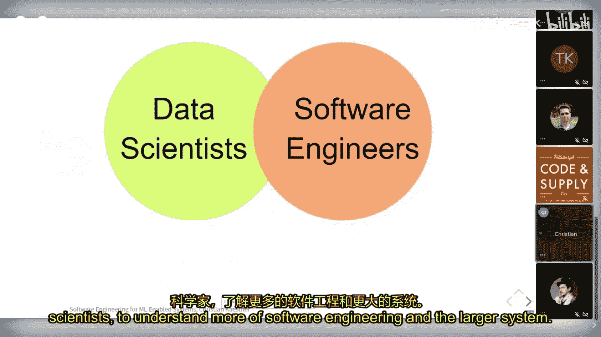

课程的核心部分聚焦于**质量保证**。我们认识到，不能只停留在评估模型准确率上，而需要将视野扩展到**模型的其他属性**（如推理成本）、**整个模型生产管道**的可靠性，以及最终**整个系统**的质量和商业目标的实现。我们特别探讨了如何通过创造性的**遥测系统设计**，在生产环境中有效地监控和评估系统表现。

最后，我们强调，成功的关键在于构建**跨学科的协作团队**。团队成员需要相互理解、尊重对方的专长，并围绕共同的目标和责任紧密合作，才能高效地构建出稳健、有价值的机器学习驱动系统。

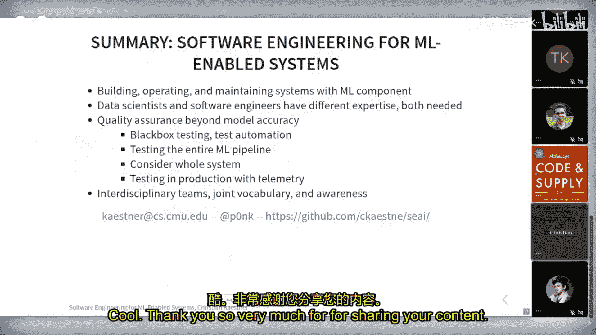

---
**延伸阅读与资源**：
*   书籍推荐：《Building Machine Learning Powered Applications》
*   学术论文合集：可向讲师咨询获取。
*   课程材料：讲师在卡内基梅隆大学的相关课程资料可供参考。