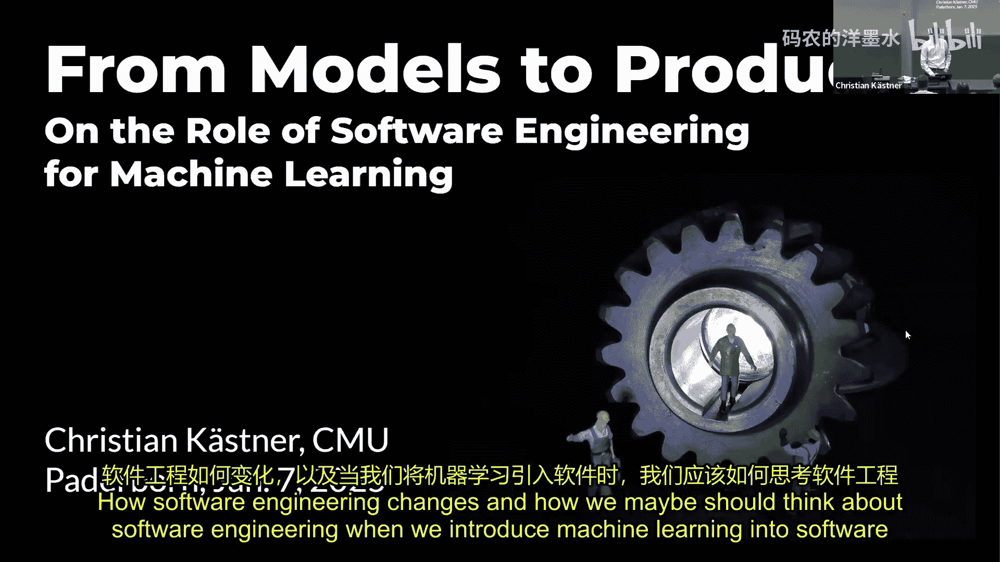
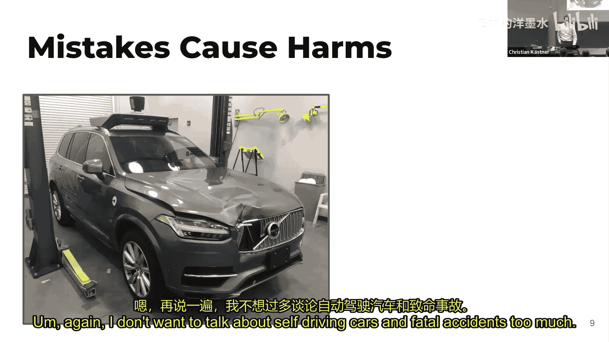
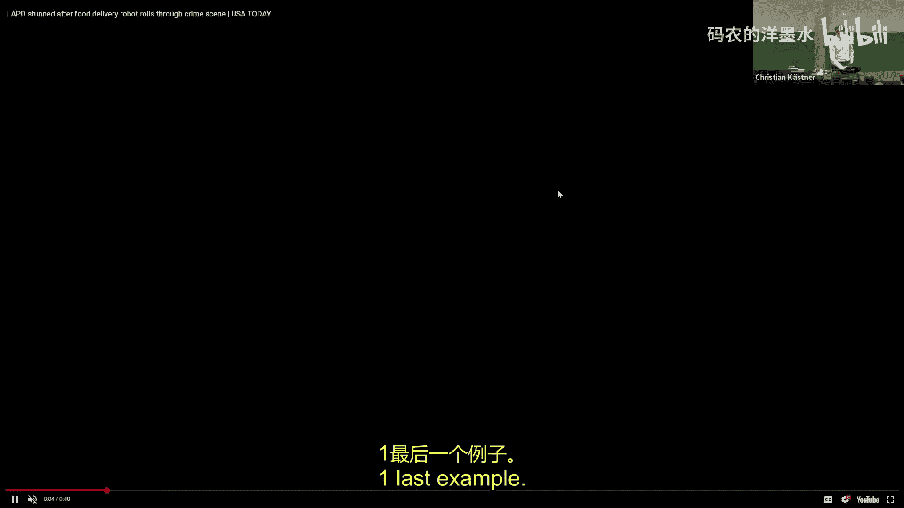
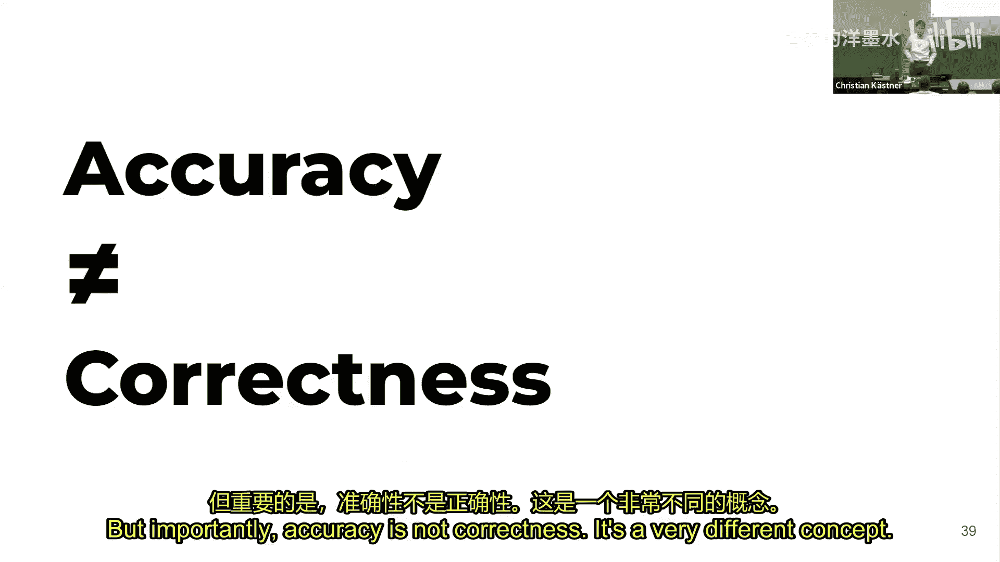
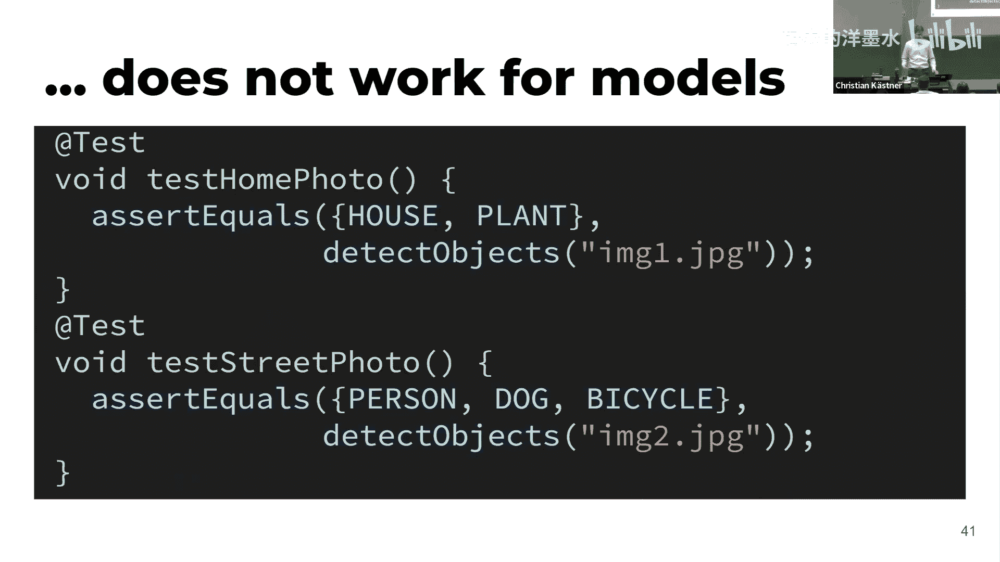
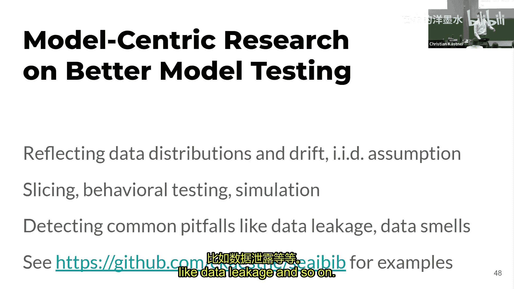
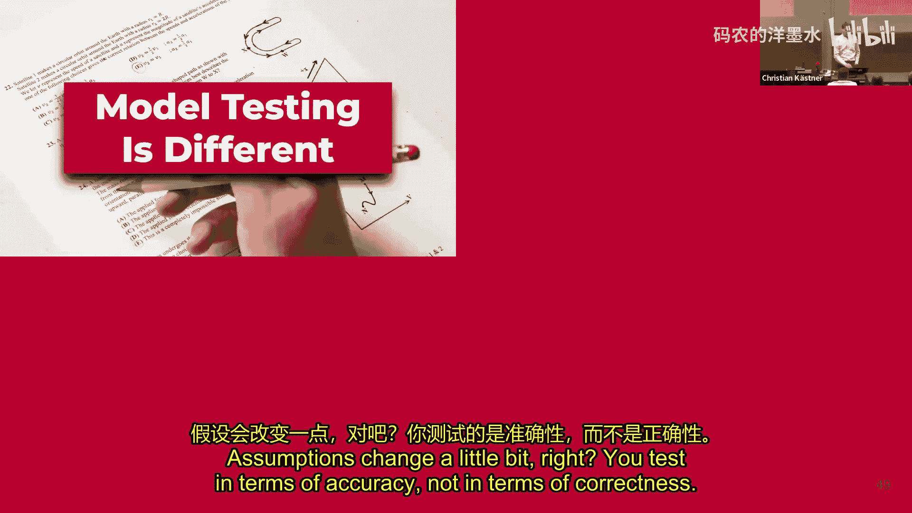
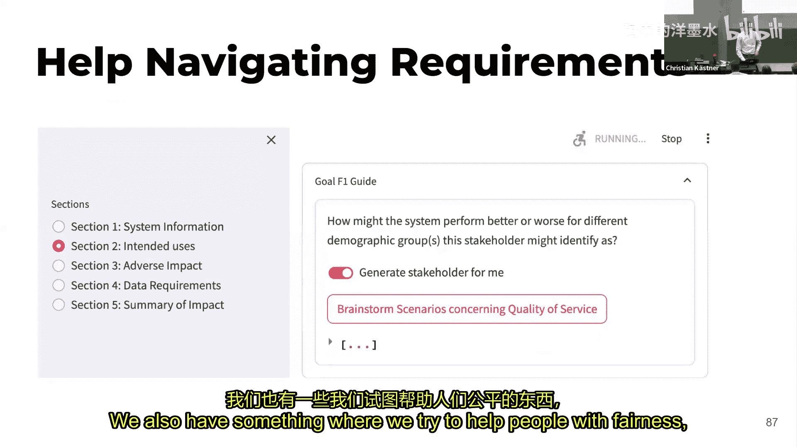
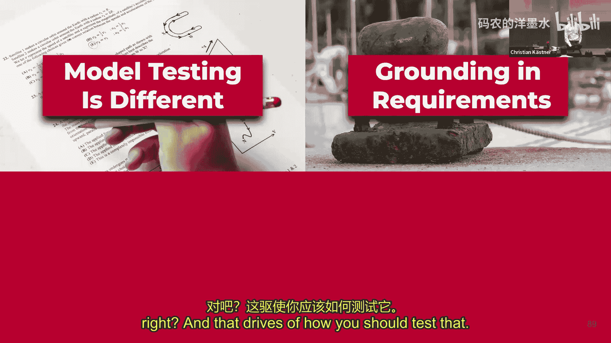
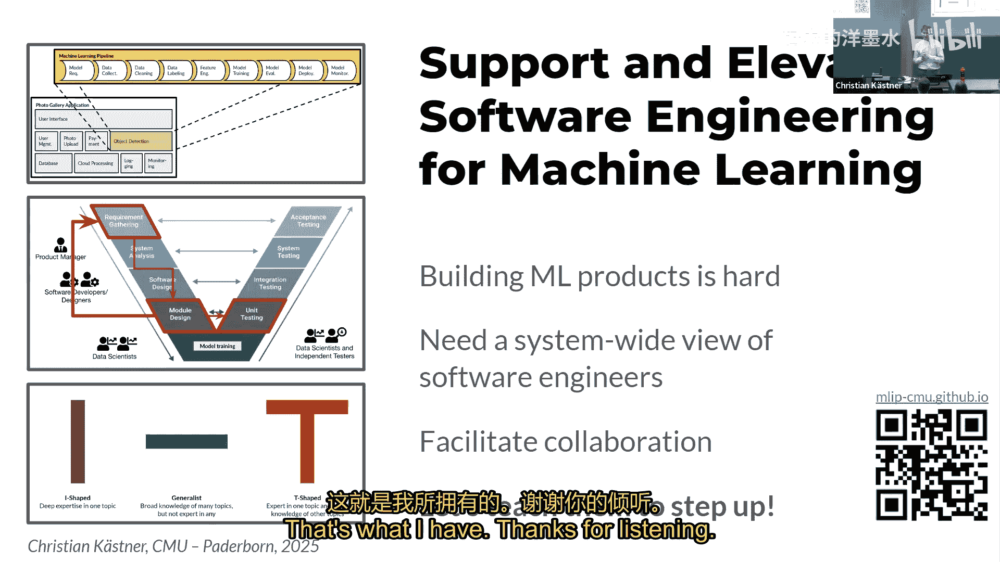

# 027：软件工程在机器学习中的作用

在本节课中，我们将探讨当机器学习被引入软件产品时，软件工程如何发生变化，以及我们应如何重新思考软件工程实践。我们将重点关注构建包含机器学习组件的端到端产品所面临的挑战，并以测试为例，详细说明从模型测试到系统测试的思维转变。

## 概述：从模型到产品

近年来，机器学习取得了惊人的进展，例如目标检测技术。然而，我们关心的不仅仅是模型本身，而是如何利用这些技术构建产品。无论是自动驾驶汽车、人行道送货机器人，还是谷歌相册的图片索引功能，机器学习都是产品中的一个组件。构建这类产品非常困难，常常面临从原型到产品的转化难题，并可能在实际应用中造成危害。

上一节我们概述了构建机器学习产品的挑战，本节中我们来看看传统的以模型为中心的视角与产品系统视角有何不同。

## 数据科学与机器学习运维：从模型到API

在数据科学领域，我们通常以模型为中心。给定一个数据集，使用现有库构建模型，并在标注数据上评估其准确率。这通常被视为一个从模型需求、数据收集、标注到模型构建和评估的管道。

然而，谷歌在2014年意识到，要将机器学习投入生产（例如欺诈检测），需要的远不止训练模型的代码。围绕模型的数据收集、服务基础设施、监控等代码量巨大，机器学习部分本身在代码量上并非系统中最庞大的部分。这催生了**机器学习运维**运动，旨在自动化并扩展模型部署和监控的步骤。

如今，大多数基础设施都有开源项目支持，复杂性在于如何将它们组合起来。但所有这些努力都是为了部署一个**模型**，而非一个**产品**。模型只是系统中的一个组件。要构建一个像谷歌相册这样的应用程序，你还需要前端、后端、流处理、支付等所有其他部分。在自动驾驶汽车等复杂产品中，可能涉及数十个相互作用的模型，而这只是整个系统的一小部分。

因此，我们需要的是**系统思维**。系统由许多组件构成，其中一些是机器学习组件（模型或训练代码）。该系统旨在与环境交互，对现实世界产生影响，这才是构建产品的意义所在。

上一节我们讨论了从模型管道到产品系统的视角转变，本节中我们来看看这种转变如何具体体现在测试实践中。

## 模型测试：准确率 vs. 正确性

我们通过测试的视角来阐释这些变化。模型测试与传统软件测试在一个关键方面存在差异。

在传统软件工程中，我们测试**正确性**。我们有一个软件应如何运行的规范（即使是模糊的），并编写测试用例来验证对于给定输入，输出是否符合预期。如果测试失败，我们就发现了一个缺陷。

而机器学习模型的评估方式不同。我们使用测试数据，并接受模型会犯一些错误。我们报告的是**准确率**（例如92%），而不是追求100%的正确性。我们通常没有明确的、形式化的规范来确定一个输出绝对“正确”，通常依赖人工判断。例如，一个模型可能将会议中心识别为“健身房”，这可能算对，也可能算错。

> **核心概念**：所有模型都是错误的（即都是近似），但有些模型是有用的。关键问题不是“模型是否正确？”，而是“这个模型对于特定应用是否足够好？”

这种差异源于不同的推理方式。传统软件工程使用**演绎推理**，基于数学概念和规范进行证明。机器学习使用**归纳推理**，基于观察进行概括，没有“证明”的概念。

因此，作为软件工程师，正确的抽象是将模型视为一个**不可靠的函数**。它大多时候能完成你想要的工作，但并非总是如此。你接受一定比例的失误，这些失误可能不可预测，且模型本身通常是不透明的黑盒。我们根据**准确率**而非正确性来评估它。

鉴于这种根本差异，许多传统的软件测试方法（如专注于发现错误的模糊测试）在机器学习语境下意义不大，因为找到错误预测很容易。更重要的问题是：这些错误是否重要？是否有人愿意修复它们？

上一节我们介绍了模型测试以准确率为核心的特点，本节中我们来看看如何将测试与产品需求结合起来。

## 需求驱动的测试：从产品目标到模型需求

模型测试不应孤立进行，而应基于需求。我们需要思考系统对模型有何要求。例如，对于人行道机器人和谷歌相册，对目标检测模型的期望截然不同。机器人可能需要精确检测地面附近的障碍物（如脚），而不太关心检测飞机；而谷歌相册则需要检测各种物体，但对准确率的要求可能不那么苛刻。

我们通常从目标角度讨论需求。产品的目标（如良好的用户体验、广告展示）与模型的目标（如准确的目标检测）并不相同。更准确的模型不一定能改善用户体验或增加广告收入。同样，用户的目标（如快速找到照片）与产品目标也不完全一致。

因此，更有意义的问题是：你究竟需要多高的准确率？在系统设计中，除了准确率还需要考虑什么？

一个来自Booking.com的例子很有启发性。他们发现，更准确的模型通常带来更多利润，但有时更差的模型反而利润更高，反之亦然。原因可能是模型过于精准导致用户感到“诡异”。这说明了不能一味优化准确率，最终应关注的是**系统目标**。

系统或产品需求应驱动测试策略。在软件工程中，我们常用V模型将需求映射到测试策略。从产品需求出发，思考如何测试产品的有效性，再分解到组件（如模型）需求。

然而，机器学习项目往往更具探索性。我们可能一开始不知道什么是可行的，需要根据模型能力反馈调整产品需求。此外，团队中不同角色（产品经理、软件工程师、数据科学家）的沟通也是一大挑战。

一些研究试图通过领域特定语言或图形界面来帮助团队在项目早期就模型需求达成一致，例如讨论可接受的准确率、延迟、鲁棒性等。

以下是进行需求讨论时需要考虑的一些方面：
*   **目标分布**：我们是否关心异常值？
*   **特定数据切片**：是否需要特别关注某些类别（如“脚”或“飞机”）？
*   **其他质量属性**：推理延迟、训练成本、硬件需求、鲁棒性、可解释性等。

因此，模型测试不同于传统软件测试，并且不能随机选取数据计算准确率。应该思考模型将如何被使用，这决定了应如何测试它。

上一节我们探讨了如何基于产品需求测试模型，本节中我们进一步思考如何超越模型本身，在系统层面防止危害。

## 超越模型：系统安全与缓解策略

错误会导致危害。如果我们想减轻危害，可以尝试训练更准确的模型，但这有其极限。模型始终是一个不可靠的组件。即使准确率达到99.99%，它最终仍会犯错。

因此，我们应该预见错误必然发生，并思考如何避免这些错误造成危害。我们可以设计**缓解策略**，即不单纯依赖目标检测模型，而是引入其他机制。例如：
*   为机器人配备专门的闪烁灯检测器，一旦发现可能涉及紧急情况，就将控制权移交远程人类操作员。
*   在机器人上设置物理紧急停止按钮，允许路人在其即将进入犯罪现场等危险区域时将其停止（但需平衡滥用风险）。
*   像谷歌那样，在无法可靠区分人类与灵长类动物时，直接选择不显示相关识别结果，以避免冒犯性错误。

所有这些缓解策略都存在于**模型之外**，属于系统设计、人机交互的范畴。核心思想是：不单独依赖模型，引入冗余机制。

> **核心概念**：“AI安全”本身是一个矛盾修辞。AI代码不会伤人，只有当它被置于系统中，与环境（包括人类）交互时，才可能造成危害。因此，**安全是一个系统属性**，无法仅在模型层面进行推理。

安全工程领域（如故障树分析、STPA等方法）拥有数十年的经验，专注于思考最坏情况如何发生，以及如何通过消除单点故障等方式进行缓解。例如，对于自动列车门，除了视觉检测器，还可以增加压力传感器。现在需要两者同时失效，事故才可能发生，风险大大降低。

我认为几乎所有我们关心的属性——安全性、安全性、公平性、透明度、问责制——都是**系统属性**，而非模型属性。我们可以通过模型之外的设计策略，使产品更安全、更公平、更透明。

一个例子是提示注入攻击。将秘密交给一个不可靠的大语言模型，并试图说服它不要泄露秘密，这本身就是一个不安全的产品设计。真正的安全解决方案应在系统层面，而不是试图“硬化”提示词。

挑战在于如何更轻松地预测和缓解错误，如何让开发人员更愿意采用这些已有的安全工程实践。我们需要更多地研究**产品**本身，而不仅仅是模型组件。

回到测试的主题，我们不仅需要测试模型（基于需求），还需要考虑模型之外的整个产品系统。

上一节我们强调了在系统层面设计缓解措施的重要性，本节中我们来看看如何对这些完整的系统进行测试。

## 系统测试：集成与生产环境测试

我们需要测试整个产品系统。单元测试相对容易，但重点应放在完整的测试用例上。

如果我们实施了安全保障措施，就应该测试它们是否有效。如果保障措施中涉及人类（如人工审核），可能需要进行用户研究，确保人类操作员理解其职责且不会产生疲劳。人机回环的设计 notoriously hard。

需要进行集成测试，测试错误处理机制。即使没有完整的系统，也可以通过模拟故障来测试安全机制和恢复机制是否正常工作。

对于包含多个交互模型的复杂系统，测试更具挑战性。最终，很多系统测试无法避免，尤其是对于机器人这类产品，大量测试需要在生产环境中进行。

我认为**生产环境测试**比以往任何时候都更重要。这包括如何进行A/B测试：在生产系统中部署一个模型版本，观察其表现（同时避免造成危害），快速检测问题并回滚。像Grafana、Prometheus这样的可观测性和监控工具至关重要。

因此，我们需要关注一整套测试策略，而不仅仅是模型测试。

## 未来方向：协作与教育

目前，我们对构建机器学习产品所面临的问题已有深入了解，并且拥有许多解决方案的要素。我们拥有数十年的软件工程经验，包括流程、生命周期、需求、安全工程、集成测试和生产环境测试等。我们需要运用这些经验。

在传统软件工程中，我们根据系统复杂性和风险级别投入相应资源。而机器学习让我们能够构建更复杂、潜在危害更大的系统，但我们有时仍像开发简单网站一样对待它们。我们需要更认真地对待工程实践，在需求工程、错误预测和缓解等方面进行投入。

我认为当前最大的改进机会在于两个方面：

1.  **协作**：团队中不同角色（数据科学家、软件工程师、产品经理）之间存在沟通障碍。他们说着不同的语言，在需求规划、数据收集、系统集成等多个环节产生摩擦。我们需要更好地支持这种跨学科协作。
2.  **教育**：我们需要培养**T型人才**。即拥有某一领域深度专业知识（如数据科学），同时对其他相关领域（如软件工程、安全工程）有足够了解，能够进行有效沟通。软件工程师需要明白模型是不可靠组件，应提前为错误做计划。数据科学家需要主动询问模型将如何被使用，理解生产中的数据分布和除准确率外的重要属性。

我通过课程教学致力于此，旨在覆盖从需求到运维、再到负责任工程的整个知识范围，培养学生对软件工程和机器学习交叉领域的整体理解。

## 总结

本节课我们一起学习了在构建包含机器学习组件的产品时，软件工程思维需要发生的转变。我们探讨了从以模型为中心的视角转向以系统为中心的视角的必要性。具体通过测试的例子，我们分析了模型测试（关注准确率而非正确性）、需求驱动的测试、系统级安全缓解策略以及完整的系统测试流程。最后，我们强调了跨学科协作和拓宽教育对于成功构建可靠、负责任的AI驱动系统至关重要。构建机器学习产品是困难的，但通过系统性的工程方法和良好的团队协作，我们可以更好地应对这些挑战。