# 01：课程介绍与背景 🎯

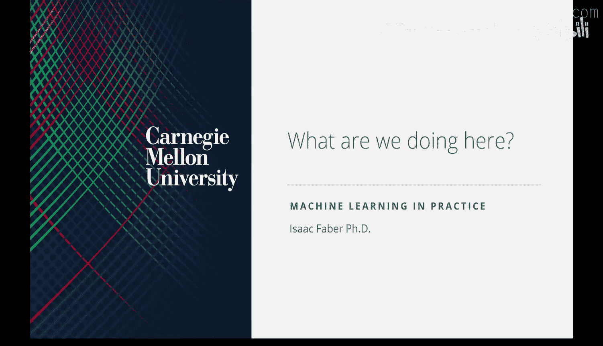

在本节课中，我们将学习这门课程的目标、结构以及机器学习产品化的核心背景。我们将探讨为什么构建一个成功的机器学习产品不仅仅是技术问题，更涉及商业价值、组织考量和用户体验。

---

## 课程概述

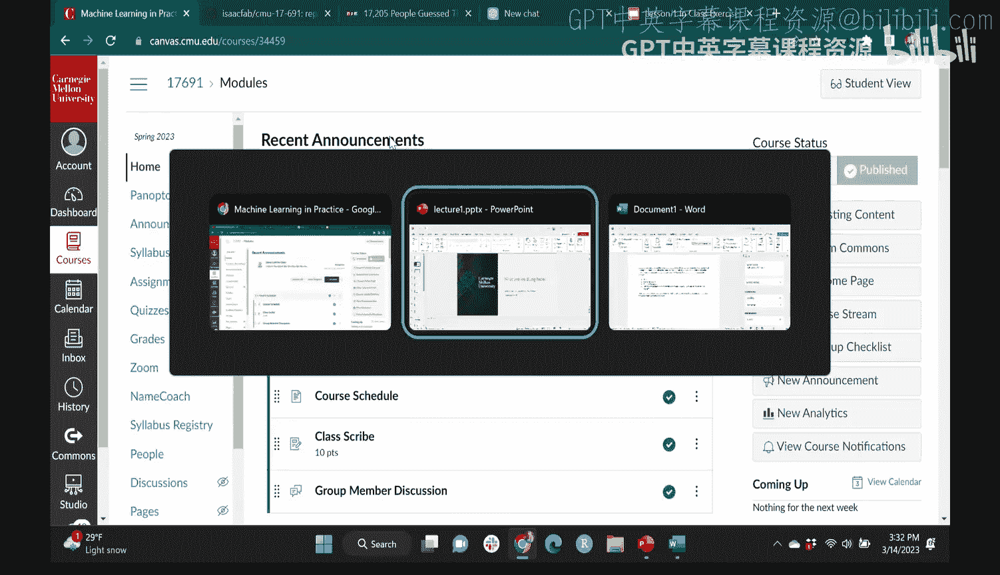

大家好，我是Isaac，在接下来的七周里，我将担任你们的讲师。我们将讨论“机器学习实践”。这是我第二次教授这门课程。我的一个导师曾说过，第一次教课没人能学到东西，第二次教课老师才能真正掌握内容，第三次学生才能最终学会。所以这是第二次，请多包涵，我们会在过程中做一些调整。去年教这门课非常有趣。

这门课程的目标是让你们在离开时，对构建一个机器学习产品意味着什么有深刻的理解。当我说“实践”时，指的就是这个。我指的不是机器学习的机制或选择不同模型类型，而是如何将机器学习呈现给那些不懂机器学习的人。我们将触及这些领域。

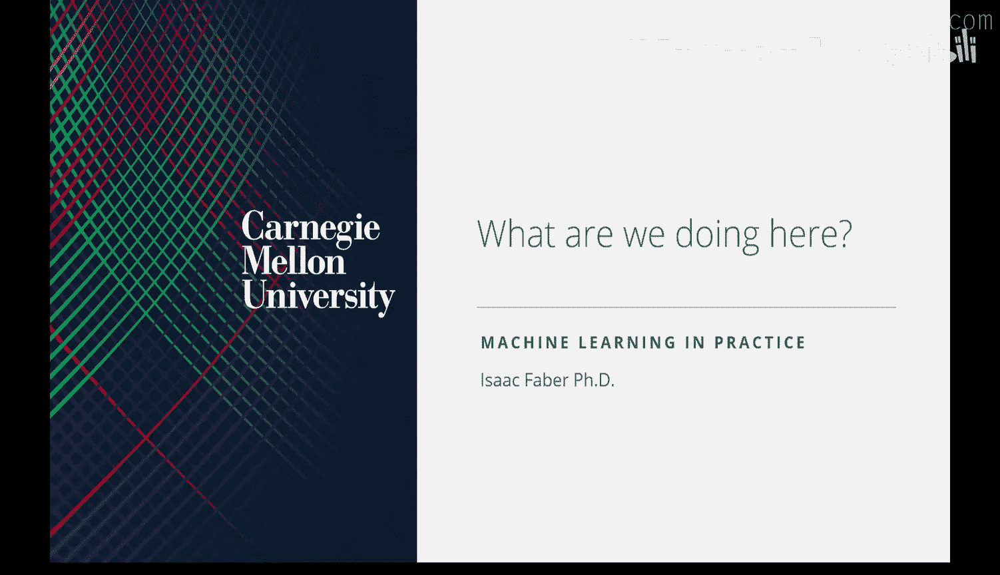

我们会涵盖一些技术内容，并深入探讨产品架构、模型评估时机与方法，以及如何建立系统。但最重要的是，目标是：你是否在为不懂机器学习的人提供价值？

我们将通过多种方式实现这一点。最重要的是，你们将构建自己的产品，并在学期末进行展示。这门课程没有考试，但有作业。作业将支持一些概念，我期望你们在期末产品中融入这些概念。作业是相互关联的，是一个贯穿始终的案例研究，你们将扮演机器学习工程师的角色，为一家企业构建产品。

你们还会看到辅导课。去年我们没有辅导课，今年会有。在辅导课中，我们将介绍在构建产品时有用的工具。因此，你们将通过三种方式学习：构建自己的产品、完成作业、以及通过讲座和辅导课学习相关主题。

此外，我计划只在课堂上讲授一部分内容，大部分时间旨在互动。会有阅读材料，我期望你们在课前完成。我稍后会介绍评分细则，但很大一部分成绩将基于你们在课堂上的参与度。因此，这将比典型的单向授课更具互动性。

---

## 今日课程安排

第一节课，我们将介绍关于我的信息、课程目标、背景动机、作业安排、机器学习产品的现状，最后是问答环节。第一节课相对轻松，但希望能为这门课程的实用性做好铺垫。

我获得了斯坦福大学管理科学与工程系的博士学位，我的论文是关于人工智能在网络安全中的应用，特别是使用AI进行预警系统。我不是全职讲师，而是兼职教员。我的全职工作是担任美国陆军人工智能集成中心的首席数据科学家和AI开发总监。在这个职位上，我从事从自动驾驶汽车到用于AI生成技术的大型语言模型等各种产品工作。我还有一些行业经验，在斯坦福期间联合创立了一家风险投资公司，该公司构建了一个用于数据科学和AI开发的工作台。我现在还担任多家初创公司的董事会成员。

---

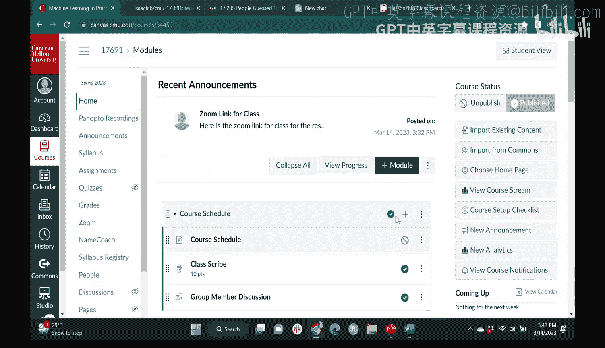

## 课程目的

本课程的目的是涵盖与构建并部署到实际运营中的机器学习系统相关的主题。这类系统有技术要求，包括数据管理、模型开发和部署。然而，也必须考虑业务和组织影响。仅仅构建并部署一个机器学习模型是不够的，你必须证明为此所需的费用和资源是合理的。这是你们从这门课中应该学到的一点：理解其中的权衡。如果你要对基础设施进行大量投资，你能用产品部署后创造的价值来证明这笔投资的合理性吗？我们将在第三部分深入探讨，但我会给你们一些工具来明确地进行这些计算。

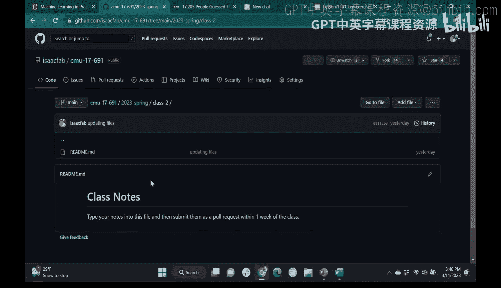

---

## 相关背景与课程

这里的目标是，我们不仅要关注机器学习技术和方法——这通常是你们在CMU上任何机器学习课程会学到的内容。因为机器学习非常流行，其流行很大程度上是由底层机制驱动的，比如我们关心的神经架构。最近，这涉及到人类反馈的强化学习。在某种程度上，这些都是非常重要的考虑因素。但我们希望确保，在理解模型开发中这些细微的架构考虑时，我们也关注组织层面的考虑。这就是我们要做的。

有一些相关课程，我会在过程中引用。据我所知，去年在CMU，你可以上一门类似的课程——“大规模机器学习与数据科学”，但它会更侧重于计算机科学的产品架构技术层面。然而，关于“你是否在构建一个有用的产品”这种理念，我认为这门课相当独特。还有两门不在CMU的课程，我认为会很相似，我也会引用它们：一门在斯坦福，一门在伯克利。我稍后会谈到我们将使用的书，这本书的作者之一就在斯坦福教授那门课程。因此，你们会在第一次作业中看到这两门课程作为参考，该作业是提出你们计划构建的产品提案。

人们正在做这些事情，只是因为机器学习发展如此之快，提出这类问题还相当新。

---

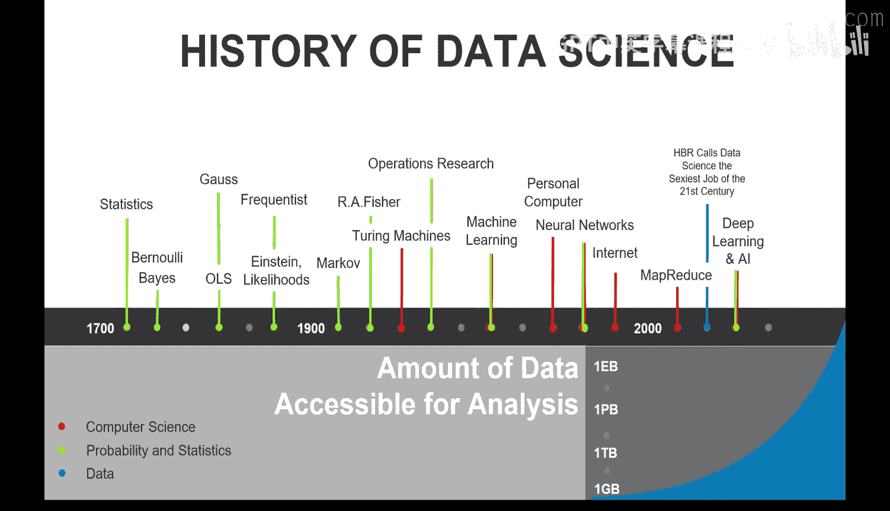

## 学习目标

如果我们在七周后能实现这些目标，我们这个班级就是成功的：
*   你们能否部署包含机器学习和AI组件的产品？
*   你们是否理解如何实现支持这些产品的数据管道和数据工程系统？
*   你们能否以美元为单位，近似计算出机器学习为组织带来的价值？
*   你们是否理解如何持续评估已部署机器学习系统的价值和品质？

---

## 课程结构与评分

小组形式，2到4人一组。我看到有些人已经和认识的人一起来了，所以你们可以自己组队。如果没有现成的小组，我们的助教Herer会帮助你们组建。Canvas上有一个小组讨论区，或者你们可以联系寻找组员。如果有问题，请联系我或Herer，我们会确保你们能加入小组。

课程理念更偏向实践和案例研究，而非理论。我们会在课堂上做一些练习，但通常的方式是：我会进行大约30分钟的讨论，然后你们会以产品小组为单位，讨论当天的阅读材料并给我一个总结，然后我们全班一起讨论这个总结。这通常会持续到下课。

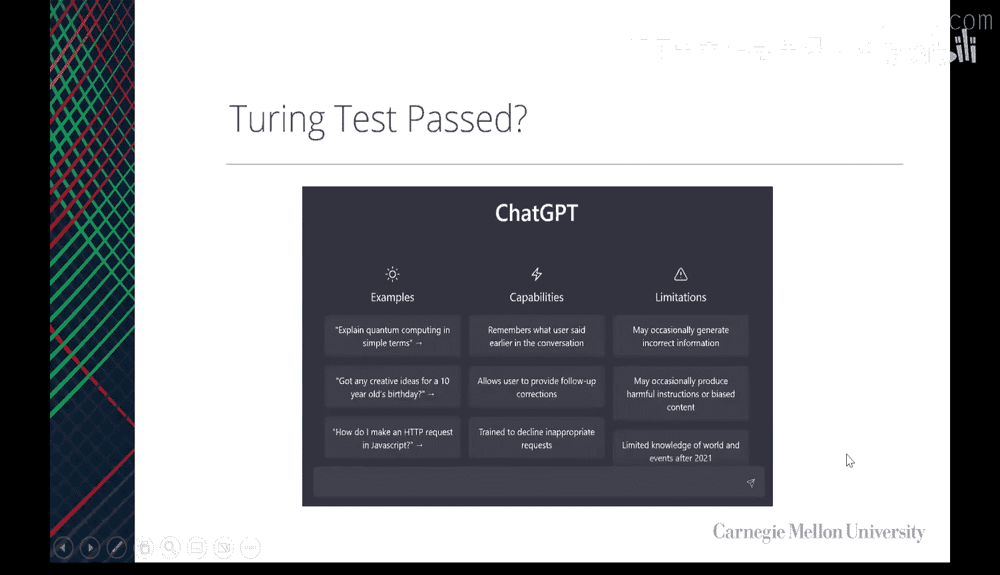

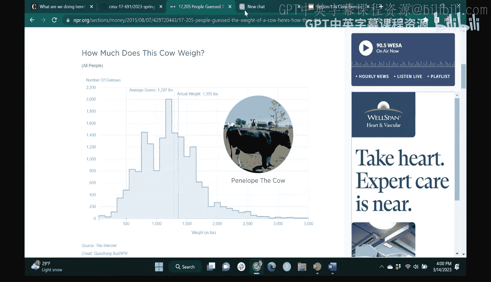

课程时间是周二和周四下午3:30到4:50，辅导课在周三下午5点。我计划亲自到场，但有时我会出差，即便如此我也会坚持上课，只是改为Zoom会议，但我会提前充分通知。去年只有一节课是线上的，但今年可能发生，请注意。辅导课也会通过Zoom录制，时间是周三下午5点，之后会提供录像。我们计划进行现场辅导，但周三不要求必须出席，不过你们会发现这些内容对构建最终要展示的小组产品非常有用。

评分细则如下：
*   **60%** 为小组项目成绩。这实际上分为两部分：提案（占成绩的一小部分）和实际的小组展示。小组展示基本上包括两件事：幻灯片演示和产品演示。这就是我期望的所有文档，随着课程进行你们会得到更多指导。
*   **20%** 为课堂参与。我期望大家在讨论中积极发言。我的意思是，我知道有些人不喜欢在公开场合讲话，所以除非你们愿意，否则我不会强迫你们发言。但我们会使用一个实时Google幻灯片来记录，就像我们今天要做的那样，随着课堂活动的进行，每个人都要参与。
*   **20%** 为作业成绩。有三份作业，如我所说，将是案例研究。
*   另外一件事是，从下节课开始，我们会指定一名课堂记录员。你们需要为那节课做笔记，然后通过拉取请求将笔记推送到班级的GitHub仓库。

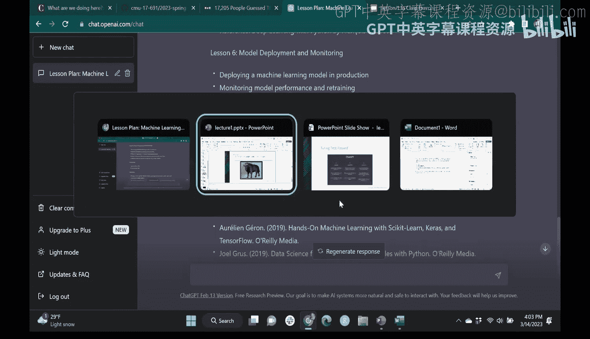

---

## 课程资源

班级有一个GitHub站点，描述了课程的分解。我想指出的第一点是，课程有指定教材《Designing Machine Learning Systems》。实际上这本书不是必需的，书中的大部分内容都可以在线找到，但书本是这些在线信息的更成熟版本。它相当便宜，30美元。我有几本副本，如果对你们来说太贵或者不想买，可以借阅。但我强烈推荐购买这本书，它是我们这门课的绝佳资源。当我们布置阅读作业时，会有文章和书中的章节需要阅读。

仓库里还有什么？你们完成作业所需的信息。例如，有一个SQLite数据库和一些数据，用于训练机器学习系统。你们还有去年的所有资料，例如，去年所有课堂记录员的笔记，你们可以进去看看其他人是怎么做笔记的。内容可能会有些许不同，但我们会涵盖很多相同的东西。去年的小组项目展示也在这里，所以如果你们在寻找灵感时好奇想看看，可以浏览。不是每个人都做得很好，所以浏览某些小组项目时需自行判断质量高低。

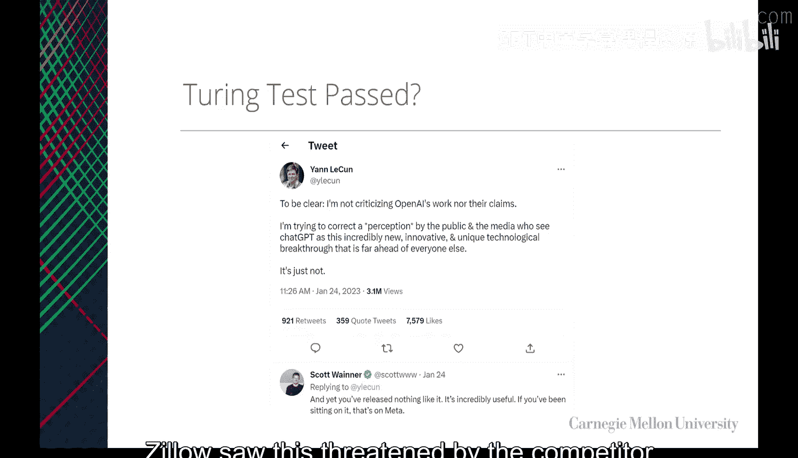

当你们被指定为记录员时，会进入今年的文件夹。比如被指定负责第二节课的人，我们会提前分配好。你们需要分叉这个仓库，做好笔记，然后通过拉取请求将笔记推回仓库，我们会接受。

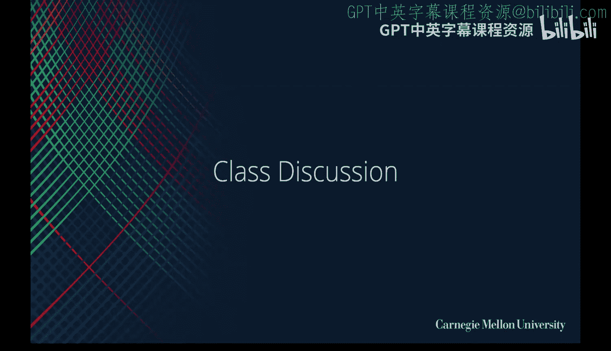

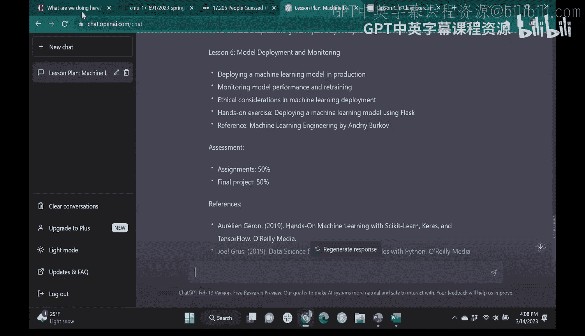

整个课程通过Canvas运行。我没有其他系统，我会在这里评分，你们在这里得到反馈，所有作业提交都在这里。我按周设置了模块，每周的模块会变得可用。你们不一定能提前访问后续内容，但能看到主题是什么，只有当前活跃的内容可以访问。这样你们不会因为过早学习而感到不知所措。每周，每节课会有两个模块。例如，“我们在这里做什么”是今天的课，“什么是好的ML产品”是周四的课，随着课程进行，我们还会为辅导课添加内容。

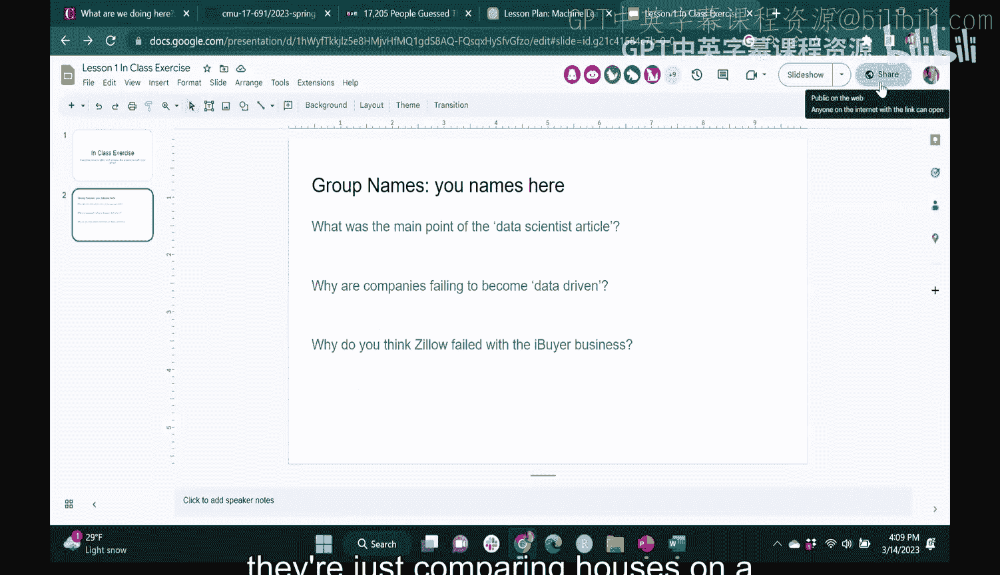

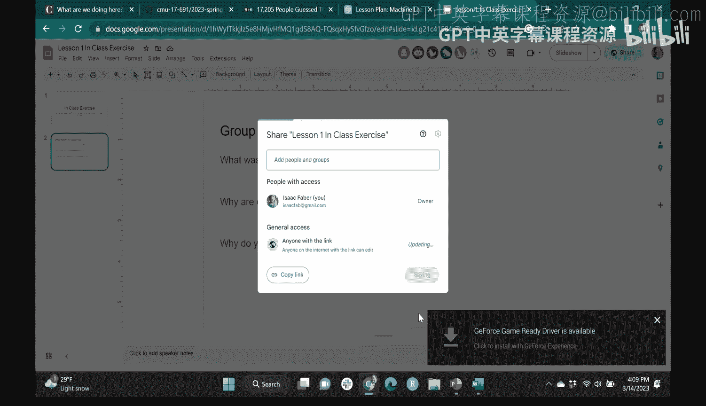

有几件事：小组产品提案作业现在已经发布。当你们组好队后，在28号之前（即两周内）制定提案并提交，从现在到那时任何时间都可以。课堂记录员作业也已发布。另外，如我所说，有一个小组成员讨论区，如果你们在寻找小组，可以来这里与人聊天和联系。

---

## 课堂活动与讨论

现在，让我们看看今天要做什么。稍后会有一个环节，我会让你们至少以初步的小组形式进行活动。这是今天要求的阅读材料类型的例子，有四篇文章，我们将在课堂上阅读。然后，你们将进入小组幻灯片，这是一个开放的Google幻灯片文档。在课堂上，你们的小组将复制第一张幻灯片，通过讨论回答这些问题。然后，我们将讨论你们所有人对文章的反馈和想法。

到目前为止有任何问题吗？如果没有，我们来谈谈课程的历史和背景。

我大约一年前整理了这个背景。总的来说，我们是如何达到现在这个地步的？在过去的几年里，我们看到机器学习系统的采用出现了巨大的加速。这其实已经酝酿了一段时间。我专业从事数据科学已经十多年了，刚开始时，大多数数据科学实际上只是应用统计分析，有一点机器学习，但非常不成熟。有趣的是，第一批数据科学家使用R作为编程语言，而现在R成了少数语言，几乎每个人都使用Python或其他变体。但你可以看到，总的来说，这始于很久以前，几百年前，我们看到了早期统计方法的基础，包括贝叶斯和频率主义方法。这些方法后来演变为估计的似然方法。当时，收集数据的能力显然非常有限，早期的数据收集都是手动的。有记录的第一批数据收集，实际上是人类历史与前历史的分界线。历史就是人类收集关于自身数据的程度。我们知道收集的第一批数据是刻在石头上的。快进几千年，我们开始说，如果我们收集数据，我们可以开始回答关于这些数据的有趣问题，从而告诉我们更多关于宇宙的信息。当然，从那里开始演变。随着二战期间图灵机的出现，以及个人电脑的出现，机器学习作为一个学科在1950年代和1960年代开始。这实际上是第一个人工神经网络或感知机发明的时候。神经网络与许多其他当时流行但现在不再那么时髦的技术一起被发明，比如支持向量机，以及其他将模型拟合到数据的方法。然后在2000年左右，数据管理出现了繁荣。这与机器学习和人工智能没有直接关系，但为了进行更大规模的工作，需要访问更多的数据。我想在座的每个人都知道个人电脑和计算能力总体上增长得有多快。同时，我们看到存储数据的成本和产生的数据量显著下降。因此，就目前而言，组织产生PB级的数据并不罕见，例如仅仅作为一个保险公司。而在过去，这是相当罕见的。所以，我们正处于这三件事的汇合点：算法技术、计算能力的扩展以及数据的可用性。这使得这门课程非常及时，因为这些因素正汇聚在一个我们可以构建10年前根本无法构建的产品的时代，这非常令人兴奋。关于我们如何做、为什么做以及什么是好的方法，有很多开放性问题。我想用接下来的几张幻灯片来证明这是一件有用的事情，这三者的结合确实能提供价值，而不仅仅是一种新颖的学术追求。

我想从亚里士多德的一个故事开始。米利都的泰勒斯是个有趣的人。有人听过这样一句话吗：“如果你那么聪明，为什么你不富有？”泰勒斯被一个同时代的人这样说过，并被亚里士多德记录下来流传后世。故事可能是杜撰的，泰勒斯说：“我随时都可以变得富有，我会证明给你看。”于是他去了。根据亚里士多德的记载，他“观察了星象”，然后说：“好吧，今年橄榄会大丰收。”带着从星象中获得的信息，他出去购买了使用他们所在城镇所有橄榄压榨机的期权。到了收获季节，每个人都获得了橄榄大丰收，而拥有所有压榨机使用权的人是泰勒斯。他说：“没问题，你们都可以用，但必须支付很高的溢价。”于是，他从未种过一棵橄榄，却通过“观察星象”赚了一大笔钱。从高层次来看，这实际上就是我希望你们思考的。在我们的世界里，我们收集数据（来自星象的信息），我们开发模型（从数据中产生洞察），然后我们将这种洞察转化为行动。在他的案例中，行动就是购买这些橄榄压榨机的期权。所以，不仅仅是星象的有趣细节，也不仅仅是从星象中获得的洞察，而是整个循环：收集数据、建立洞察，然后将洞察转化为后来可以从中获利的产品，为你自己和组织创造价值。

这是真的吗？也许是杜撰的，你真的能从星象中判断橄榄收成吗？我不知道，我对星象或橄榄了解不多，但因为是亚里士多德说的，我姑且相信。然而，我知道在其他背景下，我们开始看到这种说法的历史回响。弗朗西斯·高尔顿爵士，著名的统计学家，如果你从事任何历史科学，你绝对会遇到他。他除了创造了至今仍在我们的机器学习技术中使用的许多统计基础之外，还有一个有趣的观察。他在英国参加一个活动，有一个猜公牛体重的比赛。我想弗朗西斯·高尔顿爵士那时大概是17、18世纪，一头公牛在当时是宝贵的财产。今天我不知道如果有人给你一头公牛，如果你没有农场，你会用它做什么。但他注意到，在这个过程中数据被收集了，而且这是问题附带产生的。人们猜测公牛的重量，谁猜得最接近谁就得到公牛。所以你有动机去尽量准确地猜测。成千上万的人猜测了这头公牛的重量。他作为统计学家注意到，猜测的平均值非常、非常接近公牛的实际真实重量。为什么会这样？为什么当你收集数据时，数据中包含的信息是数据收集目的之外的？所以，有些信息可以被利用来创造价值，而生成数据的人甚至可能没有意识到。同样，这可能看起来是杜撰的，但让我向你们证明这是真的。NPR做了同样的事情。他们让17,000人猜测一头奶牛的重量。我想他们没有把奶牛送人。但这很有趣，这是猜测的直方图。你可以看到，从18,000人那里，这条实线是1300磅，虚线是1287磅。所以平均猜测值只与实际奶牛重量有很小的偏差。这里很酷的一点是，当我们说要做机器学习时，我们认为这是理所当然的：数据很特别，它包含了你直到探索之前都不知道的信息和洞察。过去几年令人难以置信的是，我们有了越来越好的模型，使我们能够从最初甚至不认为存在的信息中提取越来越有趣的洞察。当然，我们现在看到的许多可用产品都体现了这一点，我们稍后会讨论其中的一些。但你可以看到，这甚至不是深度学习，这只是平均值。所以，如果我们甚至可以从像汇总统计这样的简单方法开始提取洞察，那么用更强大的工具我们能做更多什么呢？

每个人都知道艾伦·图灵。我们离现在更近了一些。所以，我们讲了泰勒斯、弗朗西斯·高尔顿爵士，现在是艾伦·图灵。显然，他是图灵机的发明者，可能是过去一百年最重要的计算机科学家之一，很可能就是最重要的。他对许多至今仍在使用的技术的创造起到了关键作用。他最著名的可能是图灵测试。有人知道图灵测试是什么或者能解释一下吗？很好，区分能力。完全正确。图灵测试是：一个人能否合理地区分他们正在交互的实体是机器还是人？当你无法区分时，就是机器通过图灵测试的时刻。所以它非常模糊。十年前，大多数计算机科学家会告诉你这可能是不可能的。即使在那个时候，数据科学刚刚兴起，现在我会说不仅已经通过了，而且生成能够实现这一点的实体变得微不足道。现在最著名的就是ChatGPT。这里每个人都用过ChatGPT。只用于好的方面，而不是坏的。是的，我相信这个房间里没有人用，但我知道系里收到了一些入学申请文章，肯定是用它生成的，改动不大。让我们来看看。这是一个内置了机器学习的产品的例子，非常流行，用户从零增长到几亿，非常疯狂。显然我们可以问它任何事情。让我们问点有趣的。创建一个教学大纲。好的。我们看看我猜得有多接近。好的，我们不会用任何微积分。但欢迎你们用。好的，我不确定它会写多长，令牌数相当大。但这应该很接近，只是我们不会深入某些细节。然后，实际上它要求我们做的很多事情将是你们已经涵盖的内容。好的，我想这些参考文献都是真实的。有人有这些书吗？我想我有第一本。是的，我不知道Andre在2020年出版了一本书，他写了《100页机器学习书》。Collette是《The Elements of Statistical Learning》的主要作者。好的，很酷。如果我们回到，我想我们实际上大部分模型部署监控、深度学习技术、无监督、监督、数据准备、机器学习，好的，我们很接近了。那么，是什么让这个产品有价值？在你们回答之前，让我给这个问题加点料。每个人都知道Yann LeCun吗？如果你们能看到这个，好的，他当时（我想现在也是）对大家喜欢ChatGPT这件事很生气。这是他的推文：“澄清一下，我不是在批评OpenAI的工作，也不是在批评他们的声明。我是在试图纠正公众和媒体的看法，他们认为ChatGPT是一项极其新颖、创新和独特的技术突破，远远领先于其他人。事实并非如此。”然后Scott Wner（我不认识他，因为这是推特，他可以回复Yann）说：“是的，你们没有发布任何类似的东西。它非常有用。你们一直藏着掖着，这是Meta的问题。”所以Yann现在是Meta的AI负责人。我们可以看到这些互动，因为我们生活的就是这个时代。那么，首先，Yann显然认为Meta在做的事情是等效的。但如果谷歌或Meta想做就能做到，为什么ChatGPT如此有价值？

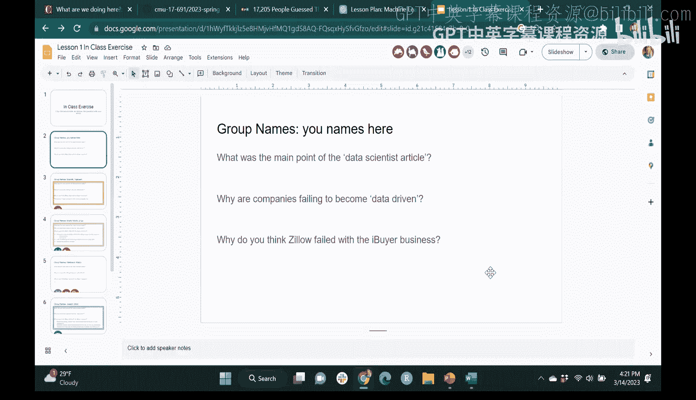

所以，你可以替换搜索引擎。它更易于访问。它更易于使用。它更易于交互。它更易于集成。它更易于定制。它更易于扩展。它更易于维护。它更易于更新。它更易于改进。它更易于测试。它更易于部署。它更易于监控。它更易于调试。它更易于优化。它更易于安全。它更易于隐私。它更易于合规。它更易于审计。它更易于报告。它更易于分析。它更易于可视化。它更易于解释。它更易于理解。它更易于学习。它更易于教学。它更易于研究。它更易于开发。它更易于创新。它更易于创造。它更易于发明。它更易于发现。它更易于探索。它更易于实验。它更易于验证。它更易于验证。它更易于确认。它更易于证明。它更易于证伪。它更易于反驳。它更易于支持。它更易于反对。它更易于辩论。它更易于讨论。它更易于交流。它更易于沟通。它更易于表达。它更易于描述。它更易于叙述。它更易于讲述。它更易于写作。它更易于阅读。它更易于聆听。它更易于观看。它更易于观察。它更易于感知。它更易于感受。它更易于思考。它更易于推理。它更易于判断。它