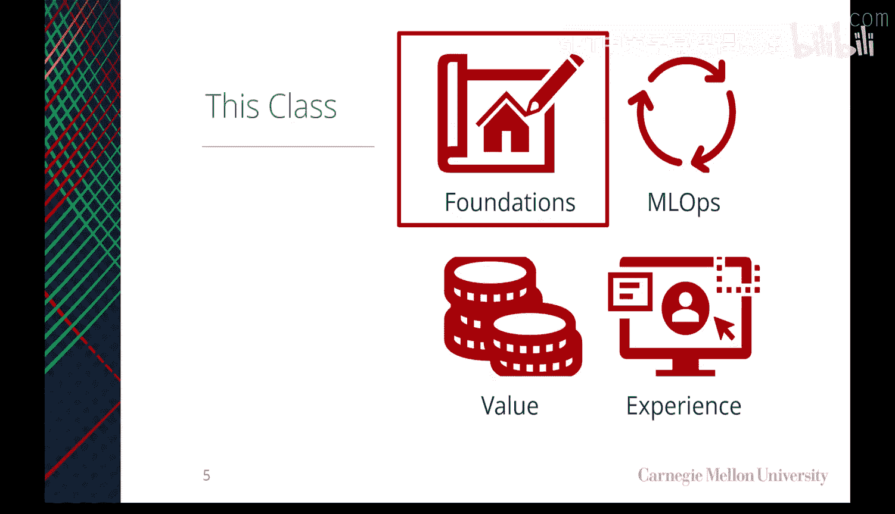
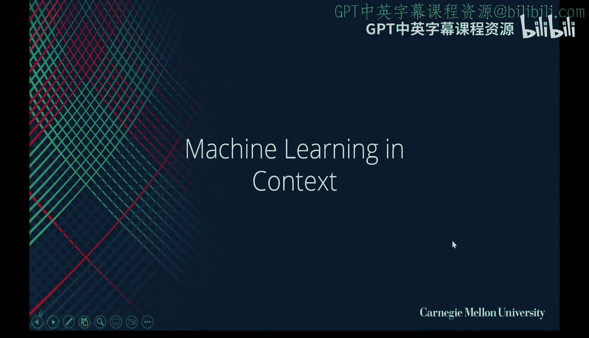
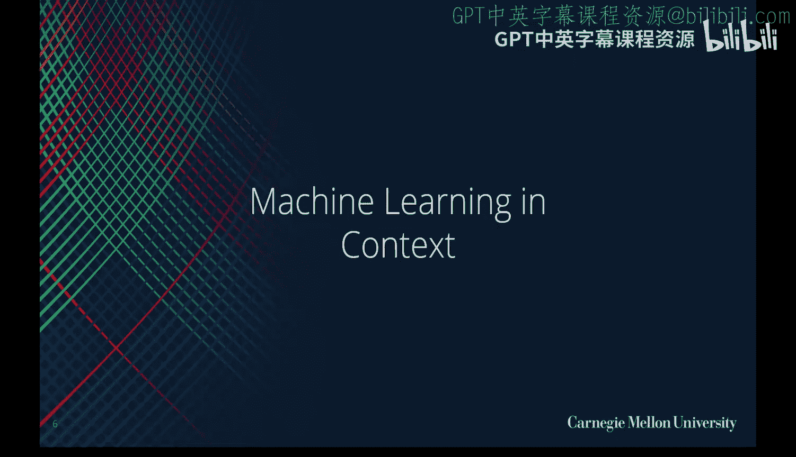

# 02：什么是好的机器学习产品

在本节课中，我们将探讨机器学习在产品和商业环境中的定位，并定义构成一个优秀机器学习产品的关键特征。我们将从基础概念入手，分析不同类型的数据产品，并通过实际案例来理解如何将机器学习有效地整合到产品中，以创造真正的用户价值。

## 机器学习在上下文中的角色

上一节我们概述了课程的整体结构，本节中我们来看看机器学习在更广泛的数据生态系统中的具体角色。

机器学习是数据产品这一大类中的一个子集。数据产品是指主要通过数据来体现其核心价值的产品。机器学习的作用在于，它并非简单地提供原始数据，而是通过算法从数据中提取洞察或进行预测，并将这些结果作为价值交付给用户。

当我们考虑构建数据产品时，通常存在一个从简单到复杂的演进路径。以下是不同类型数据产品的分类：

*   **描述性产品**：这类产品通常处理单一数据流，并以可视化的形式向用户展示“发生了什么”。例如，显示标准普尔500指数历史走势的股票价格图表。
*   **诊断性产品**：这类产品整合多个数据流，通过组合信息来讲述一个故事或解释原因。例如，在股票价格图表上叠加相关新闻事件，以解释市场波动的原因。它通常以仪表盘的形式呈现。
*   **预测性产品**：这是机器学习的核心领域。产品利用数学模型，基于多个数据流对未来结果进行预测。例如，基于新闻和市场数据预测标准普尔500指数的未来走势。
*   **规范性产品**：在预测的基础上，这类产品会进一步给出行动建议。例如，在预测股价下跌后，建议用户卖出或做空股票。
*   **人工智能产品**：这是最高级别的自动化，系统基于预测和规则自主做出决策并执行。例如，一个自动执行买卖指令的交易机器人。

随着产品类型从描述性向人工智能演进，计算机承担的计算工作越来越多，产品架构也变得更加复杂。一个优秀的机器学习产品可以位于这个光谱的任何位置，其核心价值在于提供准确且有意义的预测。

## 核心概念定义

在深入讨论产品特性之前，我们先明确几个基本术语，确保我们在同一层面进行交流。

*   **机器学习**：一个研究领域，关注如何让计算机通过经验（即数据）进行学习。
*   **应用机器学习**：使用自动化算法，通过预测性、规范性或人工智能产品来交付价值的过程。这涉及到将模型从开发环境部署到生产环境。
*   **人工智能**：一个研究领域，关注如何让计算机执行通常需要人类智能才能完成的任务，关键在于赋予计算机做出决策的“代理权”。
*   **深度学习**：机器学习的一个分支，利用大规模神经网络和数据集来构建模型，例如当前的大型语言模型。

在机器学习中，我们主要关注以下两种学习范式：

*   **监督学习**：这是产品中最常见的形式。我们收集带有标签的历史数据，训练一个模型，然后用该模型对新数据进行预测。随着新标签数据的收集，模型可以持续改进。
*   **无监督学习**：虽然不如监督学习常见，但在数据预处理和特征工程中可能发挥作用，以辅助监督学习过程。

## 优秀产品的关键特征

了解了机器学习的定位和基本范式后，我们现在可以聚焦于构成一个优秀机器学习产品的具体特征。

一个优秀的机器学习产品不仅仅是一个技术先进的模型，它是一个完整的、以用户为中心的解决方案。其核心特征包括：

*   **提供准确且有价值的预测**：模型的预测质量必须根据其解决的具体问题来定义。预测必须对用户有实际用处，无论是估计汽车价格、生成图像还是完成文本。
*   **拥有高质量的用户界面**：无论底层技术多么复杂，产品必须易于使用，直观地将机器学习的能力交付给用户。良好的用户体验是产品成功的关键。
*   **具备持续改进的能力**：产品应能通过用户交互收集新的数据，这些数据可以用来重新训练和优化模型，从而形成一个自我强化的“数据飞轮”或网络效应。产品应随时间推移而变得更好。
*   **架构可靠、可扩展、可维护且适应性强**：产品的技术基础必须稳固，能够处理用户增长，易于维护更新，并能适应未来的需求变化。
*   **明确机器学习组件的角色**：在产品设计中，需要明确机器学习是核心功能还是辅助功能；是主动提供服务还是响应用户请求；其运作对用户是可见的还是隐形的。

## 实践中的挑战与平衡

构建机器学习产品并非没有挑战。在实践中，需要在技术理想与工程现实之间取得平衡。

一个经典的例子是Netflix的推荐算法竞赛。Netflix悬赏100万美元征集更好的推荐算法。虽然竞赛产生了精度更高的模型，但最终获奖的复杂方案并未被投入生产。Netflix团队发现，离线评估中额外的精度提升，并不足以证明将其工程化、部署到生产环境所需付出的巨大努力是合理的。

这个案例揭示了机器学习产品化的一个关键原则：**一个在理论上精度略高的模型，如果无法被高效、可靠地集成到产品中，那么它对终端用户的价值可能为零**。产品的成功取决于预测准确性、工程可行性和用户体验三者的结合。

## 总结

本节课中，我们一起学习了机器学习在产品开发中的定位。我们明确了机器学习是数据产品的一种高级形式，其核心在于通过预测来交付价值。我们探讨了从描述性到人工智能的数据产品光谱，并定义了机器学习、人工智能等核心概念。最重要的是，我们总结了一个优秀机器学习产品的关键特征：它必须通过准确的预测来提供价值，这些预测需通过高质量的用户界面进行交付，并且产品本身应具备持续学习和改进的能力。记住，最终的成功不在于模型的复杂程度，而在于它是否为用户解决了真实的问题。