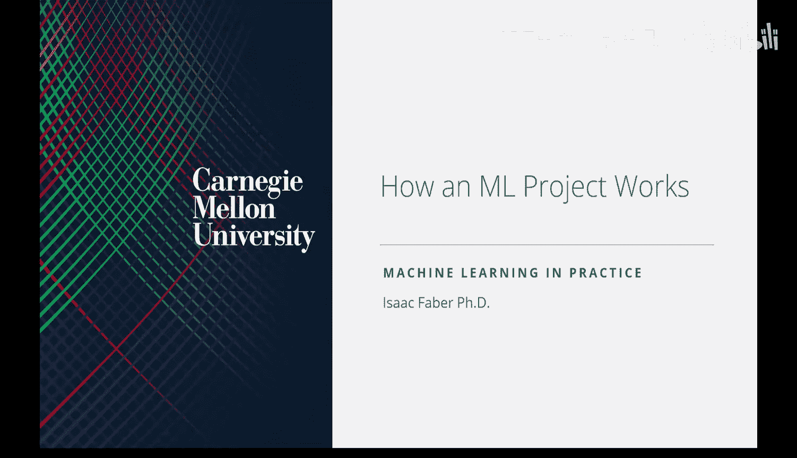

# 03：机器学习项目如何运作



在本节课中，我们将学习一个机器学习项目从构思到部署的完整工作流程。我们将重点探讨数据在其中的核心作用，以及如何将技术工作与商业价值清晰地联系起来。

## 项目启动与团队协作

在深入技术细节之前，我们需要完成一些准备工作。请确保你的小组已经提交了成员名单。项目提案即将截止，因此团队需要尽快开始沟通与合作。

此外，课程将开始安排课堂笔记记录员。笔记需要涵盖课堂讨论的主题和必读材料的概述，并在下次课前提交。

## 数据驱动项目的核心

上一节我们介绍了数据驱动项目的概念，本节中我们来看看它在机器学习项目中的具体体现。机器学习项目是数据驱动项目的一个子集，其核心特征是**数据**。

软件开发的范式正在从“软件1.0”向“软件2.0”演进。在“软件2.0”中，代码逻辑越来越多地由数据本身驱动，而非完全由程序员手动编写。这意味着，构建一个成功的机器学习产品，**数据质量和数据管道的建设**往往比模型架构本身更为关键。

企业利用机器学习解决的问题多种多样，从内容过滤、成本削减到欺诈检测和客户体验优化。无论目标是什么，组织都需要一个清晰的**数据战略**，即在构建具体模型之前，就系统地规划收集哪些数据、如何收集，并明确这些数据将如何为业务创造价值。

## 标准项目流程：CRISP-DM

为了系统化地开展数据项目，业界广泛采用一个称为**CRISP-DM**的标准流程。这是一个迭代循环，包含以下阶段：

1.  **业务理解**：明确商业问题和项目目标。
2.  **数据理解**：收集并初步探索可用数据。
3.  **数据准备**：清洗、转换数据，为建模做准备。
4.  **建模**：选择并应用各种建模技术。
5.  **评估**：评估模型是否满足业务目标。
6.  **部署**：将模型集成到业务环境中。

部署后产生的新数据和反馈，会再次流入“业务理解”阶段，开启新一轮循环。这个自我强化的过程也被称为**数据飞轮**：更多的用户带来更多的数据，更好的数据训练出更好的模型，更好的模型吸引更多的用户。

## 简化的工作流程与团队角色

对于本课程的小组项目，我们可以将上述流程简化为三个核心环节及对应的团队角色：


*   **数据收集与管理**：负责构建数据管道，获取和整理高质量数据。
*   **建模**：负责选择合适的算法，训练、评估和优化预测模型。
*   **用户界面/部署**：负责将模型集成到可用的产品中，让用户能够与之交互。

一个成功的初创产品原型，往往就是这三个环节紧密协作的成果。

## 关键第一步：定义问题与用户探索

整个流程的起点是**定义问题**。我们将其比喻为“驱散战争迷雾”——通过数据来减少决策中的不确定性。

在技术层面定义问题之前，必须进行**用户探索**。这是了解真实需求、确保产品能解决实际痛点的唯一途径。

以下是几种有效的用户探索方法：
*   **一对一访谈**：与潜在用户深入交流，了解他们的日常工作流程和痛点。
*   **焦点小组**：将一组目标用户聚集起来进行讨论。
*   **问卷调查**：以更广泛的规模收集用户反馈。
*   **最小可行产品测试**：构建一个简单的产品原型，让用户试用并收集反馈。

未能真正理解用户和他们的使用场景，是导致产品失败的最常见原因之一。

## 数据收集的实践考量

数据是项目的基石。在收集数据时，需要注意：

*   **利用公开数据**：许多网站（如雅虎财经）提供API或允许网络爬虫抓取公开数据。这是构建初始数据集的常用方法。
    ```python
    # 示例：使用 requests 库进行简单的网络请求（需遵守目标网站robots.txt协议）
    import requests
    response = requests.get('https://api.example.com/data')
    data = response.json()
    ```
*   **遵守规则**：务必检查目标网站的`robots.txt`文件和服务条款，确保爬取行为被允许。
*   **维护成本**：基于网络爬虫的数据管道非常脆弱，网站结构的任何改动都可能导致其失效，需要持续维护。
*   **数据标注**：对于监督学习，数据标注可能是一项昂贵且耗时的工作，需要在项目规划中提前考虑。

## 机器学习项目的具体步骤与挑战

将机器学习集成到产品中，通常涉及数据工程、数据科学和软件工程三个部分的协作。一个典型的机器学习项目流程包括：

1.  **问题定义**：确认项目解决真实用户问题，并与商业价值挂钩。
2.  **数据收集与标注**：获取并准备训练数据。
3.  **模型构建**：开发并训练机器学习模型。
4.  **部署与监控**：将模型集成到应用中，持续监控其性能并迭代优化。

在这个过程中，团队可能面临诸多挑战：
*   **问题范围过大**：试图一次性解决过于复杂的问题。
*   **数据可及性与标注困难**：无法获得可靠数据，或标注成本过高。
*   **缺乏支持扩展的架构**：原型无法支撑大规模用户访问。
*   **价值主张不匹配**：产品与组织的核心战略或用户需求脱节。

## 总结


本节课中我们一起学习了机器学习项目的完整运作流程。我们认识到，数据驱动项目，尤其是机器学习项目，有其独特的考量。项目的成功始于对**商业价值**的深刻理解和对**用户需求**的深入探索。**高质量的数据收集与管理**是构建有价值预测模型的基石。标准化的流程如CRISP-DM和“数据飞轮”概念，能帮助我们系统化地推进项目并实现持续改进。在接下来的课程中，我们将深入MLOps，学习如何将模型有效地投入生产并维持其长期价值。