# 04：你真的需要机器学习吗？🤔

在本节课中，我们将学习如何评估一个项目是否真的需要机器学习解决方案。我们将探讨机器学习项目的工作流程、如何选择合适的评估指标，以及一个至关重要的概念——建立性能基线。通过理解这些，你将学会在投入复杂模型之前，先用简单、低成本的方法验证问题的可行性和价值。

---

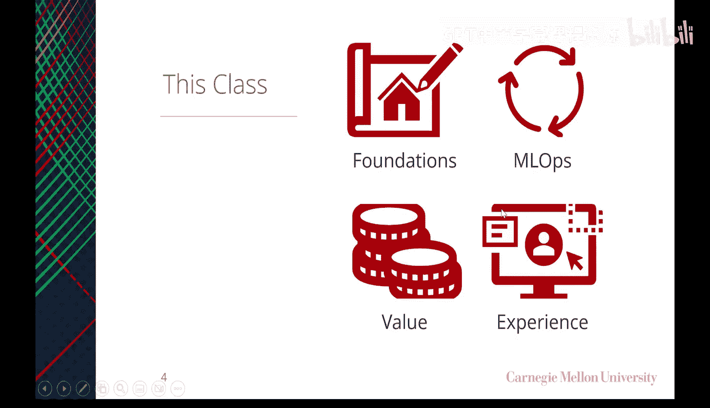

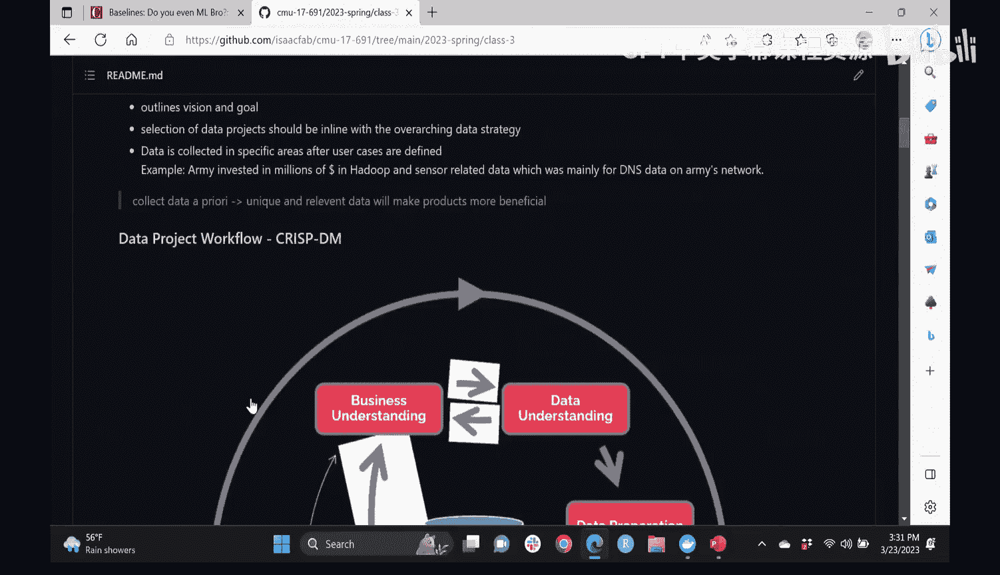

## 项目回顾与工作流程 🔄

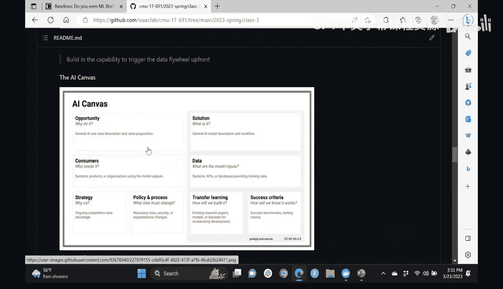

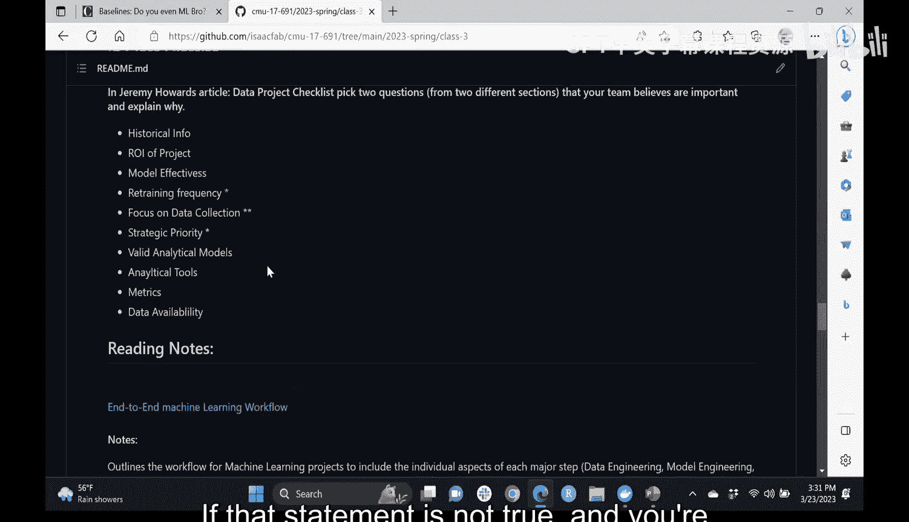

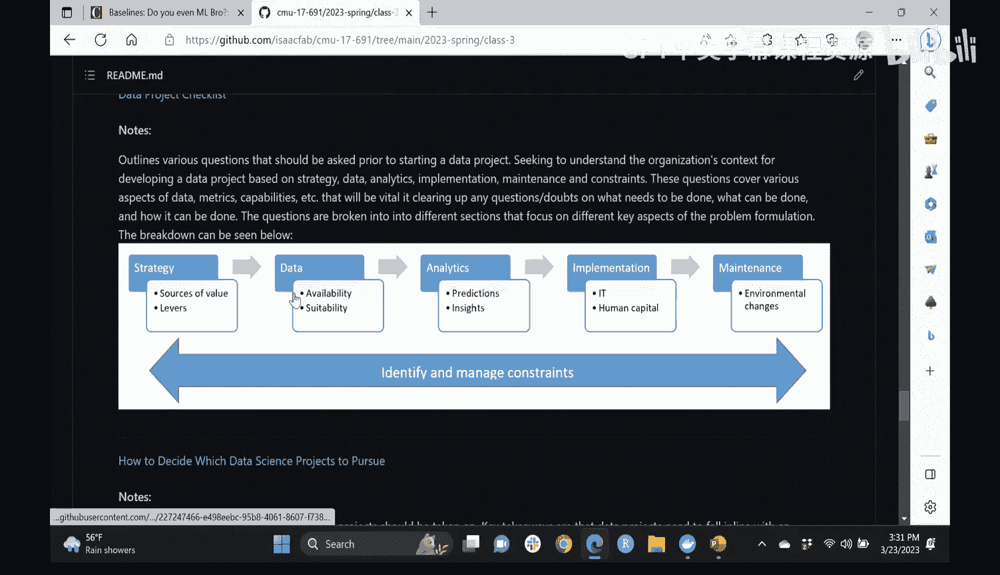

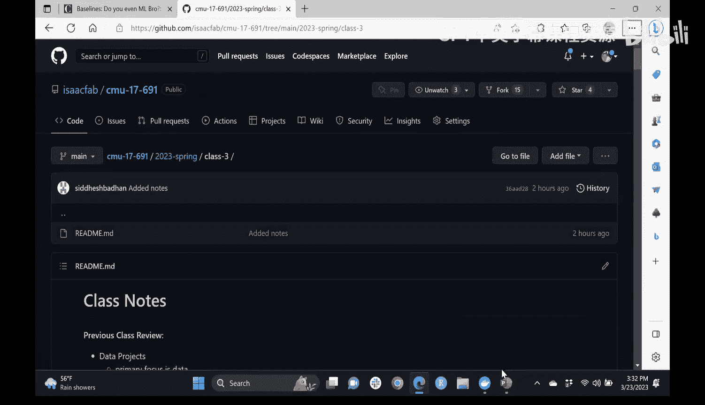

上一节我们介绍了机器学习项目的核心组件。现在，我们来回顾一下一个标准机器学习项目的工作流程。

一个典型的机器学习项目包含三个基本组成部分：**数据工程**、**数据科学**和**软件工程**。在本课程中，我们将主要关注前两者。

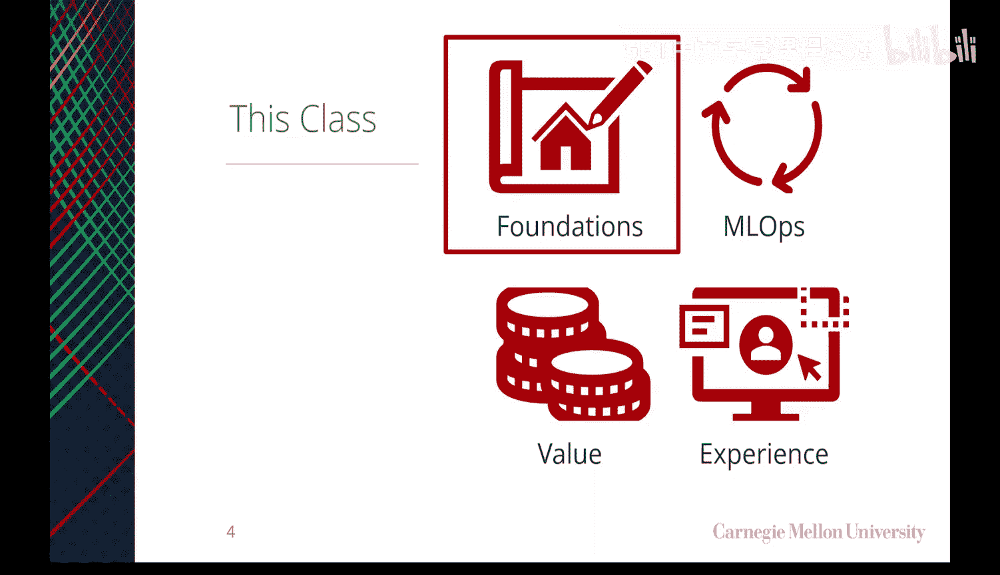

项目的工作流程始于一个植根于用户需求的问题。你需要通过用户发现过程来理解如何提供最大价值。流程如下：
1.  **问题定义与用户发现**：与潜在用户交流，了解他们的工作流程和痛点。
2.  **数据创建与整理**：通过数据管道收集、整理数据，并进行必要的标注。
3.  **模型开发**：基于数据构建和训练模型。
4.  **模型部署与监控**：将模型投入实际使用，并持续监控其性能。

这个流程是一个良性循环，其有效运行的关键在于持续评估模型产出的价值。如果模型的评估指标不能直接反映其为预期结果创造的价值，你就需要重新思考衡量标准。

---

## 评估指标与价值关联 📊

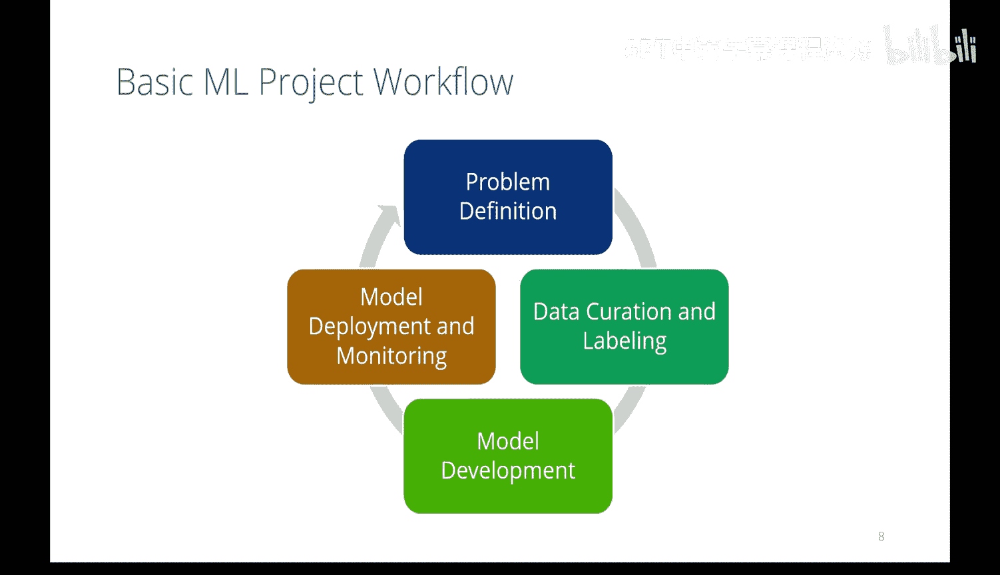

在开始构建模型之前，甚至在决定采用何种架构或方法之前，你应该先思考以下问题。

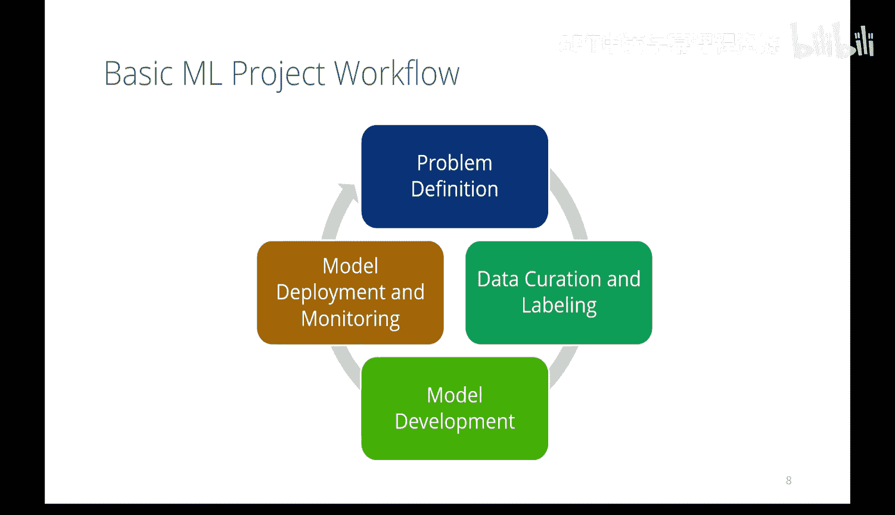

评估模型质量至关重要，但你必须先定义“质量”如何衡量。这不仅仅是选择一个数学上的损失函数。

例如，在大型语言模型的开发中，最初的训练可能基于复杂的损失函数，但最终的输出效果并不理想。通过引入**基于人类反馈的强化学习**，让人类评估和调整模型输出，才产生了质的飞跃。这说明，评估指标必须与人类对输出的感知价值相关联。

因此，选择指标时需要考虑：
*   **模型出错的成本**：是准确率更重要，还是减少假阳性或假阴性更重要？在商业场景中，总体准确率可能不错，但在自动驾驶场景中，漏检行人（假阴性）的代价是巨大的。
*   **模型对异常值的敏感度**：模型如何处理边缘情况？这在计算机视觉等领域仍是挑战。
*   **是否使用了正确的损失函数**：损失函数的选择是一门“艺术”，它需要根植于业务逻辑。例如，在回归问题中：
    *   使用**普通最小二乘法**会更多地受到异常值的影响。
    *   使用**最小绝对误差**则对异常值不那么敏感。
    *   选择哪种取决于异常值在你的业务场景中的影响程度。

---

## 混淆矩阵与常用指标 🧮

大多数人都熟悉混淆矩阵，它帮助我们在真正例、假正例等之间进行权衡。混淆矩阵能很好地指示“出错”的成本。

你可以从混淆矩阵中计算出一些常见指标：
*   **准确率**：`(TP + TN) / (TP + TN + FP + FN)`
*   **精确率**：`TP / (TP + FP)`
*   **召回率**：`TP / (TP + FN)`

以下是三个在同一数据集上训练的不同模型的指标对比示例：

| 模型 | 准确率 | 精确率 | 召回率 |
| :--- | :--- | :--- | :--- |
| 模型A | 72% | 67% | 71% |
| 模型B | 80% | 75% | 73% |
| 模型C | 76% | 80% | 65% |

哪个模型最好？这完全取决于模型的应用场景。例如，美国FDA对医疗AI设备的精确率和召回率有最低门槛要求。因此，理解业务背景是选择核心指标的关键。

你也可以组合多个指标，例如使用F1分数（精确率和召回率的调和平均数）、加权平均，或设定行业要求的最低阈值。

---

## 基线模型：你的第一个模型 🎯

在定义了问题、收集了一些数据并确定了质量指标后，你需要建立第一个模型——**基线模型**。

基线模型的目标是：以较低的成本和复杂度，快速验证问题的可行性，并为后续改进提供一个比较的基准。它不需要非常复杂，但应足以让你了解要达到目标性能所需的大致努力程度。

建立基线模型有多种方法，以下是一些常见策略：

*   **行业标准或已发表成果**：参考现有研究中的性能指标作为目标。但需注意，这些结果有时难以复现。
*   **启发式规则**：这是非常重要且常被忽视的方法。向领域专家请教，将他们长期积累的“经验法则”编码成规则。例如，在泰坦尼克号生存预测中，一个简单的启发式规则是：“如果是女性或儿童，则预测生存”。如果你的机器学习模型无法超越这个简单规则，那么你可能根本不需要复杂的ML。
*   **简单的机器学习模型**：避免一开始就使用深度学习。尽可能使用决策树等简单方法，只要其API与你未来的架构兼容即可。
*   **自动化机器学习**：如果你的问题确实需要深度学习，可以考虑使用AutoML工具来快速生成一个初始架构作为基线，而不是手动设计。

---

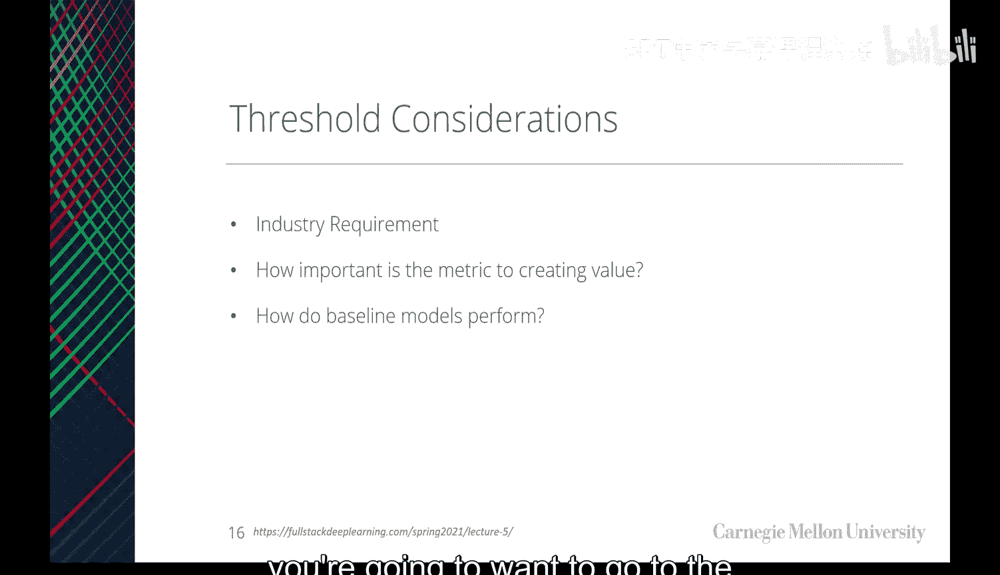

## 实践：构建启发式基线 👩💻

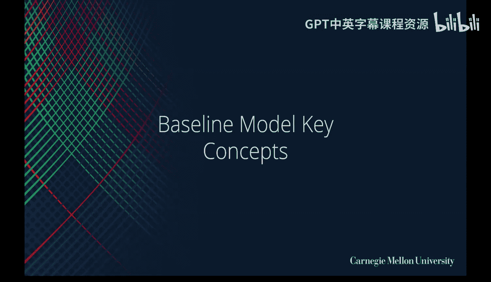

为了让大家更好地理解如何构建启发式基线，我们将在课堂上进行一个练习。

我们将使用泰坦尼克号数据集。你的任务是：编写一个比“所有女性生存”更好的启发式规则函数，并计算其准确率。

以下是步骤概要：
1.  从课程代码库的`in-class`文件夹获取Jupyter笔记本和数据文件。
2.  在Docker容器中运行笔记本，以确保环境一致。
3.  修改提供的启发式函数，尝试结合更多特征（如年龄、舱位等级等）来提升预测准确率。
4.  运行评估代码，查看你的规则性能。

通过这个练习，你会发现，一个精心设计的规则函数可以像机器学习模型一样被调用和评估，这为后续无缝切换到真正的ML模型打下了基础。

---

## 自动化机器学习简介 🤖

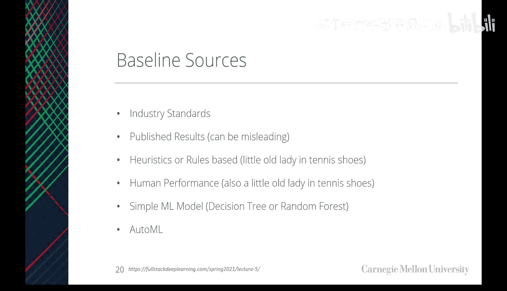

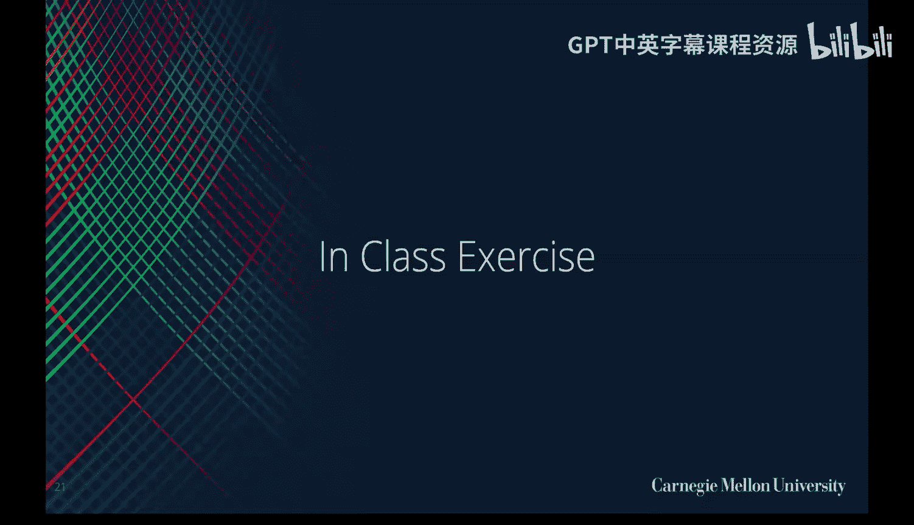

AutoML旨在自动化机器学习流程中的部分环节，特别是模型架构的搜索和优化，在深度学习领域常被称为**神经架构搜索**。

AutoML通常包含以下几个组件：
*   数据准备
*   特征工程
*   **模型生成（架构搜索）**
*   模型评估

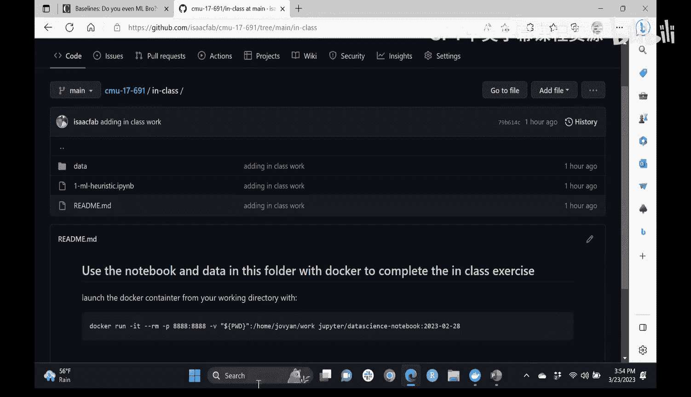

对于专家来说，手工设计的模型可能优于AutoML的结果。但对于初学者或需要快速建立基线的情况，AutoML是一个强大的工具。它可以为你提供一个不错的起点，让你无需深入架构细节就能获得一个可工作的模型。

需要注意的是，AutoML也可能引入偏见，或不一定能产生最优的初始架构，因此它更适合作为基线开发的辅助，而非最终解决方案。

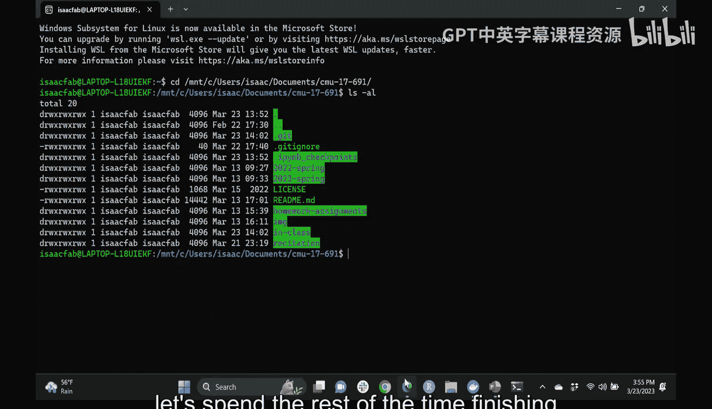

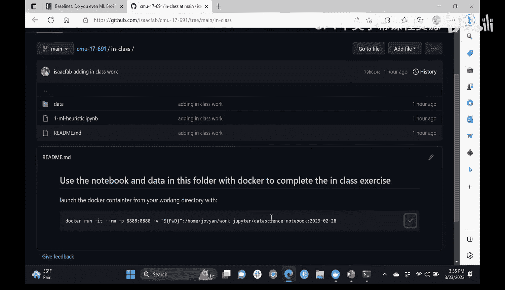

---

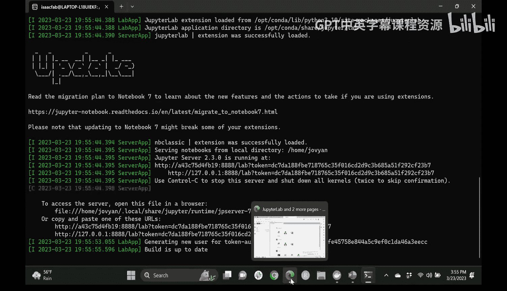

## 总结 📝

本节课我们一起学习了机器学习项目初期评估的关键步骤。

核心要点是：在投入复杂模型之前，务必先建立**基线**。一个优秀的基线通常始于对业务逻辑的深入理解，并将其编码成**启发式规则**。通过这种方式，你可以快速、低成本地验证问题的价值，并获得一个性能基准。

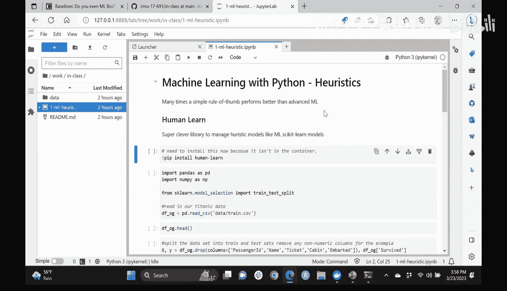

只有当简单的规则无法满足需求时，才需要考虑更复杂的机器学习方法。记住，我们的目标是解决问题、提供价值，而不是为了使用机器学习而使用它。