# 05：工具与基础设施（第二部分）

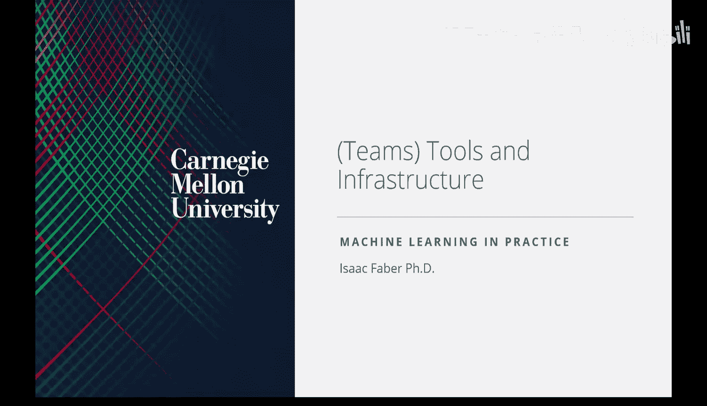

在本节课中，我们将学习机器学习项目中的团队协作、关键角色以及构建MLOps系统所需的核心工具和基础设施。我们将从MLOps的概述开始，然后探讨常见的团队成员角色、他们的协作方式，最后深入了解构成MLOps技术栈的各个组件。

## MLOps概述

上一节我们介绍了机器学习产品的基础概念。现在，我们来看看如何持续改进这些产品，这个过程就是MLOps。

MLOps是DevOps方法论在机器学习领域的扩展。它将机器学习与数据科学资产视为DevOps生态中的一等公民。DevOps是一套结合软件开发（Dev）与IT运维（Ops）的实践，旨在缩短系统开发生命周期，实现高质量的持续交付。

在MLOps中，这个循环的核心机制围绕机器学习展开：收集新数据、模型训练与质量评估、验证、部署以及通过反馈进行监控。这个基本流程构成了一个“数据飞轮”，是大多数生产级机器学习应用的工作方式。

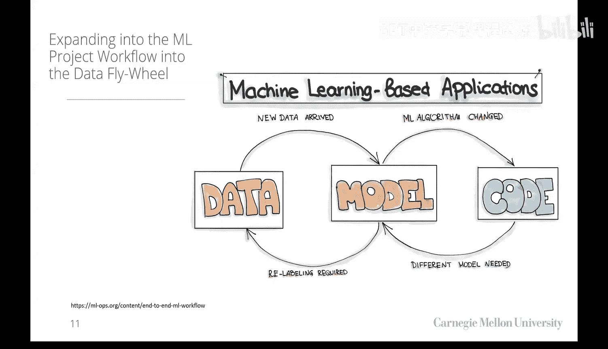

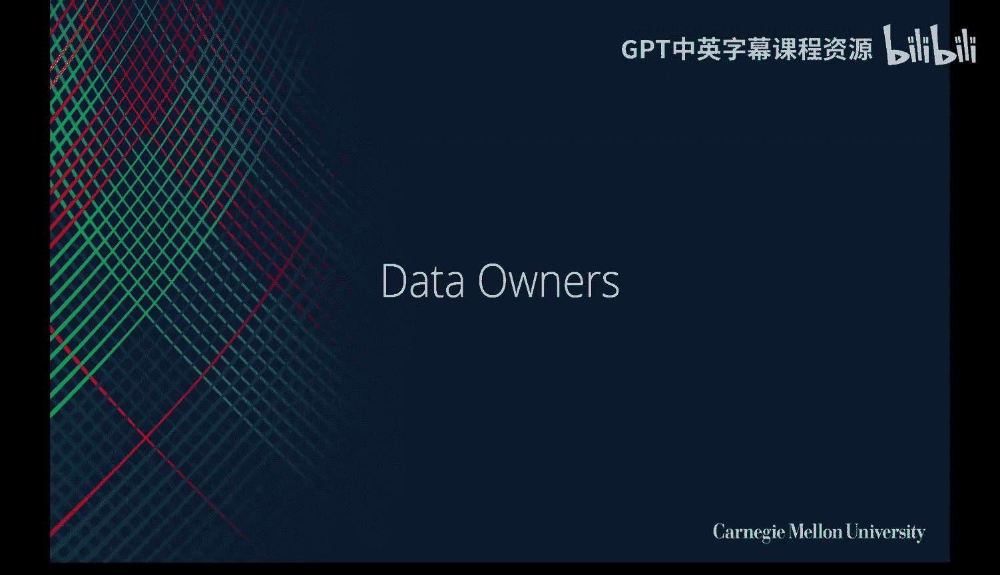

## 团队角色与协作

要成功运行一个MLOps项目，需要不同角色的团队成员紧密合作。以下是您可能会遇到的关键角色：

### 数据所有者与管理者

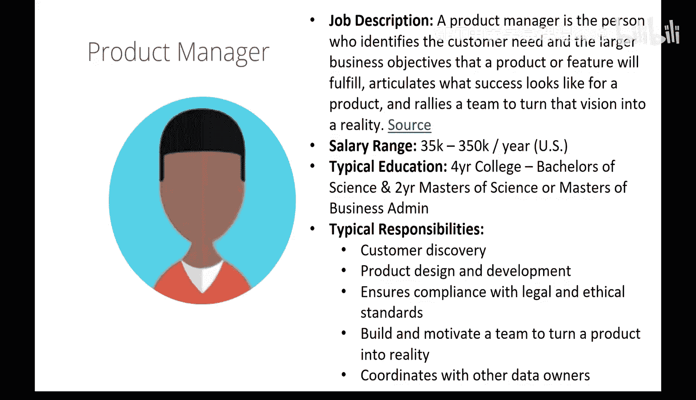

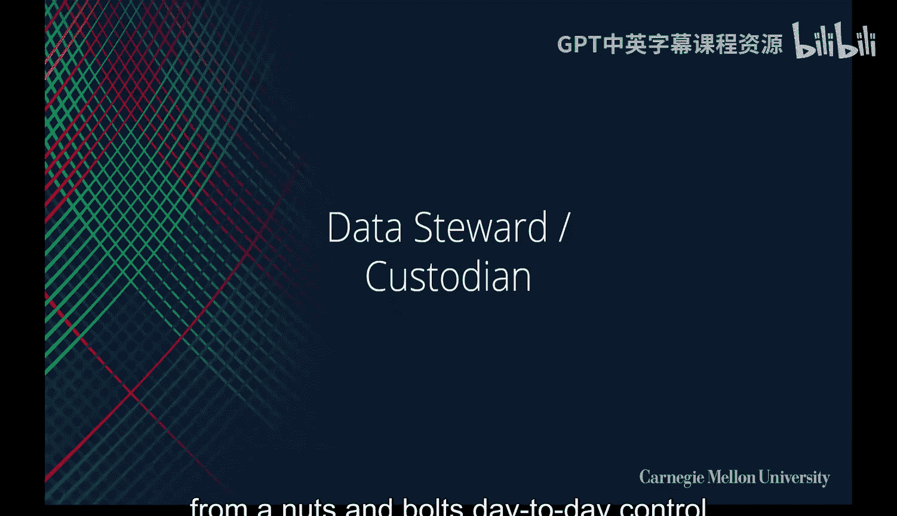

*   **首席信息官（CIO）**：负责组织内的整体技术战略、数据生态系统，并确保符合法律和伦理标准。他们通常是数据的最终所有者。
*   **首席数据官（CDO）**：通常隶属于CIO，专门负责数据聚合、管理策略以及数据访问与安全合规。
*   **系统所有者**：负责维护特定业务系统（如CRM、ERP）的人员。您需要从他们那里获取数据访问权限，并确保您的操作不会影响其系统性能。
*   **产品经理**：通常是MLOps项目的日常负责人，负责与用户沟通、确保产品提供价值，并领导产品开发过程。

### 数据使用者与构建者

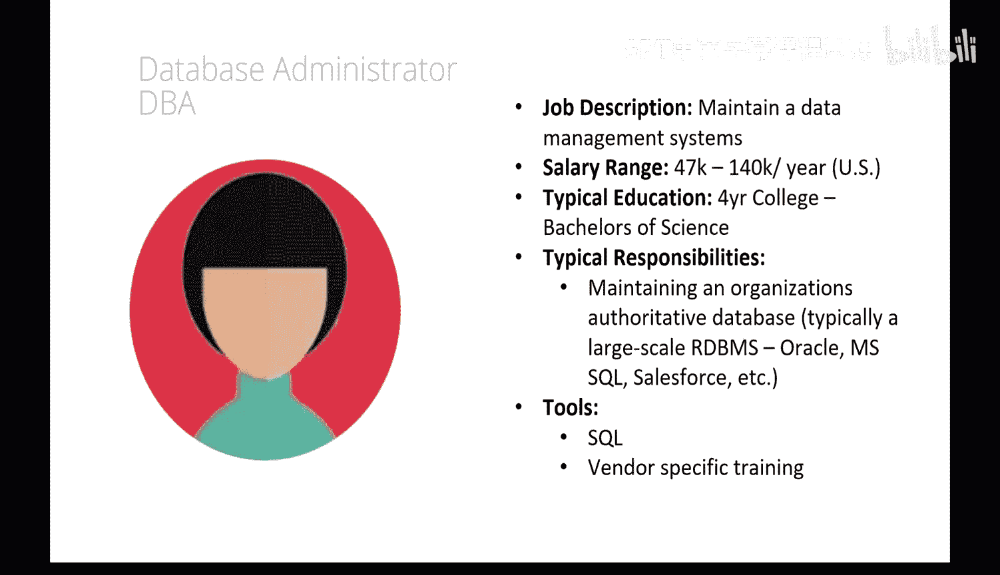

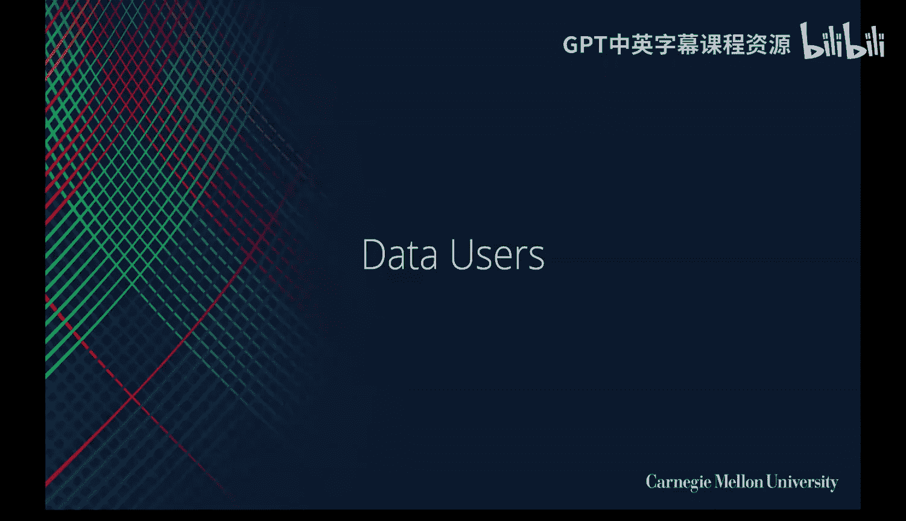

*   **数据工程师**：构建和维护数据管理系统（如数据库、数据仓库）和数据管道。他们通常精通Java和Python。
*   **数据库管理员（DBA）**：管理和维护大型关系数据库系统，控制数据访问权限。
*   **数据分析师**：通过商业智能工具（如Tableau）查询和分析数据，为业务问题提供洞察。他们是了解数据细节的重要资源。
*   **数据科学家**：通常拥有统计学背景，专注于通过统计建模和假设检验提供决策支持，产出多为分析报告或一次性模型。
*   **机器学习工程师**：设计与构建可投入生产的机器学习模型以解决业务挑战。目标是自动化预测过程，并将其集成到软件产品中。他们更侧重于模型的工程化、部署和持续迭代。

### 软件开发者

负责构建和部署最终应用程序（如网站、移动应用）。优秀的软件开发者、机器学习工程师和数据工程师的组合是打造出色产品的关键。

## 机器学习项目的协作工具

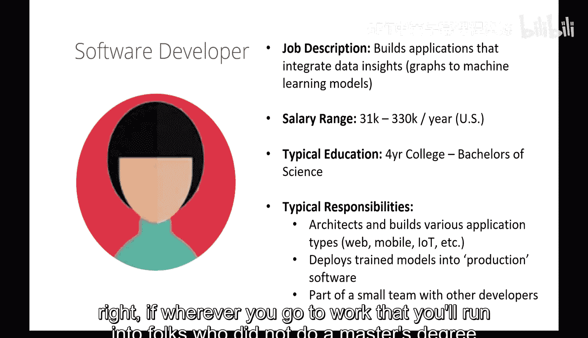

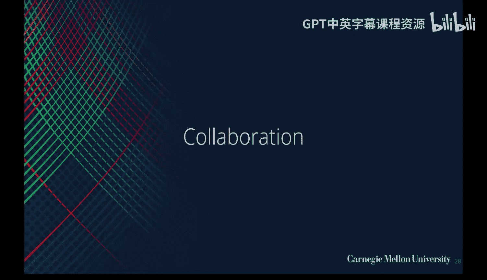

由于机器学习项目的工作流程（如探索性、实验性）与传统软件开发不同，其协作工具也存在差异。

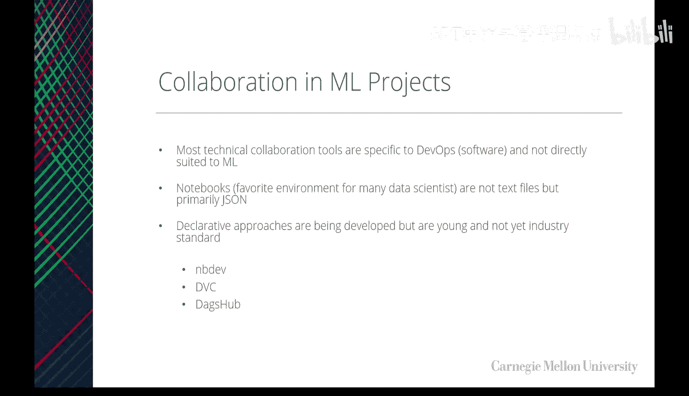

以下是机器学习项目中常用的协作工具：

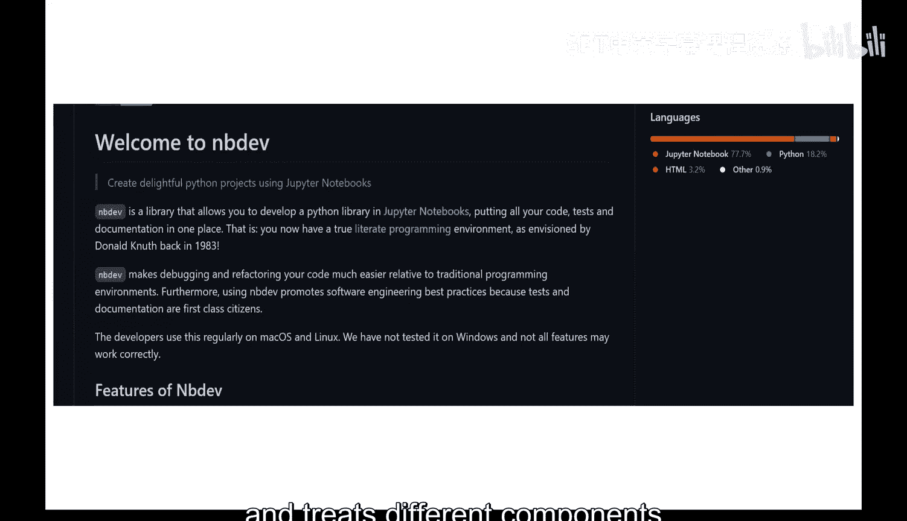

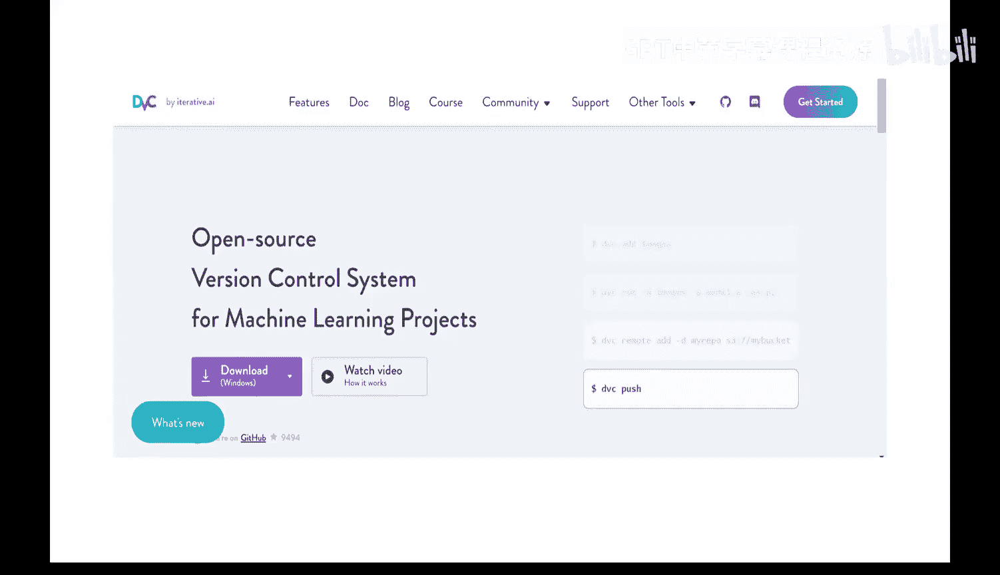

*   **Jupyter Notebooks与版本控制**：机器学习开发主要在Jupyter Notebook中进行，但Notebook文件（JSON格式）与传统的Git版本控制系统配合不佳。**nbdiff** 等工具可以帮助更好地对Notebook进行版本控制。
*   **数据版本控制**：模型性能依赖于训练数据，因此对数据集进行版本管理至关重要。**DVC（Data Version Control）** 是一个流行工具，它像管理代码一样管理数据和模型文件，跟踪数据集的变更历史。
*   **一体化协作平台**：**DAGsHub** 是一个专为机器学习项目设计的协作平台，集成了Git、DVC、实验跟踪和模型注册等功能，类似于“机器学习版的GitHub”。

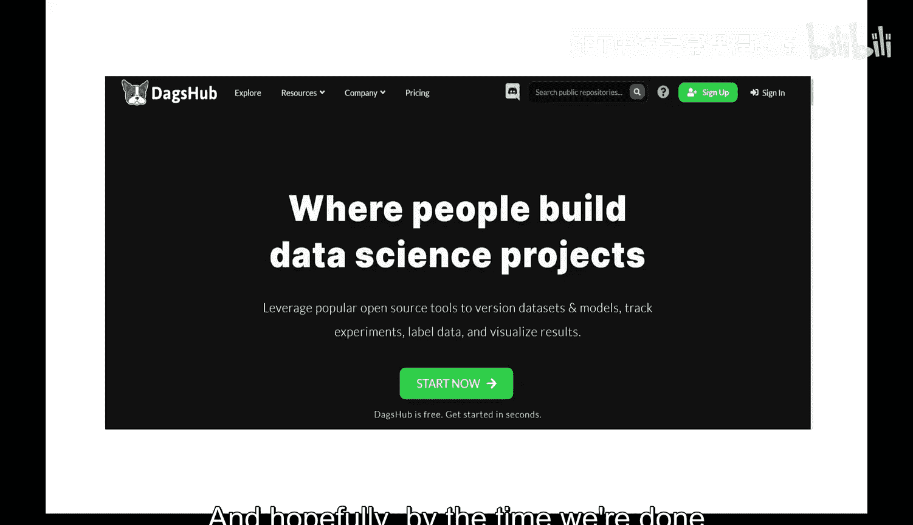

## MLOps基础设施栈

机器学习系统不仅包含模型代码，还需要大量支持性组件。一个典型的MLOps技术栈可以分为三大领域：数据管理、模型开发和软件部署。

以下是一个基础的基础设施栈框架，您需要为您的产品决定每个框内的具体技术选型：

```
基础设施层
├── 计算资源（云服务器、容器编排）
├── 存储资源（对象存储、数据库）
└── 网络与安全
```

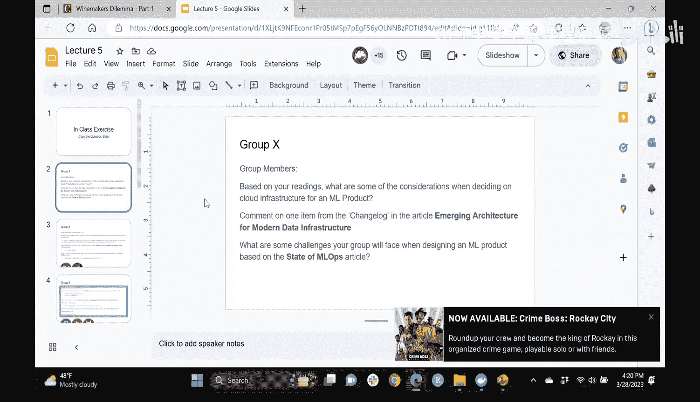


```
平台与服务层
├── 数据工程
│   ├── 数据管道编排（如 Apache Airflow）
│   ├── 数据处理（如 Spark, dbt）
│   └── 数据仓库/湖（如 Snowflake, BigQuery）
├── 模型开发
│   ├── 开发环境（如 JupyterLab, VS Code）
│   ├── 实验跟踪（如 MLflow, Weights & Biases）
│   └── 特征存储（如 Feast）
└── 软件部署
    ├── 持续集成/持续部署（CI/CD，如 GitHub Actions, Jenkins）
    ├── 模型服务（如 TensorFlow Serving, TorchServe）
    └── 监控与日志（如 Prometheus, Grafana）
```

```
应用层
├── 数据标注工具
├── 模型监控仪表盘
└── 最终用户应用程序
```

在数据工程领域，关键的组件包括：
*   **数据源（Sensors）**：API、数据库、日志文件等。
*   **数据管道**：负责数据提取、转换和加载（ETL）的任务序列。
*   **管道编排**：调度和监控数据管道（例如使用Apache Airflow）。
*   **数据存储**：存储原始和处理后数据的地方（数据湖、数据仓库）。
*   **数据版本控制**：管理数据集和模型的版本。

## 总结

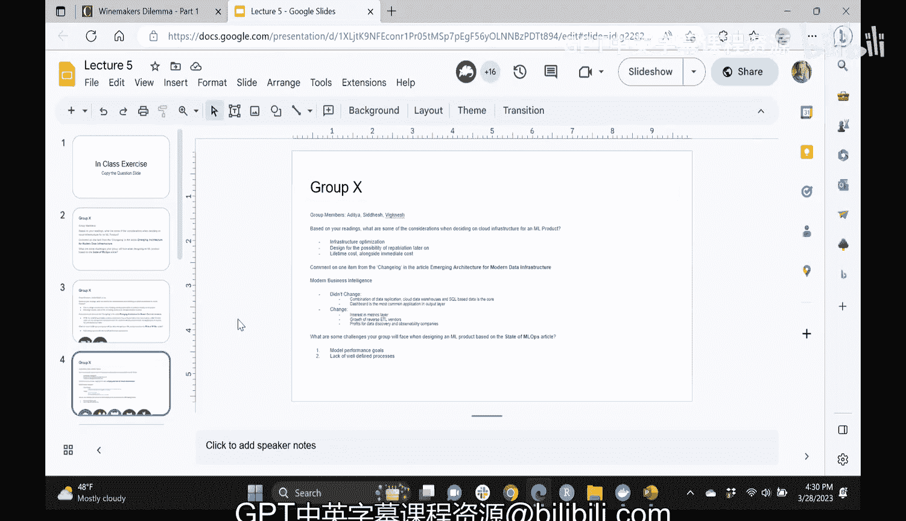

本节课我们一起学习了构建和维护生产级机器学习系统所需的人员、流程和工具。我们了解到MLOps是实现机器学习模型持续改进的工程实践，它需要数据工程师、机器学习工程师和软件开发者等多个角色的协作。由于机器学习项目的特殊性，我们需要使用像DVC、nbdiff和DAGsHub这样的专门工具来管理代码、数据和实验。最后，我们介绍了一个结构化的MLOps基础设施栈，它涵盖了从数据管理到模型部署和监控的所有关键环节，为您设计和规划自己的机器学习系统提供了清晰的蓝图。