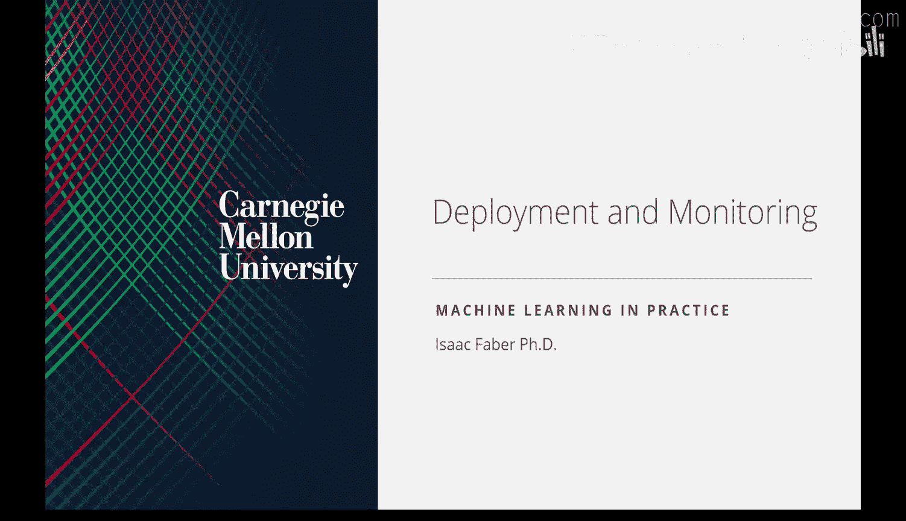
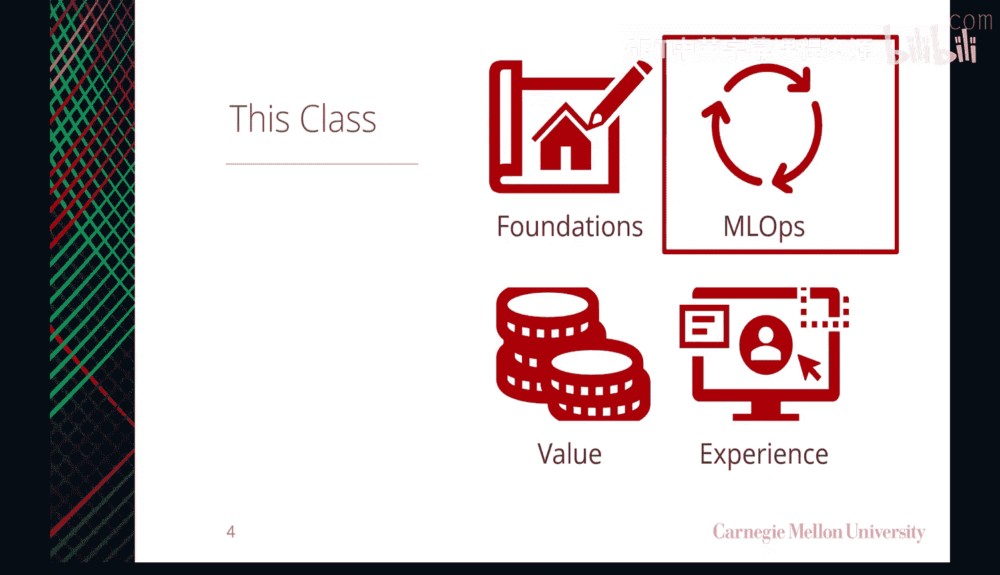
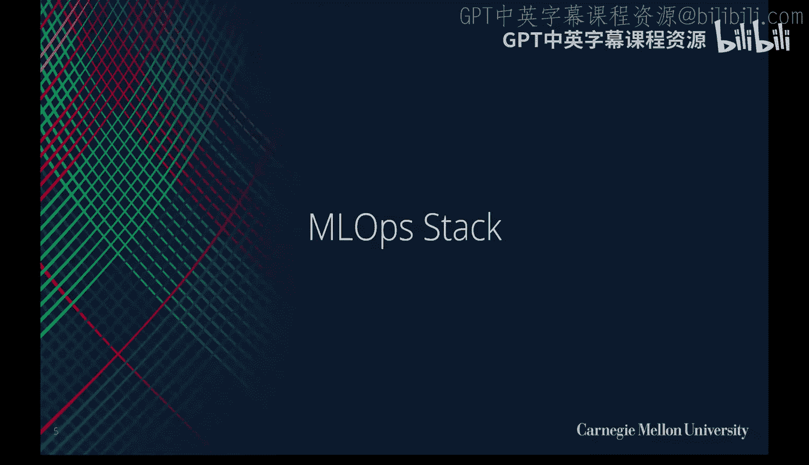
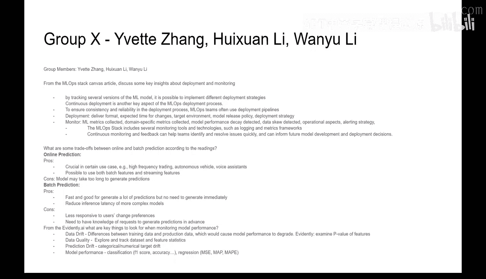

# 06：模型部署与监控

在本节课中，我们将学习机器学习模型部署与监控的核心概念。我们将回顾MLOps技术栈，并深入探讨如何将训练好的模型转化为实际产品，以及如何持续监控其性能。

## MLOps技术栈回顾与课程安排

上一节我们介绍了MLOps的基本流程。本节中，我们来看看本周的具体安排和课程背景。

首先，关于辅导课安排：
*   周三下午进行了一次关于封装常见API的Docker容器的辅导课。
*   应学生要求，计划在下周三增加一次关于迁移学习和使用PyTorch训练自定义模型的辅导课。

其次，关于课程作业与项目：
*   第一个个人作业将于下周二截止。
*   项目提案已收到，将在作业截止前提供反馈。反馈重点在于项目范围是否合理，是否涵盖了数据收集、数据飞轮、价值主张和客户定义等已学主题。
*   后续将有一个非计分的最终项目检查点。

## 模型部署：策略与架构

在机器学习工程流程中，我们将工作分解为数据工程、数据科学和软件开发三部分。部署与监控是独特的MLOps环节，它关乎将模型打包并投入产品，同时获取反馈。不同的架构选择会影响成本和性能。

以下是主要的模型部署策略：

**1. 批量预测**
在这种策略中，模型会预先计算所有可能的预测结果并存入数据库。当用户请求时，应用只需进行快速的数据库查询。
*   **公式**： `预测 = 查询(数据库[预计算表])`
*   **优点**： 用户体验快，推理时间与用户请求分离。
*   **缺点**： 仅适用于可穷举的、有限的预测场景（如Zillow房价估算）。
*   **适用场景**： MVP产品初期，用户选项有限。

**2. 实时推理（模型在服务器端）**
当无法预先计算所有预测时，需要实时推理。最常见的方式是将模型作为应用服务的一部分部署在服务器上。
*   **代码**（概念）： `客户端请求 -> 应用服务器 -> 模型服务 -> 返回预测`
*   **优点**： 灵活，可处理动态、无限的预测请求。
*   **缺点**： 基础设施和管理成本高，模型故障可能影响整个应用（如ChatGPT服务中断）。

**3. 模型即服务**
这种策略将模型解耦为一个独立的服务，通过API与主应用通信。它可能由独立的团队维护，并可被多个应用调用。
*   **优点**： 易于扩展，技术栈独立，类似OpenAI API的工作方式。
*   **缺点**： 依赖第三方或需自行维护完整服务，在中小规模下可能优势不明显。

**4. 边缘部署**
将模型直接部署在终端设备上，如手机或物联网设备。
*   **优点**： 低延迟，隐私性好，可离线工作。
*   **缺点**： 受设备硬件限制，模型通常需要优化和剪裁，可能损失精度。
*   **常用工具**：
    *   **TensorFlow Lite / PyTorch Mobile**: 用于移动端的优化框架。
    *   **Core ML**: 苹果的机器学习框架，便于在iOS生态中集成。
    *   **NVIDIA Jetson**: 用于自主开发IoT设备的开发套件。

## 部署技术实践

从“拥有一个模型”到“部署一个模型”是关键的软件化步骤。当前最主流的方式是将模型封装为微服务。

**主流方法：容器化微服务**
1.  使用 **Flask/FastAPI** 编写模型服务API。
2.  使用 **Docker** 将API和模型打包成容器。
3.  使用 **Kubernetes** 等工具管理容器编排。
4.  这种方法在可维护性和可靠性上表现很好，覆盖了95%以上的实际应用场景。

**模型格式标准化**
为了便于移植和部署，常将不同框架的模型转换为通用格式。
*   **ONNX** 是当前最流行的开放模型格式。
*   **代码**（概念）： `PyTorch/TensorFlow模型 -> 导出为ONNX格式 -> 封装至Docker容器 -> 部署`

## 模型监控

模型部署后，其性能可能不符合预期，因此监控至关重要。核心问题是**数据漂移**，即输入数据分布随时间发生显著变化。

**漂移的类型**
*   **瞬时漂移**： 部署后性能立即变化，表明训练与生产环境存在根本差异。
*   **渐进漂移**： 性能随时间缓慢下降，表明环境持续变化，需调整重训练策略。
*   **周期性漂移**： 性能周期性变化（如昼夜、性别差异），提示数据收集存在盲区。
*   **临时漂移**： 由系统突发冲击（如事故、活动）导致，属罕见事件。

**监控内容与难度**
监控的深度和广度需要权衡：
1.  **模型指标**： 准确率、精确率等。需要详细日志，测量成本较高。
2.  **业务指标**： 用户留存、转化率等。通常为聚合数据，较易测量。
3.  **特征分布**： 检测输入数据漂移。可通过统计抽样进行，成本适中。
4.  **系统性能**： API响应延迟、吞吐量。非常容易测量。

**漂移检测方法**
检测漂移本质上是统计假设检验。
1.  **可视化检查**： 直接观察分布图表。
2.  **配对T检验**： 比较两个时间窗口数据的均值差异。推荐使用。
3.  **K-S检验**： 比较两个分布的整体差异。
4.  **距离度量**： 计算分布间的距离（如p-范数）。

**实施监控**
在将模型打包为服务时，必须内置**日志记录**功能，用于收集预测结果、输入特征和性能指标。工具如 **MLflow** 能自动化此过程。

## 课堂练习总结

在小组讨论中，我们探讨了以下核心见解：

**关于部署**
*   部署前需明确目标、受众和方式（全量/部分更新）。
*   在批量预测与在线预测间权衡：批量预测适合结果可延迟、请求可枚举的场景（如Netflix推荐）；在线预测适合实时性要求高、请求动态的场景，但成本更高。
*   发布策略应与监控指标（如性能衰减阈值）联动，以触发重训练。

**关于监控**
*   监控旨在确保模型持续表现符合预期，并预警数据漂移。
*   除了监控模型性能，还需监控**数据管道**的完整性，防止上游数据异常导致模型失效。
*   自动化监控和部署管道便于快速回滚。
*   监控可触发模型重训练，例如当收集到大量新标注数据时，可通过**影子部署**先测试新模型性能。

**关于权衡**
*   在线预测虽灵活，但会引入无法预先审查所有输出的风险，可能导致模型产生意外行为。
*   边缘部署需在模型复杂度、精度与设备资源间取得平衡。
*   成本是关键的权衡因素，需确保产品运营成本可控。

## 总结

本节课中我们一起学习了机器学习模型部署与监控的全过程。

我们首先回顾了部署在MLOps流程中的位置，然后深入探讨了多种部署策略：从**批量预测**、**实时推理**、**模型即服务**到**边缘部署**，并分析了各自的优缺点和适用场景。我们了解到，将模型容器化为微服务是当前最主流的实践方式。

接着，我们强调了**模型监控**的重要性。模型性能在部署后可能因**数据漂移**而下降。我们学习了漂移的几种类型（瞬时、渐进、周期性、临时）以及如何通过统计方法（如T检验、K-S检验）进行检测。监控内容涵盖模型指标、业务指标、特征分布和系统性能，需要根据产品需求进行权衡和实施。

最后，通过课堂讨论，我们整合了这些概念，思考了在实际产品中如何根据需求选择部署方案、建立监控体系，并管理相关的成本与风险。记住，部署不是终点，而是一个通过持续监控和迭代来维持模型价值的开始。