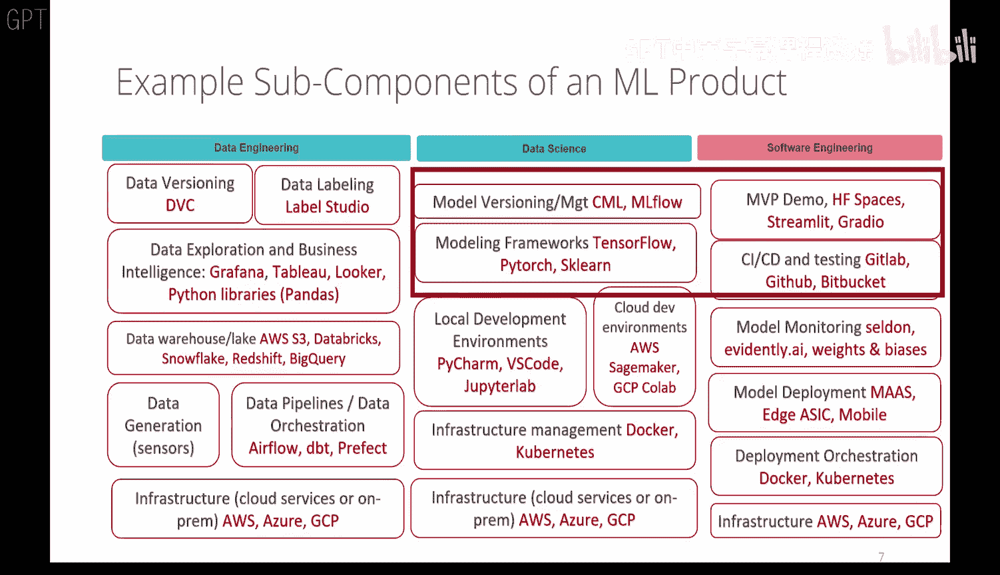
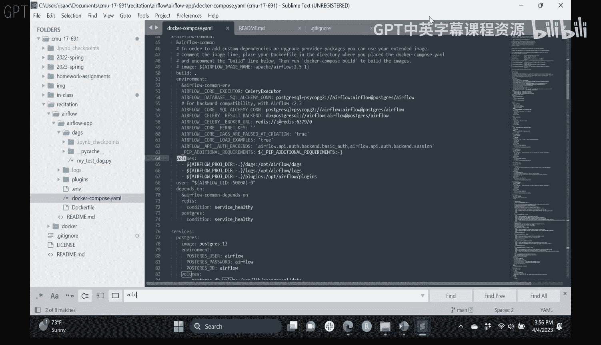

# 07：测试与可解释性（第二部分） 🧪

在本节课中，我们将继续探讨机器学习运维（MLOps）栈中的关键环节：测试与可解释性。我们将了解为什么模型的可解释性至关重要，以及如何构建有效的测试策略来确保模型在生产环境中的可靠行为。

---

## 概述 📋

上一节我们介绍了可解释性的基本概念及其重要性。本节中，我们将深入探讨可解释性模型与黑盒模型的区别，并学习如何为机器学习系统设计全面的测试方案。

---

## 可解释性模型与黑盒模型

机器学习模型在可解释性上存在一个明显的二分法。一些经典模型在设计之初就考虑了可解释性，而许多现代复杂模型则更像“黑盒”。

### 可解释模型的特点

以下是可解释模型通常具备的几个特征：

*   **线性**：模型系数与输出成比例。例如，线性回归模型 `y = β₀ + β₁x₁ + ... + βₙxₙ` 中，系数 `βᵢ` 直接反映了特征 `xᵢ` 对输出 `y` 的影响。
*   **单调性**：模型系数变化方向一致。这意味着特征值增加，预测输出总是朝同一个方向变化。
*   **可包含特征交互**：模型可以轻松地纳入并解释特征之间的相互作用。

最常见的可解释模型包括线性回归、逻辑回归和决策树。它们允许我们直接理解模型做出决策的依据。

### 黑盒模型与可解释性挑战

诸如集成方法（随机森林、梯度提升）和深度神经网络等模型，虽然通常具有更强的预测能力，但其内部工作机制难以直接理解。这就是所谓的“黑盒”问题。

当模型应用于自动驾驶、医疗诊断或司法系统等高风险领域时，仅仅知道模型“表现良好”是不够的。我们必须能够解释**为什么**模型会做出某个特定决策，这既是监管要求，也是建立用户信任和排查模型缺陷（如数据偏见）的关键。

为了解决黑盒模型的可解释性问题，研究者们开发了多种**事后（Post-hoc）解释方法**。这些方法在模型训练完成后，通过分析其输入输出来推断其行为逻辑。

---

## 可解释性方法的分类

在应用事后解释方法时，需要考虑几个关键维度：

*   **模型特定 vs. 模型无关**：有些方法只适用于特定类型的模型（如针对神经网络的激活最大化），而另一些（如LIME、SHAP）则可以应用于任何黑盒模型。
*   **全局解释 vs. 局部解释**：这是最重要的区分之一。
    *   **全局解释**旨在描述模型的**整体行为**，例如哪些特征对模型的预测总体上最重要。这有助于理解模型的平均表现。
    *   **局部解释**则关注**单个预测实例**，解释模型为何对某个特定输入做出特定输出。这对于调试边缘案例或向用户解释某个具体决策至关重要。

一个常见的例子是，在医疗诊断中，我们可能既需要全局解释来了解模型整体上依赖哪些指标，也需要局部解释来向一位特定患者说明其诊断结果的依据。

---

## 机器学习测试策略

测试是确保机器学习系统在生产环境中可靠、安全运行的另一支柱。与测试传统软件不同，机器学习测试需要覆盖数据、模型和代码三个层面。

### 测试内容

以下是构建测试方案时需要考虑的核心方面：

*   **数据测试**：确保输入数据的格式、质量和分布符合预期。这包括检查数据漂移，防止模型因输入数据变化而性能下降。
*   **模型测试**：验证模型本身的行为。
    *   **功能测试**：模型在常见输入下是否产生预期输出？
    *   **行为测试**：模型在极端或特殊情况下是否表现合理？
    *   **边缘案例测试**：专门测试模型决策边界附近的情况，这是发现模型弱点的关键。
*   **代码/集成测试**：确保将模型集成到整个应用系统后，代码逻辑正确，API调用正常。

### 测试时机

测试应贯穿机器学习系统的整个生命周期：

*   **开发与实验阶段**：采用类似测试驱动开发（TDD）的理念，在模型迭代过程中持续验证。自动化实验跟踪工具（如MLflow）在此阶段非常有用。
*   **部署阶段**：
    *   **A/B测试**：比较新模型与旧模型的实际表现。
    *   **金丝雀发布**：将新模型先部署给一小部分用户，观察效果。
    *   **影子部署**：让新模型并行处理生产流量，但其预测结果不影响实际业务，仅用于对比验证。

---

## 总结 🎯

本节课我们一起学习了机器学习中测试与可解释性的核心概念。

我们认识到，模型的可解释性并非“锦上添花”，而是在许多高风险或受监管应用中的**必需品**。根据需求选择可解释模型或为黑盒模型配备事后解释工具，是系统设计的重要决策。

同时，健全的**测试策略**是模型可靠性的基石。我们需要超越传统的代码测试，构建覆盖数据、模型推断和系统集成的端到端测试框架，并在开发、部署和监控的全周期中贯彻测试实践。

将可解释性与测试相结合，不仅能提升模型性能、规避风险，更是构建可信、负责任的人工智能系统的关键步骤。