# 09：使用 Docker Compose 编排 Airflow 数据管道


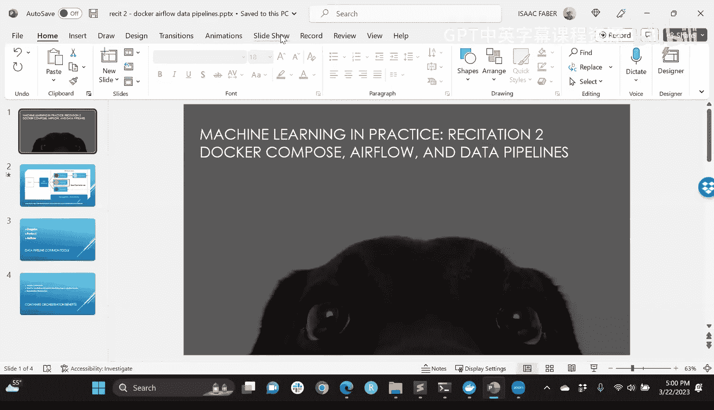

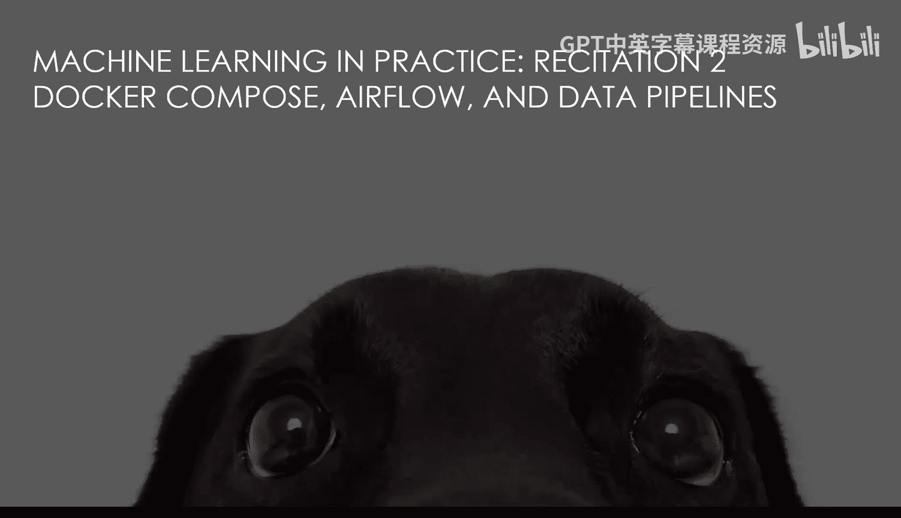

在本节课中，我们将学习如何使用 Docker Compose 来编排多个 Docker 容器，并部署一个名为 Airflow 的流行数据管道管理工具。我们将从 Docker 的单容器概念扩展到多容器应用，理解微服务架构如何帮助管理和监控复杂的机器学习数据工作流。

## 概述

上一节我们介绍了 Docker 容器的基础知识。本节中，我们来看看如何将多个容器组合成一个协同工作的应用程序，这个过程称为容器编排。我们将以 Apache Airflow 为例，这是一个用于编排、调度和监控批处理工作流的开源平台，在数据工程和机器学习项目中非常常见。

## 从 Docker 到 Docker Compose

Docker 容器代表了应用程序中的独立组件。当多个组件需要协同工作时，我们就需要容器编排。Docker Compose 是一个工具，允许我们使用一个 YAML 配置文件来定义和运行多个 Docker 容器，使它们能够像单个应用程序一样相互通信。

以下是 Docker Compose 的核心概念，通过一个 YAML 配置文件来定义：

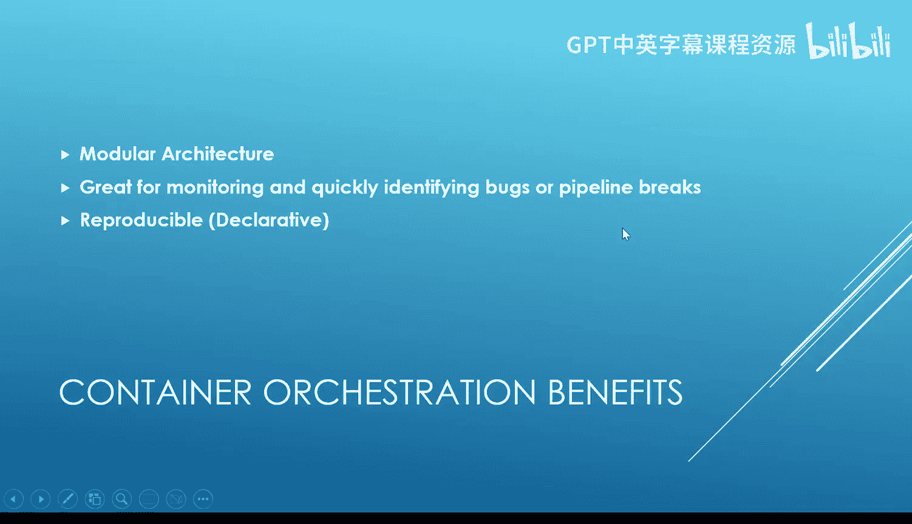

```yaml
version: '3'
services:
  webserver:
    image: apache/airflow:latest
    ports:
      - "8080:8080"
  postgres:
    image: postgres:13
```

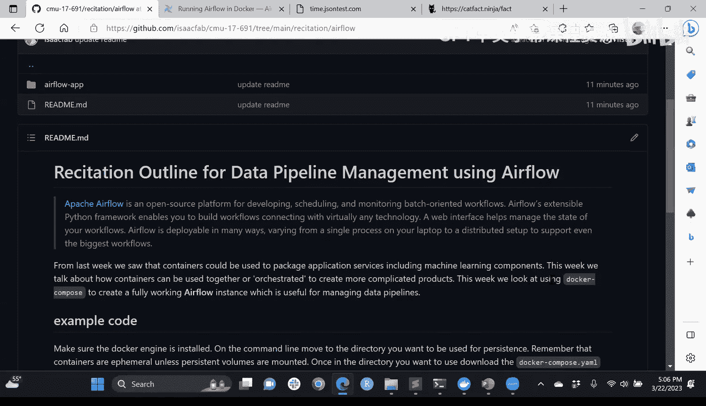

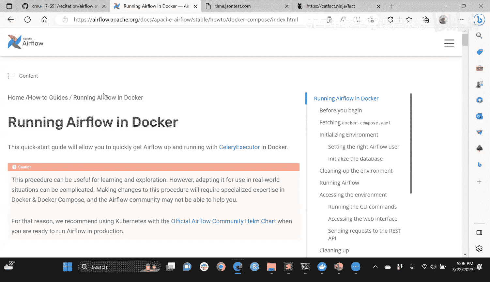

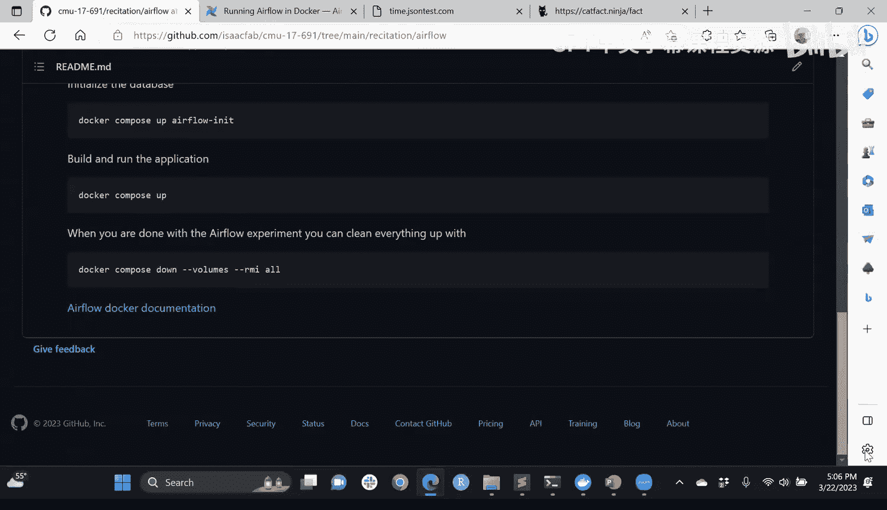

## 为什么使用 Airflow 作为微服务框架

将 Airflow 部署为微服务框架有几个关键优势。首先，它具有模块化特性，便于分离关注点和独立监控各个数据管道。其次，这种架构便于快速识别和修复故障。最后，它保证了可复现性，因为所有管道都通过代码定义，变更可以通过 Git 追踪。

## 部署 Airflow 实例

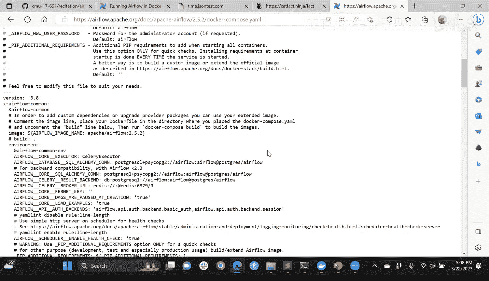

现在，让我们动手部署一个 Airflow 实例。这个过程涉及下载配置文件、初始化环境并启动多个容器。

首先，我们需要准备工作目录和必要的文件夹结构。以下是需要执行的步骤：

1.  创建一个项目目录。
2.  在该目录下创建 `dags`、`logs` 和 `plugins` 文件夹。
3.  下载官方的 Docker Compose YAML 配置文件。

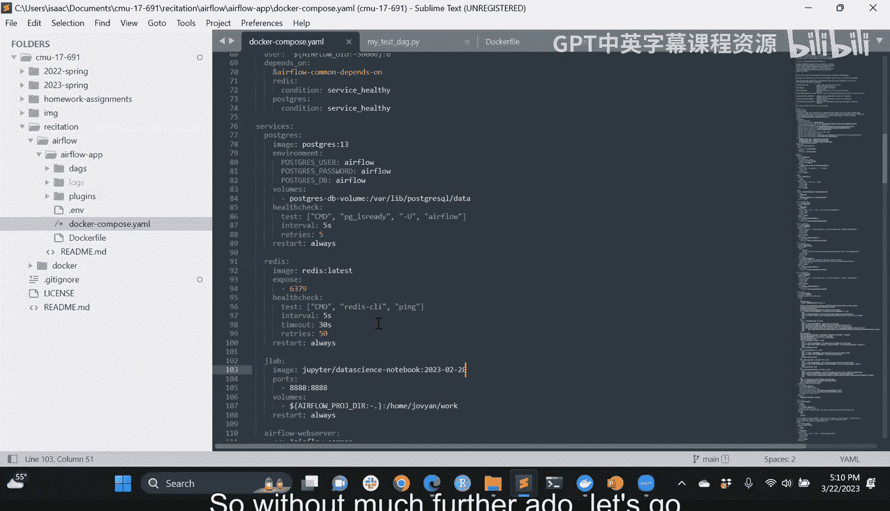

准备工作完成后，在包含 `docker-compose.yaml` 文件的目录中执行以下命令即可启动所有服务：

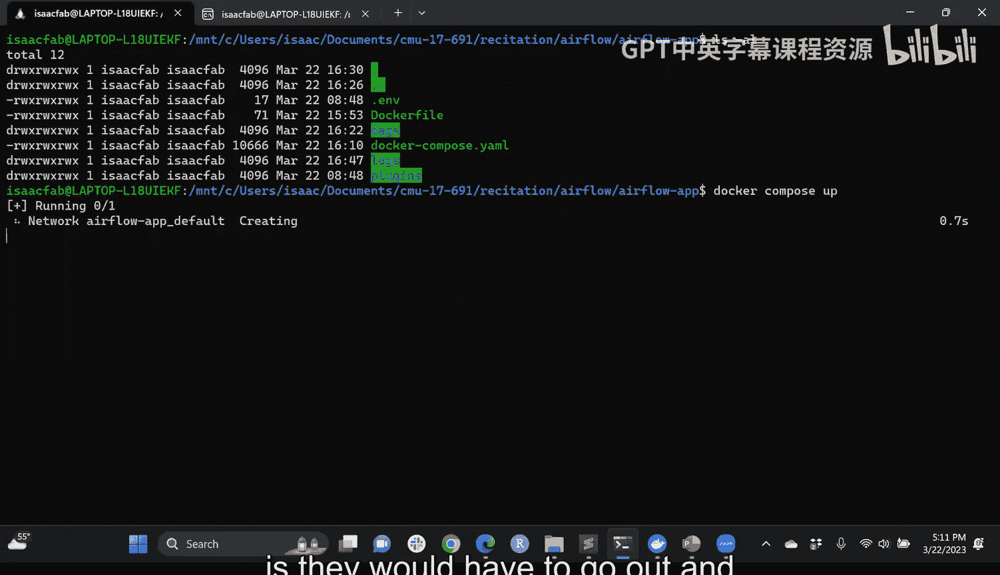

```bash
docker-compose up
```

此命令会读取 YAML 文件，拉取所需的镜像（如果本地没有），并启动定义的所有容器（如 PostgreSQL 数据库、Redis、Airflow 网页服务器、调度器等）。启动后，我们可以通过浏览器访问 `localhost:8080` 来打开 Airflow 的 Web 界面。

## 理解 Airflow 的核心：DAG

在 Airflow 中，工作流被定义为**有向无环图**。一个 DAG 包含一系列任务及其依赖关系，决定了任务的执行顺序。

在 Airflow 的 Web 界面中，我们可以查看、触发和监控 DAG 的运行状态。每个任务的状态会以不同颜色高亮显示（例如，深绿色代表成功）。我们可以点击任务来查看其详细日志，了解执行过程和输出。

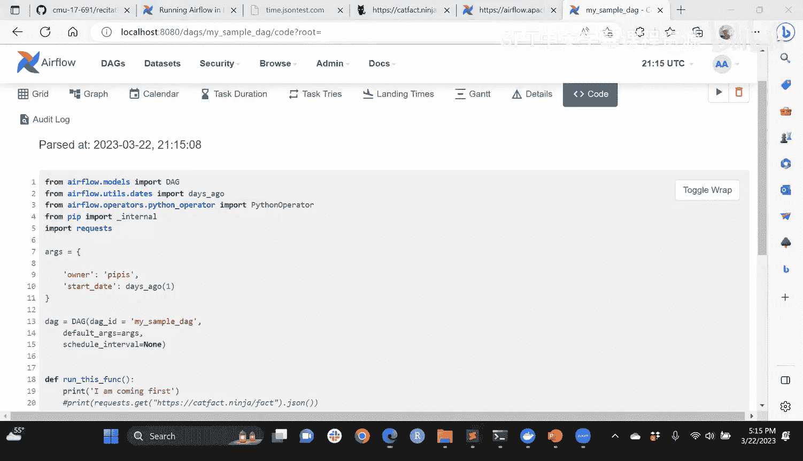

## 创建和运行自定义 DAG


DAG 使用 Python 代码定义，这使得它非常灵活。我们可以创建一个简单的 DAG 来演示如何从外部 API 获取数据。

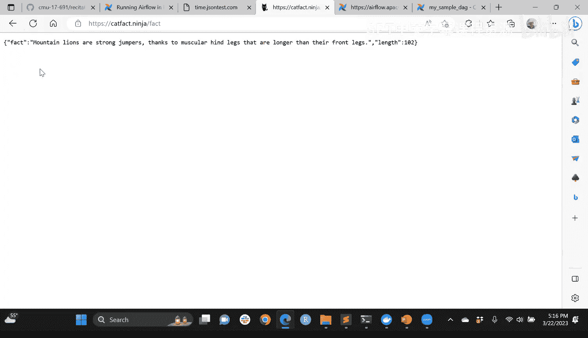

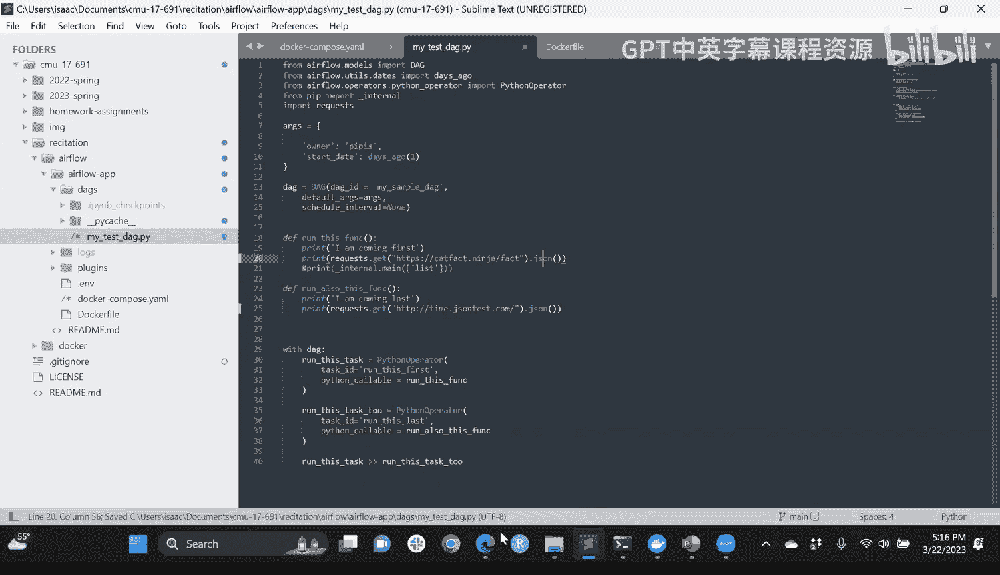

以下是一个示例 DAG 的 Python 代码框架，它定义了两个任务：

```python
from airflow import DAG
from airflow.operators.python import PythonOperator
from datetime import datetime
import requests
import json

def fetch_cat_fact():
    response = requests.get("https://catfact.ninja/fact")
    data = response.json()
    print(f"Cat Fact: {data['fact']}")

def fetch_current_time():
    response = requests.get("http://worldtimeapi.org/api/timezone/Etc/UTC")
    data = response.json()
    print(f"Current UTC time: {data['datetime']}")

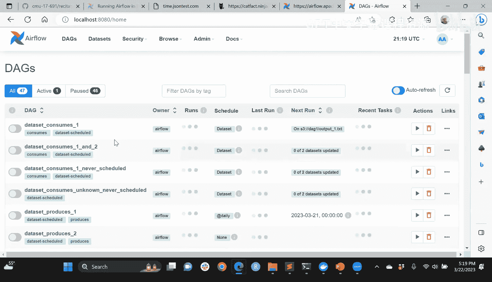

# 定义DAG
with DAG('my_sample_dag', start_date=datetime(2023, 1, 1), schedule_interval=None) as dag:
    task1 = PythonOperator(task_id='run_this_first', python_callable=fetch_cat_fact)
    task2 = PythonOperator(task_id='run_this_last', python_callable=fetch_current_time)

    task1 >> task2  # 设置任务依赖关系
```

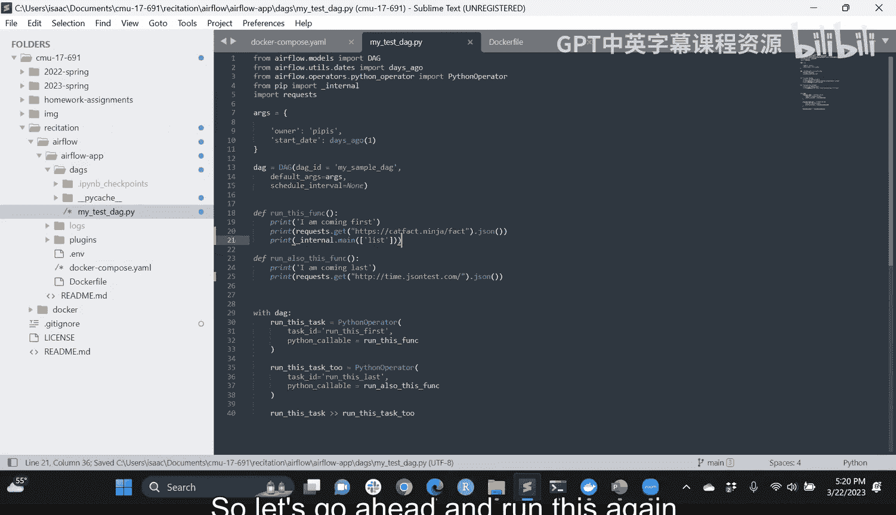

将写好的 Python 文件放入 `dags` 文件夹，Airflow 会自动加载它。我们可以在 Web 界面上找到对应的 DAG，手动触发它，并观察任务的执行顺序和日志输出。

## 管理依赖：扩展 Airflow 镜像

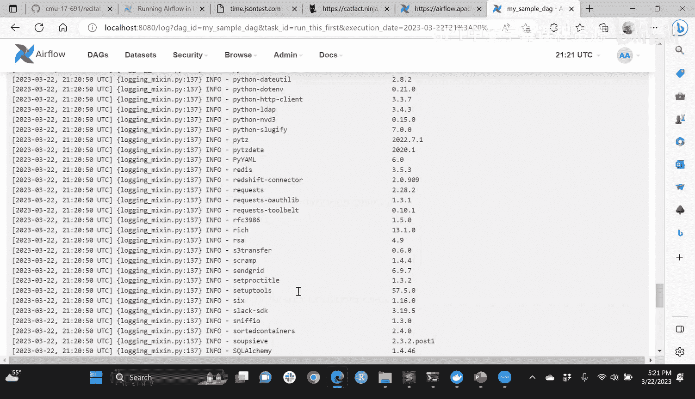

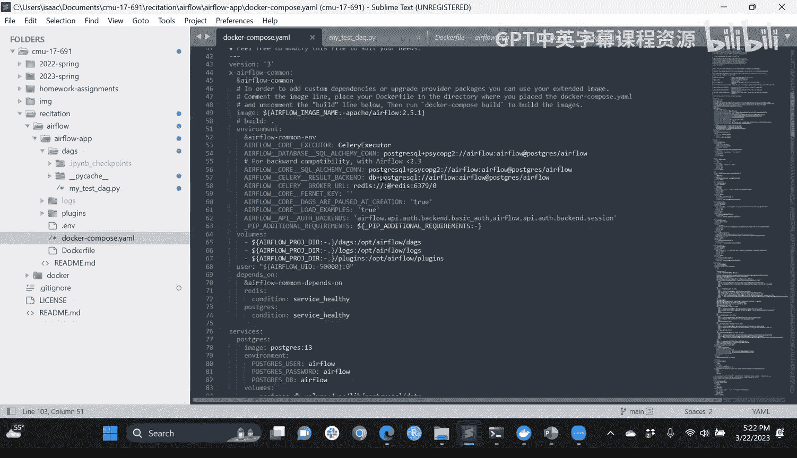

有时我们的 DAG 可能需要额外的 Python 库（如 `pandas`, `scikit-learn`），而基础 Airflow 镜像并未包含。这时，我们需要通过创建自定义 Docker 镜像来添加依赖。

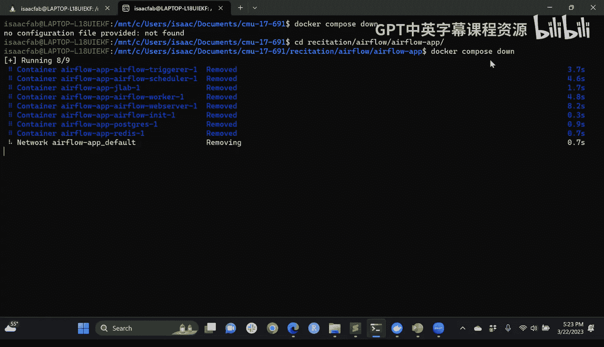

首先，我们需要创建一个 `Dockerfile` 来扩展基础镜像。以下是一个安装 `scikit-learn` 的示例：

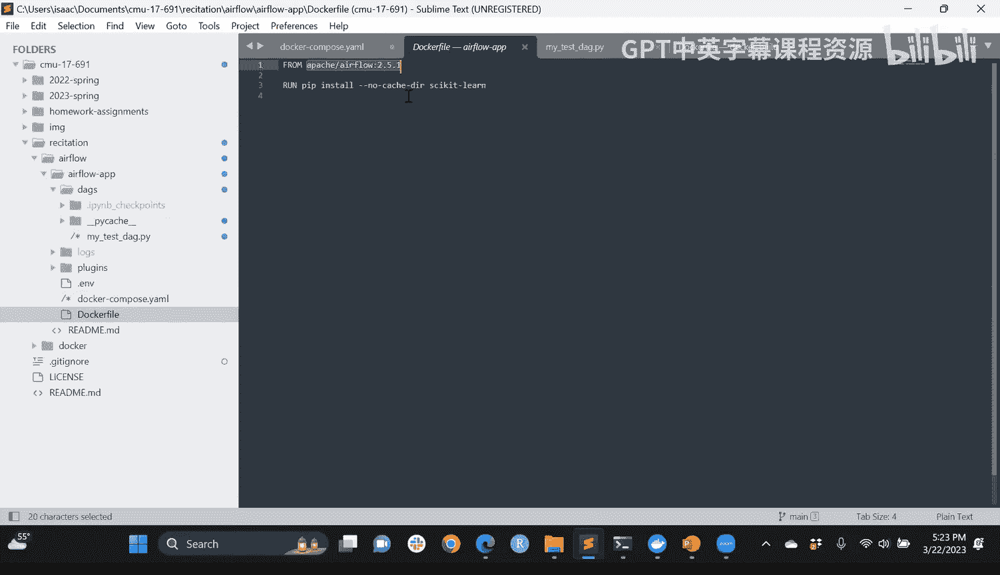

```dockerfile
FROM apache/airflow:latest
USER root
RUN pip install --no-cache-dir scikit-learn
USER airflow
```

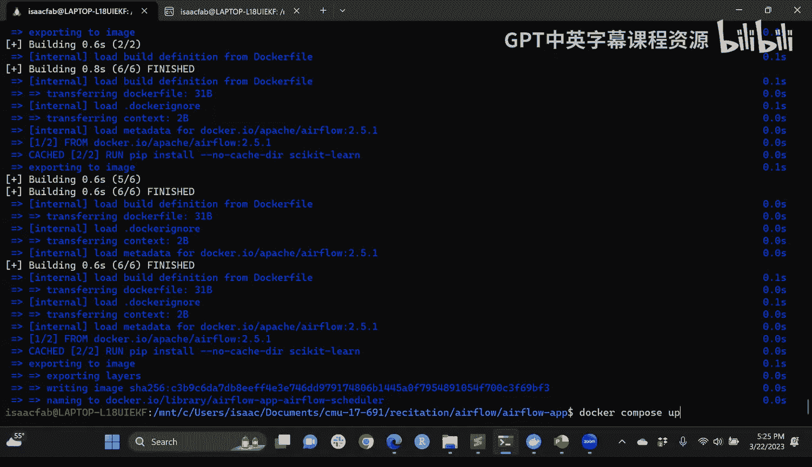

接着，需要修改 `docker-compose.yaml` 文件，将服务指向我们要构建的镜像，而不是直接使用远程镜像。主要修改 `build` 和 `image` 配置项。

修改完成后，按顺序执行以下命令来重建镜像并重启服务：

```bash
docker-compose down
docker-compose build
docker-compose up
```

重启后，新的容器就包含了我们所需的额外依赖库，可以在 DAG 中自由使用了。

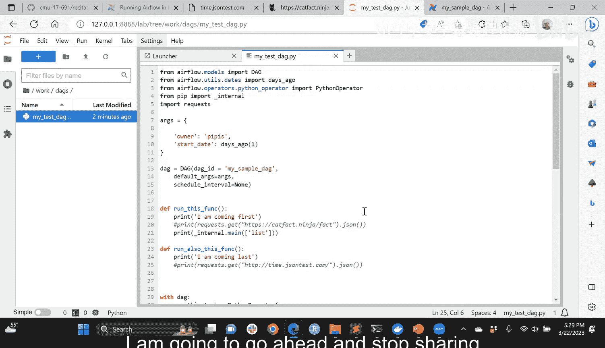


## 总结

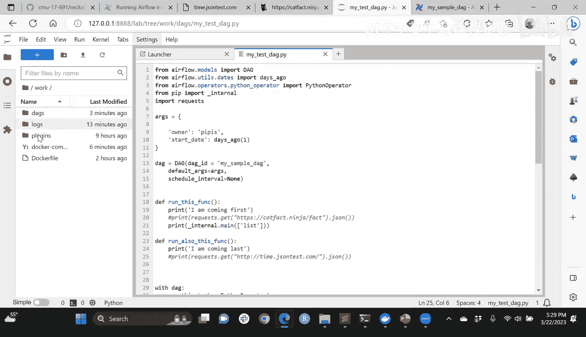


本节课中我们一起学习了容器编排的核心概念。我们使用 Docker Compose 工具部署了一个多服务的 Apache Airflow 应用。我们了解了 Airflow 如何通过 DAG 来定义、调度和监控数据管道，并实践了创建自定义 DAG 和扩展 Airflow 镜像以满足特定项目需求的方法。掌握这些工具对于构建可维护、可监控的机器学习数据流水线至关重要。