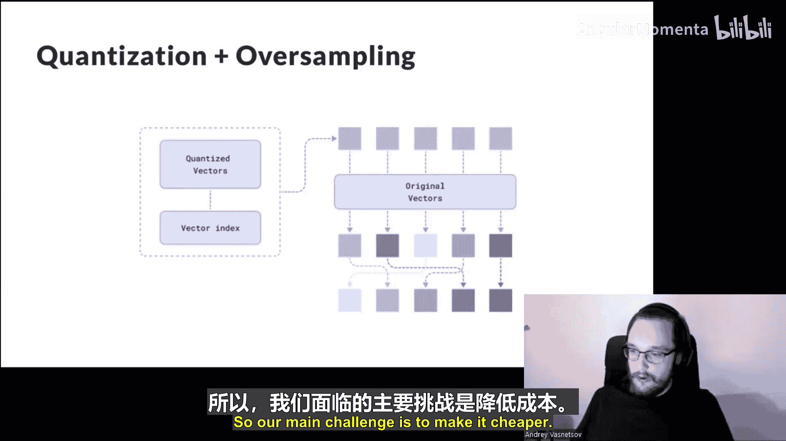

# 001：开源向量搜索引擎与向量数据库

## 概述

在本节课中，我们将学习 Qdrant 开源向量搜索引擎的内部架构与核心技术。我们将了解向量搜索的基本概念、Qdrant 的系统设计，以及它如何解决向量索引、高效搜索和复杂过滤等核心挑战。

---

## 向量搜索简介

向量搜索并非一项新技术，它已被许多大公司使用了很长时间。其基本原理是使用一个模型（通常称为编码器，通常是神经网络）将输入数据转换为密集的向量表示。这些向量表示（也称为嵌入）具有一个有趣的特性：在向量空间中彼此接近的一对向量，通常也对应着在某种意义上是相似的对象。对于文本，这可能是语义相似性；对于图像，这可能是视觉相似性。具体捕捉哪种相似性实际上由模型定义。向量之间的距离函数也由模型定义，但在大多数用例中，它只是向量之间的简单点积。

虽然这项技术本身并不新，但新的是这些现成可用模型的普及程度以及围绕它们的工具。现在，任何人都可以下载一个预训练模型并使用它，而无需任何机器学习知识。因此，下一步是将这项技术提升到生产级别，让工程师和软件开发人员也能使用它。目标是为向量搜索世界提供与传统文本搜索引擎或数据库同等的便利性和可靠性。这正是 Qdrant 所做的事情。

---

## Qdrant 架构概览

上一节我们介绍了向量搜索的基本概念，本节中我们来看看 Qdrant 如何实现这一目标。以下是 Qdrant 组件的顶层概览。

此层次结构中的每一层都代表某种特定的隔离级别。

*   **集合**：顶层是集合。集合在逻辑上隔离不同类型的数据，类似于关系数据库中的表或文档数据库（如 MongoDB）中的集合。
*   **分片**：集合之下是分片。分片隔离数据的子集，保证每个分片只包含不重叠的记录子集。分片可以在节点间移动和复制，以实现高可用性。
*   **段**：最底层的隔离级别是段。段隔离索引和数据存储。每个段都能够在其较小的数据子集上执行与整个集合相同的所有操作。

稍后我将解释为什么需要段以及它们如何工作。

首先，关于顶层架构的更多信息。你可能注意到，Qdrant 的顶层架构相当标准：我们有包含分片的集合，分片可以复制和移动。我们使用 Raft 共识协议来跟踪元数据，例如集合位于何处、节点状态、集合配置等。所有这些元数据都以分布式共识的方式存储。这对于许多分布式系统来说是相当标准的做法。

这是因为 Qdrant 是建立在 BASE 原则之上的系统的典型例子。BASE 代表基本可用、软状态、最终一致性。它通常与更常见于关系数据库的 ACID 原则进行比较。要直观理解 BASE 和 ACID，可以想想 PostgreSQL 和 Elasticsearch。PostgreSQL 是 ACID 数据库的典型例子，它具有非常严格的事务保证，非常关心数据的一致性，但 PostgreSQL 的可扩展性实际上非常有限，基本上受限于单台机器的规模。另一方面，Elasticsearch 是 BASE 系统的典型例子，它具有高度可扩展性，但一致性保证要弱得多。

这实际上也是我更喜欢“向量搜索引擎”这个术语而不是“向量数据库”的原因。对于像 Qdrant 这样的系统，可扩展性和性能在我看来比事务一致性重要得多，因此它应该被视为搜索引擎而非数据库。理想情况下，我认为它甚至不应该用作数据的主存储，特别是考虑到由于模型版本更新而导致的向量全量更新在向量数据库世界中是常见操作。你可能需要清空整个数据库并创建一个新的，仅仅因为你的编码器发生了变化。这在传统数据库中是从未发生过的事情。

---

## 段：可变性与性能权衡

上一节我们介绍了 Qdrant 的顶层架构，本节中我们来看看分片内部更具体的设计。分片内部发生的事情更有趣，因为它实际上涉及向量搜索的特性。在顶层，我们看到了一个相当标准的组件——预写日志，它负责确保 Qdrant 在数据提交后通常不会丢失数据。这对于任何数据库来说都是标准组件。不标准的是分片内部数据的第二级隔离——段。

那么，为什么首先需要多个段呢？为什么不能把所有数据都放在一个段里？实际上有几个原因。

第一个原因是**可变性**。在 Qdrant 中，我们实际上喜欢不可变的数据结构。这种“结构只构建一次，之后永不扩展”的简单假设，为许多不同的优化打开了空间。数据结构可以变得更紧凑；我们不需要在内存中的不同位置之间跳转，因此缓存未命中更少；所有数据统计信息都是预先已知的，因此我们也可以基于此执行各种优化，例如预计算直方图、预计算数据分布等。当然，在这种情况下，我们也可以分配所需的确切内存量，因此我们也不需要担心内存碎片化。加载不可变数据结构也快得多，因为你不需要执行任何反序列化操作，只需从磁盘复制原始内存块，甚至可以进行内存映射，这甚至更快。此外，我们可以使用增量编码、可变字节编码等技术进一步压缩数据。这些优化的综合效果可以使不可变数据结构比可变数据结构的效率高出一个数量级。

第二个原因是**延迟与吞吐量之间的权衡**。其原因是单个请求的并发性只在某个点之前是高效的。越接近底层索引，并发效率就越低。这使得段成为 Qdrant 中并发的自然单元。例如，如果我们处理一个需要极低延迟或单次请求的应用程序，我们可以通过为每个 CPU 核心分配一个段来优化 CPU 利用率。这样，一个请求就能尽可能多地利用 CPU。另一方面，如果我们有一个处理高吞吐量、需要发出大量并行请求的应用程序，我们可以使用一个单独的大段。在这种情况下，通过让每个请求在专用核心上以只读模式使用整个段，可以最大化整个系统的吞吐量。

以下是关于段管理的更多细节：

我们分片中有很多段，其中一些是不可变的，另一些则用于插入新数据。但是，我们如何为用户维护“整个集合是完全可变的”这一假象呢？Qdrant 用户实际上可以随时插入、删除、更新任何数据。理想情况下，用户甚至不应该知道段的存在，这纯粹是内部机制。为了解决这个问题，我们实际上需要解决两个问题：第一是如何更新不可变数据结构中的数据；第二是如何首先获得可变数据结构。

第一个问题通过简单地采用**写时复制**机制来解决。每当用户向可变段插入新数据或更改数据时，我们只需将数据片段复制到可变段中，在旧段中将其标记为已删除，一切就正常工作了。

第二个问题稍微复杂一些，因为我们需要在段上执行长时间运行的优化（例如索引构建）。这就是为什么我们需要在优化期间保持该段对用户更新可用。为了做到这一点，我们使用所谓的**代理段**，这是一种特殊类型的段，它将一个正在优化的段包装在一个接口下。它还持有一个需要应用的修改列表，以解决将数据从旧段复制到新段时发生的冲突。这是一个管理所有插入的特殊数据结构。当优化完成后，它只是转换回常规段，实际上是一对段：优化后的段和一个小的写时复制段，后者成为可变段。

---

## 向量索引：核心挑战

上一节我们讨论了段的管理，本节中我们来看看段内部的核心组件——向量索引。段内部有一些抽象组件，我故意不详细描述每个组件在底层是如何工作的，而是将重点放在向量索引上。主要原因是具体实现的选择取决于配置。例如，向量存储，我们在 Qdrant 中至少有三种不同的向量存储实现，很可能在不久的将来我们会添加第四种。Qdrant 能够与任何抽象存储一起工作，它可以是文件，也可以是内存存储，这并不重要。

但重要的是向量索引，让我们终于来谈谈向量搜索的核心组件——索引本身。

向量搜索区别于传统索引（如倒排索引或 B 树）的两个主要特征是：

1.  **近似性**：它不保证结果是精确的，甚至不保证对于相同的基础数据，多次运行索引会得到相同的结果，因为结果实际上取决于你将其插入索引的顺序。这是相当根本性的。
2.  **普遍相关性**：任何向量都可能是任何搜索请求的结果。换句话说，你集合中的任何文档在某种程度上都与其他文档相似。因此，仅基于向量相似性得分来划清相关文档和不相关文档之间的界限是不可能的。

当然，有很多不同的方法来实现向量索引，但无论你选择哪种方法，它们都必须处理我刚才描述的这些属性。实际上，这打破了许多你在传统数据库中所做的假设，因此我认为它确实需要特殊的处理和围绕它的专用架构。

在 Qdrant 中，我们使用所谓的 **HNSW 索引**。HNSW 代表分层可导航小世界图。这个名字相当复杂，但我会尝试用一个非常简化的版本来解释它，以提供一些关于它如何工作的直觉。

在内部，HNSW 表现为一个邻近图。这意味着每个向量在图里表示为一个节点，这些节点与一定数量的最近邻居（即数据库中的其他向量）相连。在邻近图中的搜索以贪婪的方式进行，意味着在每一步，我们选择距离目标最近的节点，然后用这个新选择的节点重复搜索步骤。这个过程不断重复，直到无法再改善节点与目标之间的距离。当然，无法保证这种搜索会找到绝对最接近的向量，这就是为什么它被称为近似搜索。但我们可以通过改变搜索的束宽参数来控制精度，并在精度和搜索速度之间进行权衡。

---

## HNSW 的挑战与优化方案

上一节我们介绍了 HNSW 索引的基本原理，本节中我们来看看它带来的挑战以及 Qdrant 的解决方案。HNSW 索引带来了自身的挑战。

首先，**构建时间**。将新向量插入索引的成本大约是仅搜索索引的两倍，而且它本身也非常消耗 CPU。因此，如果我们想在构建索引的同时不影响其他进程（如搜索），就需要有一个专门用于在后台构建索引的线程池，或者理想情况下，我们甚至可能希望将索引构建过程完全移到另一台机器上。

其次，HNSW 索引不仅消耗大量 CPU，而且具有**随机数据访问模式**。这意味着在每一步，它都对底层存储的延迟非常敏感。像预取、块读取这样的技术效率不高。这就是为什么它通常需要大量内存，并且不太适合磁盘存储。此外，这种模式不仅是随机的，而且是顺序的——记住，我们在图中从一个节点移动到另一个节点。这意味着我们无法高效地并行化搜索，其性能主要受存储延迟的限制，而不是吞吐量。

为了克服这些挑战，Qdrant 采用了以下方案：解决方案是使用向量的压缩内存表示，并用它来生成候选列表。例如，Qdrant 引擎的最新功能之一是**二进制量化**。它允许我们将向量压缩到每个维度仅用一个比特表示的水平，这为向量提供了总计 32 倍的压缩。在此基础上，它允许我们使用非常快速的 CPU 指令，基本上允许我们仅用两个 CPU 指令（按位异或和人口计数）来比较向量。这对于像 OpenAI 模型提供的那种大向量（例如，单个向量有 1536 维）尤其有效。

在获得这个候选列表后，我们可以使用原始向量对它们进行**重排序**，并将最终结果返回给用户。重要的是要知道，与遍历 HNSW 图不同，这个重排序过程实际上可以高效地并行化，因为我们已经知道所有候选向量的偏移量。因此，我们可以在这里利用异步 I/O，甚至可以利用具有巨大延迟的 SSD 或网络挂载磁盘。

---

## 结合向量搜索与过滤

另一个与 HNSW 相关的挑战是需要将向量搜索与额外的过滤条件结合起来。例如，你可能想在电商商店中搜索某种商品，并且该商品的价格应低于 100 美元，或者你想在特定位置附近搜索（例如“在我附近找东西”）。这些额外的条件对于现实世界的应用程序来说是必需的，但 HNSW 或任何其他 ANN 算法的原始实现并不具备这些功能。

在一些文献中，你可能会发现有两种方法来解决这个问题：**后过滤**或**预过滤**。

*   **后过滤**：建议我们可以先执行常规的向量搜索，然后在结果之上应用过滤条件，排除那些不符合过滤条件的结果。我们可能需要重复这个过程几次，直到获得所需数量的结果。这种方法实现起来相当简单，但不幸的是效率非常低，特别是当过滤条件非常严格，或者过滤条件与向量相似性得分本身相关时。这种方法基本上要么有风险将整个搜索变成线性扫描，要么最终返回不完整的结果。
*   **预过滤**：建议先生成一个候选列表，然后基于这个候选列表执行向量搜索。问题是生成候选列表本身可能是一个非常昂贵的操作。在最坏的情况下，它可能需要检查集合中一半向量的条件，这会显著增加搜索延迟。

Qdrant 提出了一种我们称之为**原位过滤**的方法。这意味着在遍历图的过程中检查过滤条件。这需要我们进行一些自定义实现，对 HNSW 进行自定义调整。因此，我们不再使用原始实现，而是使用 Qdrant 中的自定义实现。通过这种方式，我们可以确保只需要检查执行搜索实际所需的次数的过滤条件。

但这看起来问题解决了？不幸的是，还没有。当过滤条件如此严格以至于图变得**不连通**时，问题就出现了。这意味着我们无法再在图的入口点和实际包含所需结果的部分之间找到路径。在数学中，有一个专门研究这类问题的领域，称为**渗流理论**。对于大型随机图，该理论实际上给出了一个令人惊讶的简单方程，定义了需要从图中移除多少节点才能使其不连通。这个方程就是 `1 / k`，其中 `k` 是图中每个节点的平均连接数。换句话说，假设每个节点有 10 个连接，那么在移除 90% 的节点后，图将变得不连通。

在实践中，这个图表显示了 HNSW 的精度与被过滤掉的向量比例之间的关系。你可以看到，在某个点之后，精度几乎下降到零。有几项实验表明，这种效应实际上取决于每个节点的连接数，确实非常接近理论。

那么我们能做些什么呢？为了解决这个问题，我们可以利用这样一个事实：我们想要应用于搜索的过滤器实际上并不是随机的。在大多数情况下，这些过滤器基于与向量相关的一些元数据或有效载荷。正如你可能记得的，我们有一个商品旁边的价格，并且我们事先知道价格。我们不仅事先知道价格，而且我们还知道在索引构建阶段哪个价格与哪个向量相关联，因为我们使用不可变的数据结构。

我们能做的是**构建额外的链接**。我们可以基于现有的有效载荷值和可能的过滤条件来生成这些链接。例如，如果我们有一个关键字字段作为有效载荷，我们可以为这个字段的每个值构建子图，然后将这些子图合并到主图中。这样我们就可以创建这些额外的链接，这些链接将确保当我们应用带有此关键字的过滤条件时，我们的图将始终保持连通。无论搜索条件多么严格，我们都可以保证这一点。

这种方法的好处是它实际上不会增加搜索的复杂度。即使我们增加了图的大小，我们仍然可以只在需要时使用原始链接执行搜索，并仅在原始链接被过滤掉时利用额外链接。因此，搜索的总复杂度不受影响。我们可以根据需要索引尽可能多的额外链接，可以索引许多用于过滤的额外字段。这种方法也兼容在单次搜索中使用多个字段进行过滤，因为当我们这样做时，我们会将所有子图合并到主图中，并且基本上可以在此阶段对链接进行去重。因此，实际上只需要一小部分额外的内存，并且搜索速度不会受到影响。

---

## 总结

在本节课中，我们一起学习了 Qdrant 向量搜索引擎的核心架构与技术。

*   **向量搜索方兴未艾**：我认为除了文本搜索或聊天机器人的记忆之外，还有许多更有趣的用例即将出现。
*   **Qdrant 是搜索引擎**：应将其视为搜索引擎。搜索引擎的架构与数据库的架构有根本不同，在设计自己的应用程序时应考虑到这一点。
*   **向量索引需要特殊处理**：向量索引是一个非常特殊的组件，即使对于像过滤这样的常规操作，也需要特殊处理。

本次演示未涵盖但可以讨论的主题包括：查询规划和有效载荷索引在 Qdrant 内部的组织方式；每个段的动态搜索限制优化；以及量化技术（目前支持二进制量化、标量量化和乘积量化）。

感谢大家，我们很乐意回答问题。