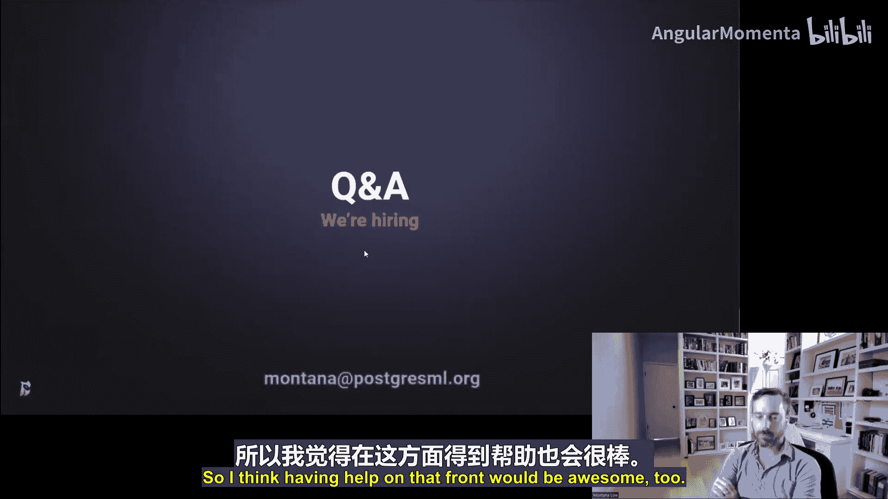

# 003：PostgresML的简洁之道

在本节课中，我们将学习PostgresML如何通过将机器学习工作负载深度集成到PostgreSQL数据库中，来构建更高效、可靠和可扩展的系统。我们将探讨其背后的动机、核心架构以及相对于传统微服务架构的优势。

---

## 概述

PostgresML是一个深度集成机器学习框架的PostgreSQL扩展。它的核心理念不是通过列式存储或分布式计算来深度改变Postgres内部结构，而是将许多重要的机器学习功能移入数据库。这种方法带来了更高的效率、可靠性和可扩展性。与机器学习领域的许多点解决方案相比，PostgresML基于整个PostgreSQL生态系统和基础构建，因此功能更强大。它是一个开源项目，提供了端到端的开源模型和算法实现，让最终用户对系统有更多控制权。

## 从简单架构到复杂挑战

上一节我们介绍了PostgresML的基本理念。本节中，我们来看看促使我们思考将机器学习工作负载移入数据库的动机。

一个经典的数据库用例是常见的Web应用架构。应用是无状态的，而数据库负责维护系统中的所有状态并长期持久化。由于这些组件通过互联网连接，系统存在固有的延迟。将状态和无状态分离所引入的延迟，与跨越大陆的网络连接延迟相比非常小。

这种简单的架构非常适合原型设计和最小可行产品。但当考虑系统扩展时，通常会先扩展应用，因为扩展有状态进程很困难。然而，随着应用负载增加，数据库负载也会相应增加。最终，数据库会达到瓶颈。

以下是应对数据库负载增长的常见步骤：

1.  **应用内缓存**：开始将更多数据缓存在应用中，以减少数据库查询。
2.  **引入只读副本**：对于许多只读、非事务性查询，可以轻松地使用PostgreSQL副本进行处理。
3.  **数据库分片**：当单数据库（即使是带副本的）也无法满足需求时，最终需要分片数据库。

数据库分片会带来复杂性，例如应用需要决定数据去向、处理故障转移、管理整个数据库集群等。最终，如果业务成功，你将管理更多的数据库。

## 微服务架构的得与失

上一节我们看到了随着业务增长，数据库架构如何变得复杂。本节中，我们来看看作为应对方案之一的微服务架构及其带来的新挑战。

在微服务架构中，目标是设计一个永远不需要第二个数据库的服务。通过将应用拆分为越来越小的服务，并在数据库变得太大时将其拆分，来应对扩展问题。然而，这会导致越来越多的网络延迟。

在一个清晰的服务导向架构中，一个完整的Web请求可以由单个服务处理。但最终会出现横切关注点。例如，一个产品搜索系统可能涉及多个机器学习模型和数十个微服务，许多服务之间存在循环依赖和自己的状态管理，最终变得与单体架构有相同的问题。

此外，微服务架构允许每个团队选择最适合自己需求的数据库。这可能导致技术栈的碎片化，增加了运维和问题排查的复杂性。当某个底层存储（如Memcached集群）出现故障时，可能会引发连锁反应，影响整个系统。

## 机器学习系统的复杂性

上一节我们讨论了微服务架构在数据层带来的复杂性。本节中，我们聚焦于构建和运行机器学习服务时所特有的复杂挑战。

下图展示了构建一个机器学习模型和服务所需的基础设施组件。在每个功能框中，都存在多种竞争性技术选择。数据科学家很可能会做出不同的选择。如果没有一个强大的机器学习平台来解决所有这些问题，每个请求都可能流经一个几乎全新的、不同的技术栈。

这种复杂性会直接导致性能问题。例如，一个搜索请求可能需要依次进行语音识别、同义词检测、查询扩展、初始查询、低库存商品替换查询等步骤，每个步骤都涉及多个模型。当所有微服务都基于Python时，搜索查询的P90响应时间可能高达8秒。这种延迟会导致用户流失和销售损失。

## 理想的架构演进

上一节我们看到了复杂机器学习系统带来的性能挑战。本节中，我们来看看一种更理想的、可扩展的数据库架构演进路径。

与其陷入微服务和多种数据库的复杂性，不如考虑一种更简洁的架构：使用一个代理（如PgBouncer或PgCat）来管理多个PostgreSQL集群（包括副本和分片）。应用层通过这个代理与数据库交互，代理负责路由、故障恢复等。这样，应用层无需处理复杂的缓存逻辑和分片逻辑，数据库层可以水平扩展。

这种架构的优点是，你不需要从一开始就构建它。可以从简单的单应用单数据库架构开始，随着业务增长，逐步引入代理和分片，而无需让应用变得异常复杂。这种演进方式比管理一堆异构的微服务和数据库要可控得多。

## PostgresML的核心思想：推送模型，而非拉取数据

上一节我们探讨了可扩展数据库架构的理想状态。本节中，我们将介绍PostgresML解决机器学习工作负载的核心思想。

在机器学习中，你有两种选择：
1.  将模型作为无状态服务运行，每次预测时从数据库拉取数据到模型（**拉取数据**）。
2.  将模型推送到数据库存储层，在数据所在的位置进行预测（**推送模型**）。

PostgresML采用第二种方式。这意味着你不再将数据从数据库层拉到应用层，而是直接将数据指针（来自PostgreSQL共享缓冲区）传递给模型，消除了数据移动。你移动的是模型，而不是数据。

从理论上讲，这种方式更优，因为任何好的模型总是小于其训练数据集，也小于用于预测的数据集，并且其更新频率远低于所建模的数据。因此，在PostgresML的处理过程中，涉及的数据传输量（电子移动）要少于微服务架构。

即使在新兴的大语言模型和向量数据库领域，将数据（无论是向量数据还是传统表格数据）与LLM放在同一进程中仍然至关重要。虽然LLM运行较慢，但数据移动仍然是相当大的开销。将LLM加载到数据库中是一次性的数据移动成本，之后可以避免在每次查询时移动大量向量数据。

## PostgresML的功能组成

上一节我们介绍了PostgresML“推送模型”的核心思想。本节中，我们具体看看PostgresML提供了哪些功能。

对于经典机器学习，PostgresML主要提供三个核心功能，它们基本上都是用户定义函数（UDF）：

1.  **训练模型**：`pgml.train`
    *   你可以指定任务类型（如分类、回归）、算法等参数来训练模型。
2.  **部署模型**：`pgml.deploy`
    *   战略性地部署训练好的模型，例如指定使用哪个版本来服务预测请求。
3.  **进行预测**：`pgml.predict`
    *   利用已部署的模型，基于新数据（来自数据库表或查询参数）进行预测。

对于新式的向量数据库和Transformer模型，PostgresML也提供了相应的功能，例如生成嵌入、进行向量搜索、文本生成等。目前，Transformer相关的功能仍通过Python调用Hugging Face的库实现，而其他核心功能则用Rust编写，以实现高效的零拷贝抽象。

通过这六大类函数，你可以在PostgreSQL内部获得一个非常全面的机器学习工具包，解决大量问题。

## PostgresML的内存与并发模型

上一节我们了解了PostgresML提供的功能。本节中，我们深入其内部，看看它如何在PostgreSQL进程内管理内存和处理并发。

PostgreSQL使用共享缓冲区来管理从磁盘到RAM的数据页。PostgresML将模型和特征数据存储在PostgreSQL表中，因此自然地被缓存在共享缓冲区中。

当通过数据库连接调用`predict`、`embed`或`transform`等功能时，系统会从共享缓冲区中取出模型权重，并在该连接进程内实例化模型（使用XGBoost、scikit-learn或PyTorch等库）。**每个连接都会缓存自己使用的模型副本**。

这种模型缓存方式与PostgreSQL的连接进程模型配合得很好。因为每个连接都是独立的进程，所以我们可以将模型加载到多个不同的连接中，从而实现并发访问。PgCat这样的连接池工具非常重要，它可以帮助保持连接开放（即使客户端断开），从而保留模型缓存。我们还可以使用PostgreSQL角色来隔离连接、限制特定模型的并发数并实施队列管理。

## 性能基准

上一节我们探讨了PostgresML的内部工作原理。本节中，我们通过一些基准测试来看看它的实际性能优势。

PostgresML在性能上往往具有“不公平”的优势，因为它避免了网络开销。例如，在嵌入生成方面，它可能比调用OpenAI API快10倍，这主要是因为消除了互联网往返延迟。

值得注意的是，开源模型在许多领域正在赶上甚至超越闭源解决方案。例如，在嵌入模型排行榜上，OpenAI的模型已跌出前列。在文本生成方面，开源模型如Falcon 180B等也构成了强劲竞争。

在向量搜索方面，即使使用查询速度较慢的IVF-Flat索引类型，PostgresML（结合pgvector）也通常比使用独立向量数据库（如Pinecone）的方案更快，因为它消除了两次网络往返延迟。

## 技术实现与未来展望

上一节我们通过基准测试看到了PostgresML的性能表现。本节中，我们简要了解其技术栈并展望未来的发展方向。

PostgresML使用`pgx`框架（一个Rust扩展管理框架）进行开发。它利用了许多Rust生态中的库，并正在推动更多机器学习功能在Rust中实现。目前，为了兼容性和提供可靠的参考实现，部分功能（特别是Transformer相关）仍通过Python调用。

未来的主要挑战和发展方向包括：
1.  **列式存储**：对于时间序列预测等场景非常重要，需要一个开源实现来集成。
2.  **Rust原生LLM**：采用Rust实现最新的LLM，以实现完全的内存去重共享，这将是PostgresML 3.0的一个重要里程碑。
3.  **算法覆盖**：持续集成机器学习领域不断出现的新算法和模型（如CatBoost），这是一个持续的过程。
4.  **GPU与内存共享**：在云服务中，实现GPU内存跨连接共享，以降低用户使用LLM的成本。

## 总结

在本节课中，我们一起学习了PostgresML如何通过将机器学习深度集成到PostgreSQL数据库中，来构建更简洁、高效和可扩展的系统。我们从传统架构的扩展挑战谈起，分析了微服务带来的复杂性，进而引出了“推送模型而非拉取数据”的核心思想。我们详细介绍了PostgresML的功能、内存模型、性能优势以及其技术实现。最后，我们展望了其未来的发展方向。PostgresML代表了一种不同的架构哲学，即在充分利用成熟、强大的数据库生态的基础上，智能地整合先进的计算负载，最终实现“少即是多”的简洁之道。