# 004：Weaviate 架构深度解析

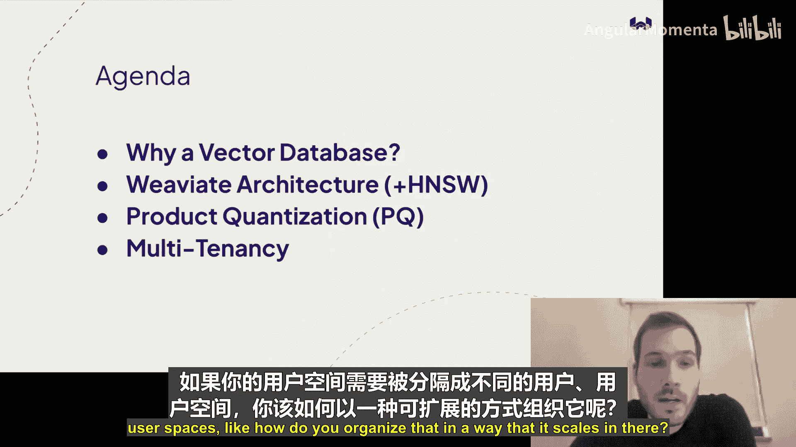

在本节课中，我们将深入探讨开源向量数据库 Weaviate 的核心架构。我们将从向量数据库的基本概念和动机开始，然后详细解析其内部组件，包括 HNSW 向量索引、产品量化压缩技术以及多租户架构。课程旨在让初学者也能理解这些复杂的技术概念。

## 概述：为什么需要向量数据库？

传统的关键词搜索系统在处理语义相似性时存在局限。例如，搜索“飞机”可能无法匹配到包含“airplane”或“aeroplane”的文档，尽管它们含义相同。向量数据库通过将文本、图像等数据转换为高维空间中的向量（即“嵌入”），并基于向量间的距离进行相似性搜索，从而克服了这一限制。

这类似于在超市中寻找商品：商品不是按字母顺序排列，而是按类别（如农产品、乳制品）组织，使你能够根据概念相似性快速导航。向量空间也是如此，它将具有相似含义的数据点放置在彼此靠近的位置。

近年来，大型语言模型（如 ChatGPT）的兴起带来了新的应用场景和挑战，例如模型可能产生“幻觉”（提供不正确但看似可信的信息）。解决此问题的一种方法是**检索增强生成**：首先从可信的知识库（如向量数据库）中检索相关文档，然后将其作为上下文提供给 LLM，从而生成基于事实的答案。Weaviate 在此类架构中扮演着核心的检索角色。

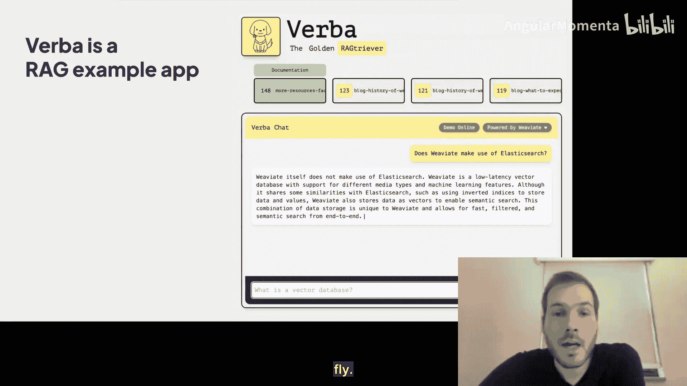

## 架构总览

Weaviate 的核心架构围绕**集合**（Collections，旧称 Classes）和**分片**（Shards）构建。

*   **集合**：类似于 SQL 数据库中的表，是用户组织数据的主要逻辑单元（例如，“文章”、“作者”、“事件”集合）。
*   **分片**：一个集合可以包含多个分片。分片的目的是将大规模数据集分布到多个节点上，以解决向量搜索对计算和内存的高需求问题。

每个分片内部包含三个主要组件：

1.  **向量索引**：默认且最常用的是 **HNSW** 索引，用于高效执行近似最近邻搜索。
2.  **对象存储**：一个键值存储，用于保存与向量关联的原始数据对象（如 JSON 文档、文本块）。这使得 Weaviate 能够端到端地处理搜索请求，无需查询外部存储系统。
3.  **倒排索引**：基于 LSM 树构建，并原生支持 Roaring Bitmaps，用于高效执行属性过滤操作（如 AND, OR）。

这种设计使得 Weaviate 不仅是一个向量搜索引擎，也是一个功能齐全的数据库。

## HNSW 索引详解

HNSW 代表**分层可导航小世界**。它是一种基于图的近似最近邻索引，在查询速度和索引构建成本之间做出了权衡：它牺牲了少量精度，换来了极高的查询性能，但构建索引的计算成本相对较高。

### 图搜索基本原理

HNSW 将数据向量视为图中的节点，并在相似向量之间创建连接（边）。搜索时，算法从一个随机入口点开始，不断评估当前节点的邻居，并移动到距离查询向量更近的邻居节点，直到无法再改进为止。这个过程避免了对图中所有节点进行暴力计算，从而大幅提升搜索效率。

以下是搜索过程的简化步骤：
1.  从预设的入口点开始。
2.  评估当前节点的所有邻居节点与查询向量的距离。
3.  将距离查询向量最近的邻居节点设为新的当前节点。
4.  记录已访问的节点，避免重复计算。
5.  重复步骤 2-4，直到无法找到更近的邻居为止。

### 分层结构

HNSW 的“分层”特性进一步优化了搜索。它构建了多层的图，高层图包含较少的节点和更长的边，用于快速、粗略地定位目标区域；低层图包含更多的节点和更短的边，用于进行精细搜索。查询时，算法从最高层开始，逐层向下导航，类似于跳表索引的搜索过程。

### 连接修剪

为了保持图的高效性，HNSW 在构建时会进行连接修剪。每个节点有最大连接数限制（参数 `M`）。当需要添加新连接但连接数已满时，算法会暂时移除所有连接，然后重新连接那些“必不可少”的邻居（即无法通过其他现有节点更高效到达的节点）。这确保了图的稀疏性和导航效率。

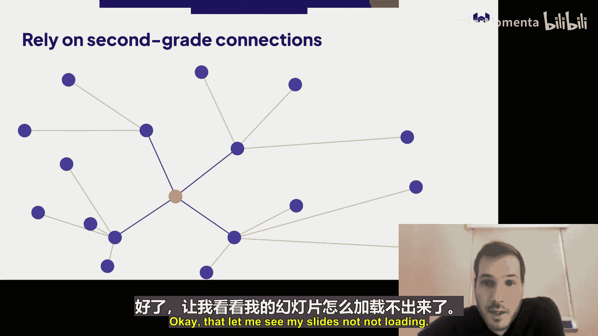

### 参数与数据更新

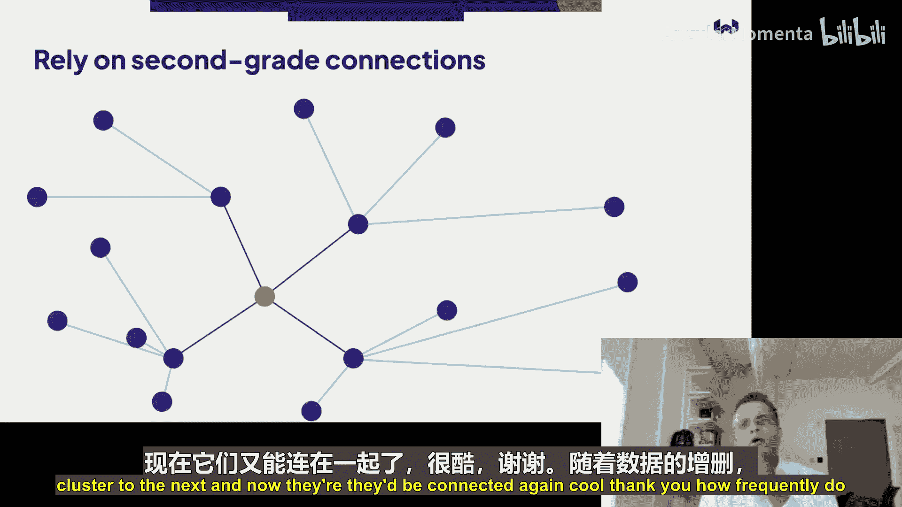

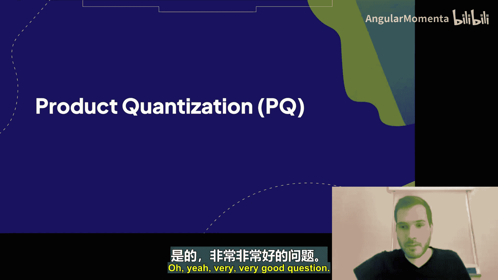

HNSW 有几个关键参数可调节性能与精度的平衡：
*   `ef` / `efConstruction`：控制搜索时或构建时考虑的候选节点数量。增加 `ef` 能提高召回率（精度），但会降低查询速度。
*   `M`：每个节点的最大连接数，影响图的密度和搜索路径。

对于数据更新：
*   **插入**：HNSW 支持动态插入，新节点通过搜索图找到其位置并连接。
*   **删除**：Weaviate 采用“标记删除”加后台图修复的策略。删除时先标记节点，确保查询结果正确；随后在后台逐步重建受影响区域的连接，以避免大规模索引重建。

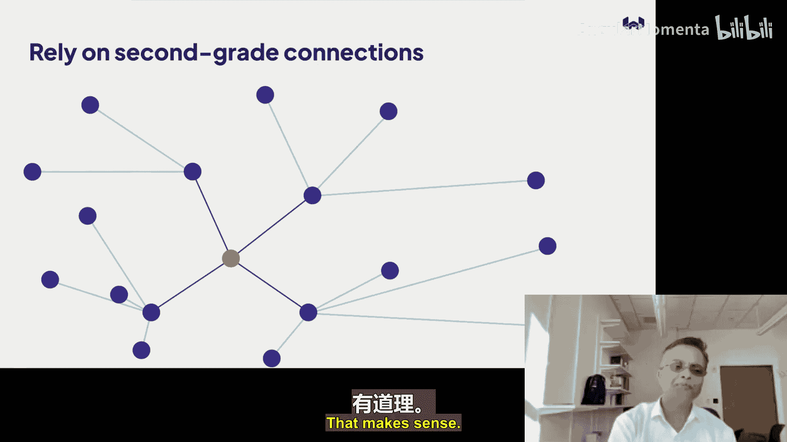

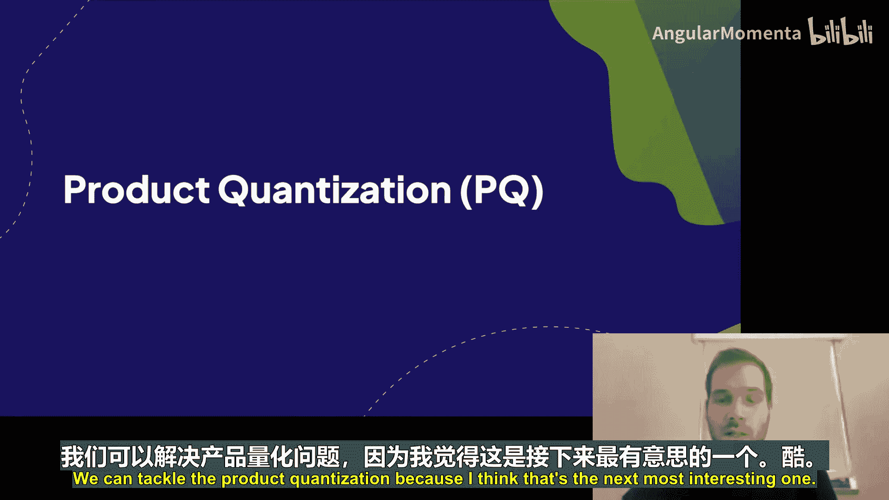

## 产品量化：压缩向量

随着嵌入模型维度增长（如 OpenAI 的 `text-embedding-ada-002` 有 1536 维），存储和内存开销变得巨大。产品量化是一种压缩技术，能显著减少向量占用的内存。

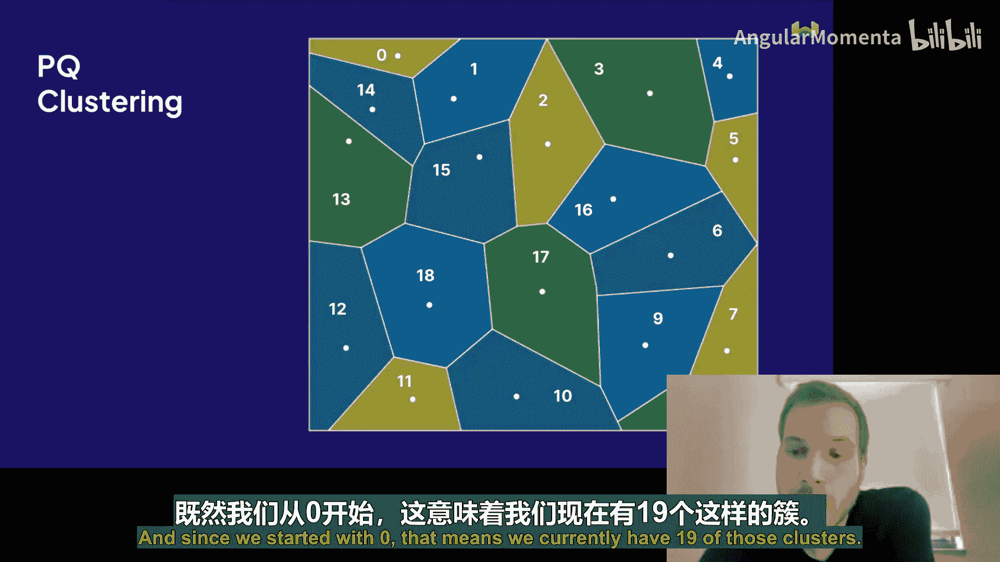

### 压缩原理

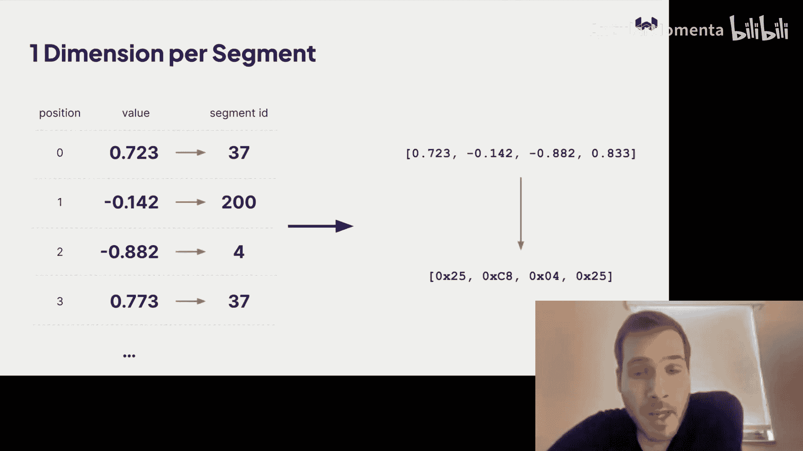

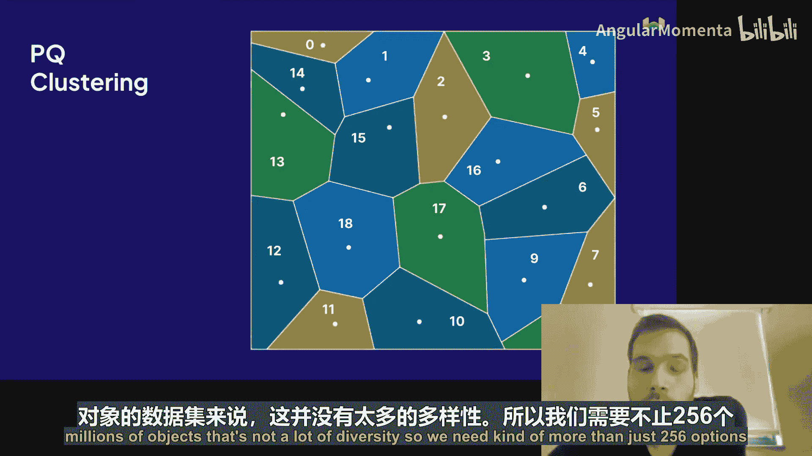

产品量化的核心思想是将高维向量分割成多个子段，并对每个子段进行独立量化。

1.  **聚类**：首先，从数据集中采样一部分向量，对每个子段分别运行聚类算法（如 K-Means），得到一组聚类中心（例如 256 个）。
2.  **编码**：对于数据集中的每个向量，将其每个子段与对应子段的聚类中心进行比较，并用距离最近的聚类中心的 ID（一个 0-255 的整数，即 1 字节）来代表该子段。
3.  **表示**：最终，整个高维向量被表示为一个由这些 ID 组成的短序列（码本）。例如，一个 1536 维的浮点数向量（原始占 6 KB）可能被压缩为仅 256 字节的码本，实现了显著的压缩。

### 精度与重排序

量化是**有损压缩**，会引入误差，直接使用压缩向量搜索会降低精度。为了解决这个问题，Weaviate 采用**重排序**策略：
1.  使用压缩向量在 HNSW 索引中进行初步搜索，并获取一个较大的候选结果集（例如 top 128）。
2.  从磁盘加载这 128 个候选向量的原始未压缩版本。
3.  在这小部分候选集上，使用原始向量重新计算精确距离，并返回最终排名。

这种方法在保持高精度（例如 >95% 召回率）的同时，获得了巨大的内存节省（例如 24 倍压缩），仅付出了少量查询吞吐量的代价。

### 实践考虑

*   **模型训练**：量化模型通常在数据集的一个代表性样本上训练一次即可，对后续的数据分布漂移有一定鲁棒性。
*   **监控**：可以通过定期对数据子集进行暴力搜索，比较量化索引的召回率来监控精度是否下降。

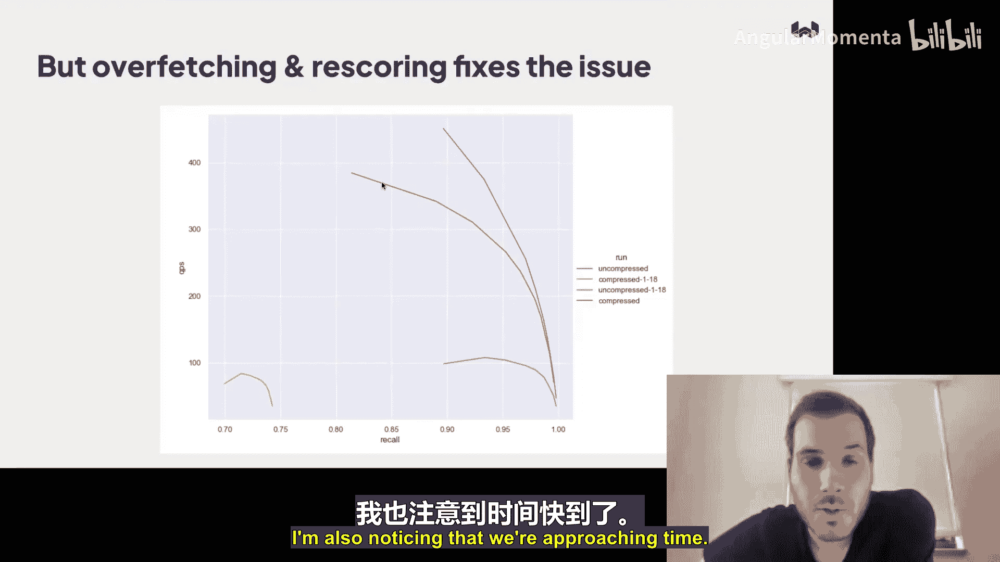

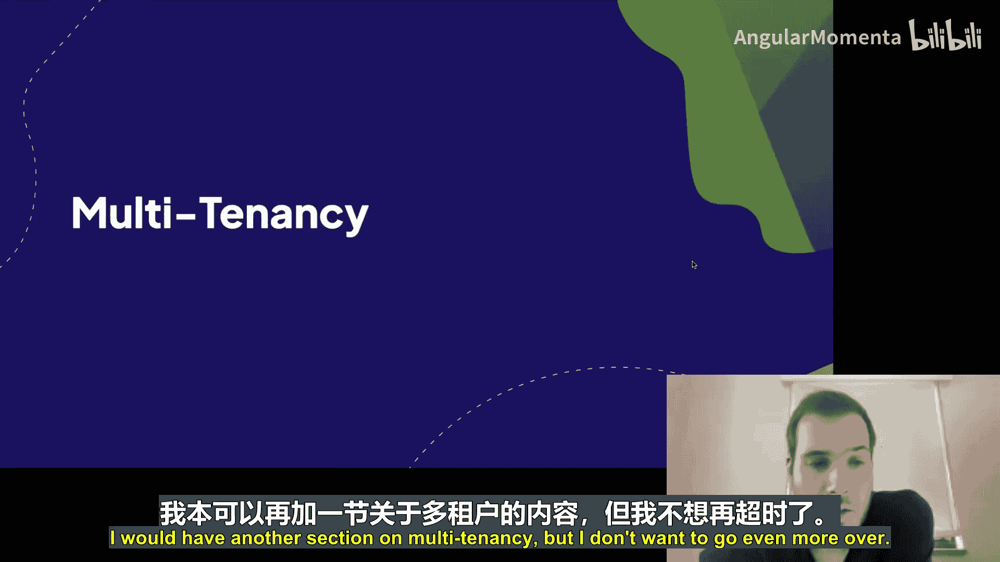

## 总结

本节课我们一起学习了 Weaviate 向量数据库的核心架构。我们从理解向量搜索的动机开始，探讨了其如何解决传统关键词搜索和 LLM 幻觉问题。随后，我们深入剖析了 Weaviate 的三层架构：集合与分片、HNSW 图索引以及产品量化压缩技术。

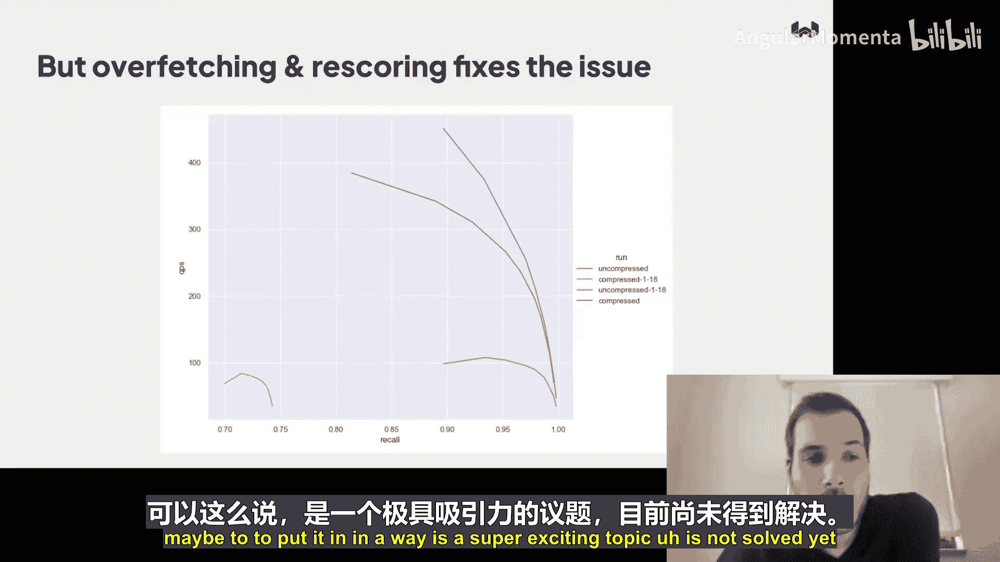

HNSW 通过构建分层近邻图，实现了快速高效的近似最近邻搜索。产品量化则通过分段聚类和编码，大幅降低了向量的存储开销，并结合重排序技术维持了搜索精度。这些技术共同使 Weaviate 能够处理大规模、高性能的向量检索任务，为构建下一代基于语义理解的智能应用提供了坚实基础。