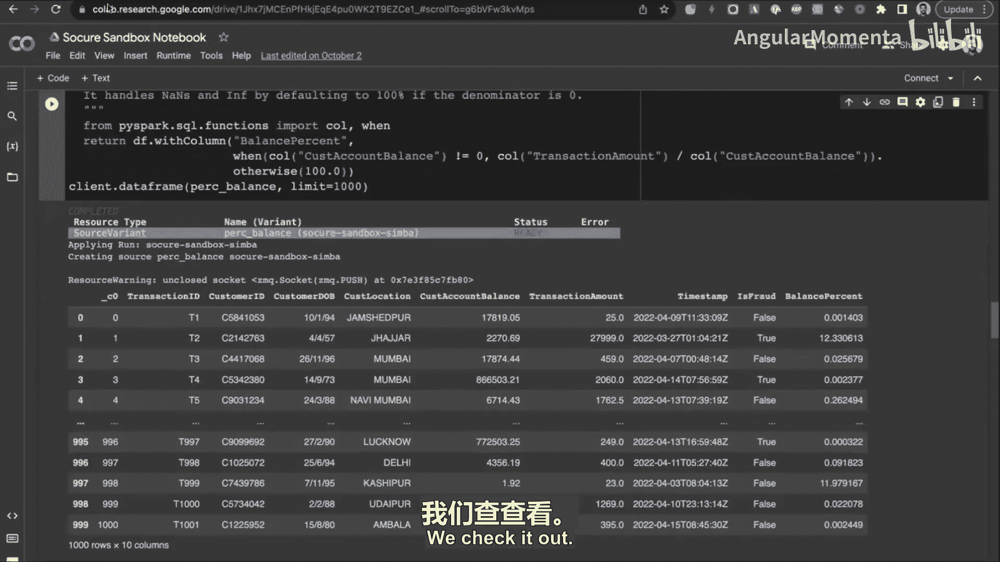

# 005：特征存储架构与技术挑战

卡内基梅隆大学的机器学习与数据库系列研讨会正在现场录制。

本项目的资金由谷歌以及像您这样的观众贡献提供。

感谢大家。欢迎来到卡内基梅隆大学数据组的又一次研讨会。今天我们很高兴邀请到Simon Qdar，他是虚拟特征存储公司FeatureForm的联合创始人兼首席执行官。他将为我们详细介绍什么是特征存储，以及如何构建一个可扩展的特征存储。和往常一样，如果您有任何问题，请随时取消静音提问。这将是一场对话，而不是他独自演讲一小时。现在，有请Simon。

谢谢邀请。大家好。

今天我将讨论特征存储。这个概念在MLOps和机器学习基础设施领域被广泛讨论，但“它究竟是什么”以及“如何构建”是根本性问题。我将深入探讨这些问题，分析不同类型的特征存储，并尝试定义特征存储。考虑到听众背景，我会保持技术性，并重点介绍我们遇到并克服的几个技术挑战，特别是FeatureForm的构建方式。它更像一个编排器，而编排器的难点通常不在于解决一个超级难题，而在于处理无数个小问题，如何让所有组件协同工作，并构建一个能适应各种预期用例的架构。

我希望保持互动，会讨论很多不同主题，并在各部分之间留出空间，乐于回答任何问题。我会保持足够的深度以提供信息和背景，同时也会控制深度，让大家可以选择感兴趣的部分深入探讨。

我先简单介绍一下自己。我是Sba，FeatureForm的联合创始人兼CEO。这是我的第二家公司，之前在谷歌工作，背景是软件工程，专注于分布式系统。我的上一家公司构建了一个为约1亿月活用户提供服务的推荐系统，当时构建的ML基础设施后来成为了FeatureForm的基础。

今天的议程如下：
1.  什么是特征存储？从基础开始。
2.  三种架构类型。业界解决此问题有三种主要方法，我们将逐一分析，并重点介绍我们采用的方法及其原因。
3.  深入探讨四个具体技术挑战：流式处理与回填、物化、作业状态与编排、监控与概念漂移。
4.  最后，鉴于当前领域的关注度，我会简要讨论一下LLMs和RAG，但我知道已经有很多关于向量数据库的讨论，所以这部分会简短，重点放在我们系统的独特之处。

## 什么是特征存储？

当我说“特征”时，指的并非产品功能，而是模型的输入或信号。例如：用户过去30天最喜欢的歌曲、商店冬季最畅销商品、目录中所有商品的平均价格。这些都是特征的例子。你可以将模型视为一个接收输入信号并生成输出预测的黑盒。

在实践中，数据科学家（作为最终用户）花费大量时间进行特征工程，即不断迭代信号以产生更好的信号来构建更好的模型。他们通常在笔记本中工作，环境通常比较混乱，使用多种基础设施，创建大量数据转换，最终形成这些信号。

这些是常见的工作流程问题，我不会深入探讨，因为它们技术性稍弱，但我想提一下。在构建此类系统时，许多公司过于关注技术细节（如性能），而往往忽略了更高层次的工作流程问题。我们花了很多时间思考什么是正确的API和工作流程，以便让系统对数据科学家无缝工作。

还有一些其他问题可能大家也熟悉。

在深入技术细节之前，最后一个背景点是：实际上，有时需要说服数据科学家同意不应将笔记本直接部署到生产环境，尤其是当整个推荐系统都依赖于某个笔记本时。对于在座各位，这一点可能很清楚：生产环境不应直接部署笔记本。通常，生产环境和离线迭代之间存在一道鸿沟。

许多公司的实际做法是，拿着这些笔记本，几乎从头开始将其重建为生产工作流程。从数据科学家的角度来看，他们提出了所有这些特征，然后会遇到一个巨大的障碍：如何将其投入生产？

将特征投入生产涉及几个部分：
1.  实验时，通常使用样本、不可扩展的模式（如pandas）、在个人电脑上运行。
2.  但当要将特征投入生产时，就必须开始处理实际的数据系统：流式数据、批处理数据、按需特征（类似于存储过程）。所有这些需要组合在一起，以极低延迟在生产时构建信号。

我们并不试图构建更好的Redis或Spark，也不认为这是需要解决的问题。我们也不试图让一切都流式化，流处理是这个问题中一个特别困难的部分，稍后会讲到。

最后，我认为“特征存储”这个名称有些用词不当。整个类别以及每个云提供商都有一个“特征存储”。但如果你按照我定义的方式思考“特征”，你可能会认为它只是一个存储特征的地方。实际上，特征存储最终看起来和工作方式（或者说我们的思考方式）更像一个编排器。我们并不认为需要解决的问题是构建一种新型数据库来存储特征。

我们看到并解决的问题，更像是构建一个应用层，置于你的数据基础设施（如Spark计算、S3存储等）之上。该层提供资源的单一事实来源，你可以定义这些资源，方便数据科学家协作，并提供监控、告警和治理功能。

我们需要能够构建每个特征，每个我创建的信号，都必须能同时用于训练和推理，这是一个非常困难的问题。最后，还需要一个良好的声明式API和一些仪表板来理解正在发生的事情并进行监控。

在内部构建FeatureForm时，我们真正想要的是“特征的Terraform”。因此，FeatureForm这个名字的字面意思是“特征的Terraform”。你会看到我们的许多架构选择可能让你联想到Terraform，因为实际上我们所做的非常相似，关键区别在于Terraform启动基础设施，而我们启动的是数据管道。

到目前为止有任何问题吗？这更多是高层概述。看起来没问题。

## 三种特征存储架构

接下来，我们谈谈业界提出的三种特征存储及其架构。

第一种架构我称之为“字面意义上的特征存储”，因为它就是字面意义上存储特征的地方。如果你使用过特征存储，最可能熟悉这种类型。目前可能使用最广泛的特征存储是开源产品Feast。AWS SageMaker、Vertex、Azure、Databricks等云提供商都有自己的特征存储，它们或多或少都借鉴了Feast，因为Feast是早期特征存储之一，也是最大的开源玩家。

它们采用的方法是让用户构建自己的信号，进行迭代，最后存储在特征存储中。其价值在于所有特征在训练和推理中是统一的。对于推理，你需要以极低延迟提供特征的最新值。例如，为Spotify构建推荐系统时，你可能想知道用户过去30天最喜欢的歌曲类型。因此，你需要维护该值的实时缓存，这就是在线存储的内容。

另一方面是训练部分，有时称为离线存储。这里的难点在于需要维护特征值的历史日志，因为特征值在不断变化，但训练时需要“回退时间”。例如，遍历我的Spotify历史记录，查看我在某个时间点听了红辣椒乐队的某首歌，当时这些特征值是什么。因此，你必须回退时间，构建当时会出现的特征，然后将它们与标签结合起来训练模型。

对于数据库领域的人来说，CDC的概念会很熟悉。实际上，这看起来就像你有一个CDC和一个物化的最新版本。物化版本是在线存储，CDC流是离线存储。对于CDC，你更关注吞吐量和正确性；对于在线存储，你更关注延迟。

这里的问题是迭代。如果你的特征不改变，这种方法效果很好。但实际上，数据科学和机器学习是一个高度迭代的过程。由于特征在这里被视为转换管道产出的工件，而不是与转换紧密绑定，这导致了两侧之间的脱节。

在实践中，如果你看Uber、Airbnb（有Zipline）、Pinterest（有Galax）、Facebook（有FB Learner的部分）等，几乎所有大公司的内部特征存储实际上都更接近我们所说的“物理特征存储”（有些人也称之为特征平台），在那里转换和存储是紧密联系在一起的。

这样做的好处是，当你在迭代转换时，转换与存储深度绑定。因此，与其迭代一个存储的工件，不如在迭代时，该工件会自动更新。它还解决了其他问题，比如流式处理等。

FeatureForm采取的是“虚拟特征存储”架构。“虚拟”一词源于早期与用户交流时，让他们将数据迁移到我们拥有的新平台上是难以逾越的障碍。例如，告诉摩根大通这样的公司，他们需要将所有数据通过我们的物理特征存储进行转换和存储，这很难推销。

我们意识到，实际上大多数公司的基础设施更像数据网格，是跨团队分布的异构基础设施。其次，需要解决的主要问题更多是编排和应用层问题，即在这整套基础设施之上提供一个单一的管理平面，而不是构建一个供应商锁定的系统。因此，我们采用了更像编排器的方法，执行特征存储特有的许多操作，但应用于他们现有的任何基础设施。

这种方法的缺点是，我们需要构建足够通用的接口来工作。无论你使用Kafka、Pub/Sub、Spark、Snowflake还是PostgreSQL，我们都需要能够以统一的方式跨这些系统工作，并保持用户期望的性能水平，至少与不使用FeatureForm时的性能在同一量级。我们必须像一个零成本抽象层。

关于架构，它是可以离线运行的，我们在Kubernetes中原生运行。稍后我会更深入地介绍我们采取的架构。

在深入技术问题之前，我想确保大家对特征存储的生态系统有基本了解。有任何问题吗？如果没有，我们继续。

## 技术挑战一：流式处理与回填

我们来讨论特征存储公司面临的最具挑战性的问题之一：流式处理与回填。

我们讨论过生产特征。现在深入探讨左上角的流式特征。流式特征有几个独特方面：
1.  它们通常是预处理的。这意味着有些特征（如用户评论，需要移除脏话）会在推理时处理，我们称之为按需特征，而不是流式特征。流式特征通常是像“用户最喜欢的歌曲”或“最近听过的五首歌”这类。你会有一个数据流，并不断生成特征值。这个值变化很快，以至于按小时或天的批处理无法工作，无法捕捉到该特征的价值（如过去30天的窗口期）。

虽然理论上流式处理是批处理的超集，但实际上并非如此，而且流式处理的工具要复杂得多。

首先，理解“时间点正确性”的概念很重要。时间点正确性的工作原理如下：如果我有一个特征是“用户最近点击的五件商品”，我不希望每次（比如Spotify做推荐时）都去查询历史值并在那个时间点进行查询。这可能会非常慢，特别是如果你在进行某种聚合操作。在实践中，所有这些都会被预处理。

因此，一方面，你需要在推理时维护特征在“现在”这个时间点的值。另一个非常重要的时间点正确性是历史正确性。模型训练的方式是：你有一组标签。例如，一个欺诈交易，标签Y为真（是欺诈交易），用户是用户A。我可能想知道特征X，比如用户过去30天购买商品的平均价值。这个特征值会不断变化，但我需要能够生成该特征在**那个时间点**会出现的值。这就像是构建一个CDC流，获取特征值在所有变化时间点的变化，并构建这些特征值随时间变化的日志，以便我可以将它们与标签结合起来，构建出训练行，就像它们当时出现的那样。从训练的角度看，你希望模型在训练的前向传递中几乎意识不到它是否正在被训练，因此你需要能够提供特征，就像它们在生产中会出现的那样，以正确进行训练。

历史上，人们会构建两个独立的管道，这很容易出错。例如，他们用Spark构建一个批处理管道来生成这些特征，然后交给ML工程师，由后者将这个批处理作业转换为流式作业。这会产生很多问题。例如，作业可能有一个7天的聚合窗口，但如果你使用Kafka，可能没有这么长的保留期，因此即使在重写特征后，也必须等待至少N天才能有足够的数据开始输出特征。其次，你训练模型的数据集在时间上是冻结的，而新生成的值在不断变化。维护这种正确性、进行监控会带来一系列问题。

总的来说，理想情况（也是特征存储的承诺之一）是统一流式和批处理管道。这样，作为数据科学家，我构建一个特征时，就知道它是可部署的。当我在此框架中定义我的特征时，它将适用于批处理，并会随着新数据的到来自动保持更新。

最后需要补充的是，在实践中，你可能会不断迭代特征，可能在几周内提出10到15种不同类型的特征。在这段时间里，你需要能够测试所有这些特征。几年前Twitter几乎公布了他们的做法：他们会提出15个特征，部署它们（或发送给工程团队部署），然后等待大约60天才能收到训练集，从而训练模型。这就是迭代周期。如果他们不断尝试新东西，60天后才能得到60天前尝试的实验结果。这极大地影响了迭代能力。

那么，我们如何解决这个问题？让我们深入技术细节。像分布式系统中的大多数事情一样，解决方案是日志。原因是日志有一个有趣的特性：如果你有一个日志（可以把它想象成一个栈，有第一个事件，所有东西都有时间戳，它是仅追加操作，历史值不可变，像一个分类账），酷的地方在于你永远无法更改历史值。这意味着你可以在某个时间点冻结日志。如果你只从顶部读取，忽略前面的部分，它看起来就像一个流。因此，它几乎可以同时作为批处理数据集和流来处理，取决于你如何看待它。这就是诀窍所在。听起来简单，但实际如何操作是一个更难的问题。

其思想大致是：当我生成一个新特征（尤其是有状态的特征）时，我会运行一个批处理作业，冻结日志，处理整个日志，然后停止批处理作业，保存状态，从最后一个事件开始运行流式作业，并继续更新我的推理缓存，同时维护一个CDC，记录所有生成的特征值。

历史上，当我构建特征存储时（当时我有拥有基础设施的奢侈条件，这在FeatureForm没有），我们实际上使用了Pulsar。原因是Pulsar有一个巧妙的特点：它将长期存储与消息代理分离。简而言之，如果你设置无限保留期，它会构建我描述的那种日志。随着时间的推移，它会将历史值切分成段，并卸载到S3、GCS或HDFS等存储中。这意味着从Flink作业的角度看，它看起来就像一个具有无限保留期的完美流。

据我了解，Confluent Kafka（Kafka的商业版）现在有无限保留期，但开源Kafka没有。原因在于，理论上你可以将参数设置得足够长，使其几乎是无限的，但实际上Kafka的架构使得消息与代理在同一节点上。由于数据流大小无限增长，即使没有那么多事件通过流，你最终也需要创建大量节点。因此，在实践中，你会反向工程Pulsar原生功能来实现这一点。

诀窍大致是将流视为日志，维护无限保留期，以可以在批处理和流式处理中运行的方式定义转换。如果你这样做，那么你可以冻结日志，运行批处理作业。在Pulsar中，我会获取最后看到的消息ID，然后运行一个大型作业（因为历史数据通常比实时流入的数据多得多，我不希望在进行流式处理时运行庞大的批处理集群）。我会处理日志的冻结部分，然后进行到流式处理的交接。在实际操作中，当我在进行批处理作业时，新事件会进入日志但未被处理。我会维护一个消息ID，将其传递给我的流式作业，流式作业会回溯时间找到那个事件，并从那里开始流式处理。

使用Kafka时，这一点更明显，因为我们不能假装Kafka在构建无限日志。我们采取的做法是：当事件进入Kafka时，我们将它们写入S3，这样我们就有了事件的历史日志。同时，我们使用Flink（也可以是Spark）处理所有传入事件。这是稳态，即特征已经创建，我只需要在新事件到来时保持其更新。

现在，假设作为数据科学家，我有一个新特征的想法：我想知道用户收听歌曲的平均每分钟节拍数。现在，我必须运行一个大型Spark作业，遍历所有用户的所有事件来生成这个特征值，以及在不同时间点的特征值。然后，如前所述，我会进行交接，协调到流式作业，因为如果我将此特征部署到生产环境，我需要在在线存储中维护该特征值。

特征存储问题存在且如此困难的原因，很大程度上源于训练与推理的这种双峰性质，以及对历史特征值的要求。理论上，如果Spark原生能够实现流批统一，让我构建一个作业并在两种模式下运行，那么所有问题都将迎刃而解。虽然这是一个已知的开放性问题，但至今仍未解决。像Apache Beam的“可重启Do函数”等方法试图解决，但最好的方法（也是大多数公司采用的方法）就是构建类似我们这样的方案，这更像是一种变通方案。

**问题**：在大型部署中，特征存储的规模有多大？它们更像OLTP系统（数据量相对较小，更新和查询频繁），还是规模巨大？

**回答**：规模可以非常大。回顾架构，推理存储是OLTP系统，而离线存储是OLAP系统。但在实践中，我需要在这两个系统之间保持一致性，并确保可以定义一个同时用于离线训练（本质上是异步长时作业）和在线生产系统（事务性）的转换。所以它兼具两者。批处理训练作业主要在OLAP风格的上下文中运行，处理海量数据集。而流式作业，在实践中，看起来更像典型的生产级事务系统。

**追问**：在大银行，比如重要的欺诈检测场景中，特征存储是TB级还是GB级？
**回答**：大于TB级。

**追问**：因为需要保留大量历史版本以记录过去可能使用的推理机制，数据规模因此增大？
**回答**：是的。在实践中，这种规模的公司通常会进行采样。他们可能处理所有数据，但不会全部存入存储，或者设置硬性截止窗口（例如，从不训练超过两年的数据），这类似于TTL。即使他们处理了所有数据，实际的训练步骤通常比生成特征本身昂贵得多。因此，即使生成了两年的特征，也可能进行智能采样或其他数据整理，只训练其中可能对模型产生影响的5%的数据。

**问题**：特征的定义是什么？它可以简单到是一个度量指标，也可以复杂到生成它的整个代码管道。如果是用Python生成的，那还包括了所有依赖库。特征的定义范围有多广？我猜不同的人有不同的理解，从仅仅是一个值，到连接该值的可复现代码实体。

**回答**：这是一个非常好的问题。我认为这实际上是我们与其他特征存储思考方式的根本区别。其他特征存储将特征视为一个工件，是最终的数据行。每个特征不只是一行，而是历史上每个特征值的CDC记录。我不这么看。我认为更好的抽象是将其定义为一个管道。这里存在一个开放性问题：管道从哪里开始？是从客户端的原始数据流开始，还是从更像数据市场的东西开始？实际上，这取决于公司。例如，LinkedIn有非常干净、完美的数据集供分析和BI团队使用，但专注于ML的数据科学家并不使用这些，他们更倾向于从原始流开始，以便能够创建任何他们想要的特征。因为实际上，指标分析更简单（例如，收入指标，你希望只有一个正确的定义），但ML特征和信号是达到目的的手段，它们不是供人消费的，而是供模型消费的。一个对人类来说很奇怪的特征（例如，只考虑年支付超过1000美元且位于美国、欧洲或印度的用户的收入），对模型来说可能是使其表现良好的正确信号。

你提到的另一点（我未深入探讨但确实是一个核心问题）是：我曾与一家银行交流，问他们生产中有多少特征，答案是数万个。我问这些特征是否都在积极使用，他们回答不知道，但不知道可以关闭哪些，也不想测试关闭哪个会出问题。实际上，如果他们想关闭，会逐一关闭看谁抱怨。这里显然有价值的是血缘关系。但因为我们工作在更高的抽象层次，我们可以决定创建什么、何时创建，决定什么值得缓存和物化，什么值得丢弃。在实践中，我们希望所有转换或多或少是纯函数，这意味着从原始数据开始，FeatureForm中的一切都应该是完全可复现的。这样想，有几件事成为可能：一是我们可以随时关闭或重新启用任何特征；二是对于像“用户过去7天/30天/90天最常做的事”这类特征，如果我们知道只有有限个窗口大小，我们可以非常智能地同时处理多个特征。所有这些都考虑在内。如果我们拥有基础设施，我们可以在这方面做得更多，但我们必须与所有供应商合作，满足他们非常不同、多样的需求。

## 技术挑战二：物化

接下来讨论另外两个部分，我决定将它们合并。我将讨论这个问题的另一面：到目前为止，我讨论的都是流式处理。对于流式处理，你不断用来自流的新数据填充在线存储（推理存储），同时维护离线存储中的历史特征值日志。

进行批处理时则有些不同。在批处理中，你可能按计划运行。通常发生的情况是，你首先以OLAP风格将表构建到离线存储中，然后希望将其物化到在线存储中。这个物化问题实际上是一个让许多特征存储头疼的难题。

我们之所以觉得困难，特别是如果你不拥有两者（比如虚拟特征存储），我们无法决定用户使用什么离线存储或在线存储。有些离线存储很容易写入某些在线存储，有些则不然。例如，Snowflake（离线存储）到Redis（在线存储）是非常常见的组合（可能仅次于Spark/Databricks到Redis）。没有原生方法将数据从Snowflake复制到Redis。

因此，我们必须填补这个空白。实际上，FeatureForm的核心编排问题之一就是处理许多这类小问题。这些问题累积起来非常烦人。这就是我说的编排系统问题：它不像一个具体的硬技术难题（最接近的可能是流式处理问题），而更多是解决这些缺失的、人们必须自己管理的部分，最终导致一堆疯狂的脚本。

**问题**：物化具体是什么步骤？是一堆Upsert操作吗？还是像`COPY INTO`这样的操作？物化看起来像什么？
**回答**：实际要解决的问题是：我有一个包含一段时间内所有特征值的表。我希望每个用户或实体的每个特征的最新值都在在线存储中，以便我可以进行查找。例如，“Sba的这个特征当前值是什么？”这样，在进行推荐时，我就有了一个预计算特征的缓存可以使用。

不同的公司和产品解决方式不同。Feast的做法是进行一种非常简单的全量复制覆盖。我们的做法是，因为网络数据传输时间通常是最昂贵的操作，而离线存储中的数据处理反而不是主要开销。我们实际上维护上一次快照。我们在离线存储中构建一个视图，表示在线存储中应该有什么。第一次我们逐行复制过去。第二次，我们维护历史值，创建新值，然后计算差异，只复制差异部分，以最小化变更使在线存储达到新状态。

**追问**：这个差异计算是在服务器端、在线存储上，还是在你的Kubernetes系统中完成的？
**回答**：我们实际上在Snowflake或Databricks等离线存储中进行计算。然后，在K8s作业中，我们只进行复制。这是一个令人尴尬的并行问题，因为只是插入操作，我可以将其分解成多个作业并行复制。

以这种方式使用Kubernetes是我们的独特之处。我们不仅是Kubernetes原生，而且真正将Kubernetes用作分布式系统的操作系统，可以生成作业，充分利用用户提供给我们的任何基础设施（无论是本地、谷歌云还是混合环境）。

## 技术挑战三：作业状态与编排

接下来，更广泛地谈谈FeatureForm的架构。它包含许多不同组件：在线服务、离线服务、基础设施提供者、工作节点Pod和作业、协调器、元数据等。这张图甚至已经过时了，自那以后又添加了一些组件。

但核心架构（可以说借鉴了一点Terraform的方式）是：我们将元数据视为事实来源。当你在FeatureForm中定义事物时，你是在创建期望状态。FeatureForm保存该期望状态，所有状态都存在于ETCD中（或者说状态是有状态的，但实践中所有重要状态都可以存储在ETCD中，备份ETCD就相当于备份了FeatureForm集群）。

其架构工作原理是：我们创建这个作为事实来源的元数据，协调器的任务就是获取这个事实来源，查看基础设施提供者上实际存在什么，并尝试使它们同步。如果无法同步（例如作业失败），则通知用户，设置监控和告警。

我认为分布式系统有两种常见方法：一种是将一切视为日志（在数据系统中，日志通常是许多问题的答案）；另一种是“不变性是朋友”。因此，创建这种不可变的状态（虽然你可以改变它，但你是从一个不可变状态转移到另一个），使得事情变得简单得多，并且天生具有幂等性。你会看到我在构建系统时不断重复使用这两种技术和策略。

## 技术挑战四：监控与概念漂移

最后要讨论的是监控概念漂移。概念漂移是指：当我训练特征时，其分布可能看起来像蓝色分布；但当进行推理时，分布可能看起来非常不同。这个概念称为特征漂移。

实际上，维护这种视图，再次体现了将分析型离线存储内容与生产级事务型内容相结合的需求。我们需要事务性地维护“这是当前的事物分布”，同时拥有在更大数据集上的历史视图“这是我们训练时的分布”。然后，我们有一套启发式方法（我没有时间详细介绍所有方法，包括何时使用何种方法）。但我想说，这可能是用户找我们解决的第四个真正困难的技术问题。我们必须自己解决，即维护、构建并提出正确的启发式方法。

对于文本数据，我们实际上构建了自己的模型，使用嵌入等技术来检测漂移。

**问题**：既然都是启发式方法，你如何确定正确的启发式方法？如何以能够提前发现问题的方式实现？
**回答**：这确实都是启发式方法。Twitter几年前有一个故事：他们某个季度的收入未达预期，原因是某个特征值设置错误，导致推荐系统质量下降（具体数字我记不清了，但相对较小），最终使他们错过了收入目标。他们不得不在公开财报中说明，因为模型中的特征错误导致收入未达标。这说明了跟踪你所做的事情及其重要性。你会惊讶地发现，从“我们达到收入目标是因为特征存储运行良好”到最终结果之间，往往存在直接的关联。

我还有一些内容，但时间有点超了。我在此暂停，如果还有最后的问题或需要深入探讨的地方，可以提问。

**问题**：随着更广泛的基础设施试图将许多特征存储功能整合到他们的产品中（每个人都试图提供流式平台、OLAP平台和数据科学平台），独立虚拟特征存储的价值主张是什么？
**回答**：很好的问题。我认为需要解决两类问题。我在本次演讲中重点讨论了我称之为“处理问题”的部分，这是工程师喜欢解决的问题。还有另一类问题（因为大家可能会觉得无聊，所以我没有讨论），即如何实现治理、正确的工作流程是什么、如何让数据科学家团队协作、版本控制的正确方式等。这些更像是工作流程问题，几乎是API设计问题。

我的一个导师（曾管理过一些非常大的数据库公司）说过，每个数据公司都解决两类问题之一：要么解决困难的技术问题，要么解决工作流程问题。解决困难技术问题的例子是Snowflake，其API大致上已存在很长时间，但他们 arguably 做得比所有人都好。另一类问题是像Terraform和HashiCorp这样的。AWS在技术上可以构建HashiCorp，但他们似乎无法构建强大的Snowflake竞争对手。API设计问题一是极其困难，二是无法靠堆人力解决。五个人的团队可能比一百人的团队设计出更好的API。

我们解决的问题实际上从根本上说是API设计问题和工作流程问题，远多于基础设施问题。因此，我们更有资格解决这个问题，甚至比Databricks更有资格，因为这是我们唯一思考的问题。其次，这类问题通常由拥有标准化工作流程并围绕其构建的开源供应商解决。顺便提一下，FeatureForm是一个开源产品。

**问题**：你提到了通过特征存储提供数据质量和管理层。你提到了Terraform式的期望状态和漂移监控。状态是如何定义的？你提到了元数据层和期望状态，它在你的特征存储中是如何工作的？
**回答**：我没有深入这一点，但我可以快速展示一些代码。在实践中，你实际上是构建转换。在这些转换中，你进行定义。例如，在这个例子中，它看起来像批处理的PySpark代码，但你所做的只是用FeatureForm的装饰器来装饰你的Python转换。因此，FeatureForm并不是试图构建一种新的转换语言，我们尽量减少这方面的工作，以便你可以继续使用你喜欢的工具。我们做的是在其之上提供一个框架。所以答案是：用Python定义，最后你调用`featureform apply`（类似于`terraform apply`），它就会构建这些东西。你可以与这些数据框交互。如果想了解更多，可以查看我们的开源产品。

**问题**：关于你提到的更高抽象层次，以及从Snowflake等处进行数据摄取并在其上执行转换，我想了解整体情况：这些转换是每次进行分析时执行吗？具体是如何工作的？
**回答**：对于流式处理，转换会持续执行。批处理部分执行一次（即回填运行），然后流式处理持续进行。在批处理情况下，你通常按计划运行某些作业。根据原始数据源，有时你希望每次按计划从头运行整个作业。在API中，有一种定义“增量更新”的方式，例如在SQL中添加`WHERE timestamp > last_run_timestamp`子句。如果你的转换易于定义为增量式，那么你只需在计划运行时处理新增部分。如果无法做到，那么在实践中，你必须重新运行所有数据。这实际上是dbt最近受到一些批评的原因：如果使用不当，可能会产生巨大的Snowflake账单，因为你几乎总是以最昂贵的方式重新运行所有东西。

**追问**：人们通常有什么样的性能目标？你们是如何实现的？
**回答**：人们经常问我们FeatureForm的性能如何。我们的目标是成为零成本抽象。在实践中，我们接近这个目标。在服务时我们确实有一些开销，但我们的目标是提供一个框架，最终映射到与你自行运行非常相似的东西，在某些情况下甚至更优化，因为我们了解你最终要做什么（训练或推理）。实际上，大部分繁重工作都已卸载，你所做的主要是元数据和编排，这在实践中并不是计算密集型问题，而更多是状态/元数据密集型问题。

**问题**：你拥有独特的视角，了解人们使用的基础设施。你列出了许多不同的框架。就Kafka与Pulsar而言，你看到哪个更多？
**回答**：Kafka多得多。我认为曾经有一段时间Pulsar势头正劲，问题是Kafka能否在功能上赶上Pulsar。我确实认为Pulsar是更好的系统。但问题是，Pulsar能否证明有足够多的团队愿意迁移。我认为这个问题已经有了答案，Kafka已经胜出。在实践中，使Pulsar如此优秀的特性正被反向移植到Kafka中。

**追问**：那么Flink与Spark呢？你看到哪个更多？
**回答**：Spark多得多。我认为Databricks在扩展Spark影响力方面做得非常出色。Flink缺乏强大的背后公司支持（虽然可能有些公司在这里演讲过）。曾经有Ververica（被阿里巴巴收购），现在还有Decodable等几家公司。Confluent最近收购了新的Flink公司（我忘了名字）。感觉Flink或Pulsar一直没有像Confluent或Databricks那样的同等体量公司。因此，大公司很难在这方面做出承诺。但我确实看到很多Flink的使用。有趣的是，中国和美国的生态系统也相当不同，中国使用Flink的比例远高于美国。我不确定原因，但阿里巴巴收购了Data Artisans可能是一个因素，但我想知道这是否早于那次收购。

（注：Confluent在2023年1月收购了Flink初创公司Immerok）。

