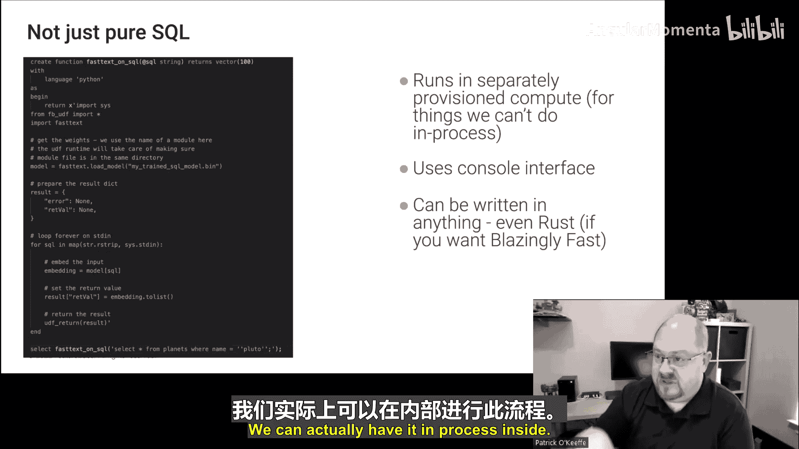

# 006：深入解析 FeatureBase


在本节课中，我们将学习 FeatureBase 的核心概念，这是一个以位图作为主要存储机制的数据库。我们将探讨其架构、数据存储方式、查询优势以及如何简化数据工作流。

---

## 数据库架构概览

FeatureBase 是一个用 Go 语言编写的分布式数据库。其共识机制基于 Raft，数据在节点间分片存储，并支持设置复制因子以实现高可用性。

从内部来看，一个节点主要分为三层：
*   **语言层**：提供 SQL 接口，方便用户使用熟悉的查询语言。
*   **计算层**：负责执行查询计划。
*   **存储层**：包含两种主要的数据存储机制。

---

## 核心存储机制：位图与 T 存储

上一节我们介绍了 FeatureBase 的整体架构，本节中我们来看看其核心的存储机制。FeatureBase 主要使用位图进行数据存储，但并非唯一方式。

### 位图存储（B 存储）

位图擅长编码关系或集合成员信息。在 FeatureBase 中，数据被建模为集合。

**示例**：假设有一个记录用户访问网页的表。我们可以将“访问的页面”建模为一个字符串集合。每个不同的页面（如“首页”、“定价”）对应一个位列表（bit list），而每个用户则对应位列表中的一个偏移量（offset）。如果用户访问了某个页面，则在该页面对应的位列表中，该用户的偏移量位置被设置为 1。

为了高效存储和计算这些稀疏的位列表，FeatureBase 使用了 **Roaring Bitmaps** 技术。它将位图数据存储在 B+ 树的叶子节点中，键由位图偏移量的高位比特和其他信息组成。

### T 存储

除了位图存储，FeatureBase 还提供传统的行式存储，称为 T 存储。它类似于 PostgreSQL 的存储引擎，将数据以行（tuples）的形式存储在页面中。

### 数据类型与存储选择

并非所有数据类型都适合用位图存储。以下是 FeatureBase 支持的主要数据类型及其存储倾向：

*   **适合位图存储的类型**：
    *   **整数**：以**位切片**形式存储。例如，一个 64 位整数会被存储为 64 个位列表，每个列表代表一个比特位。这使得范围查询非常高效。
    *   **集合**：包括 `IDSET`（数字集合）和 `STRINGSET`（字符串集合，需字典编码）。
    *   **互斥集合**：同一时刻只能有一个值的集合。
*   **适合 T 存储的类型**：
    *   高基数字符串（如用户邮箱）。
    *   浮点数。
    *   向量。

在创建表时，用户可以为每列指定使用 `BSTOR`（位图存储）还是 `TSTOR`。查询优化器也会根据查询模式（例如，高基数的 `GROUP BY`）给出存储建议。

---

## 位图存储的查询优势与挑战

了解了数据如何存储后，我们来看看位图存储为查询带来了哪些优势，又面临哪些挑战。

### 查询优势

位图存储的核心优势在于能极快地处理带有多重过滤条件的查询。



**公式**：`结果位图 = 过滤条件1的位图 AND/OR 过滤条件2的位图 ...`

1.  **快速范围查询**：对于位切片存储的整数（如年龄），查询 `WHERE age BETWEEN 18 AND 35` 只需读取和计算涉及到的几个比特位对应的位图，数据读取量极小。
2.  **快速过滤组合**：多个过滤条件的交集或并集，可以通过位图的**按位与（AND）** 或**按位或（OR）** 操作完成。这些操作可以高度向量化，执行速度极快。

### 面临的挑战

位图存储并非万能，在某些场景下会面临性能瓶颈：

1.  **点查与重构**：查询 `SELECT DISTINCT email` 或需要返回完整原始值的场景，需要从位图中逐行重构数据，效率较低。这正是 T 存储的用武之地。
2.  **更新开销**：更新一个位切片存储的值（如将年龄加 1），可能需要修改多个位图页面，写放大效应明显。FeatureBase 通过批量、预排序的写入来缓解此问题。
3.  **高基数分组**：对高基数列进行 `GROUP BY` 可能导致计算量激增。优化器会尝试先进行过滤以减少数据量，或在必要时建议使用 T 存储。

---

## 简化数据工作流：易于使用

FeatureBase 的设计哲学是让数据的流入、处理和流出都尽可能简单。

### 轻松的数据摄入

FeatureBase 提供了强大的 `BULK INSERT` 语句，允许用户声明式地将数据从源格式（如 CSV）映射并转换后插入目标表。它支持复杂的执行图，并可分布式执行。

**示例**：以下 SQL 语句可以从 CSV 读取文本，生成 UUID，并调用 OpenAI 接口生成向量嵌入后入库。
```sql
BULK INSERT INTO my_table (uuid, text, vector)
MAP ...
TRANSFORM ...
FROM ...
WITH BATCH_SIZE = 50;
```

此外，还可以通过**管道**和**外部表**功能，建立与 Kafka、Redshift 等数据源的持续同步链路，所有操作都通过 SQL 完成。

### 将计算带至数据

为了应对 ML/AI 工作负载，FeatureBase 致力于将计算推近数据，避免昂贵的数据移动。

1.  **库内模型训练**：用户可以直接使用 SQL 语句，基于数据库内的数据训练模型（如线性回归）。`WHERE` 子句用于快速筛选训练集，训练结果可存入系统表。
    ```sql
    CREATE MODEL my_model
    TRAIN (SELECT * FROM crime_data WHERE ...)
    WITH ALGORITHM = linear_regression;
    ```
2.  **库内推理**：支持通过用户定义函数调用外部推理引擎（如 Python 脚本），或直接集成原生推理库。这使得特征工程、模型应用等步骤可以在数据库内高效完成。
3.  **高级应用**：例如在 RAG 场景中，将文档块的关键词提取为字符串集并存入位图，后续的相似性搜索可以通过高效的集合运算（如 Tanimoto 系数）完成，无需向量计算。

---

## 总结

本节课中我们一起深入学习了 FeatureBase 位图数据库。
*   我们首先了解了其分布式架构和 B 存储（位图）、T 存储（行存）混合的存储设计。
*   接着，探讨了位图存储如何通过集合编码和位切片技术，在多重过滤、范围查询等场景下实现极高性能，同时也分析了其在点查、更新和高基数分组方面的挑战。
*   然后，我们看到了 FeatureBase 如何通过增强的 SQL 接口、`BULK INSERT`、管道等功能，极大简化了数据摄入和转换的复杂度。
*   最后，我们学习了 FeatureBase 如何践行“将计算带至数据”的理念，支持库内的模型训练与推理，为 ML/AI 工作流提供高效支持。

FeatureBase 的核心价值在于为特定的数据模式（宽表、多筛选条件、实时更新查询）提供了与众不同的高性能解决方案。