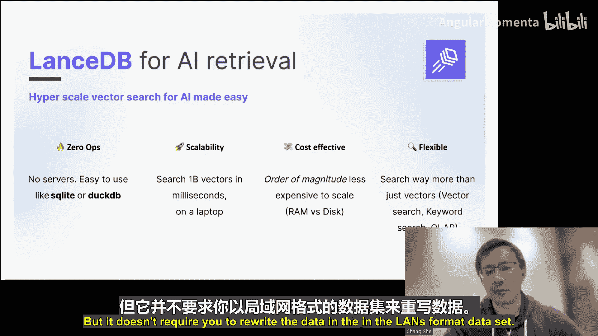
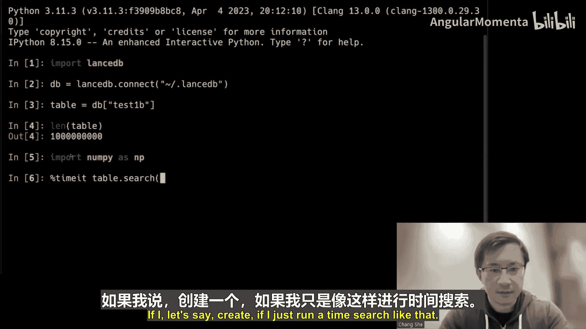
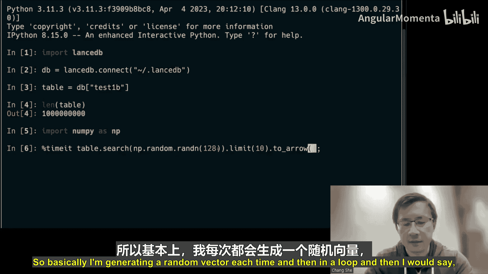
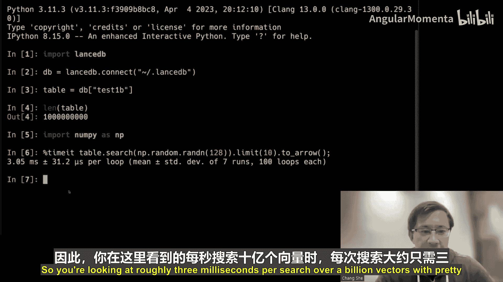
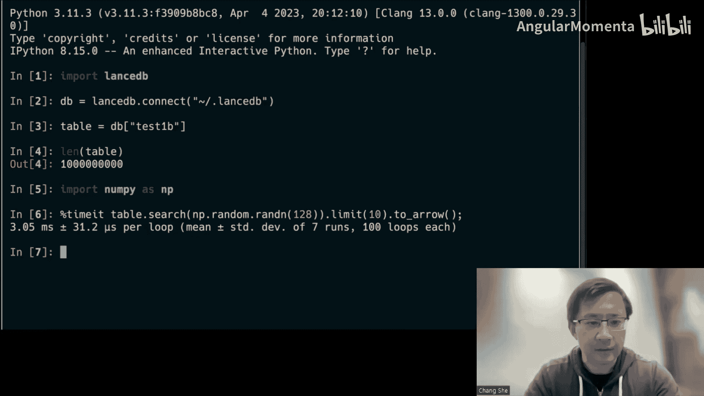
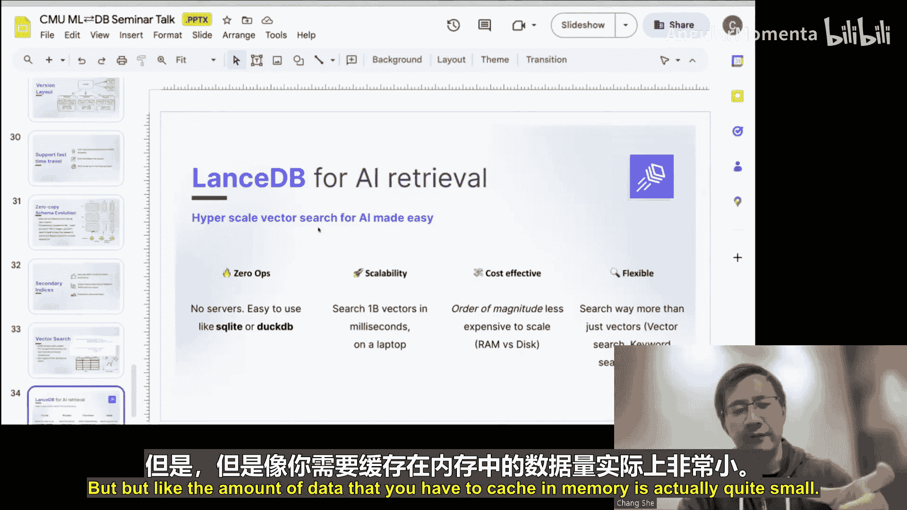
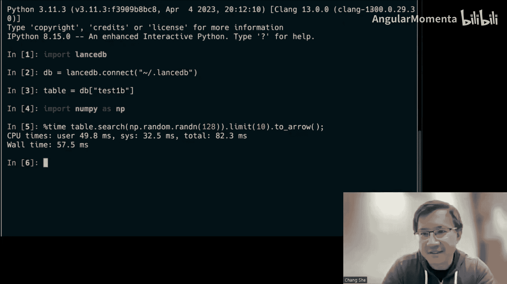
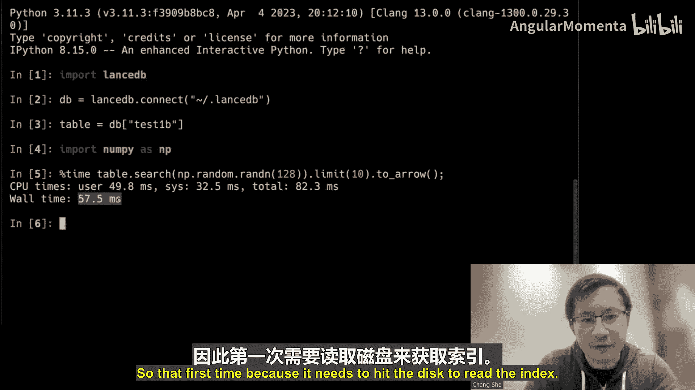
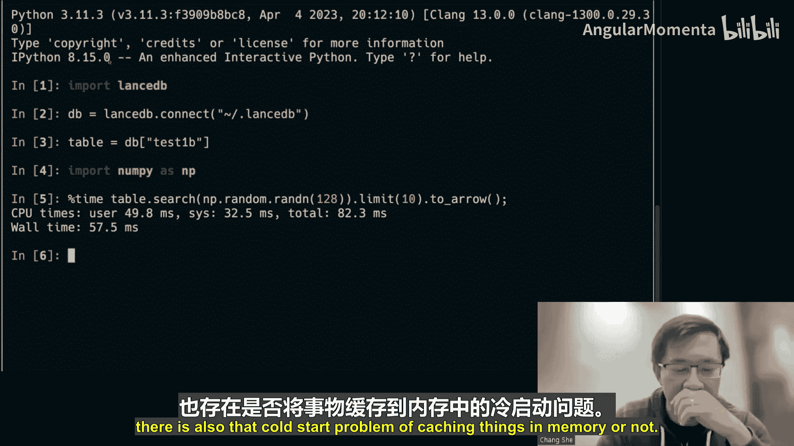
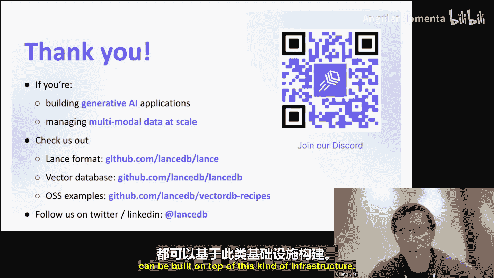

# 007：现代列式数据格式


在本节课中，我们将学习一种名为Lance的新型列式数据格式。Lance旨在解决现代机器学习工作负载，特别是处理非结构化数据（如图像、音频、向量嵌入）时，传统格式（如Parquet）所面临的挑战。我们将探讨其设计原理、性能优势以及如何简化机器学习的数据管理流程。

---

## 概述

Lance是一个为机器学习时代设计的列式数据格式和表格式。它支持快速扫描和随机访问，尤其擅长处理包含大型二进制对象（如图像、点云）和向量嵌入的数据集。Lance还集成了版本控制、事务和二级索引（如向量搜索索引）等功能，使其成为一个统一的数据管理解决方案。

---

## 设计动机与挑战

上一节我们介绍了Lance的概览，本节中我们来看看促使Lance诞生的具体挑战。

随着非结构化数据的普及，数据系统面临新的压力：
*   **数据规模巨大**：一张图片可能高达数百KB，远超传统的浮点数。即使行数不多，数据集也容易达到PB级。
*   **数据类型复杂**：除了传统表格数据，现在还有向量嵌入、图像、音频、视频、点云等。传统数据库和格式对此缺乏原生支持。
*   **工作负载复杂**：
    *   **机器学习探索与调试**：需要基于元数据过滤后，快速随机访问少量特定样本（如图像）。
    *   **模型训练**：需要高效的全局随机打乱（shuffle）数据。
    *   **可复现性**：需要强大的数据版本管理和追踪能力，以关联模型检查点与数据状态。
*   **现有方案不足**：
    *   **Parquet/ORC**：随机访问性能差，尤其不利于读取大型二进制对象。
    *   **TFRecord等**：为训练优化，但缺乏灵活的分析和过滤能力。
    *   **向量数据库**：许多更像是索引的包装，缺乏完整的数据管理能力（如存储原始数据），且计算与存储未分离，导致扩展成本高昂。

---

## Lance的核心设计

上一节我们了解了现有格式的局限性，本节中我们来看看Lance是如何从底层设计来解决这些问题的。

Lance的设计遵循几个核心原则：不存储比Parquet/ORC更多的数据、提供常量时间的单行查找、将元数据开销分摊到多次查询中，并针对现代存储硬件（如NVMe SSD、对象存储）进行优化。

### 编码方案

以下是Lance支持的主要编码方式：

1.  **平面编码**
    *   **适用类型**：定长数据类型（数值、向量、张量）。
    *   **原理**：数据连续存储，通过偏移量计算实现直接访问。支持不同的张量内存布局，便于直接送入GPU处理。
    *   **公式/代码表示**：`offset = row_index * element_size`

2.  **二进制编码**
    *   **适用类型**：变长数据（字符串、字节、图像、点云）。
    *   **与Parquet的关键区别**：Parquet将偏移量和数据交错存储，读取单行需要解码整个行组。Lance将偏移量和数据分别集中存储，先读取整个块的偏移量数组到内存，即可实现任意行的常量时间定位和读取。
    *   **优势**：这是Lance在随机访问大型二进制对象时比Parquet快几个数量级的主要原因。

3.  **高级编码（路线图）**
    *   **游程编码**：针对重复数据压缩，同时支持快速查找。
    *   **可变编码**：每个数据块可使用不同的编码方式。

**设计权衡**：二进制编码的布局使得压缩（如Snappy）更困难。但对于以已压缩图像为主的数据集，总体积与压缩Parquet相差不大。Lance通过专注于大对象场景和规划高级编码来减少此差距。

---

## I/O与执行优化

上一节我们探讨了数据在磁盘上的布局，本节中我们来看看Lance如何优化数据的读取过程。

针对大对象和现代存储，Lance的I/O执行层做了两项关键优化：

1.  **延迟物化**
    *   **问题**：传统OLAP计划会先扫描所有列（包括巨大的Lidar点云列），然后过滤，导致读取过量数据。
    *   **Lance方案**：仅先扫描谓词列（过滤条件），进行过滤和排序后，得到最终需要的行ID，再根据这些ID去随机读取投影列（如点云数据）。
    *   **前提**：这要求底层数据格式支持高效的随机访问，而这正是Lance的优势。

2.  **扁平化I/O树**
    *   **原理**：利用现代NVMe SSD的深度队列和对象存储的高并行能力，尽可能减少I/O操作间的依赖，并发起大量并行I/O请求。
    *   **效果**：显著提升向量搜索等操作的端到端性能。

---

## 表格式与版本控制

上一节我们关注于单文件内的优化，本节中我们来看看Lance如何管理由多个文件组成的数据集。

Lance不仅是一个文件格式（`.lance`文件），也是一个表格式（Lance Dataset），它组织多个文件并提供数据管理功能。



一个Lance数据集的目录结构如下：
*   `data/`：子目录，存储实际的`.lance`数据文件。
*   `_latest.manifest`：指向最新版本清单文件的指针。
*   `_versions/`：目录，存储所有历史版本的清单文件。
*   `_deletions/`：目录，存储软删除信息。









**核心特性**：
*   **版本化与时间旅行**：每次数据更新（追加、覆盖、模式演变）都会生成新版本，旧版本数据完好无损。可以轻松查询历史某个时间点的数据状态，这对机器学习实验和回滚至关重要。
*   **模式演变**：可以添加或删除列，而无需复制原有数据。新版本的清单会指向新文件和老文件。
*   **事务性**：通过清单文件保证数据版本的一致性。









---

## 二级索引集成

上一节我们介绍了数据管理的基础，本节中我们来看看Lance如何通过集成索引来加速查询。

Lance将二级索引作为其表格式的一等公民，与数据存储紧密结合。

1.  **向量搜索索引**
    *   **设计**：索引（如IVF、PQ）中存储指向数据集中行ID的指针。查询时，先搜索索引得到相似向量的ID，再根据ID快速读取对应的原始数据（如图片、文本）。
    *   **磁盘支持**：Lance的向量索引是磁盘优化的，而非完全内存驻留。通过精心设计的数据布局和并行I/O，能在磁盘上实现高速搜索，从而支持超大规模（十亿级）向量集的低成本存储与检索。
    *   **代码示例（LanceDB向量搜索）**：
        ```python
        import lancedb
        import numpy as np
        db = lancedb.connect("./data")
        table = db.open_table("my_vectors") # 假设有10亿向量
        query_vector = np.random.randn(1536)
        results = table.search(query_vector).limit(10).to_list()
        # 可在毫秒级返回结果
        ```

2.  **扩展性**：框架可扩展至标量索引（加速属性过滤）、全文搜索索引等，实现多召回器统一存储与查询。

---

## 路线图与总结

本节课我们一起学习了Lance格式的设计动机、核心编码方案、I/O优化、表格式特性以及集成的二级索引。

**当前路线图包括**：
1.  完整的统计信息与谓词下推，提升过滤性能。
2.  对平面编码的NULL值支持。
3.  实现游程编码、可变编码等高级编码。
4.  构建标量索引。
5.  更深的生态系统集成（如Spark原生数据源）。

**总结**：Lance旨在成为管理多模态机器学习数据的现代基础格式。它通过重新设计数据布局、优化I/O执行、集成版本控制和索引，解决了Parquet在随机访问和大对象处理上的不足，以及向量数据库在数据管理上的缺陷，为AI数据栈提供了一个统一、高效且开源的基础层。



---
*（注：教程根据提供的演讲内容整理，已去除语气词，并按照要求结构化。部分技术细节和问答环节因连贯性和简洁性考虑进行了归纳或省略，但保留了所有核心观点和信息。）*