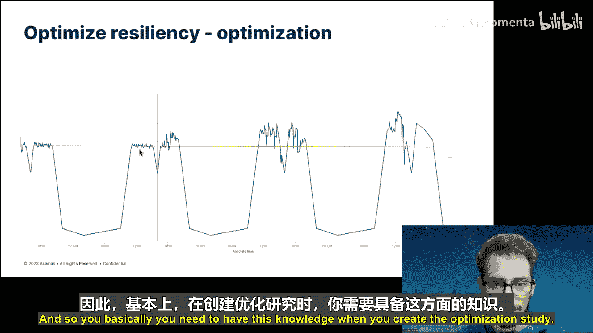

# 008：自主性能优化

卡内基梅隆大学的“机器学习与数据库”系列研讨会面向现场观众录制。

本项目的资金由谷歌以及像您这样的观众捐款支持。

感谢大家。欢迎各位参加卡内基梅隆大学数据研讨会系列的另一场讲座。今天我们很高兴邀请到Stefano Cereda。他是一位高级数据科学家，就职于Akamas，这是一个自动化性能优化平台。他在米兰理工学院的博士论文就是基于Akamas的研究，后来Akamas发展成了一家初创公司。和往常一样，如果大家在Stefano演讲过程中有任何问题，请自行取消静音并发言。随时都可以提问，这样他就不会在Zoom上独自讲一个小时了。那么，Stefano，现在交给你了。非常感谢你今天来到这里。我还要补充一下，你现在在意大利，对吗？就在米兰附近。你那边比我们早五个小时，所以现在是晚上9点。非常感谢你为我们熬夜。

谢谢，谢谢邀请我今天来到这里，也谢谢非常友好的介绍。

我将向大家介绍Akamas，这是一个用于自主性能优化的软件。

通过本次演讲，我们将首先了解配置调优的含义，即什么是配置，为什么需要调优配置，以及自动调优意味着什么。

然后，我们将探索Akamas的功能、工作原理，以及它与其他自动化调优解决方案的区别。

接下来，我们将使用MySQL进行一些实际示例，以展示Akamas的能力。

那么，让我们从了解配置开始。我们知道现代IT系统具有复杂且多层的结构。

例如，我们可以看看使Cassandra数据库管理系统工作的各个层次。

这意味着它在Java虚拟机（JVM）内部运行。

JVM又可以在Kubernetes或本地容器内执行，或者可以跳过容器，直接在操作系统（Linux或Windows）之上运行。

在最底层，是物理层。这可以是运行数据库的物理机，也可以是虚拟机。如果是虚拟机，显然还会有另一层物理机。

现在，每一层都有一组可调优的配置参数。

这些是您可以在特定软件中设置的选项，它们控制着该软件的行为。

通过控制行为，它们有能力塑造整个系统（即您的数据库）的性能。

例如，我们可以从机器层开始看，这是IT基础设施的基石。因此，我们在这个层面所做的选择确实对数据库性能有着深远的影响。

我们可以选择不同的硬件，或者选择不同的云实例。基本思路是，如果您选择不同的物理磁盘，就会有不同的I/O性能，这将导致数据库运行得更快或更慢，这是一个非常简单的例子。

向上看，我们有内核，内核配置同样影响系统性能。典型的例子包括文件系统或CPU调控器的设置。

再向上看，我们可以看看JVM。JVM设置在系统性能中扮演着至关重要的角色，因为配置不当的JVM会导致垃圾回收时间过长，从而严重影响数据库的性能。

最后，我们有数据库本身。数据库参数用于微调数据库的行为，因此它们显然直接影响系统的性能。

因此，配置调优指的是战略性地选择所有这些参数，在每一层进行选择，以优化您的系统，即您的数据库。

这里的“优化”指的是优化某个指标。这可能是提高数据库的吞吐量、降低响应时间，或者提高系统效率以降低基础设施成本。

然而，在当今复杂的IT环境中，通过手动调优实现最佳性能已成为一项艰巨的挑战。原因有很多。

但理解为什么传统方法不再有效至关重要。首先，系统的层数增加了。我们总是有更多的全局层，并且在每一层内部，可用参数的数量也成倍增加。参数的激增使得手动微调每个参数变得越来越不切实际，基本上是因为我们有太多参数需要控制。

此外，许多参数的影响不明确或缺乏文档。即使有文档，也常常缺乏关于特定设置如何影响系统性能的深入见解。

因此，如果您进行手动配置调优，您只能选择一个值，然后观察其行为。

更令人困惑的是，许多参数提供的默认值并不总是最优的，有时甚至与最优值相差甚远。例如，我们可以看幻灯片中的中间图。这里显示了数据库吞吐量作为缓存大小的函数。您可能认为选择缓存大小的默认值是一个安全的选择。

但反直觉的是，在这个特定示例中，我们发现无论是减小还是增大缓存大小都带来了性能提升。这是一个问题，因为如果您手动进行这个实验，您看不到参数的清晰线性效应，因此您真的需要探索参数的整个定义域，以了解应该如何设置其值。

所以这并不理想。最后，我们面临着发布周期的加速。基本上，每次发布之间的时间间隔越来越短，因此没有时间在每次发布前进行手动调优。这是因为IT团队面临着跟上技术发展的竞赛，发布如此频繁，以至于我们无法再进行手动调优。

在这个不断发展的环境中，对自动化、智能化的配置调优方法的需求变得至关重要。不再可能依赖手动努力。解决方案在于像Akamas这样的工具，它可以为我们适应、优化并持续微调配置。

那么，现在让我们来看看Akamas。显然，Akamas是一个自动调优器，其理念是修改系统配置以满足某些优化目标。这可以是提高服务质量、降低成本、或增加服务弹性，我们可以做许多不同的事情。

我们Akamas的目标是创建一个由机器学习驱动的优化平台，支持尽可能多的应用程序和技术。

因此，Akamas严格来说不是一个数据库调优器。我们不提供查询模式优化等服务，我们并非专门针对数据库。然而，我们确实支持一些数据库，因此我们可以使用Akamas来调优数据库的配置。

此外，我们确实支持这个技术栈的不同层，因此我们也可以使用Akamas来调优操作系统或运行数据库的实例。

显然，Akamas有一些关键能力，使其区别于其他自动调优器。在我看来，最重要的是它是一个全栈自动调优器，因此可以同时调优IT技术栈的不同层。

同时，我们是技术无关的，我们希望尽可能通用，不希望被任何特定技术或平台所限制。

现在，调优技术栈的不同层不仅意味着有更多参数可以调优，从而可能提取更多性能，而且还可以利用层间的一些相互依赖关系。

举个简单的例子，如果您选择一台内存更大的机器，就可以给数据库分配更多内存。这个例子很简单，但还有更复杂的情况，当您调优多层时，确实可以利用这些情况。

第二个最重要的点是，Akamas是一个目标驱动的自动调优器。有些自动调优器有很强的预设观点，它们对特定应用程序应如何运行有自己的想法。而使用Akamas，用户设定目标。同样，目标可以是提高吞吐量、降低响应时间或任何函数。当用户指定某个目标函数时，Akamas将在参数空间中导航，以找到优化该特定指标的配置。

那么，您能谈谈具体是怎么做的吗？假设有人注册并说“我想优化吞吐量”，您会改变要调优的参数吗？还是会改变调优的激进程度？在优化吞吐量、延迟或成本时，有什么变化？

对于目标部分，根据您设定的目标，那将是我们优化过程中监控的内容。基本上，我们有一个机器学习模型，它将您应用的配置映射到一个特定的得分值，比如说。因此，这个值取决于您指定的函数。

然而，对于第二部分，也就是下一个要点——安全性。这里的“安全性”指的是我们对其他性能指标有许多不同的约束，例如服务级别目标或最大基础设施成本。这些约束取决于我们正在调优的应用程序，如果我们对该应用程序有所了解的话。

或者实际上取决于我们如何调优应用程序，但我们稍后会讨论这一点。

这本质上是一个安全特性。我的意思是，在优化过程中，我们尽一切努力检查这些约束，并且在优化结束时，我们确保最终配置符合指定的约束。

最后一点是，Akamas是工作负载感知的。我们持续测量进入系统的工作负载，并将此信息纳入推荐中。当我们在真实环境（生产环境）中进行调优时，这一点尤其重要。在生产环境中，我们暴露在真实的工作负载下，这些负载是嘈杂的且随时间变化，因此我们必须测量并跟踪它。

这实际上引出了介绍部分的最后一点，即Akamas的两种“风味”，或者说两种使用方式。

第一种是我们最初提供的，旨在调优副本系统或副本环境。这里的理念是，Akamas控制配置，同时我们也控制一个负载注入工具。这个工具为系统创建合成工作负载。通过这种方式，我们可以比较不同的配置，因为我们总是针对相同的工作负载进行测试，因此可以轻松比较不同的配置。

在第二种风味中，我们调优真实的生产环境。因此，我们是在真实世界中与真实系统和真实工作负载一起工作。显然，这里不再有负载注入工具，因为我们暴露在真实负载下。

在这种第二种风味中，遵守我们之前讨论的约束变得至关重要。同时，动作也需要更加平滑，因为您不希望在生产环境中进行剧烈的更改。此外，还需要考虑工作负载，因为它是真实的工作负载，我们需要跟踪它。

现在，我们可以看第一个例子，其中我们看到了MySQL的优化，假设我们直接调优系统的副本。

因此，作为一个示例设置，我们使用了MySQL数据库，运行在Ubuntu之上，位于亚马逊EC2云实例内部。

我们使用Prometheus收集性能数据，并使用BenchBase为MySQL创建合成负载。

调优过程的第一步包括将配置应用到系统。

为此，我们提供了一些针对支持技术的配置器。这使得配置过程非常直接，因为您基本上只需告诉Akamas您有一个MySQL数据库和一台Ubuntu机器，需要提供一些凭据，然后Akamas会自动知道哪些参数可用、哪些参数最重要（因为我们支持该技术）、参数的可接受范围是什么，更重要的是，如何将参数应用到系统。

显然，如果某项技术不受Akamas支持，我们希望成为一个通用的自动调优器，因此我们尝试通过提供一些自定义脚本，使集成任何新技术到Akamas变得相当容易。然而，在这个例子中，MySQL和Ubuntu都是受支持的技术，因此无需编写自定义脚本。

值得注意的是，EC2也受Akamas支持。但我们决定不在此示例中包含它。基本上，调优这一层意味着选择使用哪个实例来运行数据库。如果您切换实例选择以迁移数据库，这会使示例更复杂，因此我们决定不这样做。然而，调优实例选择是我们经常做的事情。我们大多数真实的优化都是针对运行在Kubernetes中的Java应用程序，因此如果您有一个容器，将其移动到另一个实例非常容易。

尽管如此，一旦配置被应用，我们需要启动合成工作负载。为此，我们使用BenchBase。我们使用了具有100个仓库和50个终端的TPC-C工作负载，并尝试实现最大可能的吞吐量。

我们让测试运行20分钟，在这20分钟内，我们使用Prometheus收集性能数据。在这个例子中，我们使用了节点导出器（用于实例）和MySQL导出器（用于MySQL）。这只是因为Prometheus非常容易设置，并且是一个很好的示例。但实际上，我们支持许多其他监控解决方案。

在这20分钟结束时，Akamas从BenchBase和Prometheus收集结果。读取BenchBase的输出非常简单，因为有一个很好的CSV文件，您可以直接导入到Akamas中，所以很直接。而对于Prometheus，MySQL和Ubuntu是受支持的技术，因此Akamas再次知道哪些指标对这些层很重要，以及如何查询Prometheus来获取这些指标。

利用这些信息，我们使用机器学习模型来理解配置的行为。基本上，我们得到一个新的建议配置，将其应用到系统，运行新的实验，获取新的性能数据，更新模型，然后得到新的配置。因此，我们基本上是迭代地进行。

然后，我们可以手动停止这个过程（如果我们找到了一个好的配置并对结果满意），或者我们可以让Akamas继续，直到耗尽优化预算。

现在，通过这个例子，我们运行了两项研究，即两个优化研究。第一项研究专注于MySQL的两个非常重要的参数：缓冲池大小和日志容量。通过调优这两个参数，我们将最大吞吐量显著提高了65%，即从每秒130个操作（请求）提高到每秒220个请求。

然而，需要说明的是，实现这个结果相对简单，因为MySQL的默认缓冲池大小是128 MB，对于这个特定的工作负载来说确实不够。因此，实际上，大多数数据库管理员会选择更大的缓冲池大小，并且基本上会获得与研究相同的结果。

现在，显然，使用Akamas，您可以调优MySQL的更多参数。这里我们只调整了这两个参数，以展示我一开始所说的：默认配置对于许多现实工作负载来说确实不是最优的，即使通过非常简单的优化，您也可以实现显著的改进。

这是哪个版本的MySQL？最新的，我不记得是8了。好的，然后它显示实验13，所以您花了13次迭代才达到大约两倍的性能。正确，嗯，实际上，因为我在上周运行了这个实验，所以是MySQL的最新版本。基本上是13次实验，因为那是我停止优化研究的时间。好的，所以最好的结果是那个，但实际上从第四次迭代开始，我们已经提高了60%。基本上是因为缓冲池大小有这个定义域，除了把它调小之外，您所做的任何事情（定义域的大部分都比默认值大）都容易在这里提高吞吐量。明白了，太好了，谢谢。

同样的结果也适用于技术栈的其他层。因此，有许多参数的默认值并非最优，我们应该调优它们。

因此，从这个配置开始，我们运行了另一个实验。所以我们现在从具有大缓冲池大小的MySQL优化配置开始，并添加了来自Ubuntu的27个参数。

通过调整这些参数，我们能够达到255。因此，与220相比，这基本上是15%的改进，但如果与原始性能130相比，则是25%的改进。

因此，基本上，通过调优MySQL和Ubuntu系统所能获得的整个性能改进中，三分之二来自MySQL，三分之一来自操作系统，这仍然是一个实质性的改进。

显然，调优MySQL数据库可以由专家级的人类数据库管理员完成。但调优27个Linux参数则完全是另一回事，它要复杂得多，并且涉及非常不同的技能。这展示了您可以实现的潜在性能增益。

实际上，在优化过程结束时，Akamas会提供一些见解，说明哪些参数对实现优化得分贡献最大。在这个例子中，显然两个MySQL参数是最重要的。但在第三位，我们有CPU调度器的延迟。这真的很有趣，因为这一结果与我们过去运行类似实验时观察到的情况非常不同，当时这个参数并不在最重要的参数之列。

这促使我们深入研究，以了解发生了什么，以及为什么这个参数变得重要了。

抱歉，打断一下，您是如何计算那个相关性的？是像您正在调优的赫林格（Hellinger）距离那样的东西吗？还是预先计算好的？您是如何计算那个的？

这是由机器学习模型计算的，基本上它与参数在模型中的重要性相关。因此，它基于优化过程的结果。

您能分享一下您使用的模型吗？我们使用很多模型。优化的核心是贝叶斯优化过程，因此这与贝叶斯过程核中的自动相关性确定有关。

明白了，太好了。但实际上并不那么直接。我想做的一件事是在优化中引入一个最终步骤，您实际上通过从基线开始，一次将一个参数更改为最优值，来计算相关性，并真正看到哪些参数是最重要的。

好的，回到这个结果的原因。我们观察到Linux内核的5.13版本。更具体地说，是这个提交将调度器的参数移到了这个目录 `/kernel/debug/scheduler` 中，因此它们被标记为调试参数。现在，这个提交没有改变参数的默认值，但通过更改用于更新参数的路径，它破坏了一些用户空间工具，比如 `tuned`，这些工具用于更新这些值。

基本上发生的情况是，当您启动Linux机器时，内核设置一个值，然后发行版在启动过程中设置另一个默认值，他们认为这个值更适合您的特定用例。如果您破坏了用户空间工具，发行版就不再更新默认值，因此您就卡在内核的默认值上了。我们在Ubuntu 22.04和RHEL 8.1上观察到了这种行为。这里的“行为”指的是默认值在一个发行版版本和另一个版本之间是不同的。

实际上，这个观察并非我们独有。如果您点击这些链接，您会看到VMware实际上报告了这个错误，并且他们观察到由于调度器参数的这个新默认值，性能下降高达三倍。

因此，我想在这里指出的重点是，像这样的事情经常发生。存在这些未记录的性能回归，系统中某些东西坏了，您有某个外部库依赖于另一个库，有人更改了某些东西，系统中的某些东西就坏了，您基本上就遇到了性能下降。

所以这凸显了拥有像Akamas这样的工具的重要性。首先，因为它们帮助您理解您遇到了问题，因为突然之间系统的性能与过去不同了，所以您看到有问题。但同时，有了Akamas，您真的不需要理解为什么有问题，因为您可以简单地重新调优您的应用程序并解决问题。实际上，在这个例子中，我们必须研究这个，因为我们想理解为什么这个参数变得重要了。但在现实中，我们本可以保留Akamas给出的结果，并获得我们想要的所有性能。

到目前为止，我们的讨论都基于一个假设：我们拥有真实系统的副本，并且在这个副本中，我们可以方便地测试和微调配置。

然而，现实世界真的不同。更准确地说，我们的假设是拥有一个副本环境，它是真实系统的完美复制品。但事实并非如此，原因有二。

有时，副本环境（预生产环境）甚至不存在，根本没有预生产环境。而大多数时候，即使预生产环境可用，它也不是真实系统的完美复制品。因此，显然，如果您有两个不同的环境，它们可能需要不同的最优设置。所以，如果您在预生产环境中运行实验，然后将配置转移到真实环境，最终可能会得到糟糕的性能。

第二个问题在于工作负载。到目前为止，我们使用了合成工作负载，使用BenchBase来测试配置。同样，显然，如果您使用不同的工作负载，最终可能会得到不同的最优配置。

因此，您确实需要创建一个合成工作负载，它是真实工作负载的一个非常好的近似。然而，这同样非常复杂，因为首先真实工作负载是嘈杂的，而且真实工作负载也随时间变化，所以它总是与自身不同，您无法复制它，因为它总是在变化。您只能创建一个足够好的工作负载近似。

但在实际中，复制真实工作条件是一项非常复杂的任务，因为您需要准备必要的测试基础设施和工作场景，这既耗费资源又非常耗时，通常是不可接受的。

为了解决这个问题，我们引入了Akamas的第二种风味，称为Akamas Live，我们在其中调优生产环境。

从Akamas用户的角度来看，我们希望这像创建一个实时优化一样简单，而不是一个优化研究。然而，由于是生产环境，我们必须对算法进行一些调整。

最重要的考虑是增加我们在优化过程中对遵守指定约束的重视程度。因此，我们不希望违反任何安全约束。这对于防止对生产环境的任何干扰至关重要。

第二点，对于数据库来说，很明显，您不会关闭事务提交的FSync，因为您知道，这会使磁盘无法持久化数据。对于您正在调优的其他东西，比如内核参数或JVM，您能举例说明必须设置的其他安全约束吗？

嗯，基本上，为了安全，我们做了很多不同的事情。首先，就像您说的，我们限制参数的定义域以使其更安全。

我们还有一些参数之间的新约束。举个非常简单的例子，如果您在容器内调优JVM，您不会让JVM的堆大小超过容器的内存。

然后，在实时优化的优化过程中，我们进一步限制配置的定义域，使得不同配置之间的变化非常平滑。我们不希望配置发生突变。

还有那些约束，它们基本上是一个性能指标的约束，该指标是参数的未知函数。因此，您可以再次创建一个机器学习模型来将其映射为一个函数，并尝试创建一个预期能满足该约束的配置。

基本上，安全性是您希望距离约束边界有多远。另外，您可以做的一件好事是利用模型的不确定性。因此，如果您的约束模型告诉您某个配置距离边界很远，但模型对这个预测不确定，您就不会尝试该配置，而是采取更安全的做法，收集更多数据。这样优化过程会更慢，但肯定更安全。

听起来您维护了多个贝叶斯优化模型，一个用于目标（如吞吐量或延迟），但也用于内存消耗等其他指标，对吗？是的，这不是一个海洋过程，但理念是……您能说说您使用什么模型吗？啊，然后，很多，我们根据得到的指标动态决定使用哪个模型，是一种集成方法。

好的。那么，您能描述一下谁提出这些约束以及他们如何做到的吗？是Akamas的客户吗？您如何衡量所有约束的完整性？

嗯，对于我们支持的技术，当您选择特定应用程序时，会预定义一些约束。我们还有一些跨层的约束，所以如果您选择，比如说，JVM和Kubernetes容器，您会得到一个将JVM堆与容器内存联系起来的约束。

然后还有一些关于响应时间的约束，响应时间相对于基线不能下降。

还有一些关于资源利用率的约束，这些总是有益的。

除此之外，用户可以指定一些其他约束。实际上，即使是Akamas添加的那些约束，用户也可以删除，如果他们想的话。我不知道他们为什么会这样做，但是……作为用户，您可以做任何您想做的事情。然后在此基础上，我们为研究的创建添加了一些语法糖，一些约束会自动添加。

我希望这回答了任何问题。

好的，那么关于约束就说到这里。对于工作负载，我们说过需要监控工作负载的演变。

实际上，这里有两个技术细节我们需要讨论。基本上，当您设计一个自动调优器时，您正在创建一个选择配置的东西，这个配置应该优化作为参数和工作负载的未知函数的某个指标。同时您还需要保证安全。

因此，您可以控制配置，但无法控制工作负载。所以您需要决定考虑哪种工作负载。基本上，您可能有系统什么都不做的夜晚，或者系统大量工作的白天。

对于这些，您有两个正交的决定要做。您可以选择局部安全，即自动调优器将为您提供一个仅对当前工作负载预期安全的配置；或者选择全局安全，即配置预期对所有可能的工作负载都安全。

同样的决定也可以针对优化做出。您可以决定要一个仅针对当前工作负载优化得分的配置，因此您基本上是在追逐工作负载，自动调优器将不断更改配置以跟上工作负载的演变，您将始终拥有性能最佳的配置。

或者您可以选择平均优化。在这种情况下，您希望创建一个自动调优器，它将找到一个单一的配置，该配置在所有可能的工作条件下都不是最好的，但它是一种平均配置，是您为了在所有工作条件下优化这个得分所能做出的最佳权衡。

现在，当我们开始研究Akamas Live时，我们试图为追逐行为创建一个自动调优器，即不断更改配置。实际上，我们看到我们所有的用户都更喜欢单一、不变的配置的简单性和稳定性，因此我们转向了全局安全和平均优化的场景，这就是我们现在要看到的。

显然，要做到所有这些，您需要在系统中拥有一些组件来跟踪工作负载演变，并进行一些聚类和预测。

好的，有了这些，我们可以转到第二个例子，即MySQL的实时优化。这里我们保持了相同的系统来运行示例。

然而，我们修改了BenchBase的配置。最重要的是，我们不再追求最大吞吐量，而是使用一个我们稍后会看到的工作负载模式，因此工作负载随时间变化。

此外，BenchBase不再连接到Akamas。因此，即使Akamas没有运行，我们也会持续向MySQL发送查询。Akamas和BenchBase之间没有连接。所以显然，这不是一个具有生产工作负载的生产环境，但它是一个很好的近似，因为工作负载随时间变化，并且不与调优工具连接。

至于优化循环，Akamas唯一要做的就是更新配置，这与之前相同。然后我们等待一段时间，收集性能指标。因此，现在与BenchBase没有连接。

当我们应用配置时，根据您如何设置Akamas，我们可以做两件不同的事情。基本上，您可以决定自动批准，即Akamas在没有人工干预的情况下继续实施建议的更改。

或者您可以选择手动批准步骤。在这种情况下，Akamas为用户提供手动审查和修改配置的机会，然后再将其应用到系统。这确保了人类专业知识仍然是决策过程的一个组成部分。

此外，我们还提供了将新配置建议给用户已有的外部配置管理工具的选项。然后我们等待配置部署到系统，然后再测量新的性能。

显然，这种控制水平在生产环境的实时优化中至关重要，因为用户必须保持在循环中，因为配置更改会显著影响系统的性能，尤其是在调优的最初几次迭代中，用户需要建立对Akamas的一些信任，因此他们希望成为循环的一部分，检查Akamas在做什么。

至于工作负载模式，这里我们用蓝色表示我们要求BenchBase达到的吞吐量。显然，它随时间变化。黄色表示基线默认配置的响应时间。

工作负载有一些时间变化。因此，我们在晚上10点（在这里，我不知道您是否能看见我的指针）有一个低工作负载区域。好的，我们从这里开始夜晚，然后上升。

然后工作负载增加，并保持高位直到下午2点。接着在下午4点有一个轻微下降，然后在晚上8点之前又有一个高峰。我们要求的最高吞吐量是135，这与我们在第一个实验中看到的值相同，因此这是系统的饱和点，我们给数据库施加了很大压力。

基本上，这个模式持续24小时。X轴显然是时间。每天我们重复这个模式，并且我们还添加了一些噪声以使其更真实。

因此，利用这个场景，我们模拟了三种优化，这是我们的客户通常使用Akamas的三种方式。

第一种试图通过降低数据库的响应时间来优化性能。

第二种，我们希望提高系统的效率，即减少资源消耗，从而能够缩减基础设施规模。

第三种，我们从一个行为不良的基线开始，该基线无法维持所需的吞吐量，我们使用Akamas来解决这个问题。

让我们从第一种开始。这是我们刚才看到的同一张图，它显示了基线的行为。

从这张图，我们转到这张图，这是同一件事，但我们有更多的响应时间百分位数。另外，我们将响应时间的轴切换为对数坐标，以便能够看到所有百分位数，并更好地理解发生了什么。

实际上，我们想关注这个区域，这是第一个高峰，最高的峰值。正如我们之前所说，对于这个配置，我们接近饱和点，我们看到响应时间很高，尤其是较高的百分位数。而且当吞吐量上升时，它们也在急剧增加。

这里显示的是调优一天（24小时）后某个配置的行为。

实际上，从单个图中比较具有多个工作负载的不同配置非常复杂。因此，这里我决定放大第一个高峰，以便更清楚地看到发生了什么。

我们看到所有百分位数都更低了。而且，如果我们看最深的线，即最大响应时间，我们看到，首先，它比基线低，而且随着吞吐量上升，最大响应时间没有急剧增加。它上升了，但不像基线那样剧烈，这清楚地表明我们远离了系统的饱和点。

在这些表格中，我们基本上再次列出了响应时间，各种百分位数。在第一张表中，我们有最高峰值，即当我们达到135时。基本上是这一分钟的平均值，但确实是峰值时刻。正如我们所见，Akamas降低了所有百分位数的响应时间。

在第二张表中，我们有相同的测量，但是针对夜晚，即所有这10个小时（工作负载的低谷部分）的平均值。同样，在这种情况下，即使系统远离饱和点，响应时间也有显著降低。

现在，这类似于我们看到的第一个示例研究，因为我们从一个MySQL配置开始，该配置确实很小。因此，通过增加缓冲池大小，您可以获得非常好的性能改进。所以这又是一个相当简单的优化，即使这里我们实际上调优了两个MySQL参数和27个Linux参数，总共有29个参数。但看结果，这相当容易。

第二个例子稍微复杂一些，因为现在我们从MySQL和Linux都已调优的配置开始，因此这已经是一个非常好的配置。我们还修改了工作负载模式，不再上升到130，而是上升到100。如果您还记得，调优后的配置可以达到255。所以这是一个不接近饱和的系统，因此存在被浪费的资源。

我们这里的目标是调优MySQL配置和Ubuntu配置，以降低我们系统的资源消耗。

在这两张图中，左边是基线，右边是优化后的配置。同样，从图中比较不同配置很困难，而且因为我做了两张图，坐标轴的比例也有一些差异。

但我们仍然可以通过看蓝线（即吞吐量）看到白天的两个高峰。黑色是内存利用率，两种配置都是90%，所以那里有一些差异。这对于数据库来说是合理的，因为它会尝试使用所有内存，如果数据库不使用，操作系统就会使用。

然后红色是CPU利用率。它基本上与吞吐量模式匹配。但更有趣的是，在基线中，CPU利用率接近58%。而在调优后的配置中，我们降到了75%。

另外，从黄线（即响应时间）来看，基线在第一个高峰期间上升到24毫秒。而对于调优后的配置，我们降到了15毫秒多一点。

因此，基本上，经过一天对29个参数的调优，我们能够以更低的响应时间和低10%的CPU利用率维持相同的吞吐量，这是相当多的。

基本上，这意味着如果您在数据中心运行，这直接转化为更低的功耗和碳足迹。而如果您有云部署，它允许您减少分配给此数据库的资源，从而基本上可以花费更少的钱。

至于第三个例子，我们有一个所谓的弹性场景。这里的目标是修复一个不良配置。因此，基本上从默认配置开始，缓冲池大小很小，并且我使用了更高的工作负载模式。所以显然，该配置无法维持这两个高峰，因为这里对我们可以实现的最大吞吐量有明显的限制。

现在，我用蓝色或黑色垂直线标记了我们开始调优的点。橙色是基线配置可以实现的最大吞吐量。

现在，这不是Akamas Live的典型用例，因为通常您在生产环境中不会有有问题的配置。如果您有这个问题，您会尝试快速解决，而不是用Akamas。因此，在这里，我们希望优化尽可能快。这通常不是我们使用Akamas Live想要做的事情，因为正如我们之前所说，我们希望配置随时间平滑变化，所以这需要一些时间。

尽管如此，我们可以看到，在开始调优的第一个下午，我们已经能够获得更高的吞吐量。然后我们继续，基本上得到了提升。

然而，如果我们看第二天早上，我们看到我们能够实现更高的吞吐量，而且这个吞吐量甚至比下午达到的还要高。这基本上意味着，即使在夜间，Akamas也在更改配置（这里我们每20分钟更改一次配置）。通过测量进入系统的工作负载，我们能够创建一个映射配置、工作负载和性能的模型。

我们甚至能够利用这个工作负载区域（这个低工作负载区域）来获得关于系统在更高吞吐量下行为的见解。因此，第二天，我们基本上有了一个更好的配置。

然后我们继续调优，我们有另一个夜晚，我们做同样的事情。基本上在第三天下午（即经过两天调优后，基本上这里一天，这里第二天），系统表现良好，因为这里不再有吞吐量限制。

实际上，从这些数据来看，听起来您是说您认识到夜间工作负载，即使提交率低得多，但您已经确定工作负载本质上与白天高峰相同，因此您可以利用这些信息。意思是，如果夜间他们开始运行与白天完全不同的报告作业，您会自动说“这是不同的，因此我不想从中学习”，是这样吗？

是的，嗯，在这个例子中，我们始终运行TPC-C工作负载，所以始终是相同类型的东西。我们只是测量数据库的吞吐量。基本上，我们试图做的是说，如果系统在吞吐量很低时，使用这个配置表现更好，我们可以想象这个配置对于更高的吞吐量也会是好的。

在您更现实的特定设置中，您还需要跟踪在系统上运行的操作类型。因此，您有不同种类的吞吐量，比如说。

然后，您基本上从测量所有可能工作负载下的基线开始。您理解工作负载如何影响性能，因为您没有更改配置，所以您只是学习工作负载的影响。然后，即使您使用夜间工作负载进行调优，您也有一个机器学习模型，能够推断出对其他日常工作负载的一些见解。

显然，这只是一个预测，因此这里算法的安全部分变得非常重要，因为您有一个预测，并且需要能够理解该预测的可靠性。因为如果您只看到夜间，并且只在夜间进行大量调优，也许当白天来临时，您会有一个完全错误的配置，因此您真的必须注意这一点。

是的，我理解。我问的是，听起来你们现在在做Akamas Live，你们确实识别出夜间工作负载不同，因此不基于此进行调优，对吗？是的。您能分享一下您是如何做到的吗？嗯……好吧，没关系。基本上，就是用这些机器学习模型。它们映射配置、工作负载和性能，然后我们在此基础上进行一些推理。

好的。另外，我们做的另一件事是，在白天，嗯，对于这个特定例子，在白天，系统真的接近饱和，因为我们有一个行为不良的基线，因此我们真的接近系统的约束。如果我们接近……如果系统接近违反约束，我们不会过多修改配置，因为那真的很冒险。所以在这种特定设置下，我们大部分调优在夜间进行，因为那样更安全。

因此，我们基本上做的是在夜间调优，然后当工作负载回到日常工作时，可能回到基线或非常接近基线，然后我们尝试理解模型是否正确。我们可以利用夜间的结果来获得更好的配置。

好的，太好了，谢谢。

那么，这就是第二个例子的全部内容。基本上，我们看到Akamas是一个通用的优化平台，我们尝试调优尽可能多的应用程序。我们是一个全栈优化平台，因此我们真的希望利用技术栈的每一层。

我们看到了实时优化的一些例子，这是Akamas的最新版本。

在实时优化内部，我们看到Akamas尽可能重视成为一个安全的自动调优器，它不会在生产环境中造成问题。同时，它是工作负载感知的，因此正如我们讨论的，它能够利用夜间时段来获得对日间时段的见解。

就是这样。谢谢。

好的，谢谢。我会关闭我的麦克风。其他人，我们还有时间从观众那里提一两个问题。

好的，也许我可以问一个。Stefano，很棒的演讲。我是Jignesh Patel，Andy的同事。两个问题都相关。您是否在任何时候看到应用机器学习导致工作负载性能以意想不到的方式变化，直到它稳定下来？还是您几乎总是看到性能提升？第二部分是，您知道最难的工作负载是什么吗？有没有一个广泛的分类，您见过哪些超级难调优？是否所有东西似乎都可以用您的技术优化？

那么，到目前为止，我从第二个问题开始回答。到目前为止，我们总是看到可以实现一些性能改进。

关于系统方面。至于最具挑战性的工作负载，最困难的工作负载，真正的问题是当您遇到像最后一个例子中的情况时，基本上您没有明确的方法来理解工作负载是什么，因为这里我们有BenchBase，所以我知道工作负载想要上升。但在现实中，您无法访问这些信息，因此您不知道系统是稍微高于阈值还是远低于阈值，所以您需要查看响应时间并尝试理解。因此，这更多地与系统有多糟糕或离约束有多近有关。

很好，谢谢。

但对于第一个问题，我认为您真的需要考虑您正在调优的技术，因为它们显示配置更改效果所需的时间不同。因此，基本上，当您创建优化研究时，您需要具备这些知识。

