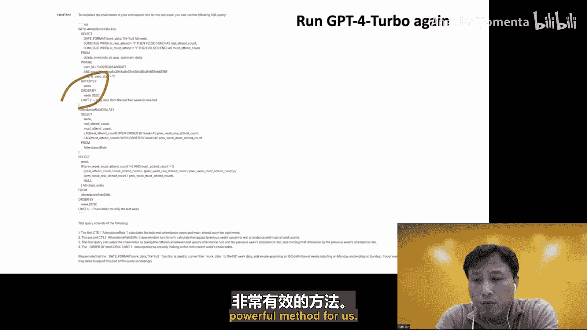

# 010：面向数据库的领域知识增强人工智能

## 概述

在本节课中，我们将学习阿里巴巴智能数据库团队如何将精心设计的领域知识干预（Handcrafted Interventions）引入人工智能系统，以增强数据库相关任务（如自然语言转SQL和运维根因分析）的性能与效率。我们将通过两个实际系统（SQL Bridge和Shapley IQ）来具体阐述这一理念。

---

## 引言：为何需要“手工”干预？

想象一下，我们讨论的主题是“面向数据库的增强人工智能”。如果我们在前面加上“手工干预的”这个修饰语，标题就变成了“面向数据库的手工干预增强人工智能”。这可能会立即在我们脑海中触发一些警报。

这听起来像是第一波人工智能浪潮的产物。如今，我们几乎已经度过了使用统计学习的第二波浪潮，正处在使用大型深度神经网络的第三波浪潮中。这是否是一种倒退，甚至是一种反模式？

在第一波浪潮中，人们通过演绎原理和总结最佳实践来构建系统。然而，随着神经网络，特别是基于Transformer架构的突破，人们意识到，使用通用模型并减少手工工程，在注入大量数据后，可以产生惊人的涌现能力。例如，同一个模型可以用于完全不同的任务，并且几乎总能给出最佳结果。

以Spider排行榜挑战（将自然语言问题翻译成SQL语句）为例，目前几乎所有排名靠前的解决方案都基于ChatGPT，要么使用某种检索方法来增强，要么使用定义良好的提示词。提示词很棒，但问题在于，有时它可能无法完全遵循你的指令。

对于NL2SQL任务，我个人认为提示词有时过于高层。我们需要一些低层级的控制。这就是今天要传达的新信息：我认为，将精确的、低层级的手工干预插入到系统中是可能的，这样做效率更高，有时甚至更有效，即使是小模型也能变得强大。

---

## 第一部分：SQL Bridge - 自然语言转SQL系统

AFDB（AI for DB）是一个很大的话题。今天我将用我们团队开发的两个真实系统来解释为何引入干预是有帮助的。第一个系统是基于NTSE的SQL Bridge，第二个是关于运维根因分析的Shapley IQ。

### 任务挑战

对于NL2SQL任务，输入肯定包括原始问题，但这还不够。我们还需要模式数据信息，包括表名、列名、其他约束（如类型信息、连接关系、主外键信息等）。有时甚至需要考虑SQL方言，例如SQL Server使用的`TOP`和MySQL使用的`LIMIT`。

右侧是SQL Bridge生成的一个真实SQL语句示例。我用这个例子来说明推导SQL语句的挑战。问题是：“英语不是官方语言的国家，其平均预期寿命是多少？”这里至少有三个挑战：1）主查询中有一个子查询；2）在子查询中有一个连接关系；3）需要将问题中的短语“官方语言”映射到名为`is_official`的列。注意，`is_official`是布尔类型，我们只能为其赋值`true`或`false`。为了使逻辑正确，我们必须为其赋值`true`。在主查询中，使用了`NOT IN`操作符。

### 为何不直接微调大语言模型？

在开发SQL Bridge时，我的同事最常问的一个问题是：既然Spider排行榜上几乎所有顶级解决方案都基于ChatGPT，为什么不直接微调一个大语言模型并优化你的提示词呢？为了回答这个问题，让我尝试用一些例子来比较GPT-4和SQL Bridge。

我想强调的是，以下例子实际上是有意挑选的，对SQL Bridge有利，因此不要过度解读，它可能有偏差。但我的目的是展示，即使是惊人的GPT-4，包括新发布的GPT-4 Turbo，仍然会犯错。

**示例一：错误的列选择**
问题来自Spider：“找出在1970年生产了一些汽车的制造商名称。”提示词实际上很长，它来自11月2日前排名第一的解决方案。提示词由两部分组成：首先需要提供数据模式信息，然后它使用额外算法从知识库中查找相似问题。这些相似问题包括自然语言问题及其对应的SQL语句。你可以将其视为一种检索增强的解决方案。然而，GPT-4在这里犯了一个错误，生成了一个不存在的列`model_id`。正确的列应该是`model`。这看起来是次要的，但即使你纠正了这个错误，还有一个更棘手的问题：`model`和`make_id`之间没有连接关系，无法进行连接。

SQL Bridge始终保证一致性。实际上，这在文献中并不是一个新想法，有很多工作使用了类似的方法。我们的核心引擎是一个基于Transformer的编码器-解码器，它会生成一些隐藏状态。我们使用一个专用模块来衡量这个隐藏状态与表中各列的相似度。换句话说，我们总是选择一个表中存在的列。新颖性实际上在于我们如何使这个过程变得有原则，这将在后面解释。

**示例二：多余的连接和聚合问题**
这里只有一个连接，但GPT-4生成了三个连接。还有一个更棘手的问题：GPT-4选择了两个列，第一个列被聚合函数修饰（即聚合器只返回单个元素），但第二个列可能返回多行（一个集合）。这里有一个规则：我们需要将这个规则插入到SQL生成过程中。唯一的问题是如何、在何处以及何时插入。我们有一个基于Transformer的引擎，它有自身的运行机制。我们不希望我们的插入操作破坏引擎。

**示例三：聚合函数选择错误**
GPT-4为短语“有多少人”生成了`COUNT(population)`，这听起来合理，但实际上是错误的。正确答案应该是`SUM`，因为`population`是整数类型，对所有这些整数求和来计算总人数更有意义。SQL Bridge之所以在这种情况下恰好给出了正确答案，是因为我们实际上使用了一个专用的分类模块来处理所有操作符。更重要的是，我们可以手动挑选一些手工设计的特征。例如，在这里，我们可以使用类型信息来增强这个非常简单的分类模块。

事实证明，使用专用模块来处理抽象概念的方法非常强大。每当我们遇到难以生成的概念时，我们有两个选择：要么使用一些相似样本重新调整模型（这需要一些手动标注工作），要么我们将这个概念升级为由专用分类模块处理的语法的一部分。

### SQL Bridge 的核心设计

听众提问：Sequel Bridge是什么？SQL Bridge只是一个内部产品名称。它是一个桥梁，旨在使数据在数据库和机器学习之间流动。它将成为我们数据库核心引擎的一部分，作为接口为客户提供服务，客户可以直接输入自然语言问题，它应自动生成SQL语句并给出答案。我们的核心引擎基于Transformer架构，但通过语法结构进行了增强。我们使用语法来引导SQL生成过程的结构化。关键是如何使这个过程变得有原则。

与传统方法的关键区别在于：我们意识到大多数传统工作似乎准确率不高，这一定有原因。其次，尽管有很多基于语法的相关文献试图生成抽象语法树中的所有标记，但我认为这首先效率不高，其次这不是正确的表示形式。因此，我们改变了语法，引入了一种新的、相对更高层的语法。正如稍后将看到的，它还允许我们并行解析。

一个关键的观察是：目前几乎所有的工作都从一个隐藏状态生成单个标记。在我们的设计中，一个隐藏状态将被传递到一个多任务学习模块，生成多个标记。因此，我们的解析本质上是并行的。

以下是相关工作的概述。基于语法的工作有很多，我们从中学到了很多。但我想强调，我们有一些我们认为具有优势的独特功能。例如，我们实际上不是考虑SQL语法的一个子集，而是考虑一个超集，并依赖后处理来进一步缩减它。更重要的是，这种语法允许我们进行并行多任务学习。

### 并行递归下降解析器

高级流程被称为并行递归下降解析器。整个过程被分为多轮。每轮包含三个阶段：
1.  **预处理阶段**：仅选择先前子查询中已选出的所有列。这是我们引入长距离依赖的方法。
2.  **核心引擎阶段**：依赖于Transformer编码器-解码器。编码器只是一个预训练模型（具体是24层的GanBERTa，它是BERT的一个变体）。新颖性实际上来自解码器的设计。
3.  **后处理阶段**：解码器只生成分段信息，由语法来组织这些信息。后处理模块可以检查当前使用的产生式规则，并附加关联操作以插入干预。

那么，为什么需要新语法？SQL不是已经有定义良好的上下文无关语法了吗？原因是这个新语法更简单、更高层。它是一个超集，我们依赖后处理来缩减它。重要的是，这种语法实际上允许我们在训练阶段进行多任务学习，在推理阶段可以并行运行多个推理任务，速度更快。

我们从`Query`开始，它由一个称为`CAT`（Colon Action Template）的单元操作组成。一个`Query`就是一个不包含子查询的`SubQuery`。如果它包含嵌套子查询，我们将使用一个占位符，该占位符将触发另一轮来生成另一个`SubQuery`。关键的是，我们引入了一个名为`CAT`的产生式规则，它将被`SELECT`、`WHERE`、`GROUP BY`、`ORDER BY`顺序使用，但不被`FROM`使用，因为`CAT`只选择列，而`FROM`需要使用表。本质上，对于SQL Bridge，整个SQL生成过程可以看作是一系列`CAT`的序列。

### 多任务学习

为什么要引入多任务学习？对于每个`CAT`，它有7个槽位，属于两类：
1.  **第一类**：包括聚合函数、`DISTINCT`关键字、操作符和排序顺序。关键是要观察到只有固定数量的关键字，因此我们使用一个专用的、非常简单的分类模块（在Transformer层之外）来处理它们。
2.  **第二类**：列和值。它们有可变数量的项。我们使用排序算法（具体是Pointwise网络）对它们进行排序，找到最佳匹配。

新颖之处在于：所有这些多任务学习任务都在同一个隐藏空间上进行。编码器-解码器网络实际上包含一个全连接Transformer层，后面跟着这个多任务学习模块。解码器将顺序生成隐藏状态，但每个隐藏状态都将被这个多任务学习模块共享。该模块将同时生成多个标记。然后由语法将它们组织在一起。

### 架构总览与示例

这是一个说明整个过程的简单示例，它分三轮生成一个谓词，每轮共享相同的隐藏状态。这是架构的全局图。编码器实际上只是一个24层的GanBERTa。因为它是微调的，所以即使我们做了一些修改（例如改变了位置嵌入并增加了一些链接嵌入），但这并不重要。因为编码器本质上只是GanBERTa。所以所有的新颖性实际上都来自解码器的设计。左侧是`CAT`解码器，它只选择列。右侧是`FROM`解码器，它选择表。中间是连接网络，它只是一个简单的前馈层，后接softmax来选择集合操作符。

这个例子可以进一步说明整个过程。输入肯定包括原始问题和数据库模式，它们被连接起来并通过分词器。预训练编码器将生成一堆隐藏状态作为参考。然后解码器将消费这些参考隐藏状态。具体对于`CAT`，它将顺序生成多个隐藏状态。例如，第一个隐藏状态生成后，它将输入到我们的多任务学习模块，该模块自动生成`avg`和`LifeExpectancy`。`avg`来自分类模块（聚合函数），`LifeExpectancy`来自排序模块。在下一个隐藏状态，我们生成`EOS`（句子结束），表示`SELECT`子句完全完成。在下一个状态，我们生成`WHERE`，实际上生成了一个`NEST_TURN`标记，意味着它将触发另一轮整个过程来找到一个子查询。注意，`WHERE`、`GROUP BY`、`HAVING`和`ORDER BY`每个子句都包含一个`EOS`，意味着所有这些子句都是空的。现在我们有了外部查询。我们可以收集这两个列并进行连接。重复整个过程，我们生成子查询，然后用这个子查询替换外部查询中的占位符。现在我们得到了完整的查询。

### 实验评估与讨论

我们在Spider的公共测试集上进行了实验。注意，此表不包含私有测试数据的结果。对于困难和超难问题（意味着它们包含连接和嵌套查询），SQL Bridge有明显的改进。除了公共SQL，我们还请合作者在他们的私有数据上进行了测试。结果如下。

听众提问：私有数据集中的文字是英文还是其他语言？这有影响吗？实际上是中文。我们的合作者用中文测试。GPT-4似乎在中文上表现也不错，但可能不如英文好。这里你可能想知道为什么只测试了GPT-3.5 Turbo。原因是我们确实测试了GPT-4，但不知为何它从未完成。所以他们只向我们报告了这个结果。

听众提问：你们是否计划在BirdBench等更全面的基准上评估？我认为到目前为止，SQL Bridge可能因为训练集不大而表现良好。例如，Spider提供了很多指导。如果我们有更大的数据集，覆盖语法的不同方面和不同领域，可能会更好。我们确实观察到一个现象：一年前我们在Spider和一些其他公开数据集上测试，发现与私有数据存在分布偏移。所以如果有更多数据集，确实会非常有帮助。

---

## 第二部分：Shapley IQ - 运维根因分析系统

我选择第二个主题是因为它使用了所谓的因果分析，而干预实际上被广泛用于因果分析。

### 背景与动机

云数据库通常采用所谓的微服务架构。对于微服务架构，要进行根本原因分析，通常由实体和KPI指标触发。例如，这里只是一个延迟。在底层，我们有某种异常检测算法来触发根因分析。目标通常是量化因果图中所有因素对异常KPI的影响，并找出最可能导致此异常的因素。例如，在这个案例中，红色框（因幻灯片来自真实内部系统，包含中文字符）标识了根本原因。

我们为什么关心根因分析？曾经，我们的云平台系统发生了一次真实故障。突然之间，大量操作停止响应。系统每分钟生成数千条追踪记录，每条追踪包含数百个跨度，更不用说我们有数千台机器，每台机器可以有多个指标，包括CPU、内存和等待线程数。因此，自动化诊断非常重要。

### 构建因果图

那么，什么是微服务系统中的因果图？为了回答这个问题，首先需要为上下文传播引入一个工作定义，即编织来自各个节点的测量（包括指标和日志），并通过为请求附加唯一ID来收集分布式追踪记录，当该请求遍历微服务系统时。这是一个真实的例子，非常直观且不言自明。

但关键部分是观察到实线代表同步调用，虚线代表异步调用。例如，`D1`调用数据库，然后是`Op P1`进行后处理。延迟实际上等于这两个时间段之和。然而，对于`Span1`，它是`D2`的父跨度，它们并行运行。延迟实际上由关键路径决定，关键路径定义为`Span1`和`D2`中延迟的最大值。这就是我们所说的`max-plus`代数。

事实证明，对于微服务系统，我们可以直接基于RPC调用关系推导出因果图。然而，这并不完整。这里我们列出了在云数据库上观察到的六类问题。除了延迟，我们还有利用率、资源利用率以及一些额外事件（例如软件升级）。因此，需要领域专家将一些额外因素添加到因果图中。因为不同的因果图会导致不同的根本原因。

假设我们决定将CPU利用率加入这个因果图。我们需要一个函数来刻画其与延迟等其他因素的关系。一种方法是使用领域特定模型，例如这里的排队论模型，多项式公式来自排队论。

### Shapley IQ 框架

这是我们的Shapley IQ框架。它由前向传播和后向传播组成。前向传播评估各种反事实。什么是反事实？反事实就是一个假设性问题：如果将一个子集的因素从正常变为异常，你会观察到什么？然后，在后向传播中，我们收集所有这些评估并进行总结，以计算每个因素的影响分数。这里我们使用带有新拆分不变性的Shapley值。

对于前向传播，我们需要为每个因素子集定义一个价值函数。价值函数实际上是当该集合中的所有因素从正常变为异常，而所有其他因素保持正常时，KPI的变化。这里有一个例子：假设`P1`从2秒变为3秒，增加了1秒。使用`max-plus`代数，我们可以计算其对端到端延迟的影响，实际上也等于1秒。所以价值函数`V({P1}) = 1`。类似地，我们可以推导出`{P1, D1}`、`{D2}`和`{D1, D2}`的价值函数。

接下来我们进行后向传播。在这一步，我们需要收集前向传播的所有评估并进行总结。假设我们计算`P1`的影响，我们需要枚举所有因素的排列。这里有四个因素，总共有24种排列。现在，假设对于每一种排列，我们想象`P1`坐在一条线上。所有坐在我前面的人，我们称其为集合`S`。边际变化定义为将我加入这个集合前后的价值函数之差。对于第一行，`P1`是第一个人，前面没有人，所以边际变化等于`V({P1}) - V({})`。`V({P1})`根据上一张幻灯片等于1，`V({})`自然定义为0。所以第一行的边际变化等于1。为每一列重复整个过程，然后取平均值，我们计算出`P1`的影响。现在我们可以为每个因素重复整个过程。

我想强调的是，这只是一个概念性说明。因为这个概念性说明具有指数级计算复杂度。我们实际上有一个通过利用单调性而高效得多的算法，复杂度为`O(N log N)`。但为了易于理解，我们暂时使用这个概念性说明。

### Shapley值与扩展

事实证明，上一张幻灯片描述的过程恰好给出了Shapley值，它在以下三个著名公理下是唯一的。然而，这还不够。因为传统的Shapley值只描述离散因素，但这里我们有一个跨度，每个跨度代表一个连续的时间段，而一个时间段可以进一步划分为子区间。因此，我们引入了一个称为拆分不变性的属性。此外，我们还需要考虑因果关系。在这条研究线上，Shapley是第一个将Shapley值用于可解释机器学习的工作，但它没有考虑因果关系。后续工作称为非对称Shapley值，尽管它考虑了因果效应，但不满足拆分不变性。

这里有一个例子说明拆分不变性。假设操作`C`等于`D`在一个循环中。在右侧，你会看到影响力随着循环次数的增加而不断减小。但直观上，如果整个跨度的总长度保持不变，那么它应该给出相同的影响力。非对称Shapley值与我们的直觉不一致。

### 性能与总结

我们的系统准确且运行非常快，比基于神经网络的方法快一个数量级。

---

## 总结

AI for DB确实是一个非常大的话题。我们的团队主要专注于库内机器学习，包括NL2SQL和可加载函数、库内推理以及运维，包括调度、异常检测、根因分析和参数调优。

我相信，今天讨论的所有细节都会被遗忘，但我希望其精神能够传达。其中一个关键信息是：将低层级控制精确地插入到正确的位置、正确的时刻是可能的（尽管不是必须的），这可以使通用人工智能效率更高，有时甚至更有效。小模型也可以很强大。我个人相信，这种设计哲学具有很大的实用价值，特别是在存在分布偏移的低资源场景中。

---

## 问答环节摘要

*   **关于查询复杂度**：SQL Bridge可以处理嵌套查询，但深度通常取决于训练数据。如果训练数据中嵌套通常是两到三层，那么模型（即使有语法增强）很少会生成更深的嵌套。但我们可以通过重写规则将嵌套查询转换为连接查询，这可以自动纳入系统。
*   **关于语法覆盖范围**：目前的语法是SQL的一个超集，主要优先满足企业客户（如Hologres）的需求，它支持部分关键字。因为是超集，它有很大的灵活性来插入新规则，可以逐步完善以支持完整语法。
*   **关于大语言模型的过度生成**：即使我们在提示词中提供了少量示例，GPT-4有时不仅从少量示例中学习，还从其自身先前的经验中学习，可能会生成目标系统不支持的函数，这是一个需要解决的问题。
*   **关于嵌套CASE语句等复杂结构**：这是当前正在攻关的关键问题。目前提供的解决方案是基于单个问题。对于跨多个问题的长距离依赖，我们有一个内部演示（非官方产品），它基于大语言模型并使用不同的算法进行总结。
*   **关于剩余的20%错误**：错误分析显示，部分错误甚至存在于Spider训练数据集中（逻辑错误）。改进方法有两种：要么提供更多相似样本来增强薄弱环节，要么将一些广泛使用但难以生成的概念升级为我们分类器的一部分。将概念升级到简单而鲁棒的分类模块，对我们来说是一个非常强大的方法。