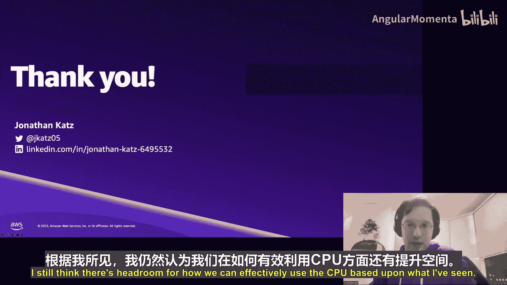

# 011：时尚分层可导航小世界索引


卡内基梅隆大学的“机器学习与数据库”系列研讨会是在现场观众面前录制的。本节目由谷歌以及像您这样的观众的贡献提供资金支持。


欢迎回到卡内基梅隆大学的另一场研讨会。今天我们非常高兴地邀请到亚马逊的首席产品经理 Jonathan Katz，他专注于 PostgreSQL 相关工作，是 PostgreSQL 的核心团队成员和主要贡献者，因此他非常了解 PostgreSQL 的内部原理。他今天来到这里，是为了向我们介绍 pgvector 项目，他是该项目的第二大提交者，拥有惊人的提交记录。

## 概述

在本节课中，我们将学习 pgvector，这是一个用于 PostgreSQL 的向量存储和相似性搜索的开源扩展。我们将探讨为什么向量数据库在当今的生成式 AI 和大语言模型时代变得至关重要，深入了解 pgvector 的工作原理、其支持的索引算法（IVFFlat 和 HNSW），并讨论性能、存储和实际应用中的权衡。课程最后将展望 pgvector 的未来发展路线图。

## 为什么需要向量数据库？

过去一年，随着生成式 AI 和大语言模型的兴起，世界发生了巨大变化。我们需要存储这些系统的输出并能够快速查询它们。PostgreSQL 的强大之处在于其可扩展性，pgvector 正是通过添加向量功能来扩展 PostgreSQL 的一个例子。

为了理解其重要性，我们首先需要了解为什么数据库需要支持向量。传统的关系数据库处理整数或文本数据，但现代 AI 应用需要处理高维向量数据。

### 基础模型与检索增强生成

基础模型是经过海量数据训练的大型机器学习系统，能够根据自然语言问题生成自然语言回答。然而，这些模型通常基于公开数据训练，可能无法访问特定于企业或组织的私有数据。

**检索增强生成** 是一种技术，它允许我们为基础模型提供额外的上下文信息。例如，假设我有一个产品数据库，当用户询问“蓝色大象花瓶多少钱？”时，RAG 系统会从数据库中检索相关信息（如价格），并将其作为上下文提供给基础模型，从而生成准确的答案。

### 向量嵌入

实现 RAG 的关键在于 **向量嵌入**。向量是数据的数学表示。通过将文本、图像或视频等信息输入嵌入生成器（通常是基础模型的一部分），我们可以得到一个向量。这个向量以一种通用的方式表示了原始信息，使我们能够将其用于查询或输入到其他模型中。

以下是 RAG 的典型工作流程：
1.  **文档分块与嵌入生成**：将原始文档（如 PDF）分割成文本块，然后使用嵌入模型（如 Amazon Titan Embeddings）将每个文本块转换为向量。
2.  **向量存储**：将生成的向量及其对应的原始文本块存储到数据库中（例如 PostgreSQL 配合 pgvector）。
3.  **用户查询**：当用户提出问题时，同样使用嵌入模型为该问题生成一个查询向量。
4.  **向量相似性搜索**：在数据库中对查询向量执行 **最近邻搜索**，找到与问题最相关的文本块向量。
5.  **答案生成**：将检索到的相关文本作为额外上下文，连同原始问题一起提交给大语言模型，生成最终答案。

这个工作流程的强大之处在于，它通过基本的向量数据类型和相似性搜索，为大型语言模型注入了额外的知识。

## 向量数据带来的挑战

向量虽然概念简单，但在大规模处理时面临诸多挑战：

1.  **生成耗时**：为每个文本块生成向量嵌入需要经过机器学习算法处理，这需要时间。无法为每次查询实时生成所有数据的嵌入，因此需要存储。
2.  **存储空间大**：现代嵌入向量的维度很高（例如 1536 维）。一个 1536 维的浮点数向量（每个维度 4 字节）约占 6 KB。存储 100 万个这样的向量就需要约 5.7 GB 的原始存储空间，这还不包括索引开销。
3.  **压缩困难**：向量由一系列看似随机的浮点数组成，缺乏可压缩的模式。实际上，尝试压缩有时反而会增加存储开销。
4.  **查询计算量大**：比较两个向量需要计算它们之间的距离（如欧氏距离、余弦距离）。这需要对每个维度进行计算。对于一个有 N 个向量的数据集，进行精确的最近邻搜索是一个 O(N²) 复杂度的问题，非常耗时。

## 近似最近邻搜索

为了解决精确搜索的性能问题，研究人员开发了 **近似最近邻** 算法。与精确搜索必须检查数据集中每个向量不同，ANN 算法只搜索一个缩小的数据集，从而以更快的速度返回“足够好”的结果。

这带来了一个关键的权衡：**召回率**。召回率衡量的是返回的结果中有多少是真正相关的。例如，如果你想找最近的10家咖啡店，ANN 算法可能只返回了8家最近的咖啡店和2家茶店，那么召回率就是 80%。在 RAG 等应用中，近似结果通常是可接受的，但需要根据应用场景权衡速度与召回率。

除了性能与召回率，在实际应用中还需考虑：
*   **存储**：数据是常驻内存还是存储在磁盘上？
*   **成本**：为极致性能付出的硬件成本是否值得？
*   **相关性**：对于近似搜索，返回结果的相关性可能不如精确搜索稳定，需要纳入考量。

## PostgreSQL 作为向量存储

向量本质上是一种数据类型，任何具有存储和处理能力的系统都可以存储向量，PostgreSQL 也不例外。

选择 PostgreSQL 作为向量存储有多个原因：
*   **开源与成熟**：PostgreSQL 已有超过 35 年的历史，拥有强大而稳定的社区。
*   **丰富的数据类型和索引支持**：PostgreSQL 支持多种数据类型（如范围类型）和高效的索引，简化了应用开发。
*   **强大的可扩展性**：PostgreSQL 的核心设计理念就是可扩展性。如果缺少某个功能，可以通过扩展（如 pgvector）来添加，而无需分叉或修改核心代码。

从开发者角度看，使用 pgvector 的优势包括：
*   **无缝集成**：可以轻松添加到现有 PostgreSQL 实例中，与现有工具链和驱动程序兼容。某些驱动程序（如 JDBC）还支持二进制向量格式以提高效率。
*   **数据共置**：可以将事务性数据与机器学习向量数据存储在同一个数据库中，便于使用 **联接** 等强大功能。
*   **灵活的架构角色**：PostgreSQL 既可以作为核心的向量处理和存储系统，也可以作为上游专用向量处理系统的持久化存储层。

## pgvector 简介

pgvector 是一个用于 PostgreSQL 的开源扩展，支持向量存储和搜索。其核心是提供了一个 **向量数据类型**，并在此基础上实现了高效的索引和搜索能力。

主要特性包括：
*   **两种索引类型**：IVFFlat 和 HNSW，用于加速近似最近邻搜索。
*   **搜索支持**：既支持精确最近邻搜索，也支持近似最近邻搜索。
*   **元数据存储**：向量可以与任何其他元数据（如原始文本块、产品信息）一起存储。
*   **多种距离算子**：支持欧氏距离 (`L2`)、余弦距离 (`cosine`) 和内积 (`inner product`) 等多种相似性度量方式。

**距离算子说明**：
*   **欧氏距离**：衡量向量之间的直线距离。
*   **余弦距离**：衡量向量之间的角度差异。
*   **内积**：结合了向量大小和方向的一种度量。

## 索引与向量归一化

在深入索引之前，需要了解 pgvector 在索引时会对向量进行 **归一化**。归一化是将向量的幅度（长度）设置为 1 的过程。公式表示为：对于一个向量 `v`，其归一化向量 `u = v / ||v||`，其中 `||v||` 是 `v` 的欧氏范数（幅度）。

归一化的重要性在于，对于某些距离计算（如余弦距离），如果向量的幅度为 1，可以消除公式中的除法运算，减少 CPU 计算开销。由于向量比较需要遍历所有维度，任何能减少单次比较开销的优化都能显著提升整体性能。

## IVFFlat 索引详解

上一节我们介绍了索引的基本概念和归一化。本节中，我们来看看第一种索引算法：IVFFlat。

**IVFFlat** 是一种基于聚类的索引方法。
1.  **构建过程**：
    *   首先，使用 k-means 算法在向量空间中确定一定数量（由 `lists` 参数指定）的聚类中心。
    *   然后，将每个向量分配到离它最近的聚类中心所在的“列表”中。
2.  **查询过程**：
    *   给定一个查询向量，先找到离它最近的若干个（由 `probes` 参数指定）聚类中心。
    *   然后只在这几个中心对应的列表中进行精确搜索，找出最近的向量。

**关键参数**：
*   `lists`：聚类中心的数量。影响索引构建和插入速度。
*   `probes`：查询时访问的列表数量。影响查询速度和召回率。

**特点与权衡**：
*   **构建**：需要数据集已存在或足够大才能确定好的聚类中心。支持并行构建，速度较快。
*   **插入**：插入时间受 `lists` 数量限制，需要计算新向量到所有中心的距离。
*   **查询**：`probes` 值越小，查询越快，但召回率可能越低。数据分布随时间变化后，可能需要重建索引以保持效果。
*   **适用场景**：适合需要快速构建索引，且对查询延迟要求不是极致的场景。

pgvector 已支持 IVFFlat 索引的并行构建，可以显著提升大数据集上的索引创建速度。

## HNSW 索引详解

接下来，我们探讨第二种索引算法：HNSW，它在查询性能和召回率方面通常表现更优。

**HNSW** 是一种基于图的索引方法。
1.  **构建过程**：
    *   算法以层级结构构建一个图。上层是稀疏的图，用于快速导航；下层是稠密的图，包含详细的连接关系。
    *   插入一个新向量时，算法会从上层开始，找到该层的最近邻，然后逐层向下，最终在底层找到其最近邻，并建立连接（边）。边的数量由参数 `m` 控制。
2.  **查询过程**：
    *   同样从上层开始，快速定位到大致区域，然后逐层向下搜索，最终在底层找到最近邻。查询时检查的候选向量数量由参数 `ef_search` 控制。

**关键参数**：
*   `m`：图中每个节点最大连接数（出边）。影响图的密度和构建时间。
*   `ef_construction`：构建索引时，为插入每个节点而搜索的候选邻居数量。影响索引质量和构建时间。
*   `ef_search`：查询时搜索的候选向量数量。必须大于或等于查询中要求的邻居数量 (`LIMIT`)。影响查询速度和召回率。

**特点与权衡**：
*   **构建**：支持增量构建，可以从空表开始。构建时间比 IVFFlat 长，尤其是当 `m` 和 `ef_construction` 较大时。pgvector 0.6 版本将支持并行构建。
*   **查询**：通常能提供比 IVFFlat 更好的查询性能与召回率平衡。通过图的层级结构，可以快速跳过不相关的区域。
*   **“默认配置友好”**：pgvector 为 HNSW 提供的默认参数 (`m=16`, `ef_construction=64`, `ef_search=40`) 在多数情况下能提供良好的效果。
*   **适用场景**：适合对查询延迟和召回率要求高，且可以接受较长索引构建时间的场景。

**参数调优建议**：
*   想提升召回率时，首先尝试增加 `ef_construction`，这对构建时间影响相对较小。
*   如果仍需提升，再考虑增加 `m`，但这会显著增加构建时间。
*   更高的 `ef_construction` 通常允许你在查询时使用更低的 `ef_search`，从而获得更快的查询速度。

## 存储考量与性能优化

在讨论了两种核心索引算法后，我们需要关注一个影响性能的基础层面：向量在 PostgreSQL 中的存储方式。

PostgreSQL 使用 **TOAST** 机制来存储超过页面大小（通常为 8KB）的大字段。一个 1536 维的向量（约 6KB）默认会被 TOAST 存储。

**TOAST 对向量查询的影响**：
*   **热点数据外置**：向量是相似性搜索的“热点”数据，但 TOAST 将其存储在独立于主表的空间中。查询时需要额外的跳转。
*   **并行查询计划受影响**：PostgreSQL 的查询计划器在估算 TOAST 表数据的扫描成本时可能不准确，导致为包含 TOASTed 向量的全表扫描计划分配更少的并行工作进程，影响扫描性能。

**优化策略**：
1.  **使用 `PLAIN` 存储**：通过 `ALTER TABLE ... ALTER COLUMN ... SET STORAGE PLAIN;` 将向量列设置为行内存储。但这会将向量维度限制在 2000 以内（因为要保证单行不超过页面大小）。
2.  **调整并行扫描阈值**：调低 `min_parallel_table_scan_size` 参数，可以促使规划器为涉及 TOASTed 向量的扫描分配更多并行工作进程。
3.  **确保足够的内存**：将 `shared_buffers` 设置得足够大，以便将更多的索引和数据页缓存在内存中，这对性能至关重要。

## 过滤与索引结合

在实际应用中，我们经常需要在向量搜索的基础上增加元数据过滤条件（WHERE 子句）。那么，能否在利用向量索引的同时进行过滤呢？答案是肯定的，有以下几种方法：

以下是几种实现过滤的策略：
1.  **部分索引**：在创建索引时使用 `WHERE` 子句，只为满足特定条件的数据子集建立向量索引。
    ```sql
    CREATE INDEX ON items USING ivfflat (embedding vector_cosine_ops) WHERE category_id = 1;
    ```
2.  **表分区**：按照自然的分区键（如类别、时间范围）对表进行分区，然后只在需要的分区上创建向量索引。
3.  **即将到来的 HQANN**：这是一种创新的多列索引方法，正在 pgvector 项目中开发。它可以在构建 HNSW 图时，考虑元数据属性（如类别ID），从而在查询时高效地同时利用向量相似性和属性过滤。这有望提供更高的召回率。

## 硬件选择与性能数据

硬件配置对 pgvector 的性能有显著影响。例如，在 AWS 上，使用更强大的 Graviton3 处理器与 Graviton2 相比，不仅在基础性能上有提升，在处理高 CPU 负载的查询（如提高 `ef_search` 值）时，性能提升更为明显。

性能数据示例：在一个包含 1000 万条 1536 维向量的数据集上，使用 HNSW 索引，pgvector 能够实现可观的每秒查询数。这表明通过优化的算法（如 HNSW），在 PostgreSQL 中实现低延迟的向量搜索是可行的。

## 未来发展路线图

pgvector 项目正在快速发展，未来计划包括：
*   **HNSW 并行构建**：已在 0.6 版本提交，将加快大规模索引的创建速度。
*   **HQANN 索引**：支持带过滤的高效向量搜索。
*   **更多数据类型**：支持 `float2` (FP16)、`uint8` 等更小的浮点或整数类型来存储向量，以减少存储空间和内存带宽占用，但可能会损失一些精度（量化）。
*   **产品量化**：一种更高级的向量压缩技术，能大幅减少向量大小，但会对召回率产生一定影响。
*   **并行查询**：进一步提升大规模数据集上的查询吞吐量。

## 总结与建议

本节课中，我们一起学习了 pgvector 扩展，它使 PostgreSQL 成为一个强大的向量数据库。我们探讨了向量数据库的必要性、RAG 工作流程、向量数据面临的挑战，并深入研究了 pgvector 的两种核心索引算法 IVFFlat 和 HNSW。

回顾一下，在选择和使用 pgvector 时，请记住以下要点：
*   **理解召回率与性能的权衡**：这是近似最近邻搜索的核心。HNSW 算法在此方面表现优异。
*   **根据需求选择索引**：需要快速构建选 IVFFlat；追求高查询性能和召回率选 HNSW。
*   **关注存储和内存**：合理配置存储模式 (`PLAIN`/`EXTERNAL`) 并确保充足的 `shared_buffers`。
*   **利用过滤技术**：使用部分索引、分区或未来的 HQANN 来优化带过滤条件的向量查询。
*   **硬件配置很重要**：CPU 和内存资源直接影响性能。
*   **拥抱快速演进**：向量数据库领域发展迅速，pgvector 也在持续创新。选择像 PostgreSQL 这样成熟稳定的平台，配合 pgvector 这样活跃的扩展，可以兼顾当前的生产需求与未来的技术演进。



