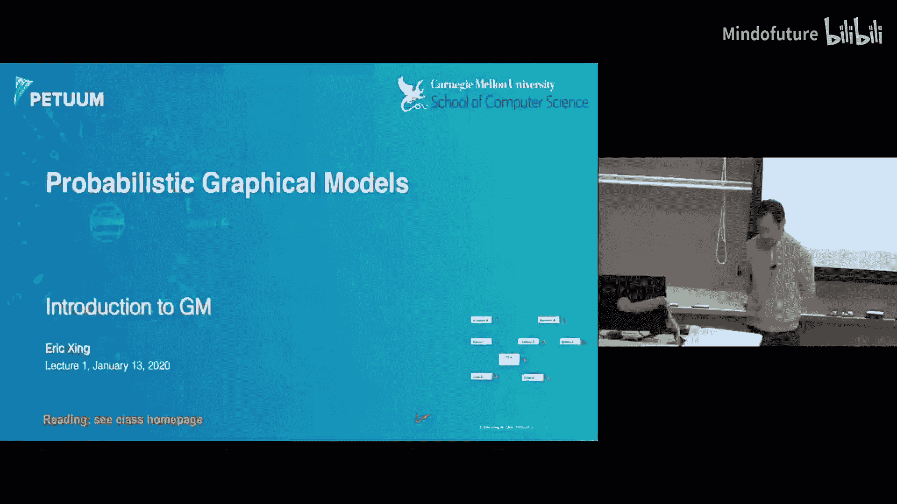
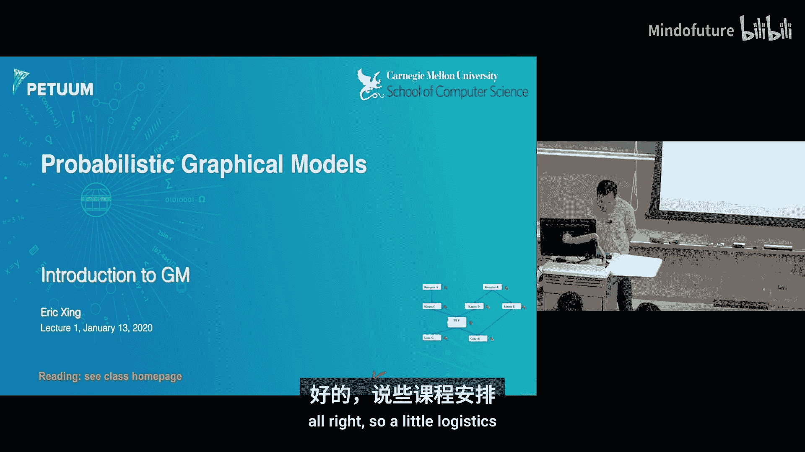
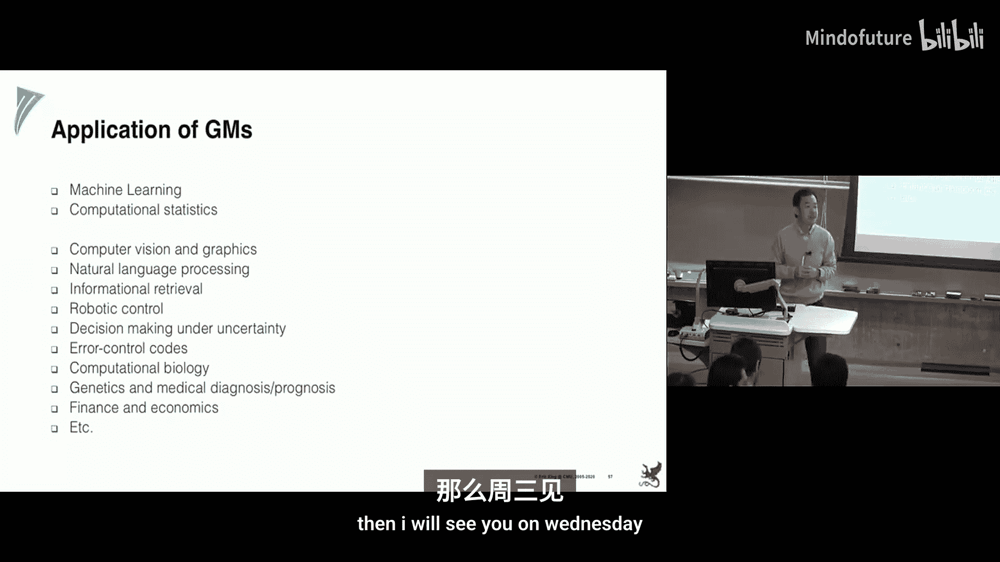

# 001：导论 🎯

在本节课中，我们将要学习概率图形模型（PGM）的基本概念、课程安排以及学习这门高级课程的意义。我们将从为什么需要图形模型开始，探讨如何将领域知识融入数学模型，并初步了解衡量变量间关系的不同方法。

---

## 课程概述与安排 📅

我很高兴看到这么多同学。这门课是机器学习领域最先进的技术课程之一。最初是为少数学生设计的，今年是课程开设的第15周年。第一年只有大约10名学生，而今年注册人数达到了160人，另有50人在等待名单上。

这门课技术内容具有挑战性，每年都会收到关于课程难度的反馈。我无意降低难度，但希望你们都能从中学到很多，并取得好成绩。

课程没有期中或期末考试。评分主要由几次作业（占50%）和一个主要的课程项目（占40%）构成。课程项目鼓励组成3-4人的团队，许多往届学生在此发表了他们的第一篇论文。

课程会被录制，并会定期发布额外的阅读材料。每节课的内容都足够深入，可以作为一学期课程的指南。

### 课程资源与要求 📚

以下是课程相关的后勤信息：

*   **课程主页**：请定期访问以获取材料、更新和信息。
*   **教材**：推荐两本教材作为理论基础和经典用例参考，但请注意它们不包含最新的解决方案。
*   **讨论区**：使用Piazza论坛进行提问和课堂互动。
*   **作业提交**：通过Gradescope提交。
*   **教学团队**：我们有多位优秀的助教和课程助理Amy负责后勤问题。
*   **旁听**：允许旁听，但需要填写表格。

课程要求包括完成作业、参与课堂笔记记录以及完成团队项目。我们鼓励尽早组队。课程中还设有加分机制和中期反馈调查。

---

## 为什么需要图形模型？🤔

如今，机器学习领域非常活跃，每年有数百种算法变体发表，很难全面掌握。本课程的目标之一，就是尝试用一个统一的框架来组织这些纷繁复杂的算法和模型实例。

我们希望用一棵或几棵“树”来统一当前乃至未来几年出现的大多数算法实例，让你能更好地定位自己的研究，设计出更具通用性和影响力的算法。

为了实现这个目标，我们需要从基础开始。大多数机器学习算法的核心动机源于对数据的统计建模。让我们看看如何使用概率模型来建模数据。

---

## 从基础概率模型到图形模型 📊

假设我们有一个具有8个二元特征的数据实例。如何为其写出概率分布？最直接的方法是枚举所有可能的特征组合并给出每个组合的概率，即创建一个巨大的概率表。

然而，这种方法存在明显缺陷：表格的行数随特征数量呈指数级增长，会迅速耗尽计算资源。此外，在学习和推断（例如计算某些事件的概率）时，也会面临巨大的复杂性挑战。

### 融入领域知识 🧬

在现实中，数据实例通常对应着真实世界的现象。例如，考虑一个描述细胞信号通路的生物学问题，其中有8个分子随机变量（开或关）。生物学家会提供额外的知识：哪些分子在细胞表面，哪些在内部，以及它们之间的触发关系图。她还会指出某些分子（如受体A和基因H）在生命周期中从未相遇，因此不可能直接相互作用。

作为数学家或计算机科学家，这些领域知识是否有用？答案是肯定的。这正是本课程的核心问题：**如何将各种形式的领域知识整合到数学框架中，使模型表达式更具信息性、更简单、更可解释、更可操作**。

一言以蔽之，这引出了我们对**图形模型**的介绍。模型与表示它的图相结合，就成了图形模型。我们最关心的是图形模型内在的严谨含义。

---

## 定义“关系”：从模糊到严谨 🔍

“关系”这个词很容易产生歧义。例如，一张基于《圣经》人物共现频率绘制的网络图，其边的定义（如“在同一页中出现”）就是主观的。不同的人使用相同的材料但采用不同的共现范围定义，可能会画出不同的图。

因此，我们需要更严谨地定义随机变量之间的关系。关系可以有很多种解释：相关、独立、依赖、条件独立/依赖，甚至因果。我们需要定量地确定这些关系的存在与否。

一种方法是探索使用**单一数值摘要**作为关系强度的度量。以下是一些常见的度量指标：

*   **皮尔逊相关系数**：衡量线性依赖关系。公式为 `corr(X, Y) = E[(X-μ_X)(Y-μ_Y)] / (σ_X σ_Y)`。注意：若X与Y独立，则相关系数为0；但相关系数为0**不能**推出X与Y独立（例如，Y = X²）。
*   **互信息**：基于Kullback-Leibler散度，衡量两个分布之间的差异，能捕捉非线性依赖。公式为 `I(X; Y) = KL( P(X,Y) || P(X)P(Y) )`。计算可能具有挑战性。
*   **希尔伯特-施密特独立性准则**：使用核方法将分布嵌入到希尔伯特空间，然后计算距离，适用于更复杂的分布形式。
*   **偏相关**：在给定其他变量（如Z）的条件下，衡量两个变量（X与Y）之间的线性关系。公式涉及计算残差之间的相关性。

在多元高斯分布的假设下，偏相关可以通过**精度矩阵**（协方差矩阵的逆）方便地计算。此时，偏相关与条件独立性等价。

---

## 超越成对检验：全局视角 🌐

即使我们有了衡量成对关系（边际的或条件的）的方法，直接为包含多个变量的大领域构建图形模型仍然面临操作上的困难。例如，对于三个变量：孩子的身高(X)、词汇量(Y)和年龄(Z)。如果仅进行成对独立性检验，可能会发现每对变量都相关，从而得到一个全连接的图。

然而，根据我们的先验知识，更合理的模型可能是年龄(Z)同时影响身高(X)和词汇量(Y)。这说明，我们需要超越局部的成对检验，从**全局条件独立性**的角度来定义和构建图形模型。这正是我们将在第二讲中深入研究的**条件独立图**（也称为马尔可夫网络或无向图模型）。

这类模型用途广泛，例如著名的**伊辛模型**，最初用于模拟原子自旋状态，后来被应用于图像建模。

---

## 课程路线图与总结 🗺️

本节课我们一起探讨了图形模型的动机、基本思想以及定义变量间关系的挑战。以下是后续课程的简要路线图：

1.  **Lecture 2: 条件独立图**：深入研究马尔可夫网络等无向图模型及其统计含义。
2.  **Lecture 3: 有向图模型**：研究贝叶斯网络，探讨其因子化特性、可解释性（如因果）和计算优势。
3.  **Inference & Learning**：用多讲篇幅深入探讨图形模型上的推断（如计算条件概率、最可能配置、采样）和学习（从数据中学习参数和结构，融入规则、奖励等丰富知识）。
4.  **Modern PGM**：研究现代图形模型，展示其如何成为强化学习、深度学习、迁移学习等技术的统一框架。
5.  **Student-Selected Topics**：本学期将实验保留部分课时，由同学们投票选择感兴趣的主题进行深入探讨。

### 图形模型的核心价值 💎

最后需要明确：**图形模型是一个领域或一种思维方式的名称，而不是一个特定模型的名称**。它提供了一种语言，用于：
*   **交流领域知识**和设计模型。
*   **组织和规划计算**。
*   **进一步开发模型**。

其优势包括：
*   **表示优势**：通过局部结构（超越成对）全局地构建模型，节省参数。
*   **模块化与可组合性**：易于组合不同模块或研究成果。
*   **统一框架**：贝叶斯推断等都可以视为在图形模型框架下引入额外节点和边。

希望在本学期结束时，你们不仅能带走许多公式，更能掌握几个核心的“主方程”，并能根据具体问题插入不同的构建模块，从而高效地启动甚至完成你们的研究工作。

我们周三见！ 👋