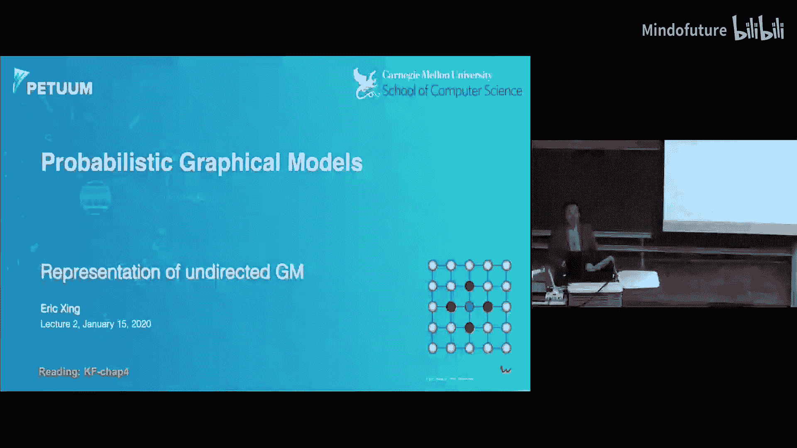
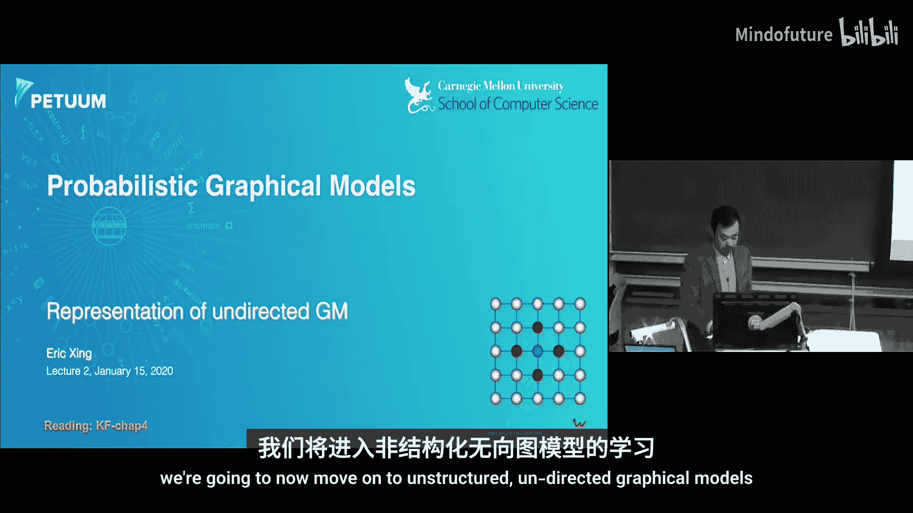
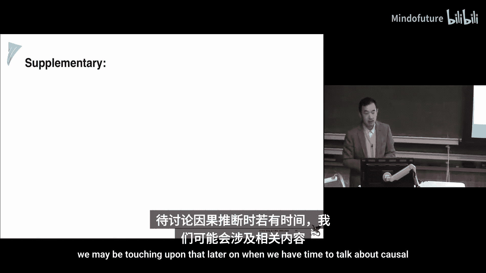

# 002：无向图模型 📊

在本节课中，我们将要学习概率图形模型中的一个重要类别——无向图模型。我们将探讨其基本定义、如何从图中读取独立性、以及一些经典的实际应用模型。

---

## 课程概述与回顾

上一讲我们讨论了如何通过条件独立性测试（如偏相关、互信息）来判断两个随机变量之间的依赖关系。然而，当变量数量庞大时，这种“自底向上”地测试所有变量对及其条件集的方法在计算上是不可行的。

本节中，我们将采用“自顶向下”的视角：首先定义一个图结构，然后探讨如何从该图中系统地“读出”它所蕴含的所有条件独立性关系。如果图与概率分布之间能建立良好的对应关系，那么通过图来构建模型将变得简单高效。

---

## 基本符号约定 📝

在深入之前，我们先统一一些基本符号，这在统计学和机器学习领域尤为重要：
*   **随机变量**：通常用大写字母（如 `X`）表示，其具体取值用小写字母（如 `x`）表示。
*   **随机向量**：可表示为粗体大写字母 **`X`** 或带箭头的 `\vec{X}`。
*   **参数**：通常用希腊字母表示，如 `α`, `β`, `θ`。

---

## 什么是无向图模型？

一个无向图模型由一个无向图 `G` 定义。图中的节点代表随机变量，边代表变量之间的**对称关联关系**（非因果性）。该模型定义了这些随机变量联合概率分布的一种特定参数化形式。

那么，图中的边具体意味着什么？它们对节点的联合配置有何影响？这就是本节课的核心。

---

## 动机与应用实例 🌅

让我们通过一个实际问题来感受无向图模型的价值：图像语义分割。任务是将图像中的每个像素或图像块分类（例如，分为“天空”或“水”）。

仅看一个孤立的图像块很难判断。但如果我们知道它在图像中的位置（例如，在顶部或邻近陆地），判断就会容易得多。这种“邻近区域标签倾向于一致”的常识，正是无向图模型可以自然表达的。

具体做法是：将图像网格化，每个格点定义一个随机变量表示其标签。在相邻的格点（变量）之间连接一条边，并为这条边上的联合配置（如“同为天空”、“同为水”、“一水一天空”）分配一个数值。这个数值表达了我们对这种配置的“偏好”或“兼容性”，例如，赋予“标签相同”的配置更高的分数。

这种思想广泛应用于多个领域：
*   **计算机视觉**：图像去噪、分割。
*   **统计物理**：伊辛模型描述原子自旋相互作用。
*   **计算生物学**：蛋白质相互作用网络。
*   **自然语言处理**：词性标注、主题模型。

---

## 形式化定义：吉布斯分布 ⚙️

一个无向图模型（也称为马尔可夫随机场或吉布斯分布）的联合概率分布定义如下：

给定一个无向图 `G`，我们首先找出其所有**团**。一个团是图中所有节点都相互连接的一个子集。**极大团**是指不能再添加任何其他节点而仍保持为团的团。

对于每个团 `c`，我们定义一个**势函数** `φ_c`。势函数是一个**正的**实值函数，其输入是该团中所有随机变量的某种联合配置 `x_c`。它衡量了该配置的“可能性”或“能量”，但本身不是概率。

整个模型的联合分布由所有团上的势函数乘积归一化后得到：

**`P(X) = (1/Z) * ∏_{c ∈ C} φ_c (x_c)`**

其中，归一化常数 `Z` 称为**配分函数**：

**`Z = ∑_{x} ∏_{c ∈ C} φ_c (x_c)`**

对于连续变量，求和应替换为积分。

**为什么使用势函数而非概率？**
势函数提供了更大的灵活性。它可以是任何正数，便于注入人类知识（如“相邻像素标签相同的兼容性得分为10”）。直接将其定义为条件概率或边缘概率反而困难且不必要，因为势函数在因子分解中并不对应唯一的概率解释。

---

## 从图中读取独立性：马尔可夫性质 🔍

无向图模型的核心价值在于，其图结构直接编码了随机变量间的条件独立性假设。以下是三种等价的马尔可夫性质定义：

1.  **全局马尔可夫性**：对于图中不相交的节点子集 `A`, `B`, `C`，如果 `C` 在图分离了 `A` 和 `B`（即所有连接 `A` 和 `B` 的路径都必须经过 `C`），则在概率分布中满足 `A ⊥ B | C`。
2.  **局部马尔可夫性**：一个节点 `X_i`，在给定其所有邻居节点（即**马尔可夫毯**）的条件下，独立于图中所有其他非邻居节点。
3.  **成对马尔可夫性**：对于两个没有边直接相连的节点 `X_i` 和 `X_j`，在给定所有其他节点的条件下，它们相互独立。

这些性质为我们提供了一套从图结构直接推断独立性关系的规则。

---

## 图与分布的对应关系：I-map 🗺️

为了建立图模型与概率分布之间的严格联系，我们引入 **I-map** 的概念。

*   令 `I(P)` 为分布 `P` 中所有成立的条件独立性语句的集合。
*   令 `I(G)` 为根据图的全局马尔可夫性质所能读出的所有条件独立性语句的集合。

如果 `I(G) ⊆ I(P)`，即图 `G` 中蕴含的所有独立性在分布 `P` 中都成立，则称图 `G` 是分布 `P` 的一个 **I-map**。

**重要性**：如果一个分布 `P` 可以表示为基于图 `G` 的吉布斯分布，那么 `G` 一定是 `P` 的一个 I-map。这意味着，通过吉布斯分布的形式定义模型，我们能自动保证图结构所编码的独立性在分布中成立。这比直接通过数字定义分布并验证独立性要方便得多。

**哈默斯利-克利福德定理** 进一步强化了这种对应关系：如果一个严格正的分布 `P` 满足图 `G` 是其 I-map，那么 `P` 一定可以表示为基于 `G` 的吉布斯分布形式。这为无向图模型的合理性提供了理论基础。

---

## 指数族形式与经典模型 🌡️

在实际应用中，直接指定正的势函数有时不直观。更常用的形式是将其写为指数族形式，即**对数线性模型**：

**`P(X) = (1/Z) * exp( -∑_{c ∈ C} E_c(x_c) )`**

其中 `E_c(x_c)` 称为**能量函数**，可正可负。`-E` 可视为“得分”，得分越高（能量越低），该配置概率越大。这种形式与统计物理中的**玻尔兹曼分布**一致。

以下是两个经典的无向图模型：

1.  **伊辛模型**：变量取值为 `{+1, -1}`。通常只定义单点势和相邻节点间的成对势。常用于建模二值图像或铁磁体自旋。
2.  **波茨模型**：伊辛模型的推广，变量可取 `K` (`K>2`) 个离散状态。常用于彩色图像分割或多类标签问题。

---

## 受限玻尔兹曼机：深度学习的先驱 🧠

受限玻尔兹曼机 是一个两层结构的无向图模型，包含一层**可见单元** `v`（对应观测数据，如图像像素）和一层**隐藏单元** `h`（对应潜在特征或表示）。它是一个二分图，可见层和隐藏层内部无连接，只有层间有连接。

其联合分布定义为：

**`P(v, h) ∝ exp( -E(v, h) )`**
**`E(v, h) = - (b^T v + c^T h + v^T W h)`**

其中 `W` 是层间连接的权重矩阵，`b` 和 `c` 是偏置项。

**RBM 的关键性质**：
*   **条件独立性**：给定可见层，所有隐藏单元条件独立；给定隐藏层，所有可见单元条件独立。即：
    **`P(h|v) = ∏_i P(h_i|v)`** 和 **`P(v|h) = ∏_j P(v_j|h)`**
*   这一性质使得**吉布斯采样**等推断和学习算法变得非常高效，是后续深度信念网络等模型的基础。

---

## 条件随机场：考虑全局上下文的序列模型 📄

条件随机场 是一种在给定观测序列 `X` 条件下，对标签序列 `Y` 进行建模的无向图模型（通常是链式结构）。与之前模型不同，CRF 是**条件模型**，直接对 `P(Y|X)` 建模。

其形式为：

**`P(Y|X) = (1/Z(X)) * exp( ∑_{i} λ_i f_i(Y, X) )`**

其中 `f_i(Y, X)` 是特征函数，可以依赖于整个观测序列 `X` 和标签序列的局部（如相邻标签对 `(Y_i, Y_{i-1})` 或单个标签 `Y_i`）。`λ_i` 是特征权重。

**优势**：通过特征函数 `f_i`，CRF 能够灵活地融入长距离的、依赖于整个观测序列 `X` 的上下文信息，这在自然语言处理等任务中非常强大。

---

## 总结与要点 ✅

本节课我们一起学习了概率图形模型的核心组成部分之一——无向图模型。以下是需要掌握的关键点：

*   无向图模型（马尔可夫随机场）通过无向图定义变量间的对称关联，并用吉布斯分布表示联合概率。
*   **势函数**定义在团的配置上，是模型表达先验知识或数据偏好的载体。
*   图结构编码了条件独立性，主要通过**全局、局部和成对马尔可夫性质**来体现。
*   **I-map** 概念严格定义了图与概率分布之间的对应关系。哈默斯利-克利福德定理确立了这种表示的完备性。
*   **马尔可夫毯**的概念在推断中极其有用，它允许我们将一个变量对其余所有变量的条件分布，简化为对其马尔可夫毯的条件分布。
*   我们介绍了几个经典模型：**伊辛模型**、**波茨模型**、作为深度学习基石的**受限玻尔兹曼机**，以及广泛应用于序列标注的**条件随机场**。

理解如何从图中读取独立性以及如何通过势函数构建模型，是掌握更复杂的概率推断和学习算法的基础。在接下来的课程中，我们将探讨如何在这些模型中进行参数学习和概率推断。