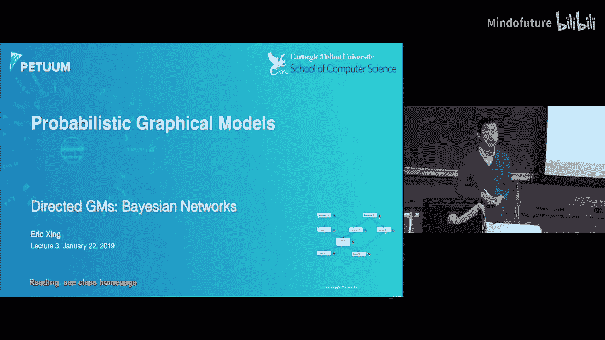
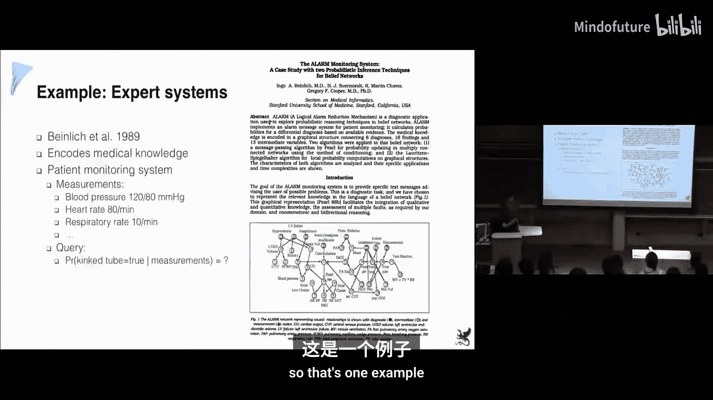
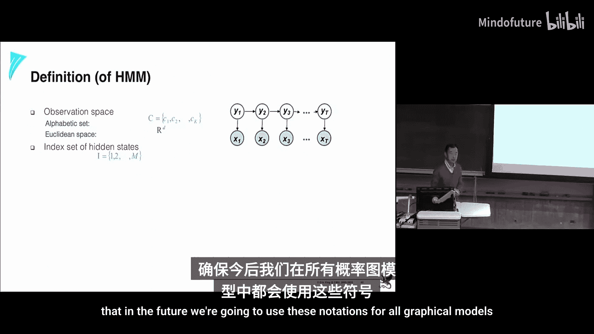

# 003：有向图模型 🎯

在本节课中，我们将继续讨论图形模型的结构。我们将介绍另一个非常重要的图形模型家族——贝叶斯网络。我们将探讨如何利用有向图模型进行灵活的知识工程，并深入理解其与概率分布之间的等价关系。

---

## 知识工程与有向图模型

上一节我们介绍了无向图模型，它通过定义在团上的势函数来捕捉随机变量之间的关联关系。本节中，我们来看看有向图模型，它能够表达更丰富、更灵活的变量间关系，尤其适合进行知识工程。

有向图模型，或称贝叶斯网络，其节点代表随机变量，有向边代表变量间的直接影响。它是一种数据结构，为表示联合概率分布提供了一个系统化的因子分解框架。

以下是知识工程在有向图模型中的一个经典历史案例：

这是一个用于医疗诊断的专家系统贝叶斯网络。网络中的每个节点代表一个医学现象，如症状、病因或后果。领域专家（如医生）可以将他们的知识编码为概率关系（例如，给定某种病因，出现特定症状的概率）。通过将所有局部知识合成为一个连贯的图模型，我们可以对网络进行各种概率查询（即推理），这比直接操作庞大的联合概率表要高效得多。

---

## 实例：赌场骰子游戏 🎲

为了更具体地展示如何构建模型，我们来看一个有趣的例子：赌场骰子游戏。

**场景设定：**
*   庄家有两种骰子：公平骰子（每个面概率相等）和灌铅骰子（例如，6点朝上的概率为1/2，其余点数平分另外1/2概率）。
*   你作为玩家，观察到一连串的投掷结果（例如50次）。
*   你看不到庄家每次具体选择了哪种骰子。

**我们希望解决的问题（知识工程的目标）：**
1.  **评估问题：** 给定观察到的投掷序列，这个序列由公平庄家或狡猾庄家产生的可能性有多大？即计算 `P(观测序列 | 模型)`。
2.  **解码问题：** 在给定整个观测序列的条件下，估计每一次投掷具体使用的是哪种骰子？即计算 `P(第i次骰子选择 | 所有观测结果)`。
3.  **学习问题：** 如何从数据中学习模型的参数，例如骰子的偏置以及庄家切换骰子的策略？

### 构建贝叶斯网络模型

以下是构建模型的步骤：

**第一步：确定随机变量**
*   `X_i`：第 `i` 次投掷的结果（观测变量）。其取值域为 {1, 2, 3, 4, 5, 6}。
*   `Y_i`：第 `i` 次投掷所使用的骰子类型（隐变量）。其取值域为 {公平, 灌铅}。

**第二步：确定变量间的结构（定性知识）**
基于我们对物理世界的了解：投掷结果 `X_i` 由所使用的骰子 `Y_i` 直接“导致”。因此，存在从 `Y_i` 指向 `X_i` 的边。
此外，狡猾的庄家在选择骰子时可能具有策略性。例如，他可能倾向于连续使用同一种骰子。这意味着 `Y_{i+1}` 可能依赖于 `Y_i`。因此，存在从 `Y_i` 指向 `Y_{i+1}` 的边。

由此，我们得到一个链状结构：
`Y_1 -> X_1, Y_1 -> Y_2 -> X_2, Y_2 -> Y_3 -> X_3, ...`

这个模型就是著名的**隐马尔可夫模型**。

**第三步：确定局部概率（定量知识）**
*   **初始概率：** `P(Y_1)`，即第一轮使用各种骰子的概率。
*   **转移概率：** `P(Y_{i+1} | Y_i)`，描述庄家切换骰子的策略。例如：
    *   `P(Y_{i+1}=公平 | Y_i=公平) = 0.99`
    *   `P(Y_{i+1}=灌铅 | Y_i=公平) = 0.01`
    *   （灌铅到公平/灌铅的概率可类似定义）
*   **发射概率：** `P(X_i | Y_i)`，描述给定骰子类型下，各个点数出现的概率。
    *   若 `Y_i = 公平`，则 `P(X_i=k | Y_i=公平) = 1/6`, k=1..6。
    *   若 `Y_i = 灌铅`，则 `P(X_i=6 | Y_i=灌铅) = 0.5`, `P(X_i=k | Y_i=灌铅) = 0.1`, k=1..5。

### 模型的因子分解与计算挑战

根据贝叶斯网络的定义，上述模型的联合概率分布可以优雅地因子分解为：
`P(Y_1, ..., Y_n, X_1, ..., X_n) = P(Y_1) * ∏_{i=2}^{n} P(Y_i | Y_{i-1}) * ∏_{i=1}^{n} P(X_i | Y_i)`

然而，当我们需要回答“评估问题”，即计算边际概率 `P(X_1, ..., X_n)` 时，需要对这个联合分布关于所有 `Y_i` 求和：
`P(X_1, ..., X_n) = ∑_{Y_1} ... ∑_{Y_n} [ P(Y_1) * ∏_{i=2}^{n} P(Y_i | Y_{i-1}) * ∏_{i=1}^{n} P(X_i | Y_i) ]`

如果骰子类型有 `K` 种，序列长度为 `n`，朴素求和的计算复杂度是 `O(K^n)`，这是指数级的，对于长序列不可行。这引出了图形模型的一个核心优势：**利用图结构，我们可以设计出高效的算法（如前向-后向算法），将这类推理问题的复杂度降低到 `O(n * K^2)`，即多项式级别**。这只是一个预告，后续课程会深入讲解。

---

## 贝叶斯网络的形式化定义与独立性

现在，让我们回到贝叶斯网络的形式化定义。一个贝叶斯网络由两部分构成：
1.  **结构（定性）：** 一个有向无环图 `G`。
2.  **参数（定量）：** 与每个节点相关联的局部条件概率分布 `P(X_i | Parents(X_i))`。对于没有父节点的根节点，则是其先验概率 `P(X_i)`。

该网络定义了一个联合概率分布：
`P(X_1, ..., X_n) = ∏_{i=1}^{n} P(X_i | Parents(X_i))`

### 图结构蕴含的条件独立性

有向图通过三种基本结构（或称“图元”）来编码条件独立性假设：

1.  **共同父节点（Common Parent）**
    
    **含义：** 给定父节点 `B`，子节点 `A` 和 `C` 条件独立。即 `A ⊥ C | B`。
    **例子：** 一个基因 `B` 调控两个下游基因 `A` 和 `C`。如果已知 `B` 的状态，`A` 和 `C` 的发生是独立的。

2.  **链式结构（Cascade）**
    **含义：** 给定中间节点 `B`，头节点 `A` 和尾节点 `C` 条件独立。即 `A ⊥ C | B`。
    **例子：** `A` 导致 `B`，`B` 导致 `C`。如果已知 `B`，那么 `A` 对 `C` 没有额外的预测能力。

3.  **V型结构（V-structure / Common Effect）**
    **含义：** 父节点 `A` 和 `B` 在先验情况下是独立的（`A ⊥ B`）。但是，**当它们的共同子节点 `C` 被观测到时**，`A` 和 `B` 会变得相关。这种现象称为“解释消除”（Explaining Away）。
    **例子：** `A`=钟表不准，`B`=交通拥堵，`C`=上课迟到。`A` 和 `B` 本身无关。但如果你迟到（`C` 被观测到），并且得知交通畅通（`B` 为假），那么你会更怀疑是钟表出了问题（`A` 为真的概率增加）。`A` 和 `B` 为解释同一个结果而竞争。

### 全局独立性：D-分离

对于图中任意三个不相交的变量集 `X`, `Y`, `Z`，我们如何判断是否满足 `X ⊥ Y | Z`？这需要用到 **D-分离** 准则。

D-分离的判定可以通过一个直观的“球类算法”来理解：想象在图上沿着边传递信息（一个“球”）。规则如下：
*   **链式 `A -> B -> C` 或共同父节点 `A <- B -> C`：** 如果 `B` 在 `Z` 中（被观测），则球无法从 `A` 传到 `C`；如果 `B` 不在 `Z` 中，球可以通过。
*   **V型结构 `A -> C <- B`：** 如果 `C` 或其任何后代节点在 `Z` 中（被观测），则球可以从 `A` 传到 `B`（反之亦然）；如果 `C` 及其后代都不在 `Z` 中，球无法通过。

如果所有从 `X` 中某节点到 `Y` 中某节点的路径都被 `Z` “阻塞”（根据上述规则），则称 `X` 和 `Y` 被 `Z` **D-分离**，这意味着在概率分布中 `X ⊥ Y | Z` 成立。

---

## 图与分布的等价性：可靠性与完备性

令 `I(G)` 表示由图 `G` 通过 D-分离得到的所有条件独立性集合。
令 `I(P)` 表示从概率分布 `P` 中实际成立的所有条件独立性集合。
令 `P_F` 表示通过因子分解公式 `P(X) = ∏ P(X_i | Parents(X_i))` 从图 `G` 定义出的所有可能概率分布的集合。

我们关心两个性质：
*   **可靠性：** 如果分布 `P` 根据图 `G` 因子分解（即 `P ∈ P_F`），那么图 `G` 中的所有独立性都必须在 `P` 中成立。即 `I(G) ⊆ I(P)`。**这个性质是始终成立的。** 这意味着我们从图读出的独立性故事，在任何符合该图因子分解的分布中都是真实的。
*   **完备性：** 如果某个独立性关系在所有根据图 `G` 因子分解的分布 `P ∈ P_F` 中都成立，那么它一定能从图 `G` 中通过 D-分离推导出来。即，如果某个独立性不在 `I(G)` 中，我们总能找到某个 `P ∈ P_F` 使其不独立。**这个性质在一般情况下也成立，但存在一些极端反例。** 例如，即使图中 `A -> B` 有一条边（表示依赖），我们仍可以故意选择参数使得 `P(B|A) = P(B)`，从而在数值上制造出 `A ⊥ B`。不过，这种参数选择是“测度为零”的，在从数据学习或合理设定参数的自然情况下，完备性可以认为是成立的。

因此，在实践中，我们可以放心地认为贝叶斯网络的图结构与其所定义的分布家族在条件独立性意义上是等价的。

---

## 连续变量与混合模型

贝叶斯网络不仅限于离散变量。我们可以轻松地构建包含连续随机变量的模型。

**例子：**
*   节点 `X` 和 `Y` 是连续变量，我们将其建模为高斯分布：`X ~ N(μ_x, σ_x^2)`, `Y ~ N(μ_y, σ_y^2)`。
*   节点 `Z` 依赖于 `X` 和 `Y`。我们可以定义其条件分布，例如：`Z | X, Y ~ N( w1*X + w2*Y + b, σ_z^2 )`。这里 `w1, w2, b` 是参数。
*   节点 `M` 是一个离散变量（例如，类别标签）。节点 `N` 是一个连续变量，其分布依赖于 `M`，例如：`N | M=k ~ N(μ_k, σ_k^2)`。这构成了一个**高斯混合模型**，常用于聚类。

模型的设计（选择何种分布形式、如何参数化依赖关系）是知识工程和模型构建的核心部分。

---

## 总结

本节课中我们一起学习了：
1.  **有向图模型（贝叶斯网络）** 是一种强大的知识表示工具，通过有向无环图和局部条件概率分布来定义联合概率分布。
2.  **知识工程** 的过程包括：识别关键随机变量、根据领域知识确定变量间的依赖结构（定性）、以及指定或学习局部概率参数（定量）。隐马尔可夫模型是一个典型例子。
3.  图结构通过**共同父节点、链式、V型结构**三种基本模式编码条件独立性。判断任意变量集间的独立性可使用 **D-分离** 准则。
4.  贝叶斯网络具有**可靠性**：从图读出的独立性在所有符合其因子分解的分布中都成立。在自然参数设置下，也具有**完备性**。
5.  贝叶斯网络可以灵活地结合**离散和连续变量**，构建复杂的混合模型，用于应对各种现实世界的问题。

掌握有向图模型为我们打开了用概率语言系统化地构建、理解和推理复杂系统的大门。在接下来的课程中，我们将深入探讨如何在这些模型上进行有效的推理和学习。

