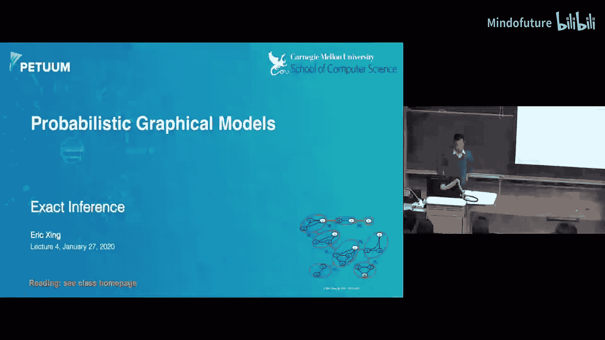
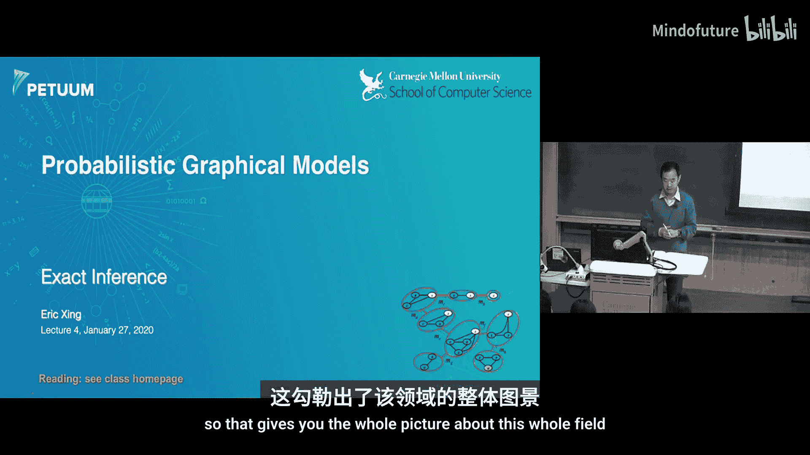
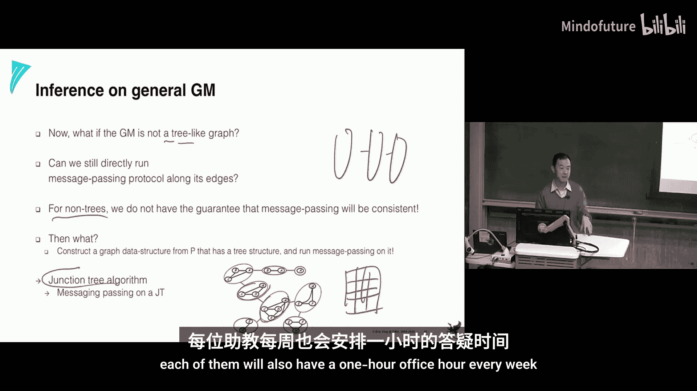

# 004：精确推断

在本节课中，我们将开始学习图形模型，并介绍第一个核心主题——推断。具体来说，我们将专注于**精确推断**。虽然随着模型规模的增长，精确推断在许多应用中已变得不太可行，但它仍然是理解当前近似推断方法的重要基础。本节课我们将学习精确推断的基本原理和算法。

## 什么是推断？

上一节我们介绍了图形模型，本节中我们来看看什么是推断。推断是指，在给定一个模型后，计算某些查询的答案。在图形模型的语境下，这通常意味着计算某些随机变量子集在给定其他变量观测值下的条件概率。

推断的应用非常广泛，例如：
*   计算数据的似然度。
*   计算后验概率分布。
*   在存在缺失值或隐变量的模型中，估计这些变量的值（例如EM算法中的E步）。
*   寻找最可能的变量赋值（MAP估计）。

然而，一个悲观的结论是：在一般情况下，计算这些量是NP难问题，因为需要对所有未观测变量的可能配置进行求和，其复杂度是指数级的。

## 变量消除算法

为了应对指数级复杂度，我们引入**变量消除**算法。其核心思想是通过系统地“消除”我们不关心的变量，将全局的指数求和分解为一系列局部的、可管理的计算。

让我们通过一个经典的**隐马尔可夫模型**例子来理解这个过程。我们的目标是计算某个隐变量 `Y_i` 在给定整个观测序列 `X` 下的后验概率 `P(Y_i | X)`。

直接计算需要边缘化所有其他隐变量，导致嵌套求和与指数复杂度。变量消除通过选择变量消除顺序（例如从 `Y_1` 到 `Y_T`），并反复应用一个称为**和积**的原子操作来简化计算。

以下是和积操作的核心步骤：
1.  **识别因子**：收集所有包含待消除变量（例如 `Y_1`）的局部概率因子。
2.  **乘积**：将这些因子相乘。
3.  **求和**：对乘积结果关于待消除变量求和（即边缘化）。
4.  **生成新因子**：求和的结果是一个不再包含已消除变量的新因子，将其放回因子列表中。

这个过程持续进行，直到只剩下我们关心的变量。最终，通过对剩余因子进行归一化，即可得到所需的后验概率。

变量消除的**计算复杂度**取决于消除过程中产生的最大因子的规模。这个规模由消除顺序决定，并且可以直接在图形上通过“消除节点并连接其所有邻居”的操作来可视化地确定。最优消除顺序的寻找本身也是一个NP难问题。

## 信念传播与消息传递算法

变量消除算法是针对单一查询的。如果我们希望对图中多个节点进行查询，重复运行变量消除效率低下。**信念传播**（或**消息传递**）算法解决了这个问题。

信念传播的核心是将变量消除过程理解为在图上传递“消息”。每条消息本质上是一个因子，它汇总了来自图的一部分的信息，并将其传递给相邻部分。

在**树结构**的图上，信念传播算法具有以下特性：
*   可以安排一个有效的消息传递**调度**（例如，从叶子节点收集信息到根节点，再从根节点分发信息回叶子节点）。
*   经过两轮传递后，每个节点都收到了来自图中所有其他部分的信息。
*   此时，我们可以快速计算图中任意节点的边际分布，而无需重新运行整个算法。

消息 `m_{j->i}` 从节点 `j` 传递到节点 `i` 的通用公式（对于无向图）是：
`m_{j->i}(x_i) = ∑_{x_j} φ(x_j) * ψ(x_i, x_j) * ∏_{k ∈ N(j) \ i} m_{k->j}(x_j)`
其中 `φ` 是节点势函数，`ψ` 是边势函数，`N(j) \ i` 是节点 `j` 除 `i` 之外的所有邻居。

## 联结树算法

对于包含环（即非树结构）的通用图，直接在原图上运行信念传播不能保证得到精确结果。**联结树算法**为解决此问题提供了一个系统性的框架。

该算法的步骤如下：
1.  **道德化**（针对有向图）：将每个节点的所有父节点两两连接，将有向图转化为无向图。
2.  **三角化**：通过添加边，确保图中任意长度大于3的环都有一条弦。
3.  **识别团**：找出三角化后图中所有的极大完全子图（团）。
4.  **构建联结树**：将这些团作为节点，构建一棵树，使得满足**联结树性质**（即对于图中任何变量，包含该变量的所有团在联结树中形成一个连通子树）。
5.  **在联结树上进行信念传播**：在团节点之间传递消息，计算每个团的联合分布，进而通过边缘化得到单个变量的分布。

联结树算法将任意图的推断复杂度明确地体现在**最大团的规模**上。对于像网格模型这样的结构，最大团可能非常大，导致精确推断依然不可行，但这揭示了问题的内在计算难度。

## 总结

本节课中我们一起学习了精确推断的核心方法。
*   我们从**变量消除**算法入手，理解了如何通过和积操作和选择消除顺序来高效计算单一查询。
*   接着，我们将其推广到**信念传播**算法，它通过在树结构图上传递消息，能高效计算所有节点的边际分布。
*   最后，对于带环的通用图，我们介绍了**联结树算法**，它通过将图转化为树结构（联结树）来保证推断的精确性，同时其复杂度由图中最大团的规模决定。

精确推断是图形模型的理论基石，它为我们理解和分析更复杂的近似推断方法提供了重要的参考和基准。