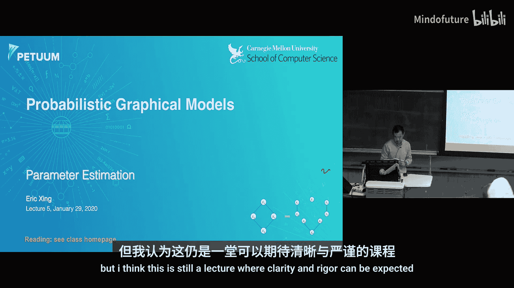
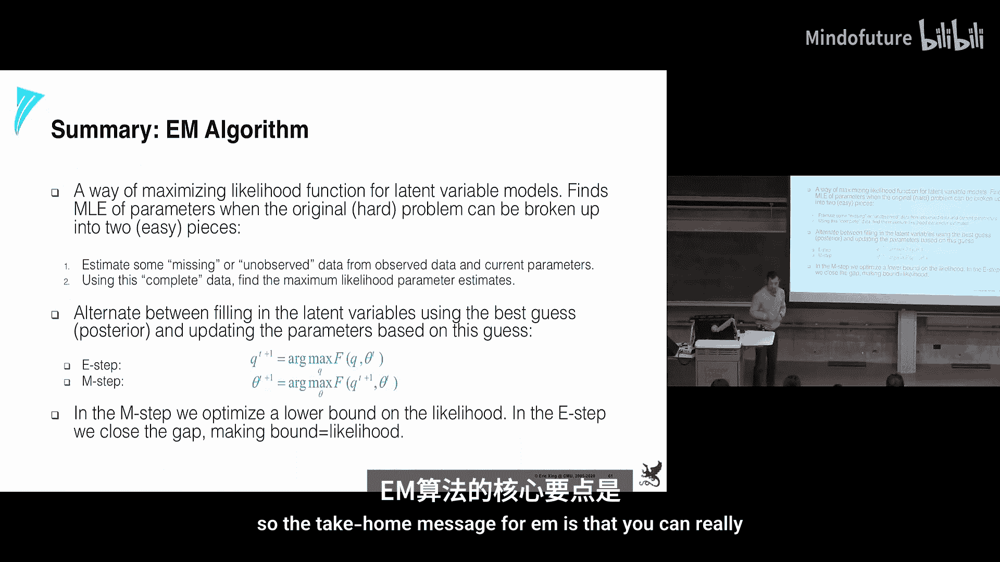
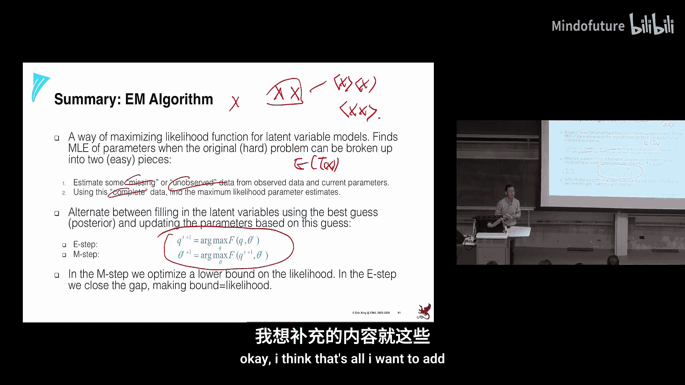

# 005：参数估计 📊

在本节课中，我们将要学习概率图形模型中的参数估计。我们将从最简单的完全观测模型开始，逐步深入到更复杂的部分观测模型，并介绍一种强大的学习算法——期望最大化算法。

---

## 概述

参数估计，也称为学习，是概率图形模型中的核心任务。我们通常从一个已知结构的图模型和一组独立同分布的观测数据开始，目标是估计模型中的参数，例如贝叶斯网络中的条件概率表或马尔可夫网络中的势函数参数。

---

## 完全观测图模型的参数估计

上一节我们介绍了图模型推断的基本概念。本节中，我们来看看当图模型结构已知且所有变量都被观测到时，如何进行参数估计。

### 最大似然估计原理

我们从定义损失函数开始，即数据的似然函数。对于贝叶斯网络，联合概率可以表示为许多局部项的乘积。我们通常使用对数似然作为目标函数。

以下是构建似然函数的关键步骤：
1.  写出给定参数下数据的联合概率。
2.  利用图模型的因子分解性质，将其分解为局部项的乘积。
3.  取对数，得到对数似然函数。

### 指数族分布：一个统一的框架

对于任意复杂的图模型，其参数估计都可以分解为对更小组件的处理。指数族分布为描述这些组件提供了一个强大而统一的框架。

指数族分布的定义如下：

\[
p(x|\eta) = h(x) \exp(\eta^T T(x) - A(\eta))
\]

其中：
*   \(\eta\) 是**自然参数**。
*   \(T(x)\) 是**充分统计量**。
*   \(A(\eta)\) 是**对数配分函数**，用于确保概率归一化。

这个形式的关键在于，参数 \(\eta\) 和数据 \(x\) 通过充分统计量 \(T(x)\) 以线性方式（点积）相互作用。

指数族包含了绝大多数常见的分布，例如：
*   伯努利分布、多项分布（离散）
*   高斯分布、泊松分布、伽马分布（连续）

在指数族框架下，参数的最大似然估计有一个通用模式：**矩匹配**。具体来说，对数配分函数 \(A(\eta)\) 的一阶导数给出了充分统计量的期望（一阶矩），二阶导数给出了方差（二阶矩）。参数估计的过程就是让模型计算的矩等于从数据中观测到的经验矩。

这种统一视角的核心思想是**充分性**。充分统计量 \(T(x)\) 包含了从数据 \(x\) 中估计参数 \(\eta\) 所需的全部信息。这意味着，在存储数据时，我们只需保留充分统计量，而无需保存所有原始数据点。

---

## 广义线性模型：两节点图模型的构建块

理解了单节点的指数族分布后，我们将其扩展到更常见的两节点图模型，例如线性回归和逻辑回归。这些模型可以通过**广义线性模型**统一描述。

广义线性模型由三部分组成：
1.  **线性预测器**：\(\zeta = \theta^T x\)，将输入进行线性组合。
2.  **响应函数**：\(\mu = f(\zeta)\)，将线性预测值映射为输出变量的条件期望 \(E[y|x]\)。
3.  **条件分布**：输出 \(y\) 的条件分布属于指数族，其自然参数 \(\eta\) 与均值 \(\mu\) 通过一个可逆函数关联。

通过选择不同的响应函数 \(f\) 和指数族分布，我们可以得到不同的模型：
*   **线性回归**：响应函数 \(f\) 是恒等函数，条件分布是高斯分布。
*   **逻辑回归**：响应函数 \(f\) 是逻辑函数，条件分布是伯努利分布。

在广义线性模型下，参数 \(\theta\) 的学习可以通过一个通用的梯度上升规则进行（在线学习）：

\[
\theta \leftarrow \theta + \alpha (y - \mu) x
\]

其中 \(\alpha\) 是学习率，\(\mu\) 是当前模型预测的响应值。对于更快的收敛，也可以使用基于牛顿法的批量学习算法。

---

## 部分观测图模型与EM算法

在实际应用中，我们经常遇到包含未观测（隐）变量的图模型，例如混合模型或隐马尔可夫模型。本节中，我们来看看如何处理这种部分观测的情况。

### 挑战：似然函数难以处理

当存在隐变量 \(Z\) 时，观测数据 \(X\) 的（边际）似然函数需要对 \(Z\) 进行求和或积分：

\[
L(\theta; X) = p(X|\theta) = \sum_Z p(X, Z|\theta)
\]

这个求和项通常在对数内部，导致对数似然函数 \(\log L(\theta; X)\) 不再是简单的求和形式，参数之间相互耦合，直接优化变得困难。

### EM算法：一种坐标上升方法

**期望最大化算法** 通过优化一个更容易处理的替代目标函数——**完全数据对数似然的期望**（也称为Q函数或证据下界ELBO）来解决这个问题。

EM算法迭代执行以下两步：
1.  **E步（期望步）**：固定当前参数 \(\theta^{(t)}\)，计算隐变量后验分布 \(p(Z|X, \theta^{(t)})\)，并利用它计算完全数据对数似然的期望：
    \[
    Q(\theta|\theta^{(t)}) = E_{Z|X,\theta^{(t)}}[\log p(X, Z|\theta)]
    \]
2.  **M步（最大化步）**：固定Q函数中的分布，寻找最大化 \(Q(\theta|\theta^{(t)})\) 的新参数：
    \[
    \theta^{(t+1)} = \arg\max_{\theta} Q(\theta|\theta^{(t)})
    \]

### EM算法的直观理解：以高斯混合模型为例

高斯混合模型假设数据来自多个高斯分布的混合，但每个数据点具体来自哪个分布是未知的。
*   **E步（软分配）**：基于当前的高斯分布参数，计算每个数据点属于每个高斯成分的“责任”（后验概率）。这类似于K-means中的“分配”步骤，但这里是概率性的软分配。
*   **M步（参数更新）**：基于E步计算出的“责任”，重新估计每个高斯成分的参数（均值、方差）和混合权重。这相当于用“加权计数”代替了完全观测情况下的“硬计数”。

### EM算法的关键洞察

EM算法的核心在于，它通过引入隐变量的分布 \(q(Z)\)，将对数边际似然 \(\log p(X|\theta)\) 分解为两部分：
\[
\log p(X|\theta) = \underbrace{E_{q}[\log p(X,Z|\theta)] - E_{q}[\log q(Z)]}_{\text{证据下界 } \mathcal{L}(q,\theta)} + \underbrace{KL(q(Z) || p(Z|X,\theta))}_{\text{KL散度}}
\]
其中KL散度非负。EM算法实际上是在交替优化证据下界 \(\mathcal{L}\)：
*   **E步**：固定 \(\theta\)，令 \(q(Z) = p(Z|X,\theta)\)，这使得KL散度为0，从而证据下界等于对数似然。
*   **M步**：固定 \(q(Z)\)，优化 \(\theta\) 以增大证据下界。

一个**重要且常见的误解**是：EM算法就是用隐变量的期望值代替缺失值。这是不准确的。正确的做法是计算**充分统计量**在隐变量后验分布下的期望，并用这个期望值进行后续计算，因为参数是通过充分统计量与数据交互的，而非原始数据本身。

---

## 总结

本节课中我们一起学习了概率图形模型的参数估计。
1.  我们从**完全观测模型**开始，介绍了基于最大似然估计的原理，并引入了**指数族分布**作为描述模型组件的统一框架，其参数估计可通过**矩匹配**完成。
2.  接着，我们探讨了**广义线性模型**，它统一了如线性回归、逻辑回归等两节点模型的学习，其参数可以通过通用的梯度规则进行估计。
3.  最后，我们深入研究了包含**隐变量的部分观测模型**。为了解决其似然函数难以直接优化的问题，我们介绍了强大的**期望最大化算法**。EM算法通过交替执行E步（计算完全数据似然期望）和M步（最大化该期望）来迭代优化参数，本质上是最大化对数似然的一个下界。理解“用充分统计量的期望进行估计”是掌握EM算法的关键。

通过将这些构建块——指数族、GLM、EM算法——组合起来，我们可以为各种复杂的概率图模型设计出有效的参数学习算法。